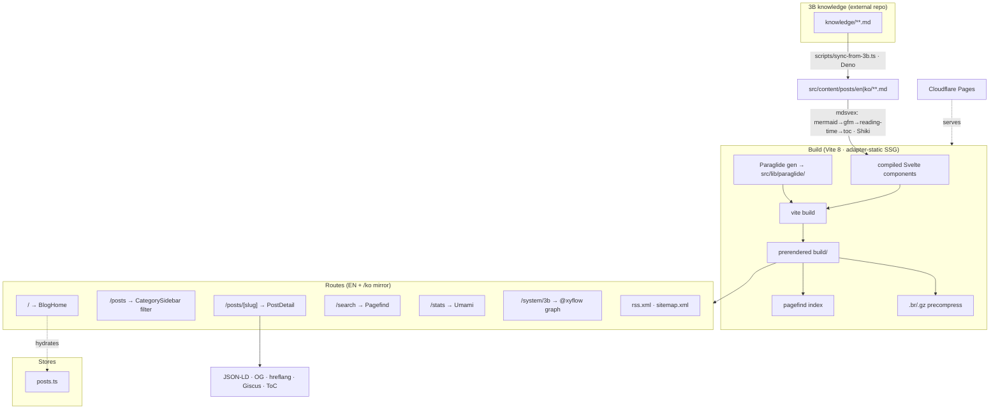

# Architecture

Long-term architecture documentation for **brandonwie.dev**. This folder is the
**structural source of truth** for the codebase — created at the start of the
2026 renewal effort because the project `CLAUDE.md` prose had drifted materially
from the actual code.

## Contents

| File                                   | What it is                                                                                                      | When to read                                       |
| -------------------------------------- | --------------------------------------------------------------------------------------------------------------- | -------------------------------------------------- |
| [`structure.yaml`](./structure.yaml)   | The map — stack, entry points, 5 subsystems, routes, build pipeline, deps, **known drift**, **known risks**     | Orienting, onboarding, before touching a subsystem |
| [`improvements.md`](./improvements.md) | Renewal backlog — 41 findings + 2 product-direction, deduped + verified, with pros/cons, effort, risk, priority | Planning what to build/fix next                    |
| [`decisions/`](./decisions/)           | ADRs — context, options, chosen + consequences (e.g. terminal vs Cmd+P)                                         | Before terminal-coupled work                       |
| `README.md` (this)                     | Navigation + decision record + maintenance contract                                                             | First                                              |

## System at a glance

## Subsystems (ownership boundaries)

1. **routing_ssg_seo** — `src/routes/**`, prerender, feeds, sitemap, View Transitions
2. **content_pipeline_i18n** — mdsvex + remark plugins, Paraglide, `scripts/sync-from-3b.ts`
3. **command_palette** — `src/lib/palette/items.ts`, `src/lib/fuzzy.ts`, `components/palette/FuzzyFinder.svelte`
4. **blog_ui_components** — `components/*.svelte`, stores, `app.css` (Tailwind v4)
5. **build_tooling_ci** — Vite/svelte config, pnpm/Deno toolchain, husky, GitHub Actions

Full detail (files, LOC, data flows, dependencies) lives in `structure.yaml`.

## Decision record (5W1H)

- **Who / When:** Brandon + orchestrated multi-agent analysis, 2026-06-03 (commit `5e467d4`), opening the renewal effort.
- **Where:** `architecture/` at repo root (version-controlled, ships with the code).
- **What:** Built an accurate structural map + a prioritized improvement backlog as the renewal baseline.
- **Why:** A renewal needs a trustworthy "as-is" before an "as-should-be." The existing docs were stale (e.g. "52 posts/9 categories" vs the real 139 EN + 139 KO across 11 categories, plus undocumented `/search`, `/stats`, `/system/3b` subsystems).
- **How:** 5 parallel `code-explorer` agents (one per subsystem) → a verification pass that corrected two false agent claims (`deno.lock` exists; `ui/` is empty) → synthesis into these files.

### Why `architecture/` here, and YAML-first

| Option                             | Pros                                                                                  | Cons                                                                                                | Chosen |
| ---------------------------------- | ------------------------------------------------------------------------------------- | --------------------------------------------------------------------------------------------------- | :----: |
| `architecture/` at repo root       | Versioned with code; ships in clones; survives 3B symlink quirks; conventional        | Slight duplication with 3B `docs/`                                                                  |   ✅   |
| `docs/` (3B symlink)               | Centralized in 3B                                                                     | `docs/` is gitignored + personal; not in the deployable repo; wrong home for code-coupled structure |   ✗    |
| `app-architecture/`                | Matches the literal phrasing                                                          | Non-standard name                                                                                   |   ✗    |
| **YAML map + MD backlog** (chosen) | YAML is diffable/greppable/machine-readable as SoT; MD is human-facing for trade-offs | Two formats to keep aligned                                                                         |   ✅   |
| Single big Markdown                | One file                                                                              | Poor as a queryable structural SoT; prose drifts (the very problem being fixed)                     |   ✗    |
| Split YAML per subsystem           | Smaller files                                                                         | Cross-subsystem coherence harder; premature for this size                                           |   ✗    |

## Maintenance contract

- **On structural change** (new route/subsystem/dep, moved files): update `structure.yaml` in the same PR.
- **On finding new debt:** add a row to `improvements.md` (keep the summary table + detail in sync).
- **Keep `CLAUDE.md` aligned** — edit the 3B SoT at `3b/.claude/project-claude/brandonwie.dev.md` (the repo `CLAUDE.md` is a symlink), not the symlink target. See improvement `DOC-1`.
- **Regenerate from scratch:** re-run the per-subsystem analysis (5 `code-explorer` agents over the boundaries above), then a verification pass before trusting any security/count claim.
- **Frontmatter + relative links** per 3B conventions; this is a `.md` in a 3B-linked repo.

## Status

Analysis complete (2026-06-03). Renewal **in progress** — see
`improvements.md` for the active/superseded backlog.
