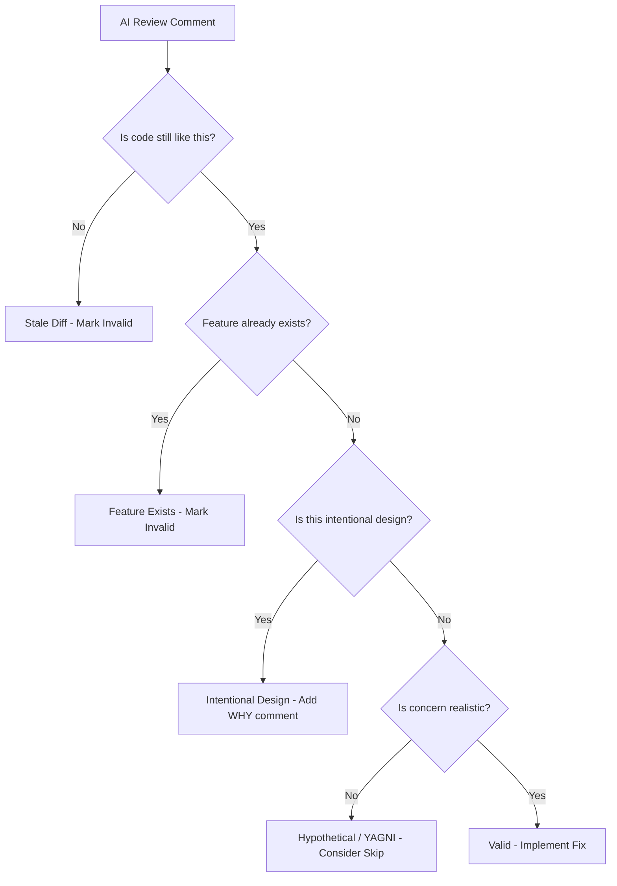

AI code review tools (GitHub Copilot, Claude, Codex) catch real bugs and save
time. But they also generate false positives -- flagging code that is correct,
suggesting features that already exist, or raising concerns about scenarios that
cannot happen. After reviewing dozens of AI-generated PR comments across
multiple projects, I noticed the same failure modes repeating. This post
catalogs six patterns of invalid AI feedback and provides a triage workflow for
each.

---

## The Problem

AI reviewers analyze code without full project context. They see diffs in
isolation, miss cross-file dependencies, and apply general best practices
without evaluating whether those practices apply to your specific situation.
The result: a mix of genuinely useful feedback buried under false positives.

Without a systematic way to triage AI reviews, you either waste time
implementing unnecessary changes or dismiss everything and miss real issues.

---

## Pattern 1: Stale Diff

**Symptom**: AI flags code that was already fixed in a later commit.

**Example**:

```text
AI Review: "Hardcoded account ID '123456789012' should be dynamic"
Reality: Account ID was made dynamic in commit abc123, 2 commits ago
```

**Cause**: AI reviewed an older diff, not the current HEAD. This happens
frequently in multi-commit PRs where early commits contain rough code that gets
cleaned up in later commits. The AI reviews each diff snapshot independently
without checking whether subsequent commits already addressed the issue.

**Mitigation**:

- Always validate AI reviews against current code before acting
- Re-request review after pushing fixes to get fresh feedback
- Add reinforcing comments explaining the fix was applied (prevents the AI from
  flagging the same issue again on the next review cycle)

---

## Pattern 2: Feature Exists

**Symptom**: AI suggests adding a feature that already exists.

**Example**:

```text
AI Review: "Consider adding checksum verification for the binary download"
Reality: Checksum verification already exists a few dozen lines up in the same file
```

**Cause**: AI analyzed code in chunks, missing context from other sections of
the same file or from imported modules. Token limits force the AI to process
large files in windows, and the relevant implementation may fall outside the
current window.

**Mitigation**:

- Point AI to the specific lines where the feature exists
- Add comments near the feature explaining its purpose (helps both AI and human
  reviewers)
- Use systematic validation to check each review comment against the full
  codebase before responding

---

## Pattern 3: Cross-File Blindness

**Symptom**: AI doesn't see changes in related files.

**Example**:

```text
AI Review: "entrypoint.sh calls docker-credential-ecr-login but it's not installed"
Reality: Dockerfile installs it, just in a different file
```

**Cause**: AI reviewed files in isolation without full context. PR review tools
typically send each changed file as a separate review unit. If a dependency is
satisfied by a different file in the same PR (or an existing file not in the
diff), the AI has no way to know.

**Mitigation**:

- Include all related files in the review context when possible
- Add comments referencing where dependencies come from
  (`# Installed in Dockerfile, line 42`)
- Respond to the review with cross-file references so the AI (and future human
  reviewers) can see the connection

---

## Pattern 4: Hypothetical Concerns

**Symptom**: AI raises concerns about scenarios that cannot happen in practice.

**Example**:

```text
AI Review: "What if AWS_DEFAULT_REGION is set to an invalid region?"
Reality: AWS CLI will fail with a clear error, no special handling needed
```

**Cause**: AI is trained to be thorough, which means it flags every possible
failure mode regardless of likelihood. It cannot distinguish between "this could
theoretically happen" and "this will happen in production." The result is
defensive programming suggestions for paths that existing infrastructure already
handles.

**Mitigation**:

- Evaluate whether the concern is realistic given your deployment environment
- Trust existing error handling from well-maintained libraries (AWS CLI, database
  drivers, etc.)
- Only add handling for failure modes that are genuinely likely and whose default
  error behavior is inadequate

---

## Pattern 5: Intentional Design

**Symptom**: AI flags code that is intentionally written a certain way.

**Example**:

```text
AI Review: "The query's start bound, parsed as UTC midnight, misses events for negative-offset timezones"
Reality: a ±1 day timezone buffer intentionally over-fetches — max IANA offset (±14h) < 24h buffer
```

**Cause**: AI sees the mechanism (UTC midnight parsing) but misses the holistic
design intent (buffer-based over-fetching). It analyzes line-by-line without
understanding the system-level invariant that makes the approach correct. This
is the hardest false positive to dismiss because the AI's reasoning sounds
technically plausible -- it identifies a real edge case but does not realize the
code already accounts for it.

**Mitigation**:

- Add inline comments explaining WHY the approach is correct, not just WHAT it
  does
- Document the invariant directly in the code:
  `// NOTE: ±1 day buffer covers all IANA offsets (max ±14h < 24h)`
- Reference the design pattern name when applicable (e.g., "over-fetch and
  filter" strategy)

---

## Pattern 6: YAGNI Suggestion

**Symptom**: AI recommends premature optimization for a low-traffic or
already-constrained path.

**Example**:

```text
AI Review: "Add partial indexes for the recurrence-start columns"
Reality: an indexed user column plus a NOT NULL filter on the recurrence-parent
column already narrows this to a handful of rows
```

**Cause**: AI applies general best practices without evaluating the specific
data volume and existing filter constraints. It sees a query without an index on
a particular column and recommends one, without considering that upstream
filters already reduce the result set to a handful of rows.

**Mitigation**:

- Add a reinforcing comment documenting why the optimization is deferred:
  `// NOTE: [Optimization] intentionally deferred — current scale does not justify complexity.`
- Note existing pre-filters that constrain the result set
- If the suggestion has long-term merit, create a backlog item rather than
  implementing it now -- YAGNI does not mean "never," it means "not yet"

---

## Validation Workflow

When an AI review comment arrives, run through this decision tree before acting
on it:



The first two checks (Stale Diff, Feature Exists) are fast -- a quick `git log`
or codebase search resolves them in seconds. The Intentional Design check
requires domain knowledge. The final realism check requires judgment about your
specific deployment context.

---

## Key Takeaways

| Pattern              | Detection                      | Action                       |
| -------------------- | ------------------------------ | ---------------------------- |
| Stale Diff           | Check current code             | Mark invalid, add comment    |
| Feature Exists       | Search codebase                | Point to existing code       |
| Cross-File Blindness | Check related files            | Explain cross-file context   |
| Hypothetical         | Assess likelihood              | Skip or add minimal handling |
| Intentional Design   | Verify design intent/invariant | Add WHY comment at location  |
| YAGNI Suggestion     | Evaluate actual scale/filters  | Document deferral reasoning  |

---

## Why This Matters

AI code reviews are a net positive. They catch typos, security issues, and logic
errors that humans miss during fatigue. But treating every AI comment as a
mandatory fix leads to wasted effort and unnecessary code changes.

The six patterns above account for the majority of false positives I have
encountered. Recognizing them lets you triage AI feedback in seconds instead of
minutes: check if the code has changed, check if the feature exists, verify
whether the design is intentional, assess whether the concern is realistic.

The most effective long-term mitigation is the same across all patterns:
**write comments that explain WHY, not just WHAT.** AI reviewers (and human
ones) cannot infer design intent from code alone. A one-line comment explaining
the invariant, the pre-filter, or the intentional trade-off prevents the same
false positive from surfacing on every future review.

---

## References

- [Using GitHub Copilot Code Review](https://docs.github.com/copilot/using-github-copilot/code-review/using-copilot-code-review)
