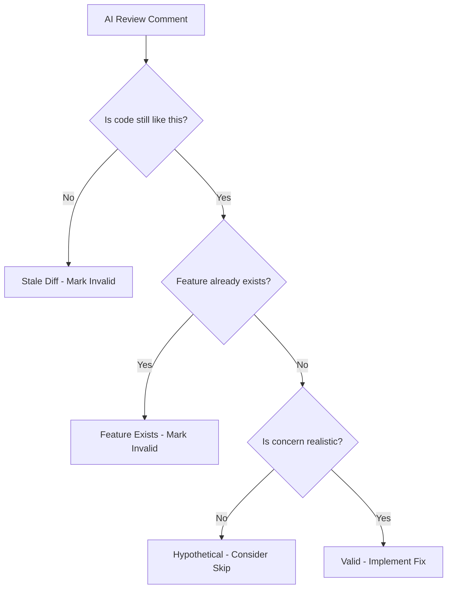

## Pattern 1: Stale Diff

**Symptom**: AI flags code that was already fixed in a later commit.

**Example**:

```text
AI Review: "Hardcoded account ID '325908307049' should be dynamic"
Reality: Account ID was made dynamic in commit abc123, 2 commits ago
```

**Cause**: AI reviewed an older diff, not the current HEAD.

**Mitigation**:

- Always validate AI reviews against current code
- Re-request review after pushing fixes
- Add reinforcing comments explaining the fix was applied

## Pattern 2: Feature Exists

**Symptom**: AI suggests adding a feature that already exists.

**Example**:

```text
AI Review: "Consider adding checksum verification for the binary download"
Reality: Checksum verification already exists on lines 80-85
```

**Cause**: AI analyzed code in chunks, missing context from other sections.

**Mitigation**:

- Point AI to the specific lines where feature exists
- Add comments near the feature explaining its purpose
- Use `/validate-pr-reviews` skill to systematically check reviews

## Pattern 3: Cross-File Blindness

**Symptom**: AI doesn't see changes in related files.

**Example**:

```text
AI Review: "entrypoint.sh calls docker-credential-ecr-login but it's not installed"
Reality: Dockerfile installs it, just in a different file
```

**Cause**: AI reviewed files in isolation without full context.

**Mitigation**:

- Include all related files in the review context
- Add comments referencing where dependencies come from
- Respond to review with cross-file references

## Pattern 4: Hypothetical Concerns

**Symptom**: AI raises concerns about scenarios that can't happen.

**Example**:

```text
AI Review: "What if AWS_DEFAULT_REGION is set to an invalid region?"
Reality: AWS CLI will fail with a clear error, no special handling needed
```

**Cause**: AI is trained to be thorough, sometimes over-thorough.

**Mitigation**:

- Evaluate if the concern is realistic
- Trust existing error handling (AWS CLI, etc.)
- Only add handling for genuinely likely failure modes

## Validation Workflow



## Key Takeaways

| Pattern | Detection | Action |
| ------- | --------- | ------ |
| Stale Diff | Check current code | Mark invalid, add comment |
| Feature Exists | Search codebase | Point to existing code |
| Cross-File Blindness | Check related files | Explain cross-file context |
| Hypothetical | Assess likelihood | Skip or add minimal handling |

## Why This Matters

- AI reviews save time but require human validation
- Blindly implementing all AI suggestions wastes effort
- Understanding patterns helps quickly identify valid vs invalid feedback
- Reinforcing comments prevent repeated invalid reviews
