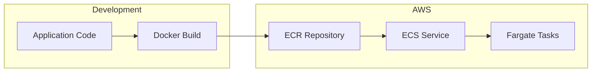
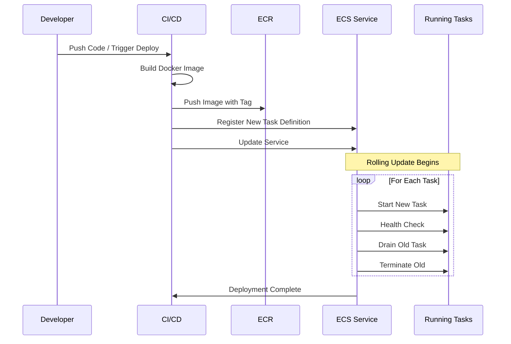
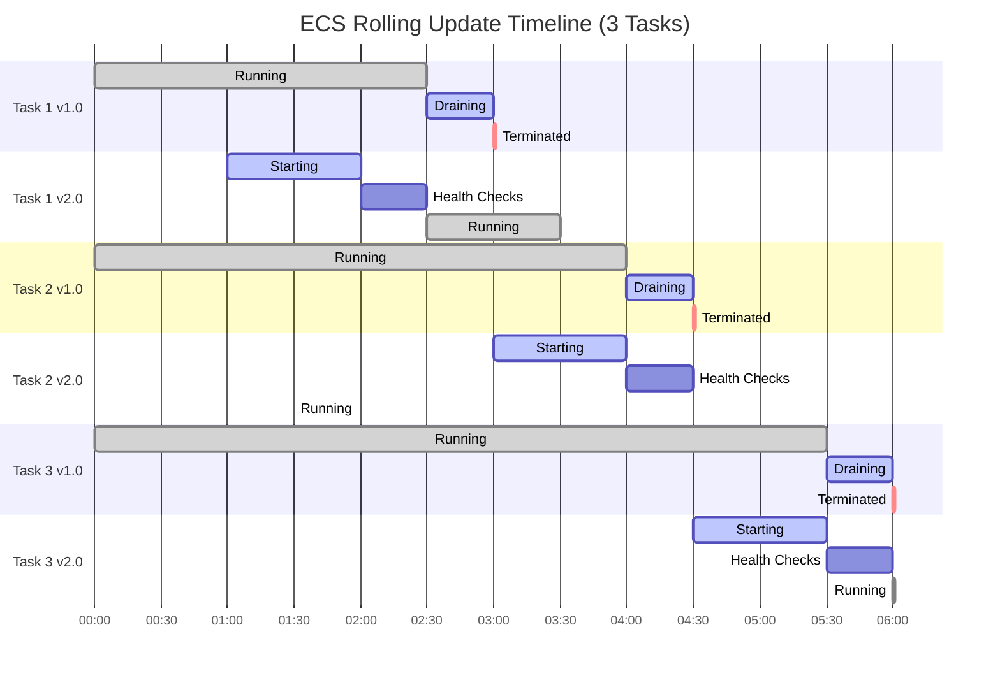
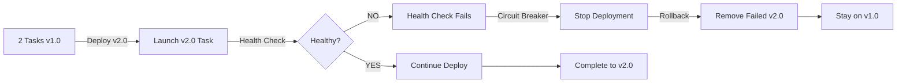
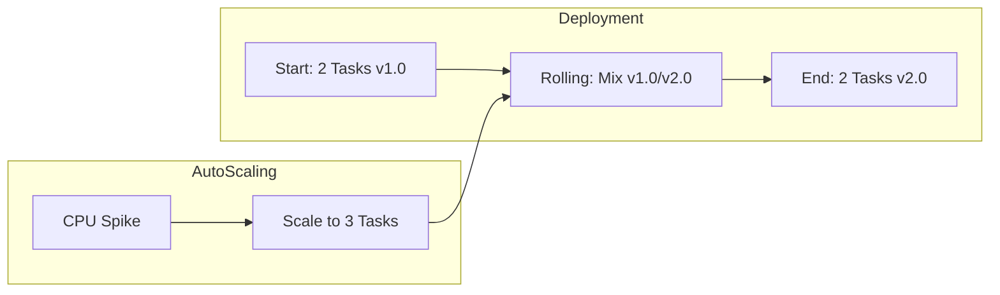
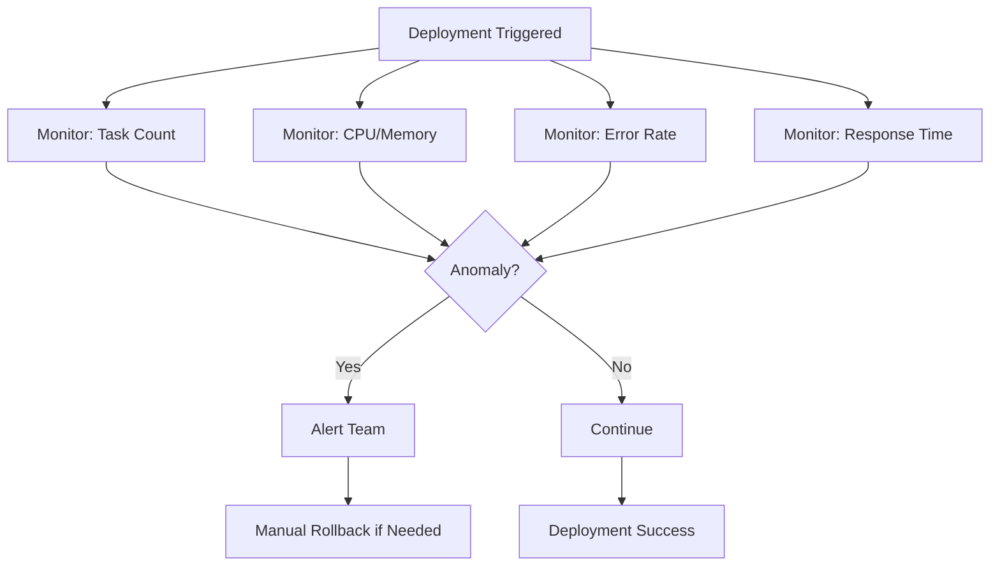
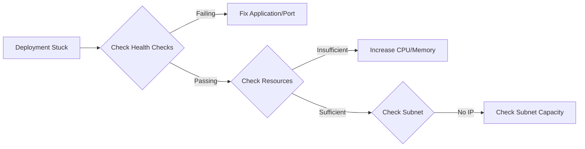

Our first ECS deployment looked perfect in the GitHub Actions logs, green checkmarks everywhere. Then we checked the running service: it was still serving the old image. The task definition had been registered, but nobody told the ECS service to actually use it. That was the first of many "it works but not really" moments on our way to reliable container deployments.

If you're deploying Docker containers to AWS and want to understand the full pipeline, from `docker build` to zero-downtime rolling updates with automatic rollback, this guide walks through every step, including the gotchas that the docs don't warn you about.

---

## The problem

Deploying containerized applications to AWS requires coordinating multiple services (ECR for image storage, ECS for orchestration, Fargate for compute) with specific authentication flows, image tagging strategies, and deployment configurations. Without a clear end-to-end workflow, deployments are error-prone: images get pushed to wrong repos, task definitions reference stale images, rolling updates cause downtime, and failed deployments have no automatic rollback.

---

## Difficulties encountered

- ECR authentication is session-based. The Docker login token expires after 12
  hours, so CI/CD pipelines fail silently with cryptic "no basic auth
  credentials" errors if the token isn't refreshed before each push.
- Task definition versioning trips people up. ECS creates a new revision on
  every `register-task-definition` call, but the service does not automatically
  pick up the latest revision; you must explicitly update the service with the
  new revision ARN.
- Rolling update percentage math is unintuitive. `minimum_healthy_percent` and
  `maximum_percent` are relative to `desired_count`, not absolute numbers, so
  the actual task count during deployment depends on the combination of all
  three values.
- Health check timing has gaps. If the health check grace period is too short,
  ECS kills tasks that are still starting up (especially JVM or NestJS apps with
  slow cold starts), which creates an infinite deployment loop.
- The circuit breaker is not enabled by default. Without
  `deployment_circuit_breaker`, a bad image makes ECS endlessly retry launching
  failing tasks, burning Fargate costs until you manually intervene.
- `--force-new-deployment` never deploys a newly pushed tag. It re-pulls
  whatever image reference the current task definition pins. A workflow that
  pushes `:v1.0.6` then force-redeploys silently restarts the old image unless
  it also registers a new task-def revision pinning the new tag and calls
  `update-service --task-definition <returned ARN>`. Capture the ARN returned by
  `register-task-definition`; never assume the next revision number.
- `batch-get-image` manifest capture is fail-open without assertions. A
  mismatched manifest lands in `failures[]` while the command exits 0, so a
  naive `--query 'images[0].imageManifest'` capture writes an empty or null
  rollback artifact that looks successful. Gate the capture with one compound
  `jq -e` assertion (`failures` empty AND exactly one image AND `imageManifest`
  is a string with non-null `mediaType`) under `set -euo pipefail`. One caveat:
  `--accepted-media-types` permits only three values (Docker manifest v1/v2, OCI
  image manifest v1), and manifest-list or OCI-index types are rejected as flag
  values, so rerun without the flag for index-backed tags.
- Rollback tag restore:
  `aws ecr put-image --image-tag <tag> --image-manifest file://saved.json --image-manifest-media-type "$(jq -r '.mediaType' saved.json)"`
  restores an overwritten mutable tag from a pre-captured manifest. Capture
  before any push that overwrites a pinned tag.

---

## When to use

- Deploying Docker containers to AWS with managed orchestration
- Teams wanting AWS-native CI/CD without Kubernetes complexity
- Applications needing zero-downtime rolling deployments
- Projects already using Terraform for AWS infrastructure

---

## When not to use

- Single static site or Lambda function: ECS/Fargate is overkill; use S3 with
  CloudFront, or Lambda directly.
- Multi-cloud or cloud-agnostic requirement: ECR/ECS locks you into AWS; use
  Kubernetes (EKS or self-managed) instead.
- Very short-lived batch jobs: Fargate has a one-minute minimum billing
  granularity and cold-start overhead; consider Lambda or Step Functions.
- Local development workflows: use Docker Compose locally, not ECS; the feedback
  loop with ECR push and ECS deploy is too slow for iterative development.
- Budget-constrained hobby projects: Fargate costs add up quickly; a single
  t3.micro EC2 with Docker is cheaper for low-traffic services.

With those pitfalls noted, the sections below cover the architecture and each step of the deployment pipeline.

---

## Architecture overview

At a high level, the deployment pipeline moves code from your local machine through three AWS services:



---

## ECR (Elastic Container Registry)

The first stop in the pipeline is ECR, AWS's managed Docker container registry. This is where your built images live before ECS pulls them down to run as containers.

### Creating the ECR repository

```hcl
resource "aws_ecr_repository" "app" {
  name                 = "my-app"
  image_tag_mutability = "MUTABLE"

  image_scanning_configuration {
    scan_on_push = true  # Security scanning
  }
}
```

With `scan_on_push = true`, ECR scans OS packages for known CVEs and checks dependencies for vulnerabilities; the results are viewable in the AWS Console or via the API.

### Push workflow

```bash
# 1. Authenticate Docker to ECR
aws ecr get-login-password --region ap-northeast-2 | \
  docker login --username AWS --password-stdin \
  ${ACCOUNT_ID}.dkr.ecr.ap-northeast-2.amazonaws.com

# 2. Build image
docker build -t my-app .

# 3. Tag for ECR
docker tag my-app:latest \
  ${ACCOUNT_ID}.dkr.ecr.ap-northeast-2.amazonaws.com/my-app:latest

# 4. Push to ECR
docker push \
  ${ACCOUNT_ID}.dkr.ecr.ap-northeast-2.amazonaws.com/my-app:latest
```

Once your image is in ECR, ECS takes over to orchestrate the deployment. The flow involves registering a new task definition and then telling the ECS service to use it.

---

## ECS deployment flow

### Complete deployment pipeline

Here's the full sequence from code push to running containers:



### Manual deployment steps

```bash
# 1. Build and push image (see above)

# 2. Register new task definition
aws ecs register-task-definition \
  --cli-input-json file://task-definition.json

# 3. Update service with new task definition
aws ecs update-service \
  --cluster my-cluster \
  --service my-service \
  --task-definition my-task:NEW_REVISION \
  --force-new-deployment
```

One flag in that last command is a trap worth calling out. `--force-new-deployment` does not deploy a newly pushed tag; it re-pulls whatever image reference the _current_ task definition already pins. A workflow that pushes `:v1.0.6` and then force-redeploys will silently restart the _old_ image. That's the same "green checkmarks, stale service" failure from the top of this post, just wearing a different hat.

To actually ship the new tag, register a new task-definition revision that pins it, then call `update-service --task-definition <returned ARN>`. Capture the ARN that `register-task-definition` hands back rather than assuming the next revision number is free. A concurrent deploy can take it out from under you, and pointing the service at the wrong revision is exactly the kind of quiet mistake that passes CI and fails in production.

The manual steps above show the mechanics, but in production you want zero-downtime deployments. That's where rolling updates come in.

---

## Rolling updates

### How rolling updates work

ECS replaces tasks one by one to ensure zero downtime. The key idea: new tasks start and pass health checks _before_ old tasks are drained and terminated:

```text
Time     | Old v1.0 | New v2.0 | Total | Status
---------|----------|----------|-------|------------------
00:00    | 2        | 0        | 2     | Deploy starts
00:30    | 2        | 1        | 3     | New task starting
01:30    | 1        | 1        | 2     | First old removed
02:00    | 1        | 2        | 3     | Second new starting
03:00    | 0        | 2        | 2     | Complete
```

### Rolling update process (3 tasks)

```mermaid
graph TB
    subgraph "Rolling Deployment with 3 Tasks"
        A["Start: 3 Tasks v1.0"] -->|"New Deployment"| B["Launch Task #1 v2.0"]
        B -->|"Health Check Pass"| C["Drain Task #1 v1.0"]
        C -->|"Terminate Old"| D["Running: 2x v1.0, 1x v2.0"]
        D -->|"Continue"| E["Launch Task #2 v2.0"]
        E -->|"Health Check Pass"| F["Drain Task #2 v1.0"]
        F -->|"Terminate Old"| G["Running: 1x v1.0, 2x v2.0"]
        G -->|"Continue"| H["Launch Task #3 v2.0"]
        H -->|"Health Check Pass"| I["Drain Task #3 v1.0"]
        I -->|"Complete"| J["End: 3 Tasks v2.0"]
    end
```



### Rolling update timeline



### Key phases of each task replacement

1. Starting (60-90 seconds): pull the new Docker image from ECR, start the
   container, and initialize the application.
2. Health checks (30-60 seconds): ALB health checks must pass, the app must
   respond on the configured port, and several successful checks are required.
3. Draining (30-300 seconds): stop sending new requests to the old task and
   allow existing requests to complete during a graceful shutdown period.
4. Termination: the old task is fully stopped, its resources are released, and
   the new task is fully operational.

### Deployment configuration

```hcl
resource "aws_ecs_service" "app" {
  name            = "my-service"
  cluster         = aws_ecs_cluster.main.id
  task_definition = aws_ecs_task_definition.app.arn
  desired_count   = 2

  # Deployment behavior
  deployment_minimum_healthy_percent = 100  # Never below desired
  deployment_maximum_percent         = 200  # Can double temporarily

  # Circuit breaker for automatic rollback
  deployment_circuit_breaker {
    enable   = true
    rollback = true
  }
}
```

With `desired_count = 3`, those percentages mean:

- `minimum_healthy_percent = 100`: always keep at least 3 tasks
- `maximum_percent = 200`: up to 6 tasks during deployment

### Deployment strategies

| Strategy     | Min % | Max % | Speed  | Risk   | Use Case   |
| ------------ | ----- | ----- | ------ | ------ | ---------- |
| Conservative | 100   | 150   | Slow   | Low    | Production |
| Balanced     | 100   | 200   | Medium | Low    | Most apps  |
| Aggressive   | 50    | 200   | Fast   | Medium | Staging    |

### Circuit breaker and automatic rollback

When the circuit breaker is enabled, ECS detects failed deployments and
automatically rolls back to the last stable version:



Without `deployment_circuit_breaker`, a bad image causes ECS to endlessly retry
launching failing tasks, burning Fargate costs until you manually intervene.
Always enable it for production services:

```hcl
deployment_circuit_breaker {
  enable   = true
  rollback = true
}
```

A common question: what happens if auto-scaling kicks in during a deployment? ECS handles it gracefully.

---

## Deployment with auto-scaling

Auto-scaling continues working during deployments:



Key behaviors:

- If auto-scaling adds tasks during deployment, new tasks get the latest version
- If auto-scaling removes tasks, ECS prioritizes removing old version tasks
- Scale state is preserved after deployment

### Auto-scaling interaction scenarios

| Scenario                   | What Happens                    | Result                                          |
| -------------------------- | ------------------------------- | ----------------------------------------------- |
| CPU spike during deploy    | Auto-scaling adds tasks         | Deployment updates ALL tasks including new ones |
| CPU drop during deploy     | Auto-scaling removes tasks      | Deployment continues with fewer tasks           |
| Memory issue during deploy | Auto-scaling triggers           | Both new and old tasks can scale                |
| Deploy fails               | Tasks remain at current version | Auto-scaling continues normally                 |

### Deployment with a CPU spike (scales from 2 to 3)

```text
Time     | Old v1.0 | New v2.0 | Total | Event
---------|----------|----------|-------|------------------
00:00    | 2        | 0        | 2     | Deployment starts
00:30    | 2        | 1        | 3     | New task starting
01:00    | 2        | 1        | 3     | CPU SPIKE, auto-scale triggered
01:30    | 2        | 2        | 4     | Scale-out adds v2.0 task
02:00    | 1        | 2        | 3     | Remove one old task
02:30    | 1        | 3        | 4     | Add final new task
03:00    | 0        | 3        | 3     | All tasks now v2.0
```

### Resolving auto-scaling conflicts

If auto-scaling fights with deployment, temporarily suspend scaling:

```bash
# Suspend auto-scaling during deployment
aws application-autoscaling register-scalable-target \
  --service-namespace ecs \
  --resource-id service/my-cluster/my-service \
  --scalable-dimension ecs:service:DesiredCount \
  --suspended-state \
    '{"DynamicScalingInSuspended": true, "DynamicScalingOutSuspended": true}'

# Re-enable after deployment completes
aws application-autoscaling register-scalable-target \
  --service-namespace ecs \
  --resource-id service/my-cluster/my-service \
  --scalable-dimension ecs:service:DesiredCount \
  --suspended-state \
    '{"DynamicScalingInSuspended": false, "DynamicScalingOutSuspended": false}'
```

With the deployment mechanics covered, the next step is automating the pipeline with GitHub Actions.

---

## GitHub Actions workflow

The following workflow builds a Docker image, pushes it to ECR, updates the task definition, and deploys to ECS, all triggered by a push to `main`:

```yaml
name: Deploy to ECS

on:
  push:
    branches: [main]

jobs:
  deploy:
    runs-on: ubuntu-latest
    steps:
      - uses: actions/checkout@v4

      - name: Configure AWS credentials
        uses: aws-actions/configure-aws-credentials@v4
        with:
          aws-access-key-id: ${{ secrets.AWS_ACCESS_KEY_ID }}
          aws-secret-access-key: ${{ secrets.AWS_SECRET_ACCESS_KEY }}
          aws-region: ap-northeast-2

      - name: Login to ECR
        id: login-ecr
        uses: aws-actions/amazon-ecr-login@v2

      - name: Build and push image
        env:
          ECR_REGISTRY: ${{ steps.login-ecr.outputs.registry }}
          IMAGE_TAG: ${{ github.sha }}
        run: |
          docker build -t $ECR_REGISTRY/my-app:$IMAGE_TAG .
          docker push $ECR_REGISTRY/my-app:$IMAGE_TAG
          docker tag $ECR_REGISTRY/my-app:$IMAGE_TAG $ECR_REGISTRY/my-app:latest
          docker push $ECR_REGISTRY/my-app:latest

      - name: Update ECS task definition
        id: task-def
        uses: aws-actions/amazon-ecs-render-task-definition@v1
        with:
          task-definition: task-definition.json
          container-name: my-app
          image:
            ${{ steps.login-ecr.outputs.registry }}/my-app:${{ github.sha }}

      - name: Deploy to ECS
        uses: aws-actions/amazon-ecs-deploy-task-definition@v2
        with:
          task-definition: ${{ steps.task-def.outputs.task-definition }}
          service: my-service
          cluster: my-cluster
          wait-for-service-stability: true
```

With the pipeline automated, these practices keep deployments reliable over time.

---

## Best practices

### Image tagging

Consistent tagging makes it possible to trace a running container back to its source code and roll back to any previous version:

```text
Recommended tags:
- Git SHA: my-app:abc123def  (unique, traceable)
- Environment: my-app:prod-latest  (current production)
- Semantic: my-app:v1.2.3  (releases)
```

### ECR lifecycle policy

Without cleanup, ECR accumulates images indefinitely, since each push adds a new one. Lifecycle policies automatically expire old images to keep storage costs under control:

```json
{
  "rules": [
    {
      "rulePriority": 1,
      "description": "Keep last 30 images",
      "selection": {
        "tagStatus": "any",
        "countType": "imageCountMoreThan",
        "countNumber": 30
      },
      "action": {
        "type": "expire"
      }
    }
  ]
}
```

### Rollback: restoring an overwritten tag

The circuit breaker rolls the ECS service back to the previous task definition, but it can't help once you've overwritten a mutable tag in ECR. At that point the old image reference is simply gone. Recovering it means capturing the image manifest _before_ the overwriting push, then restoring it afterward. The ordering is the whole game: capture before any push that overwrites a pinned tag, because after the overwrite there is nothing left to capture.

Capture is also the part that bites. `aws ecr batch-get-image` is fail-open: a mismatched manifest lands in the `failures[]` array while the command still exits `0`. A naive `--query 'images[0].imageManifest'` then writes an empty or null artifact that looks successful right up until you actually need it. Gate the capture with a single compound `jq -e` assertion under `set -euo pipefail`: the `failures` array is empty, exactly one image came back, and `imageManifest` is a string with a non-null `mediaType`. One more sharp edge is `--accepted-media-types`, which permits only three values (Docker manifest v1, Docker manifest v2, OCI image manifest v1). Manifest-list and OCI-index types are rejected as flag values, so for index-backed tags you rerun without the flag.

With a validated manifest saved before the overwrite, restoring the tag is one command:

```bash
aws ecr put-image \
  --image-tag <tag> \
  --image-manifest file://saved.json \
  --image-manifest-media-type "$(jq -r '.mediaType' saved.json)"
```

### Health checks

Health checks are the mechanism that prevents bad deployments from receiving traffic. The ALB checks each task's health endpoint before routing requests to it:

```hcl
resource "aws_lb_target_group" "app" {
  # ...
  health_check {
    path                = "/health"
    healthy_threshold   = 2
    unhealthy_threshold = 3
    timeout             = 5
    interval            = 30
    matcher             = "200"
  }
}
```

### Graceful shutdown

ECS sends `SIGTERM` before terminating tasks during rolling updates. The
application must handle this signal to avoid dropping in-flight requests:

```javascript
// Graceful shutdown handling (Node.js)
process.on("SIGTERM", async () => {
  console.log("SIGTERM received, starting graceful shutdown");

  // Stop accepting new requests
  server.close(() => {
    console.log("HTTP server closed");
  });

  // Close database connections
  await database.close();

  // Wait for ongoing requests to complete (max 30 seconds)
  setTimeout(() => {
    process.exit(0);
  }, 30000);
});

// Health check endpoint (include version for deployment tracking)
app.get("/health", (req, res) => {
  res.status(200).json({
    status: "healthy",
    version: process.env.APP_VERSION
  });
});
```

### Deployment monitoring

Monitor these signals during rolling updates to detect anomalies early:



```bash
# Watch deployment progress in real time
watch -n 5 'aws ecs describe-services \
  --cluster my-cluster \
  --services my-service \
  --query "services[0].deployments"'

# Check recent deployment events
aws ecs describe-services \
  --cluster my-cluster \
  --services my-service \
  --query 'services[0].events[0:5]'
```

---

## Troubleshooting

### Deployment stuck

```bash
# Check task stopped reason
aws ecs describe-tasks \
  --cluster my-cluster \
  --tasks $(aws ecs list-tasks --cluster my-cluster --query 'taskArns[0]' --output text) \
  --query 'tasks[0].stoppedReason'

# Check service events
aws ecs describe-services \
  --cluster my-cluster \
  --services my-service \
  --query 'services[0].events[:5]'
```

### Common issues

| Issue                   | Cause                     | Solution                            |
| ----------------------- | ------------------------- | ----------------------------------- |
| Tasks fail health check | App not ready             | Increase health check grace period  |
| Out of memory           | Container needs more RAM  | Increase task memory                |
| No IP available         | Subnet full               | Use larger subnet or multiple AZs   |
| Image pull failed       | ECR auth expired          | Refresh ECR token                   |
| Slow deployments        | Conservative min/max %    | Increase max % or decrease min %    |
| No automatic rollback   | Circuit breaker not set   | Enable `deployment_circuit_breaker` |
| Auto-scaling conflicts  | Scaling fights deployment | Temporarily suspend auto-scaling    |

### Stuck deployment decision tree



---

## Practical takeaways

ECR/ECS deployment is a coordination problem more than a technical one. Each piece (image registry, task definitions, service updates, health checks) works fine individually; the challenge is making them work together reliably. Here's what matters most:

1. Always enable the circuit breaker. Without `deployment_circuit_breaker`, a bad image causes ECS to endlessly retry launching failing tasks, burning Fargate costs until you manually intervene. It's a one-line Terraform addition that saves you from 3 AM pages.

2. Tag images with git SHAs, not just `latest`. The `:latest` tag is convenient but makes rollbacks painful because you can't tell which version is running. Git SHA tags (`my-app:abc123def`) give you instant traceability from a running task to its source commit.

3. Set health check grace periods generously. If your application takes 30 seconds to start (common for JVM or NestJS apps), a 10-second grace period creates an infinite deployment loop: ECS launches a task, kills it before it's ready, launches another, and kills it again. Set the grace period to at least 2x your worst-case startup time.

4. Handle SIGTERM in your application. ECS sends SIGTERM before terminating tasks during rolling updates. If your app doesn't handle this signal, in-flight requests get dropped. The Node.js graceful shutdown pattern above takes 10 lines and prevents data loss during deployments.

The GitHub Actions workflow in this post is a production-ready starting point. Clone it, update the cluster/service names, and you have zero-downtime deployments with automatic rollback on failure.

---

## References

- [ECS Deployment Types](https://docs.aws.amazon.com/AmazonECS/latest/developerguide/deployment-types.html)
- [ECR Lifecycle Policies](https://docs.aws.amazon.com/AmazonECR/latest/userguide/LifecyclePolicies.html)
