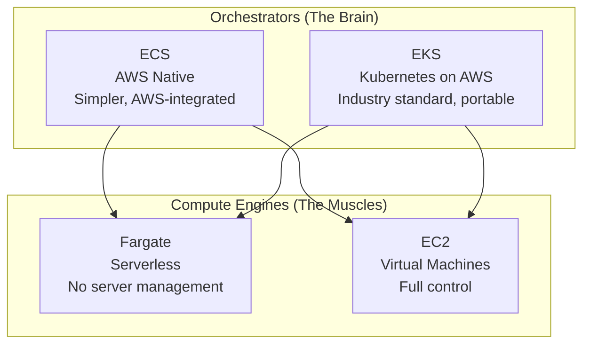
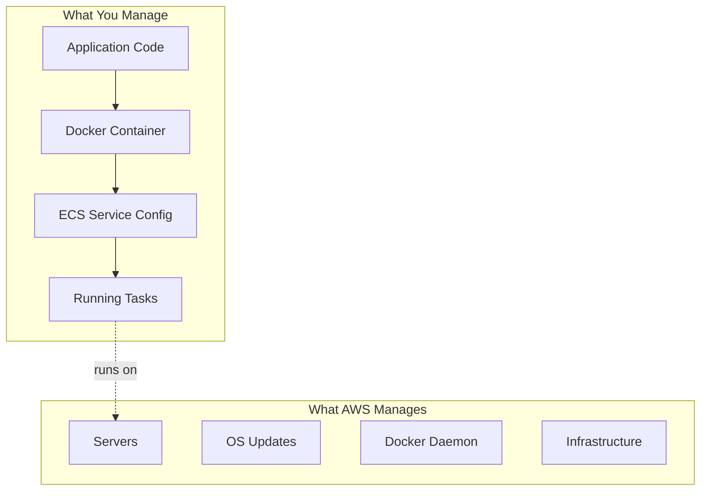
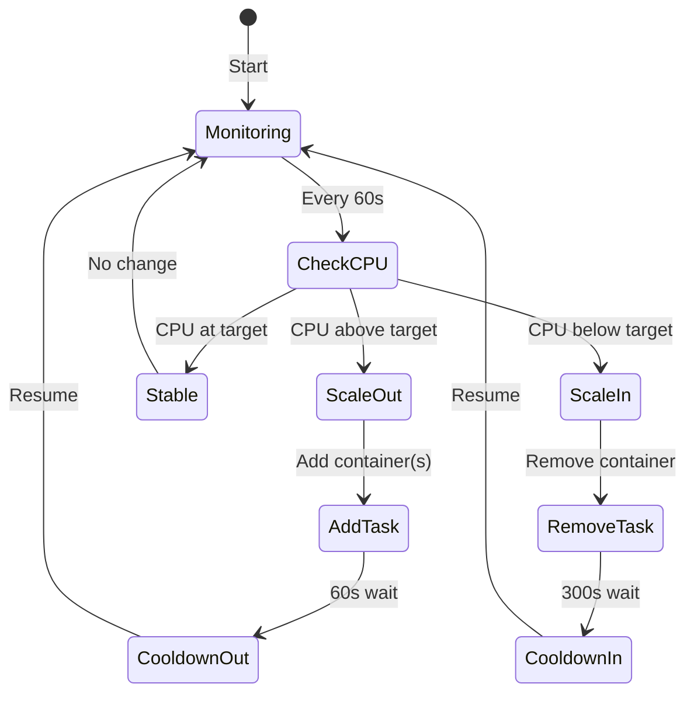
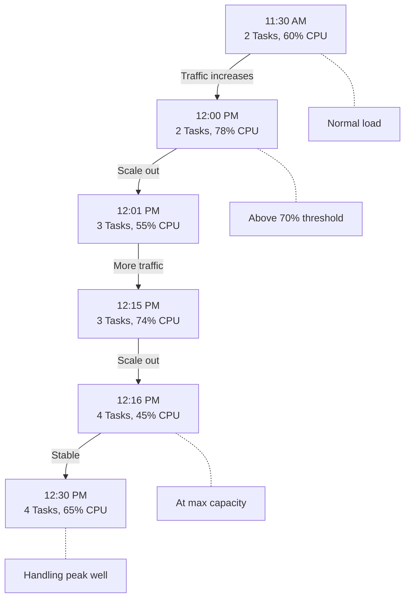
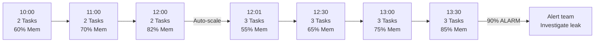
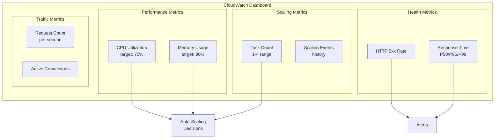
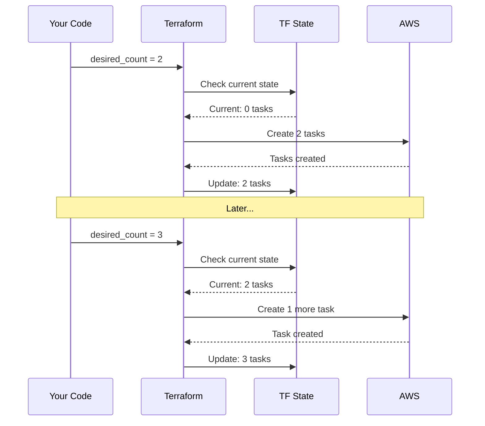
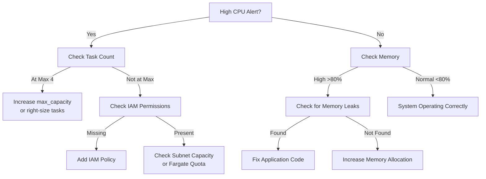

## The Problem

Running containers at a fixed count wastes money during low traffic and drops
requests during spikes. ECS auto-scaling solves this, but configuring it
correctly requires understanding target tracking algorithms, cooldown periods,
the difference between scaling policies and CloudWatch alarms, and how scaling
interacts with deployments. Misconfiguration leads to flapping (rapid
scale-out/in cycles), runaway costs from unbounded scaling, or unresponsive
services that fail to scale when needed.

---

## Difficulties Encountered

- **Target tracking is not threshold-based** -- the initial assumption was "if
  CPU > 70%, add one container," but the actual algorithm calculates the
  proportional number of tasks needed to bring the metric back to target, which
  can add multiple tasks at once
- **Cooldown asymmetry is not obvious** -- using the same cooldown for scale-in
  and scale-out causes flapping; scale-in must be much longer (300s+) because
  removing capacity too quickly leads to immediate scale-out again
- **Auto-scaling vs CloudWatch alarms confusion** -- both reference CPU
  thresholds but serve completely different purposes; alarms notify humans while
  scaling policies act automatically, and setting them to the same value defeats
  the purpose of the alarm as an early warning
- **Memory scaling is often forgotten** -- CPU-only policies miss memory leaks
  entirely; a Node.js app can OOM-kill at 95% memory while CPU sits at 30%, and
  no scaling event fires
- **Max capacity without context is dangerous** -- setting `max_capacity = 100`
  as a "safe high number" can exhaust database connection pools or hit API rate
  limits long before reaching that count

---

## When to Use

- Stateless HTTP services behind a load balancer with variable traffic
- Microservices architecture where individual services have different load
  profiles
- Production workloads that need automatic recovery from traffic spikes
- Cost optimization for services with predictable daily or weekly traffic
  patterns (combine with scheduled scaling)

---

## When NOT to Use

- **Stateful services with persistent connections** -- WebSocket servers or
  long-lived gRPC streams break when tasks are removed; use sticky sessions or
  connection draining instead
- **Services with very slow startup** -- if your container takes 5+ minutes to
  become healthy (heavy initialization, large ML model loading), auto-scaling
  cannot respond to sudden spikes fast enough; pre-warm with scheduled scaling
- **Single-task services at minimum** -- if `min_capacity = max_capacity = 1`,
  auto-scaling adds configuration complexity with zero benefit; just set a fixed
  desired count
- **Batch processing workloads** -- jobs that run to completion do not benefit
  from target tracking; use ECS scheduled tasks or Step Functions instead
- **Development and staging environments** -- auto-scaling adds unpredictable
  cost variance; use fixed task counts for non-production to keep billing
  predictable

---

## Container Orchestration Concepts

### What Container Orchestration Does

- **Scheduling**: Decides where containers run
- **Scaling**: Adds/removes containers based on demand
- **Networking**: Ensures containers can communicate
- **Health Monitoring**: Restarts failed containers
- **Load Balancing**: Distributes traffic evenly

### ECS vs EKS vs Fargate



**Clarification**: Fargate is NOT Kubernetes. Fargate is serverless compute that
works with EITHER ECS or EKS.

- **Orchestrator** (ECS/EKS) = The brain deciding what to do
- **Compute** (Fargate/EC2) = The muscles doing the work

### ECS + Fargate Responsibility Model

With ECS + Fargate, AWS manages the underlying infrastructure:



---

## Auto-Scaling Types

### Horizontal Scaling (Recommended)

Adds/removes container instances:

```text
Normal Load:           High Load (Horizontal):
[Container 1 @ 70%]    [Container 1 @ 35%]
                       [Container 2 @ 35%]
```

- Better for stateless applications
- No downtime during scaling

### Vertical Scaling (Not Recommended for Auto-Scaling)

Changes container size:

```text
Normal:                High Load (Vertical):
[2 CPU, 4GB RAM]  →    [4 CPU, 8GB RAM]
```

- Requires container restart
- Causes downtime

---

## Target Tracking Scaling Algorithm

Target tracking maintains a metric value (like cruise control). The monitoring
loop evaluates every 60 seconds and transitions through distinct states:



The algorithm calculates the proportional number of tasks, not just +1/-1:

```python
# Simplified algorithm
current_cpu = get_average_cpu()
target_cpu = 70
current_tasks = get_task_count()

if current_cpu > target_cpu:
    # Calculate needed tasks proportionally
    desired_tasks = current_tasks * (current_cpu / target_cpu)
    desired_tasks = min(desired_tasks, max_capacity)
    if not in_cooldown_period():
        scale_to(desired_tasks)
```

**Important**: It's NOT a simple "if CPU > 70% add one container". If 1 task is
at 140% effective load, the algorithm calculates `1 * (140 / 70) = 2` tasks
needed, scaling directly to 2 in one action.

---

## Cooldown Periods

### Why Cooldowns Exist

Prevent over-provisioning and flapping:

**Without Cooldowns (BAD):**

```text
12:00:00 - CPU 75% → Add container
12:00:10 - Still 75% → Add container (new one not ready!)
12:00:20 - Still 75% → Add container
12:01:00 - CPU 20% each → WASTED MONEY
```

**With Cooldowns (GOOD):**

```text
12:00:00 - CPU 75% → Add container
12:00:10 - Still 75% → WAIT (cooldown)
12:01:00 - CPU 40% each → Perfect!
```

### Recommended Cooldown Values

| Cooldown  | Value | Reasoning          |
| --------- | ----- | ------------------ |
| Scale-Out | 60s   | Responsive to load |
| Scale-In  | 300s  | Prevents flapping  |

---

## Auto-Scaling vs CloudWatch Alarms

**These serve different purposes:**

| Feature      | Auto-Scaling Policy   | CloudWatch Alarm    |
| ------------ | --------------------- | ------------------- |
| Purpose      | Add/remove containers | Send notifications  |
| CPU Setting  | 70% target            | 85% alert threshold |
| Action       | Immediate scaling     | Human notification  |
| Intervention | None needed           | May require action  |

**Why different thresholds?**

- 70% target: Auto-scaling maintains this level
- 85% alarm: Warns when auto-scaling might not be enough

---

## Industry Standard Settings

### Your Settings vs Industry

| Metric             | Setting | Industry | Assessment           |
| ------------------ | ------- | -------- | -------------------- |
| CPU Target         | 70%     | 65-75%   | Excellent            |
| Memory Target      | 80%     | 75-85%   | Excellent            |
| Scale-Out Cooldown | 60s     | 60-120s  | Good                 |
| Scale-In Cooldown  | 300s    | 300-600s | Standard             |
| Min Tasks          | 1       | 1-2      | Consider 2 for HA    |
| Max Tasks          | 4       | Varies   | Application-specific |

### How Major Companies Configure

```text
Netflix:    CPU 60-75%, Scale-Out 60s, Scale-In 300s
Uber:       CPU 65-70%, Scale-Out 30s, Scale-In 600s
Airbnb:     CPU 65%,    Scale-Out 90s, Scale-In 600s
```

---

## Real-World Scenarios

### Scenario 1: Morning Traffic Surge

Users arrive at 8:00 AM. CPU climbs gradually, crosses the 70% threshold at
8:45, and auto-scaling adds a task. After the cooldown, load distributes and
stabilizes:

| Time | Tasks | Avg CPU | Action                       |
| ---- | ----- | ------- | ---------------------------- |
| 8:00 | 1     | 45%     | Normal morning traffic       |
| 8:30 | 1     | 68%     | Approaching threshold        |
| 8:45 | 1     | 75%     | Above 70% -- scale out       |
| 8:46 | 2     | 40%     | Load distributed across 2    |
| 9:00 | 2     | 72%     | Above threshold again        |
| 9:01 | 3     | 50%     | Third task added             |
| 9:30 | 3     | 48%     | Stable at morning peak level |

### Scenario 2: Lunch Peak

A sustained traffic increase that pushes scaling to max capacity:



Key observation: at max capacity (4 tasks) the service handles 65% CPU. If
traffic exceeds what 4 tasks can handle, the CloudWatch alarm at 85% fires to
notify the team.

### Scenario 3: Evening Wind-Down

Scale-in happens conservatively with 300s cooldowns between removals:

| Time    | Tasks | Avg CPU | Action                   |
| ------- | ----- | ------- | ------------------------ |
| 7:00 PM | 4     | 40%     | Below target             |
| 7:05 PM | 3     | 52%     | Scaled in by 1           |
| 7:10 PM | 3     | 50%     | Stable, cooldown active  |
| 7:15 PM | 3     | 48%     | Still below target       |
| 7:20 PM | 2     | 65%     | Scaled in again after 5m |
| 8:00 PM | 2     | 45%     | Evening stable state     |

The 300s scale-in cooldown prevents removing too many tasks at once. Without it,
all 3 extra tasks could be removed in seconds, causing a spike.

### Scenario 4: Memory Leak Detection

Memory-based scaling catches leaks that CPU-only policies miss entirely. As
memory grows linearly over hours, auto-scaling buys time, but the alarm signals
a code-level problem:



Auto-scaling masks the leak temporarily by spreading memory across more tasks,
but each task's memory still grows. The 90% alarm eventually fires, signaling
that the application needs a code fix, not more capacity.

---

## Cost Optimization

### Fargate Pricing

Per-second billing based on vCPU and memory:

```text
Example: 2 vCPU, 4 GB Memory
- CPU: $0.04048/hour
- Memory: $0.01778/hour
- Total: ~$0.058/hour per task
- Monthly (1 task 24/7): ~$42
```

### Monthly Cost Estimates with Auto-Scaling

Based on 2 vCPU / 4 GB tasks at ~$0.058/hour each:

| Scenario           | Avg Tasks | Monthly Cost |
| ------------------ | --------- | ------------ |
| Min (1 task 24/7)  | 1         | ~$42         |
| Typical (2 avg)    | 2         | ~$84         |
| Peak hours (3 avg) | 3         | ~$126        |
| Max (4 tasks 24/7) | 4         | ~$168        |

Real-world cost is usually between the min and typical range because
auto-scaling only runs extra tasks during peak hours, not 24/7.

### Cost Strategies

1. **Right-sizing**: Monitor actual usage, reduce if CPU &lt; 50% consistently --
   halving vCPU/memory cuts cost by ~50%
2. **Scaling threshold tuning**: 65% target = more containers (higher cost), 75%
   target = fewer containers (lower cost); 70% is the balanced middle ground
3. **Scheduled scaling**: Reduce min capacity to 0 at night for non-critical
   services, or use a Gantt-like pattern:

```mermaid
gantt
    title Daily Task Scaling Pattern
    dateFormat HH:mm
    axisFormat %H:%M

    section Tasks
    Night - min 0      :done, night, 00:00, 6h
    Morning ramp       :active, ramp1, 06:00, 2h
    Business hours     :crit, business, 08:00, 10h
    Evening ramp down  :active, ramp2, 18:00, 2h
    Night - min 0      :done, night2, 20:00, 4h
```



1. **Fargate Spot**: Up to 70% savings for fault-tolerant workloads that can
   handle 2-minute interruption notices

---

## Monitoring During Scaling

### Key Metrics to Watch



### CloudWatch Dashboard Setup

```bash
# View current task count
aws ecs describe-services \
  --cluster my-cluster \
  --services my-service \
  --query 'services[0].runningCount'

# View scaling history
aws application-autoscaling describe-scaling-activities \
  --service-namespace ecs \
  --resource-id service/my-cluster/my-service

# Real-time CPU metrics (last hour, 5-min intervals)
aws cloudwatch get-metric-statistics \
  --namespace AWS/ECS \
  --metric-name CPUUtilization \
  --dimensions Name=ServiceName,Value=my-service \
  --start-time "$(date -u -v-1H +%Y-%m-%dT%H:%M:%SZ)" \
  --end-time "$(date -u +%Y-%m-%dT%H:%M:%SZ)" \
  --period 300 \
  --statistics Average

# Check desired vs running (detect stuck deployments)
aws ecs describe-services \
  --cluster my-cluster \
  --services my-service \
  --query 'services[0].{desired:desiredCount,running:runningCount}'
```

---

## Common Mistakes

### 1. Thresholds Too Low

```hcl
# BAD
target_value = 40.0  # Too aggressive, wastes money

# GOOD
target_value = 70.0  # Balanced
```

### 2. Same Cooldowns for Scale-In/Out

```hcl
# BAD
scale_in_cooldown  = 60
scale_out_cooldown = 60

# GOOD
scale_in_cooldown  = 300  # Conservative
scale_out_cooldown = 60   # Responsive
```

### 3. No Max Capacity Limit

```hcl
# BAD
max_capacity = 100  # Runaway costs possible

# GOOD
max_capacity = 4    # Based on DB connection limits
```

### 4. Only CPU Scaling (No Memory)

```hcl
# BAD - Memory leaks won't trigger scaling

# GOOD - Both metrics
resource "aws_appautoscaling_policy" "cpu" { ... }
resource "aws_appautoscaling_policy" "memory" { ... }
```

### 5. Not Testing Scaling Before Production

Always load-test auto-scaling before relying on it:

```bash
# Generate load to trigger scaling
ab -n 10000 -c 100 http://your-alb-url/

# Then monitor: did tasks scale? Did they scale back?
aws application-autoscaling describe-scaling-activities \
  --service-namespace ecs --max-results 10
```

Without testing, you only discover misconfigurations during real incidents.

### 6. Confusing Alarms with Auto-Scaling

Auto-scaling policies and CloudWatch alarms both reference CPU thresholds but do
completely different things:

- Auto-scaling policies = automatically add/remove containers
- CloudWatch alarms = send notifications to humans (SNS, PagerDuty)

Setting them to the same threshold (e.g., both at 70%) means the alarm fires
every time scaling happens, creating noise. Keep alarms 10-15% above the scaling
target as a "scaling might not be enough" warning.

---

## Terraform Implementation

### Resource Structure

ECS auto-scaling in Terraform uses three resource types:

```hcl
# Step 1: Define scaling limits (the target)
resource "aws_appautoscaling_target" "ecs_target" {
  max_capacity       = 4  # Maximum containers
  min_capacity       = 1  # Minimum containers
  resource_id        = "service/cluster-name/service-name"
  scalable_dimension = "ecs:service:DesiredCount"
  service_namespace  = "ecs"
}

# Step 2: Define scaling policy (the rules)
resource "aws_appautoscaling_policy" "cpu_scaling" {
  name               = "cpu-target-tracking"
  policy_type        = "TargetTrackingScaling"
  resource_id        = aws_appautoscaling_target.ecs_target.resource_id
  scalable_dimension = aws_appautoscaling_target.ecs_target.scalable_dimension
  service_namespace  = aws_appautoscaling_target.ecs_target.service_namespace

  target_tracking_scaling_policy_configuration {
    target_value       = 70.0  # Maintain 70% CPU
    scale_in_cooldown  = 300   # 5 minutes
    scale_out_cooldown = 60    # 1 minute

    predefined_metric_specification {
      predefined_metric_type = "ECSServiceAverageCPUUtilization"
    }
  }
}

# Step 3: Define alarms for monitoring (separate from scaling)
resource "aws_cloudwatch_metric_alarm" "high_cpu" {
  alarm_name          = "ecs-high-cpu"
  comparison_operator = "GreaterThanThreshold"
  evaluation_periods  = 2           # 2 consecutive periods
  metric_name         = "CPUUtilization"
  namespace           = "AWS/ECS"
  period              = 60          # 60-second periods
  statistic           = "Average"
  threshold           = 85          # Alert at 85%
  alarm_actions       = [aws_sns_topic.alerts.arn]
  # This DOESN'T scale - just alerts!
}
```

### How Terraform Manages State

Terraform tracks infrastructure state and only applies the delta:



For full Terraform configuration with migration task separation and connection
pool math, see the ECS autoscaling patterns post (coming soon).

---

## Troubleshooting

### Auto-Scaling Not Working

```bash
# Check IAM permissions
aws iam get-role --role-name ecsAutoscaleRole

# Check service limits
aws service-quotas get-service-quota \
  --service-code fargate \
  --quota-code L-3032A538

# Review scaling activities
aws application-autoscaling describe-scaling-activities \
  --service-namespace ecs \
  --resource-id service/cluster/service
```

### Rapid Scaling (Flapping)

**Symptom**: Containers constantly adding/removing

**Solution**: Increase cooldowns

```hcl
scale_in_cooldown  = 600  # 10 minutes
scale_out_cooldown = 120  # 2 minutes
```

### High Costs (More Containers Than Expected)

```bash
# Check actual vs desired task count
aws ecs describe-services \
  --cluster your-cluster \
  --services your-service \
  --query 'services[0].{desired:desiredCount,running:runningCount}'
```

If running count exceeds what you expect, check whether the scaling target is
too low (40% instead of 70%) or whether a memory leak is causing memory-based
scaling.

### Decision Tree for Scaling Issues



---

## Quick Reference

### Recommended Configuration

```yaml
Auto-Scaling:
  CPU Target: 70%
  Memory Target: 80%
  Min Tasks: 1-2
  Max Tasks: Based on DB limits
  Scale-Out Cooldown: 60 seconds
  Scale-In Cooldown: 300 seconds

Alarms (Notifications):
  CPU Alert: 85% for 2 minutes
  Memory Alert: 90% for 2 minutes
```

### Essential Commands

```bash
# Current task count
aws ecs describe-services \
  --cluster CLUSTER --services SERVICE \
  --query 'services[0].runningCount'

# Scaling history
aws application-autoscaling describe-scaling-activities \
  --service-namespace ecs \
  --resource-id service/CLUSTER/SERVICE

# Current policies
aws application-autoscaling describe-scaling-policies \
  --service-namespace ecs
```

---

## References

- [ECS Best Practices Guide](https://docs.aws.amazon.com/AmazonECS/latest/bestpracticesguide/)
- [Application Auto Scaling](https://docs.aws.amazon.com/autoscaling/application/userguide/)
- See also: ECS autoscaling patterns (coming soon)
