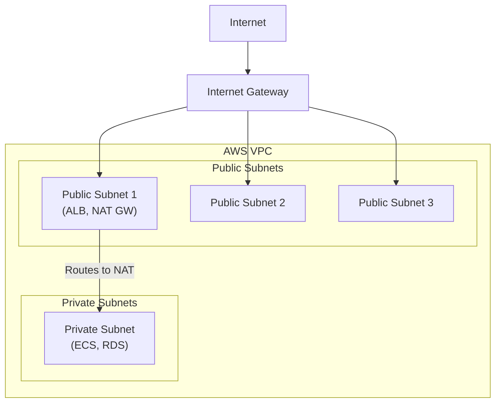
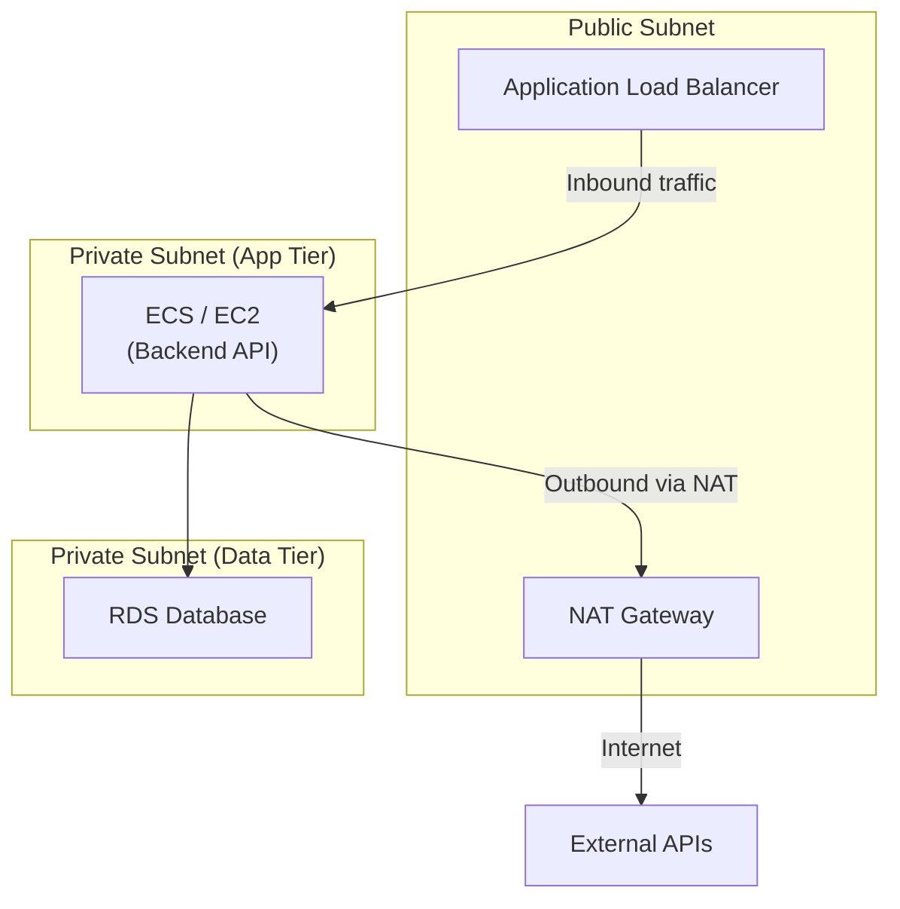

## Architecture Overview



## NAT Gateway Placement

### Correct Configuration

NAT Gateway **must be in a public subnet**:

```hcl
resource "aws_nat_gateway" "ngw" {
  # ✅ Correct: NAT Gateway in public subnet
  subnet_id     = aws_subnet.public.id
  allocation_id = aws_eip.nat.id
  depends_on    = [aws_internet_gateway.igw]
}
```

### Incorrect Configuration

```hcl
resource "aws_nat_gateway" "ngw" {
  # ❌ Wrong: NAT Gateway in private subnet
  subnet_id     = aws_subnet.private.id  # Cannot reach IGW
}
```

## Why Placement Matters

| Placement      | Internet Access | Notes                         |
| -------------- | --------------- | ----------------------------- |
| Public subnet  | Works           | Can route to Internet Gateway |
| Private subnet | Fails           | No route to Internet Gateway  |

## Network Flow

### Public Subnet Resources

```text
EC2/ECS → Route Table → Internet Gateway → Internet
```

### Private Subnet Resources

```text
EC2/ECS → Route Table → NAT Gateway → Internet Gateway → Internet
```

## Route Table Configuration

### Public Subnet Route Table

```hcl
route {
  cidr_block = "0.0.0.0/0"
  gateway_id = aws_internet_gateway.igw.id
}
```

### Private Subnet Route Table

```hcl
route {
  cidr_block     = "0.0.0.0/0"
  nat_gateway_id = aws_nat_gateway.ngw.id
}
```

## What Breaks Without NAT Gateway

For private subnet resources:

- `apt-get update` fails
- External API calls fail
- Docker image pulls fail
- AWS service API calls fail (S3, DynamoDB)

## Recommended Architecture

| Tier    | Subnet Type | Resources        |
| ------- | ----------- | ---------------- |
| Public  | Public      | ALB, NAT Gateway |
| Private | Private     | ECS/EC2, Lambda  |
| Data    | Private     | RDS, ElastiCache |

## Security Implications

| Configuration            | Risk                         |
| ------------------------ | ---------------------------- |
| RDS in public subnet     | Database exposed to internet |
| Security group 0.0.0.0/0 | Open to all IPs              |
| All resources public     | No network segmentation      |

## How NAT Translation Works

The NAT Gateway performs IP address translation in four steps:

1. Private subnet resource sends a packet to the internet
2. NAT Gateway receives the packet and replaces the source IP with its own
   Elastic IP address
3. The translated packet routes through the Internet Gateway to the internet
4. When the response returns, NAT Gateway translates the destination address
   back to the original private IP and forwards it

This is one-way initiation only -- the internet cannot initiate inbound
connections to private resources through the NAT Gateway.

## NAT Gateway vs NAT Instance

| Aspect              | NAT Gateway                             | NAT Instance               |
| ------------------- | --------------------------------------- | -------------------------- |
| Management          | Fully managed by AWS                    | User-managed EC2 instance  |
| Availability        | Redundant within single AZ              | Single point of failure    |
| Bandwidth           | 5 Gbps default, auto-scales to 100 Gbps | Depends on instance type   |
| Maintenance         | AWS handles patching                    | User must patch OS         |
| Cost (low traffic)  | Higher (hourly + per-GB)                | Lower (small instance)     |
| Cost (high traffic) | Predictable                             | Variable, can be cheaper   |
| Security groups     | Not supported (use NACLs)               | Supports security groups   |
| Bastion use         | Cannot double as bastion                | Can double as bastion host |
| Port forwarding     | Not supported                           | Supported                  |
| Scaling             | Automatic                               | Manual resize required     |

**When to choose NAT Instance:** Small-scale or hobby projects where cost is the
primary concern and you accept the operational burden of managing an EC2
instance.

**When to choose NAT Gateway:** Production workloads where availability,
scalability, and reduced operational overhead justify the cost.

## Cost Analysis

NAT Gateway costs have three components:

| Component       | Cost (us-east-1)    | Notes                                      |
| --------------- | ------------------- | ------------------------------------------ |
| Hourly charge   | ~$0.045/hour        | ~$32.40/month regardless of traffic        |
| Data processing | ~$0.045/GB          | Applied to all traffic through the gateway |
| Elastic IP      | Free while attached | Charged only if EIP is unattached          |

**Monthly cost estimate (example):**

- Base: $0.045 x 730 hours = **$32.85**
- Data: $0.045 x 100 GB = **$4.50**
- Total: **~$37.35/month** for 100 GB of outbound traffic

Costs increase linearly with data volume. For high-throughput workloads,
consider VPC endpoints for AWS services (S3, DynamoDB) to bypass the NAT Gateway
entirely and reduce both cost and latency.

## Management Considerations

- **High availability:** NAT Gateway is redundant within a single AZ. For
  multi-AZ resilience, deploy one NAT Gateway per AZ and configure each private
  subnet to route through its local NAT Gateway.
- **Bandwidth:** Starts at 5 Gbps and auto-scales to 100 Gbps. No manual
  intervention required.
- **Monitoring:** CloudWatch metrics include `BytesOutToDestination`,
  `BytesOutToSource`, `PacketsDropCount`, and `ErrorPortAllocation`.
- **No security groups:** NAT Gateways do not support security groups. Use
  Network ACLs on the subnet level to control traffic.

## Use Cases

### 3-Tier Web Architecture



### Common Scenarios

- **Database servers** -- Not directly exposed to internet, but need to download
  security patches
- **Backend API servers** -- Must call external APIs (payment gateways,
  third-party services) without being directly reachable from the internet
- **Batch processing** -- Upload results to external storage after processing
- **Container pulls** -- ECS Fargate tasks in private subnets pulling Docker
  images from public registries
