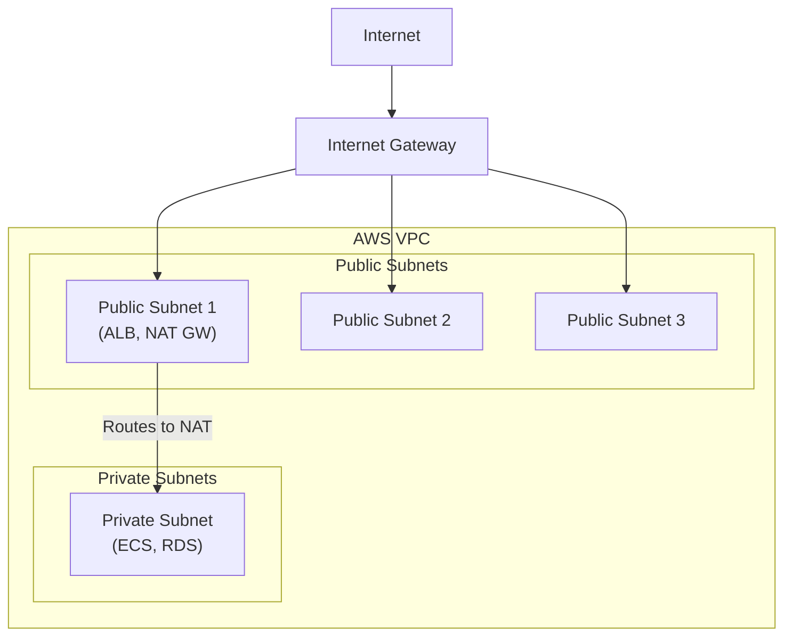
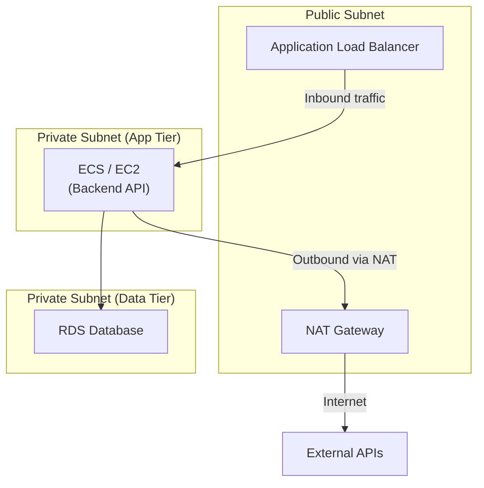

My ECS containers kept failing to pull Docker images. The tasks would start, hang for 30 seconds, then crash with a timeout error. The containers were in a private subnet, and I had forgotten one thing: private subnets cannot reach the internet without a NAT Gateway. And the NAT Gateway has to be in the right place.

This post covers NAT Gateway placement, network flow, cost analysis, and the architectural decisions behind private subnet design.

## Architecture Overview



The key relationship: the Internet Gateway connects the VPC to the internet, public subnets have a route to the Internet Gateway, and the NAT Gateway sits in a public subnet so it can relay traffic from private subnets outward.

## NAT Gateway Placement

The single most important rule: a NAT Gateway **must be in a public subnet**. This trips up everyone at least once.

### Correct Configuration

```hcl
resource "aws_nat_gateway" "ngw" {
  # Correct: NAT Gateway in public subnet
  subnet_id     = aws_subnet.public.id
  allocation_id = aws_eip.nat.id
  depends_on    = [aws_internet_gateway.igw]
}
```

The NAT Gateway needs its own route to the internet (through the Internet Gateway). Public subnets have that route. Private subnets do not.

### Incorrect Configuration

```hcl
resource "aws_nat_gateway" "ngw" {
  # Wrong: NAT Gateway in private subnet
  subnet_id     = aws_subnet.private.id  # Cannot reach IGW
}
```

If you place the NAT Gateway in a private subnet, it has no path to the Internet Gateway. Traffic from your private resources hits the NAT Gateway and goes nowhere.

## Why Placement Matters

| Placement      | Internet Access | Notes                         |
| -------------- | --------------- | ----------------------------- |
| Public subnet  | Works           | Can route to Internet Gateway |
| Private subnet | Fails           | No route to Internet Gateway  |

The confusion comes from the name. "NAT Gateway" sounds like it belongs with the resources it serves (in the private subnet). But it needs to be where the internet access is (in the public subnet). Think of it as a bridge: one end faces the private subnet, the other faces the Internet Gateway. The bridge has to be anchored on the public side.

## Network Flow

Understanding the traffic path makes the placement requirement intuitive.

### Public Subnet Resources

Resources in public subnets reach the internet directly:

```text
EC2/ECS -> Route Table -> Internet Gateway -> Internet
```

### Private Subnet Resources

Resources in private subnets need an extra hop through the NAT Gateway:

```text
EC2/ECS -> Route Table -> NAT Gateway -> Internet Gateway -> Internet
```

The private subnet's route table sends all internet-bound traffic (`0.0.0.0/0`) to the NAT Gateway. The NAT Gateway then forwards it through the Internet Gateway. The return traffic follows the reverse path.

## Route Table Configuration

The route tables are where the magic happens. Each subnet type gets a different default route.

### Public Subnet Route Table

```hcl
route {
  cidr_block = "0.0.0.0/0"
  gateway_id = aws_internet_gateway.igw.id
}
```

All internet-bound traffic goes directly to the Internet Gateway.

### Private Subnet Route Table

```hcl
route {
  cidr_block     = "0.0.0.0/0"
  nat_gateway_id = aws_nat_gateway.ngw.id
}
```

All internet-bound traffic goes to the NAT Gateway, which then forwards to the Internet Gateway.

This is the entire difference between a public and private subnet: which route table is associated with it and where that route table points for `0.0.0.0/0`.

## What Breaks Without a NAT Gateway

If you put resources in a private subnet without a NAT Gateway, any operation that requires internet access fails:

- `apt-get update` fails -- no package downloads
- External API calls fail -- payment gateways, third-party services
- Docker image pulls fail -- ECS tasks cannot start
- AWS service API calls fail -- S3, DynamoDB, SQS (unless you use VPC endpoints)

The Docker image pull failure is particularly frustrating because the error message is a generic timeout, not "no internet access." I spent an hour checking IAM permissions before realizing the network path was the problem.

## How NAT Translation Works

The NAT Gateway performs IP address translation in four steps:

1. A private subnet resource sends a packet to the internet with its private IP as the source address
2. The NAT Gateway receives the packet and replaces the source IP with its own Elastic IP address
3. The translated packet routes through the Internet Gateway to the internet
4. When the response returns, the NAT Gateway translates the destination address back to the original private IP and forwards it

This is one-way initiation only. The internet cannot initiate inbound connections to private resources through the NAT Gateway. A request from the internet addressed to the NAT Gateway's Elastic IP will be dropped because there is no translation mapping for unsolicited inbound traffic.

This one-way property is the security benefit of the entire architecture. Your database servers, application backends, and batch processors can reach the internet for outbound requests while remaining invisible to inbound scans and attacks.

## Recommended Architecture

The standard three-tier layout puts each resource type in the appropriate subnet:

| Tier    | Subnet Type | Resources        |
| ------- | ----------- | ---------------- |
| Public  | Public      | ALB, NAT Gateway |
| Private | Private     | ECS/EC2, Lambda  |
| Data    | Private     | RDS, ElastiCache |

The ALB sits in the public subnet because it needs to accept inbound traffic from the internet. The NAT Gateway sits in the public subnet because it needs a route to the Internet Gateway. Everything else goes in private subnets.

## Security Implications

Deviating from this architecture creates real security risks:

| Configuration            | Risk                         |
| ------------------------ | ---------------------------- |
| RDS in public subnet     | Database exposed to internet |
| Security group 0.0.0.0/0 | Open to all IPs              |
| All resources public     | No network segmentation      |

Putting RDS in a public subnet means the database has a public IP and is reachable from the internet. Even with security group rules restricting access, a misconfiguration or rule change exposes the database directly. Private subnets provide defense in depth -- even if the security group is wrong, the network path does not exist.

## NAT Gateway vs NAT Instance

Before NAT Gateway existed as a managed service, the standard approach was to run a NAT Instance -- an EC2 instance configured to perform address translation. Both options still exist.

| Aspect              | NAT Gateway                              | NAT Instance               |
| ------------------- | ---------------------------------------- | -------------------------- |
| Management          | Fully managed by AWS                     | User-managed EC2 instance  |
| Availability        | Redundant within single AZ               | Single point of failure    |
| Bandwidth           | 5 Gbps default, auto-scales to 100 Gbps | Depends on instance type   |
| Maintenance         | AWS handles patching                     | User must patch OS         |
| Cost (low traffic)  | Higher (hourly + per-GB)                 | Lower (small instance)     |
| Cost (high traffic) | Predictable                              | Variable, can be cheaper   |
| Security groups     | Not supported (use NACLs)                | Supports security groups   |
| Bastion use         | Cannot double as bastion                 | Can double as bastion host |
| Port forwarding     | Not supported                            | Supported                  |
| Scaling             | Automatic                                | Manual resize required     |

**When to choose a NAT Instance:** Small-scale or hobby projects where cost is the primary concern and you accept the operational burden of managing an EC2 instance. A `t3.nano` instance costs around $3.50/month compared to $32+/month for a NAT Gateway.

**When to choose NAT Gateway:** Production workloads where availability, scalability, and reduced operational overhead justify the cost. You do not want your entire private subnet's internet access to depend on a single EC2 instance that you have to patch and monitor.

## Cost Analysis

NAT Gateway costs have three components:

| Component       | Cost (us-east-1)    | Notes                                      |
| --------------- | ------------------- | ------------------------------------------ |
| Hourly charge   | ~$0.045/hour        | ~$32.40/month regardless of traffic        |
| Data processing | ~$0.045/GB          | Applied to all traffic through the gateway |
| Elastic IP      | Free while attached | Charged only if EIP is unattached          |

**Monthly cost estimate for a typical workload:**

- Base: $0.045 x 730 hours = **$32.85**
- Data: $0.045 x 100 GB = **$4.50**
- Total: **~$37.35/month** for 100 GB of outbound traffic

Costs increase linearly with data volume. For high-throughput workloads, consider VPC endpoints for AWS services (S3, DynamoDB) to bypass the NAT Gateway entirely. A VPC endpoint for S3 is free and eliminates both the NAT Gateway data processing charges and the latency of routing through it.

## Management Considerations

A few operational details that matter in production:

- **High availability:** NAT Gateway is redundant within a single AZ. For multi-AZ resilience, deploy one NAT Gateway per AZ and configure each private subnet to route through its local NAT Gateway. This prevents a single AZ failure from taking out internet access for your entire VPC.
- **Bandwidth:** Starts at 5 Gbps and auto-scales to 100 Gbps with no manual intervention.
- **Monitoring:** CloudWatch metrics include `BytesOutToDestination`, `BytesOutToSource`, `PacketsDropCount`, and `ErrorPortAllocation`. Set alarms on `PacketsDropCount` to catch capacity issues early.
- **No security groups:** NAT Gateways do not support security groups. Use Network ACLs on the subnet level to control traffic. This is a common point of confusion for teams accustomed to managing everything through security groups.

## Use Cases

### 3-Tier Web Architecture



This is the most common pattern. The ALB accepts inbound HTTP traffic and forwards it to ECS containers in the private subnet. When those containers need to call external APIs (payment processing, email delivery, third-party integrations), the traffic routes through the NAT Gateway.

### Common Scenarios

- **Database servers** -- Not directly exposed to the internet, but need to download security patches and OS updates
- **Backend API servers** -- Must call external APIs (payment gateways, third-party services) without being directly reachable from the internet
- **Batch processing** -- Upload results to external storage after processing, pull data from external sources
- **Container pulls** -- ECS Fargate tasks in private subnets pulling Docker images from public registries (ECR public, Docker Hub)

## Takeaway

NAT Gateway architecture comes down to one principle: put the NAT Gateway where the internet access is (public subnet) and route private subnet traffic through it. The placement mistake is easy to make and produces confusing timeout errors rather than clear failure messages.

For production workloads, use NAT Gateway over NAT Instance. The $30/month premium buys you managed availability, automatic scaling, and zero patching. For cost optimization, add VPC endpoints for high-volume AWS service traffic (S3 and DynamoDB are the big ones) to keep that data off the NAT Gateway entirely.
