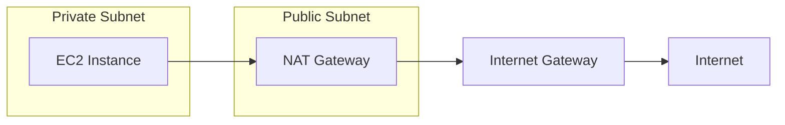

I spent my first week on AWS wondering why my EC2 instance in a "private subnet" was reachable from the internet, and why the NAT Gateway I placed next to my application wasn't doing anything — except costing me $32/month. VPC networking is one of those topics where a small misunderstanding cascades into hours of debugging and unexpected bills.

This post is the guide I wish I'd had: a ground-up walkthrough of AWS VPC networking, from CIDR math to NAT Gateway placement to Terraform configuration. If you've ever stared at a route table wondering why your traffic isn't flowing, this is for you.

---

## The Problem

AWS resources need an isolated network to communicate securely. Without understanding VPC fundamentals — CIDR notation, subnet design, route tables, and gateway placement — you end up with resources that cannot reach the internet, private subnets that are accidentally public, NAT Gateways in the wrong subnet burning money without working, or address spaces too small to accommodate growth. VPC is the foundation that every other AWS service builds on, and mistakes here cascade into every layer above.

---

## Difficulties Encountered

- **CIDR math is not intuitive** -- calculating available IPs from a prefix
  length requires understanding binary math (`2^(32-prefix)`), and forgetting
  that AWS reserves 5 IPs per subnet means a /28 only gives you 11 usable
  addresses, not 16
- **NAT Gateway placement is counterintuitive** -- the NAT Gateway must live in
  a public subnet to give private subnet resources internet access; placing it
  in the private subnet (where the resources that need it are) seems logical but
  breaks routing entirely
- **Subnet IP count vs connection capacity confusion** -- a /24 subnet with 251
  usable IPs does not mean 251 maximum connections; each EC2 instance uses one
  IP but can handle thousands of connections, so subnet sizing is about resource
  count, not traffic capacity
- **Route table association is implicit** -- subnets not explicitly associated
  with a route table use the VPC's main route table, which can accidentally make
  a "private" subnet public if the main route table has an IGW route
- **NAT Gateway costs are surprisingly high** -- at ~$32/month plus data
  processing fees, a NAT Gateway for a dev environment is an expensive
  oversight; this is easy to miss because Terraform creates it without cost
  warnings

---

## When to Use

- Any AWS deployment that needs network isolation (which is nearly all of them)
- Multi-tier architectures with public-facing and internal-only resources
- Production environments requiring private subnets for databases and
  application servers
- Environments needing controlled internet access from private resources (via
  NAT Gateway)

---

## When NOT to Use

- **Serverless-only architectures with no VPC resources** -- Lambda functions
  that only call external APIs and DynamoDB do not need a VPC; adding one
  increases cold start latency and requires NAT Gateway for internet access
- **Simple S3 + CloudFront static sites** -- no compute resources means no VPC
  needed; adding one adds cost and complexity with zero benefit
- **Quick prototyping with default VPC** -- AWS provides a default VPC in every
  region with public subnets pre-configured; for throwaway experiments, use it
  instead of building custom VPC infrastructure
- **Single-AZ development environments** -- a full multi-AZ VPC with NAT
  Gateways per AZ is production architecture; dev environments can use a single
  AZ with a simpler setup to save ~$64/month on redundant NAT Gateways
- **Cross-region networking at scale** -- a single VPC cannot span regions; for
  multi-region architectures, you need VPC Peering or Transit Gateway, which are
  separate concepts with their own design patterns

With those constraints in mind, let's start with the foundation of VPC design: IP addressing.

---

## IP Addressing and CIDR

### CIDR Notation Basics

IP addresses (IPv4) are 32-bit numbers, typically written as 4 octets separated
by dots (e.g., `10.0.1.5`). Each octet ranges from 0-255.

CIDR (Classless Inter-Domain Routing) notation: `base_address/prefix_length`

```text
Example: 10.0.0.0/24
- 10.0.0.0 = base address
- /24 = first 24 bits are network portion (fixed)
- Remaining 8 bits = host portion (variable)
```

### Prefix Length to IP Address Count

| Prefix | Host Bits | Total IPs | AWS Usable      |
| ------ | --------- | --------- | --------------- |
| /32    | 0         | 1         | Single IP       |
| /28    | 4         | 16        | 11              |
| /27    | 5         | 32        | 27              |
| /26    | 6         | 64        | 59              |
| /25    | 7         | 128       | 123             |
| /24    | 8         | 256       | 251             |
| /23    | 9         | 512       | 507             |
| /22    | 10        | 1,024     | 1,019           |
| /16    | 16        | 65,536    | Common VPC size |

Formula: `2^(32-prefix_length) = total IPs`

### AWS Reserved IPs

In each subnet, AWS reserves 5 IP addresses:

```text
10.0.1.0/24 subnet:
10.0.1.0   - Network address (reserved)
10.0.1.1   - AWS gateway (reserved)
10.0.1.2   - AWS DNS (reserved)
10.0.1.3   - AWS future use (reserved)
10.0.1.255 - Broadcast address (reserved)

Usable: 10.0.1.4 to 10.0.1.254 (251 addresses)
```

One common misconception about these numbers deserves its own section.

---

## Subnet IP vs Connection Capacity

**Important clarification**: Subnet IP count ≠ connection capacity.

- IP addresses limit **resources** you can deploy (EC2, RDS, etc.)
- Each EC2 instance can handle thousands of concurrent connections
- Connection capacity depends on instance type and application design

Example architecture:

```text
/24 subnet (251 usable IPs):
- 5 EC2 instances (5 IPs)
- 1 RDS instance (1 IP)
- 1 ElastiCache (1 IP)
- Each EC2 handles 2,000 connections
- Total capacity: ~10,000 concurrent connections
```

Now that we understand IP addressing and subnet sizing, let's put it together into a VPC architecture.

---

## VPC Architecture

### Standard VPC Design

A VPC is your isolated network within AWS. The CIDR block you choose determines the total address space available for all subnets within it.

```terraform
resource "aws_vpc" "main" {
  cidr_block           = "10.0.0.0/16"  # 65,536 IPs
  enable_dns_hostnames = true
  tags = { Name = "production-vpc" }
}
```

### Subnet Layout Convention

```text
VPC: 10.0.0.0/16

Public Subnets (internet-facing):
├── 10.0.1.0/24  - AZ-a public
├── 10.0.2.0/24  - AZ-b public
├── 10.0.3.0/24  - AZ-c public
└── 10.0.4.0/24  - AZ-d public

Private Subnets (internal):
├── 10.0.11.0/24 - AZ-a private
├── 10.0.12.0/24 - AZ-b private
├── 10.0.13.0/24 - AZ-c private
└── 10.0.14.0/24 - AZ-d private
```

**Convention benefits:**

- Predictable IP patterns
- Easy to identify subnet purpose from IP
- Room for expansion
- Clear security boundaries

With subnets defined, we need components that control how traffic flows in and out of the VPC.

---

## Network Components

### Internet Gateway (IGW)

The Internet Gateway is the VPC's connection point to the public internet. Think of it as the building's front door — without it, nothing inside the VPC can reach the outside world.

- Connects VPC to the internet
- One IGW per VPC (hard limit)
- No IP address consumption
- Enables public subnet internet access

```terraform
resource "aws_internet_gateway" "main" {
  vpc_id = aws_vpc.main.id
}
```

### NAT Gateway

NAT Gateway enables private subnet resources to access the internet (outbound
only).

**Critical placement rule**: NAT Gateway must be in a **public subnet**.



```terraform
# EIP for NAT Gateway
resource "aws_eip" "nat" {
  domain     = "vpc"
  depends_on = [aws_internet_gateway.main]
}

# NAT Gateway in PUBLIC subnet
resource "aws_nat_gateway" "main" {
  subnet_id     = aws_subnet.public_a.id  # Must be public!
  allocation_id = aws_eip.nat.id
  depends_on    = [aws_internet_gateway.main]
}
```

**Cost consideration**: NAT Gateway costs ~$32/month + data processing fees.
Only create if private subnets need internet access.

### IGW-to-EIP Dependency Ordering

The `depends_on` on the EIP and NAT Gateway resources is not about IP assignment
-- it is about **creation ordering**. The Internet Gateway must exist and be
attached to the VPC before the EIP and NAT Gateway are created, because the NAT
Gateway needs a functioning internet path to operate.

**Key facts about IGW and EIP:**

- IGW does **not** consume or assign IP addresses -- it is a logical connection
  point between VPC and internet
- One VPC can have at most one IGW (AWS hard limit)
- EIP is **not** attached to the IGW -- it is attached to the NAT Gateway (or an
  EC2 instance)
- `depends_on` takes a list (array syntax) even for a single dependency

```hcl
resource "aws_eip" "nat" {
  domain     = "vpc"
  # Ordering: IGW must exist before EIP is created
  depends_on = [aws_internet_gateway.main]
}

resource "aws_nat_gateway" "main" {
  subnet_id     = aws_subnet.public_a.id
  allocation_id = aws_eip.nat.id
  # Same ordering: IGW must exist before NAT GW is created
  depends_on = [aws_internet_gateway.main]
}
```

Without `depends_on`, Terraform may create the EIP and NAT Gateway in parallel
with the IGW. This can cause intermittent failures because AWS APIs are
asynchronous -- the NAT Gateway creation may succeed but the gateway cannot
route traffic until the IGW is fully attached.

### Elastic IP (EIP)

- Static public IP address
- Persists across instance stop/start
- Free when attached to running instance
- Charged when unattached (~$3.6/month)

### IP Setup Options Comparison

Five approaches exist for assigning public-facing IPs to AWS resources, each
with different cost and flexibility trade-offs:

| Option                       | Cost                              | Fixed IP | Survives Stop/Start | Best For                           |
| ---------------------------- | --------------------------------- | -------- | ------------------- | ---------------------------------- |
| Default Public IP            | Free (included with EC2)          | No       | No                  | Dev/test, behind LB                |
| Load Balancer + Public IP    | LB cost only (~$16/month)         | DNS name | N/A                 | Production HA clusters             |
| Route 53 + Default Public IP | ~$0.50/month + query fees         | DNS name | Short TTL needed    | Budget-friendly domain routing     |
| Private IP + NAT Gateway     | NAT GW shared (~$32/month + data) | No       | N/A                 | Backend services, no direct access |
| Elastic IP (attached)        | Free when attached to running EC2 | Yes      | Yes                 | Fixed IP requirement (NAT GW, EC2) |

**Cost-driven decision guide:**

1. **No fixed IP needed** -- Use default public IP (free)
2. **Multiple servers, single endpoint** -- Load Balancer + default public IP
3. **Fixed name needed, IP does not matter** -- Route 53 + default public IP
4. **Fixed IP required** -- Elastic IP (free when properly attached)
5. **No public exposure** -- Private subnet + shared NAT Gateway

**Note on NAT Gateway EIP:** The Terraform code uses an EIP for the NAT Gateway.
This is required because the NAT Gateway needs a stable public IP for outbound
traffic from private subnets. This EIP is free as long as it remains attached to
the NAT Gateway.

Gateways and EIPs provide the _ability_ to reach the internet, but route tables determine _which subnets_ actually use them.

---

## Route Tables

### Public Route Table

The public route table sends all non-local traffic (`0.0.0.0/0`) through the Internet Gateway, making any associated subnet "public":

```terraform
resource "aws_route_table" "public" {
  vpc_id = aws_vpc.main.id

  route {
    cidr_block = "0.0.0.0/0"
    gateway_id = aws_internet_gateway.main.id
  }
}

resource "aws_route_table_association" "public_a" {
  subnet_id      = aws_subnet.public_a.id
  route_table_id = aws_route_table.public.id
}
```

### Private Route Table

The private route table sends outbound traffic through the NAT Gateway instead, keeping resources hidden from direct internet access while still allowing them to reach external services:

```terraform
resource "aws_route_table" "private" {
  vpc_id = aws_vpc.main.id

  route {
    cidr_block     = "0.0.0.0/0"
    nat_gateway_id = aws_nat_gateway.main.id  # Note: nat_gateway_id, not gateway_id
  }
}

resource "aws_route_table_association" "private_a" {
  subnet_id      = aws_subnet.private_a.id
  route_table_id = aws_route_table.private.id
}
```

With route tables configured, here's how traffic actually flows through the VPC for different scenarios.

---

## Traffic Flow

### Public Subnet Traffic

```text
Internet → IGW → Public Route Table → Public Subnet → EC2
```

### Private Subnet Outbound

```text
EC2 (private) → Private Route Table → NAT Gateway → IGW → Internet
```

### Private Subnet Inbound (via ALB)

```text
Internet → IGW → ALB (public) → EC2 (private)
```

---

## AWS Billing for VPC

**Free resources:**

- VPC itself
- Subnets
- Route tables
- Security groups
- Network ACLs
- Private IP addresses

**Charged resources:**

- NAT Gateway (~$0.045/hour + data)
- Elastic IP (when unattached)
- Data transfer (cross-AZ, internet egress)
- VPN connections
- Transit Gateway

Understanding the cost model helps you make informed decisions about which components to include — especially for non-production environments where a NAT Gateway might not be worth the $32/month.

Now let's put everything together into a complete, production-ready Terraform configuration.

---

## Complete VPC Example

The following Terraform code creates a VPC with one public subnet, one private subnet, an Internet Gateway, and a NAT Gateway — the minimal production setup for a single availability zone:

```terraform
# VPC
resource "aws_vpc" "main" {
  cidr_block           = "10.0.0.0/16"
  enable_dns_hostnames = true
  tags = { Name = "production-vpc" }
}

# Public subnet
resource "aws_subnet" "public_a" {
  vpc_id                  = aws_vpc.main.id
  cidr_block              = "10.0.1.0/24"
  availability_zone       = "ap-northeast-2a"
  map_public_ip_on_launch = true
  tags = { Name = "public-subnet-a" }
}

# Private subnet
resource "aws_subnet" "private_a" {
  vpc_id            = aws_vpc.main.id
  cidr_block        = "10.0.11.0/24"
  availability_zone = "ap-northeast-2a"
  tags = { Name = "private-subnet-a" }
}

# Internet Gateway
resource "aws_internet_gateway" "main" {
  vpc_id = aws_vpc.main.id
  tags = { Name = "main-igw" }
}

# NAT Gateway (in public subnet)
resource "aws_eip" "nat" {
  domain     = "vpc"
  depends_on = [aws_internet_gateway.main]
}

resource "aws_nat_gateway" "main" {
  subnet_id     = aws_subnet.public_a.id
  allocation_id = aws_eip.nat.id
  depends_on    = [aws_internet_gateway.main]
  tags = { Name = "main-nat" }
}

# Public route table
resource "aws_route_table" "public" {
  vpc_id = aws_vpc.main.id
  route {
    cidr_block = "0.0.0.0/0"
    gateway_id = aws_internet_gateway.main.id
  }
  tags = { Name = "public-rt" }
}

# Private route table
resource "aws_route_table" "private" {
  vpc_id = aws_vpc.main.id
  route {
    cidr_block     = "0.0.0.0/0"
    nat_gateway_id = aws_nat_gateway.main.id
  }
  tags = { Name = "private-rt" }
}

# Associations
resource "aws_route_table_association" "public_a" {
  subnet_id      = aws_subnet.public_a.id
  route_table_id = aws_route_table.public.id
}

resource "aws_route_table_association" "private_a" {
  subnet_id      = aws_subnet.private_a.id
  route_table_id = aws_route_table.private.id
}
```

---

## Practical Takeaways

VPC networking is the invisible foundation of every AWS deployment. Get it right once, and every service you build on top inherits a secure, predictable network. Get it wrong, and you'll spend hours debugging connectivity issues that could have been prevented by understanding three things:

1. **CIDR math determines your growth ceiling.** A `/16` VPC gives you room for 65,536 addresses — start there unless you have a reason not to. Remember that AWS reserves 5 IPs per subnet, so a `/28` only gives you 11 usable addresses.

2. **NAT Gateway placement is counterintuitive by design.** The NAT Gateway lives in the _public_ subnet to give _private_ subnet resources internet access. If you place it in the private subnet (where the resources are), routing breaks entirely. At ~$32/month, a NAT Gateway in a dev environment is an expensive mistake — skip it unless private subnets genuinely need outbound internet access.

3. **Explicit route table associations prevent accidental exposure.** Never rely on the default main route table. If someone adds an IGW route to it, every unassociated subnet becomes public. Always explicitly associate every subnet with its intended route table.

Start with the complete Terraform example above, adapt the CIDR ranges and AZs to your region, and build from there. For dev environments, a single-AZ setup without redundant NAT Gateways saves ~$64/month with no impact on development workflows.

---

## References

- [AWS VPC Documentation](https://docs.aws.amazon.com/vpc/latest/userguide/)
- [NAT Gateway Documentation](https://docs.aws.amazon.com/vpc/latest/userguide/vpc-nat-gateway.html)
