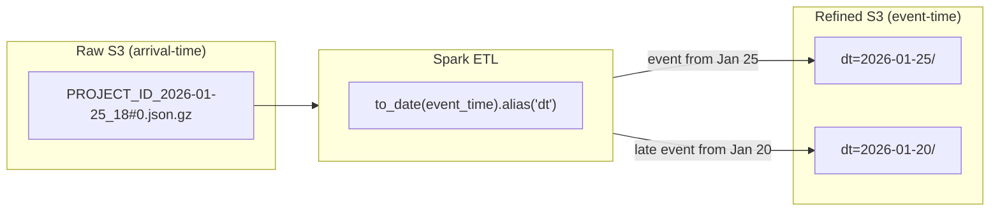
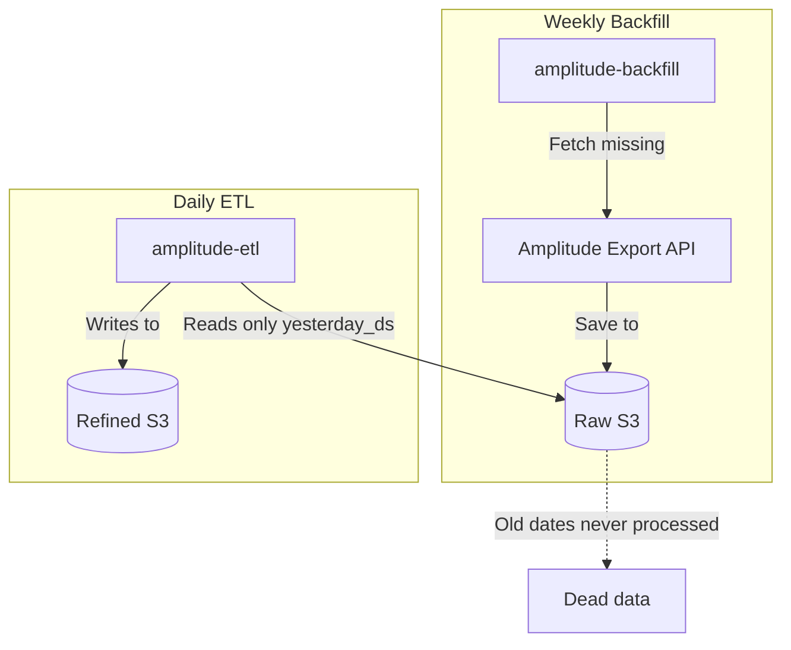

I was staring at an analytics dashboard showing a 10% drop in events on
Mondays, and a corresponding spike on Tuesdays. The events were not missing --
they were landing on the wrong date. The ETL was partitioning by arrival time
instead of event time.

When you ingest Amplitude Export API data into a data lake, the raw files are
organized by the hour the export API returned them. But the events inside
those files may belong to earlier dates. Mobile users go offline, SDKs batch
uploads, network retries delay delivery. If your refined partition key is the
arrival timestamp from the filename, late-arriving events appear on the wrong
date, and every downstream query inherits that error.

## Understanding the Two Timestamps

The confusion starts with the raw file names. A file named
`{PROJECT_ID}_2026-01-25_18#0.json.gz` looks like it contains events from
January 25 at 6 PM. It does not. It contains events that were _exported_ at
that time. The actual events inside might span several days.

This is the core distinction:

- **Arrival time** (filename date): When Amplitude exported the file
- **Event time** (`event_time` field): When the event occurred on the user's
  device

Late-arriving data is common with mobile SDKs. Offline users, batched
uploads, and network retries mean 5-10% of events arrive hours or days after
they happened.

## Options Explored

| Option                                    | Pros                                      | Cons                                                               |
| ----------------------------------------- | ----------------------------------------- | ------------------------------------------------------------------ |
| Partition by arrival time (filename date) | No parsing needed                         | Late events land on wrong date; analytics are inaccurate           |
| Partition by event_time (chosen)          | Correct date placement; late data handled | Requires parsing event payload; append mode needs dedup downstream |
| Partition by both (dual write)            | Supports both access patterns             | Double storage cost; complexity maintaining two partition schemes  |

Partitioning by arrival time would be the simplest approach -- use the date
from the filename and avoid parsing the event payload at all. But analytical
queries almost always filter by "when the event happened," not "when we
received the file." With 5-10% of events consistently misplaced, every
dashboard built on top of this data would show incorrect trends.

Dual-write was considered for supporting both raw debugging and clean
analytics. The double storage cost was acceptable, but maintaining two
partition schemes in the DAG added complexity that was not justified by how
rarely anyone queries by arrival time.

## The Solution: Partition by Event Time

The ETL extracts the date from `event_time` in the event payload and uses
that as the partition key:

```python
# Extracts date from event_time, NOT from filename
to_date(col("event_time")).alias("dt"),
```

This single line is the difference between accurate and inaccurate analytics.
Late-arriving events get placed in the partition for the day they occurred,
not the day they were exported.

The write uses `mode("append")` with `partitionBy`:

```python
def write_to_s3(df, output_path, partition_cols=["dt"]):
    df.write.mode("append").partitionBy(*partition_cols).parquet(output_path)
```

`mode("append")` allows late-arriving data to be added to existing
partitions. Spark creates `part-*.parquet` files within each partition
directory. The tradeoff is that rerunning the ETL creates duplicate files in a
partition, so downstream queries need deduplication.

## How the Flow Works



A single raw file can produce events in multiple refined partitions. An
export file from January 25 might contain events that occurred on January 20
(five days late). The ETL routes each event to the correct partition based on
when it happened.

## The Backfill Gap

There is a known gap in the pipeline: the weekly backfill job fetches missing
raw files but does not refine them.



The daily ETL only processes `yesterday_ds` (yesterday's date). Backfilled
data for older dates sits in the raw bucket with no path to refined. Three
potential fixes:

1. Backfill job also runs the ETL transformation
2. Backfill triggers a re-processing DAG for affected dates
3. Separate "catchup ETL" DAG that processes raw files missing from refined

## DAG-Job Variable Mismatch

Another issue discovered during debugging: the DAG passes environment
variables that the Spark job ignores.

| Variable        | Passed by DAG | Used by Job    |
| --------------- | ------------- | -------------- |
| `SOURCE_PATH`   | Yes           | No (hardcoded) |
| `TARGET_PATH`   | Yes           | No (hardcoded) |
| `MANIFEST_PATH` | Yes           | No (hardcoded) |

The fix is straightforward -- update `amplitude_backfill.py` to read from
`os.getenv()` instead of constants. Until then, changing paths in the DAG
configuration has no effect, which makes testing and debugging unreliable.

## Manual Testing

```bash
# Test ETL for specific date
python cli.py amplitude-etl \
  --execution-date 2026-01-26 \
  --source-path "s3://amplitude-raw-bucket/{PROJECT_ID}/" \
  --target-path "s3://amplitude-refined-bucket/event/"

# Test backfill for date range
python cli.py amplitude-backfill \
  --start-date 2026-01-20 \
  --end-date 2026-01-26
```

## When to Use This Pattern

This approach applies to any ETL pipeline ingesting Amplitude Export API data
into a partitioned data lake (S3, GCS, HDFS). It is especially important when
late-arriving events must land in the correct date partition for accurate
analytics, and when building Spark-based transformation jobs on top of raw
Amplitude exports.

## When to Skip It

- **Real-time streaming** -- If you use Amplitude's real-time event streaming
  (webhook or Kafka), events arrive individually with timestamps already
  attached. File-level partitioning logic does not apply.
- **Small-scale analytics** -- If your Amplitude data fits in a single query
  (under 1M events/day), exporting to CSV or using the Dashboard API is
  simpler than building an ETL pipeline.
- **Non-Amplitude sources** -- The nested ZIP+GZIP format and file naming
  conventions are Amplitude-specific. Other event platforms have different
  export formats.

## Key Takeaway

Partition by `event_time`, not arrival time. The file name in the raw bucket
is when Amplitude exported the data, not when the events occurred. Getting
this wrong silently shifts 5-10% of events to the wrong date, and every
downstream dashboard inherits the error.
