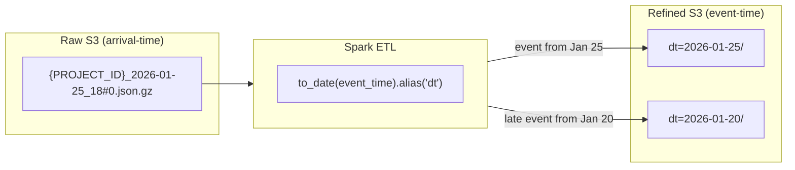
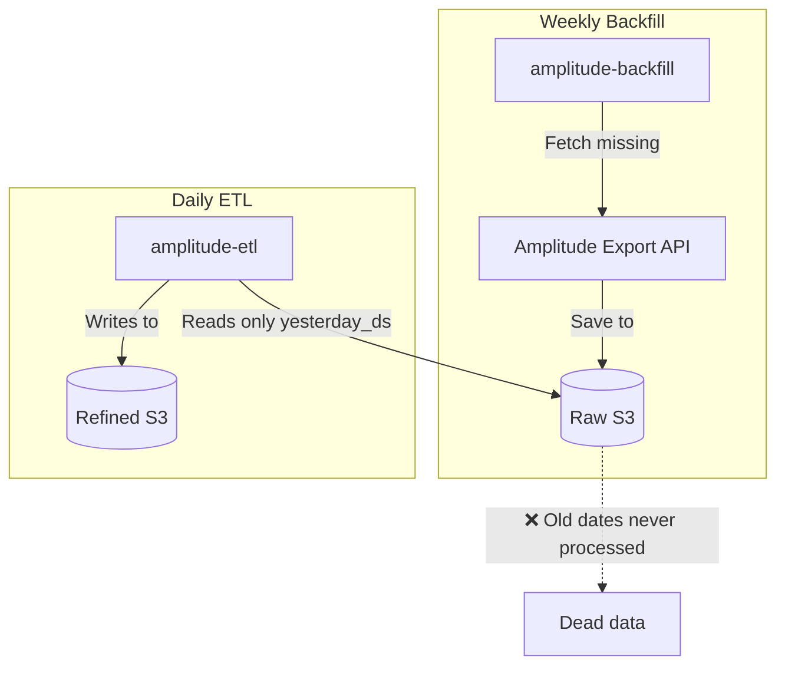

## The Problem

When ingesting Amplitude event data into a data lake, raw files are organized by
arrival time (the hour the export API returned them). But events inside those
files may belong to earlier dates (late-arriving data). If the ETL partitions
refined data by arrival time instead of event time, analytics queries produce
incorrect results — events appear on the wrong date.

## Difficulties Encountered

- **Arrival time vs event time confusion** — Raw file names contain the export
  hour, which looks like a date partition but is not the event date. This
  misleads anyone reading the S3 structure for the first time.
- **Backfill gap is invisible** — The weekly backfill fetches missing raw files
  but the daily ETL only processes yesterday's date, so backfilled data for
  older dates silently accumulates in raw with no path to refined.
- **DAG-job variable mismatch** — The DAG passes `SOURCE_PATH`, `TARGET_PATH`,
  and `MANIFEST_PATH` as environment variables, but the job ignores them and
  uses hardcoded constants, making testing and debugging unreliable.
- **append mode idempotency concern** — `mode("append")` means rerunning the ETL
  creates duplicate files in a partition. Without downstream deduplication, this
  causes double-counting.

---

## Key Insight

The ETL uses **event_time** (when the event occurred) for partitioning, NOT
arrival time (when the file was exported). This means late-arriving data is
correctly placed in the original event date's partition.

## Regular ETL Flow



## Implementation Details

**Partition key creation** (`amplitude_etl.py:294`):

```python
# Extracts date from event_time, NOT from filename
to_date(col("event_time")).alias("dt"),
```

**Write mode** (`amplitude_etl.py:300-301`):

```python
def write_to_s3(df, output_path, partition_cols=["dt"]):
    df.write.mode("append").partitionBy(*partition_cols).parquet(output_path)
```

**Why `mode("append")` matters:**

- Allows late-arriving data to be added to existing partitions
- Idempotent if combined with deduplication downstream
- Multiple files per partition (Spark creates `part-*.parquet`)

## Backfill Gap (Current Issue)

The weekly backfill job does NOT refine data:



**Problem:** Backfilled data for old dates (e.g., Jan 20th) sits in raw bucket
but daily ETL only processes `yesterday_ds` (yesterday's date).

**Potential fixes:**

1. Backfill job also runs ETL transformation
2. Backfill triggers re-processing DAG for affected dates
3. Separate "catchup ETL" DAG that processes raw files missing from refined

## DAG-Job Mismatch

The DAG passes environment variables that the job ignores:

| Variable        | Passed by DAG | Used by Job  |
| --------------- | ------------- | ------------ |
| `SOURCE_PATH`   | ✅            | ❌ Hardcoded |
| `TARGET_PATH`   | ✅            | ❌ Hardcoded |
| `MANIFEST_PATH` | ✅            | ❌ Hardcoded |

**Fix needed:** Update `amplitude_backfill.py` to read from `os.getenv()`
instead of constants.

## Manual Testing

```bash
# Test ETL for specific date
python cli.py amplitude-etl \
  --execution-date 2026-01-26 \
  --source-path "s3://amplitude-raw-bucket/{PROJECT_ID}/" \
  --target-path "s3://amplitude-refined-bucket/event/"

# Test backfill for date range
python cli.py amplitude-backfill \
  --start-date 2026-01-20 \
  --end-date 2026-01-26
```

---

## When to Use

- Any ETL pipeline ingesting Amplitude Export API data into a partitioned data
  lake (S3, GCS, HDFS)
- When late-arriving events must land in the correct date partition for accurate
  analytics
- When building Spark-based transformation jobs on top of raw Amplitude exports

## When NOT to Use

- **Real-time streaming** — If you use Amplitude's real-time event streaming
  (e.g., via webhook or Kafka), events arrive individually with timestamps
  already attached; file-level partitioning logic does not apply
- **Small-scale analytics** — If your Amplitude data fits in a single query
  (under 1M events/day), exporting to CSV or using the Dashboard API is simpler
  than building an ETL pipeline
- **Non-Amplitude sources** — The nested ZIP+GZIP format and file naming
  conventions are Amplitude-specific; other event platforms have different
  export formats

---

## Options Considered

| Option                                    | Pros                                      | Cons                                                               |
| ----------------------------------------- | ----------------------------------------- | ------------------------------------------------------------------ |
| Partition by arrival time (filename date) | Simple, no parsing needed                 | Late-arriving events land on wrong date; analytics are inaccurate  |
| Partition by event_time (chosen)          | Correct date placement; late data handled | Requires parsing event payload; append mode needs dedup downstream |
| Partition by both (dual write)            | Supports both access patterns             | Double storage cost; complexity maintaining two partition schemes  |

## Why This Approach

Partitioning by `event_time` was chosen because analytical queries almost always
filter by "when the event happened," not "when we received the file."
Late-arriving data is common with mobile SDKs (offline users, batched uploads),
so arrival-time partitioning would consistently misplace 5-10% of events.

---

## References

- [Amplitude Export API](https://amplitude.com/docs/analytics/apis/export-api)
- Spark partitionBy: Creates Hive-style partitions (`dt=YYYY-MM-DD/`)
