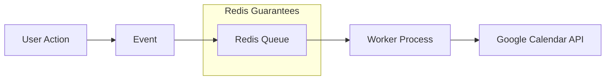

Background jobs in Node.js applications -- API calls, sync operations,
notifications -- need reliability guarantees that in-process execution cannot
provide. This post covers how Redis and BullMQ solve that problem, from data
structures and threading models to error classification and dead letter queues.

---

## The Problem

Background jobs in Node.js applications (API calls, sync operations,
notifications) need reliability guarantees that in-process execution cannot
provide. When a server crashes mid-job, the work is lost. When an external API
rate-limits you, there is no built-in retry. When traffic spikes, the system has
no way to absorb and smooth out load.

---

## Difficulties Encountered

- **Misconception that BullMQ uses separate threads** — Initial assumption was
  that BullMQ workers run on a separate thread; in reality they share the
  Node.js event loop, which changes how you reason about concurrency and
  blocking
- **Understanding Redis's role beyond caching** — Redis is commonly taught as "a
  cache," so recognizing it as a coordination system (atomic operations,
  pub/sub, sorted sets for delayed jobs) required a mental model shift
- **Race conditions with concurrent updates** — Without queue-based sequencing,
  rapid user actions (update then delete) caused out-of-order processing that
  was hard to reproduce and debug
- **Choosing between EventEmitter, Promise chains, and BullMQ** — Each pattern
  looks similar on the surface; the key differentiator (persistence + retry +
  monitoring) only becomes obvious after a production incident

---

## Why Not "Run and Forget"

The naive approach has critical production issues:

```typescript
// BAD: Run and forget
async function handleBlockUpdate(block) {
  try {
    await googleCalendarAPI.update(block);
  } catch (error) {
    console.error(error); // Lost forever
  }
}
```

**Problems:**

- Lost on server crash
- No retry mechanism
- No rate limiting
- No deduplication
- No monitoring/observability
- Can't handle burst traffic

**With Redis + BullMQ:**

```typescript
// GOOD: Production-grade
await queue.add(
  "update-calendar",
  {
    blockId: block.id,
    snapshot: extractSnapshot(block),
    intent: "update"
  },
  {
    jobId: `block-${block.id}-update`, // Deduplication
    attempts: 3, // Auto-retry
    backoff: { type: "exponential" }, // Smart delays
    priority: urgent ? 1 : 10 // Priority queue
  }
);
```

---

## Redis: The Coordination System

### What Redis Actually Is

- **In-memory data structure store** (not just a cache)
- Persistent (survives restarts)
- **Single-threaded for commands** = guaranteed atomicity
- Handles 100,000+ ops/second on single core

### Key Problems Redis Solves

**1. Persistence & Reliability**

```javascript
// Job stored in Redis:
{
  id: "job-123",
  data: { blockId: 456, intent: "update" },
  attempts: 1,
  status: "active"
}
// Survives app crashes, will be retried on restart
```

**2. Distributed Coordination**

```javascript
// Atomic operation (BRPOPLPUSH):
// 1. Remove job from waiting list
// 2. Add to processing list
// 3. Return to exactly ONE worker
// All in single atomic operation - no race conditions
```

**3. Rate Limiting**

```javascript
new Worker("calendar-queue", processor, {
  limiter: {
    max: 100, // Max 100 jobs
    duration: 60000 // Per minute
  }
});
```

**4. Retry Logic**

```javascript
{
  attempts: 3,
  backoff: {
    type: 'exponential',
    delay: 2000  // 2s, 4s, 8s...
  }
}
```

---

## BullMQ Data Structures

BullMQ uses Redis data structures for different purposes:

| Structure   | Use           | Example                                 |
| ----------- | ------------- | --------------------------------------- |
| Lists       | FIFO queue    | `waiting: [job3, job2, job1]`           |
| Sorted Sets | Delayed jobs  | `{score: timestamp, member: "job-123"}` |
| Hashes      | Job data      | `job:123 {data: "...", opts: "..."}`    |
| Sets        | Deduplication | `completed: {job-123, job-124}`         |

### Lists (FIFO Queue)

```text
waiting jobs: [job3, job2, job1]  // job1 processed first
BRPOPLPUSH removes from right, ensures FIFO order
```

Redis `BRPOPLPUSH` (blocking right-pop, left-push) atomically moves a job from
the waiting list to the active list and returns it to exactly one worker. This
atomic operation prevents duplicate processing across multiple workers.

### Sorted Sets (Delayed/Scheduled Jobs)

```text
delayed jobs: {
  score: 1703001234567 (timestamp),
  member: "job-123"
}
// Jobs become available when current time > score
```

BullMQ polls the sorted set and moves jobs whose score (scheduled timestamp) is
less than or equal to the current time back into the waiting list.

### Hashes (Job Data Storage)

```text
job:123 {
  data: "{ blockId: 456, snapshot: {...} }",
  opts: "{ attempts: 3, delay: 5000 }",
  timestamp: "1703001234567"
}
```

Each job's full payload, options, and metadata are stored as a Redis hash,
allowing partial reads of individual fields without deserializing the entire
job.

### Sets (Job Deduplication)

```text
completed jobs: {job-123, job-124, job-125}
// Check if job already processed via SISMEMBER
```

Combined with the `jobId` option, BullMQ uses sets to track completed and failed
jobs, preventing re-processing of duplicate submissions.

---

## Threading Model

### Common Misconception: BullMQ Uses Separate Threads

**Q:** Does BullMQ use a separate thread from the main NestJS service?

**A:** No. BullMQ runs in the **same Node.js process** and **same event loop**.
Node.js is single-threaded. The BullMQ worker, NestJS controllers, services, and
database queries all share one event loop. This means a CPU-intensive job in a
BullMQ worker blocks the entire application, including HTTP request handling.

```text
Main Thread (Event Loop)
├── NestJS Controllers
├── Services
├── Database queries
└── BullMQ Workers ← SAME THREAD
```

BullMQ **can** run in a separate process (not thread) by creating a standalone
worker file, but the default NestJS integration (`@Processor` decorator) runs
in-process:

```typescript
// OPTION 1: Same process (default NestJS integration)
@Module({
  imports: [
    BullModule.registerQueue({ name: "google-calendar-event" }),
  ],
  providers: [QueueProcessor], // Worker in same process
})

// OPTION 2: Separate process (standalone worker file)
// worker.ts - run with `node worker.ts`
import { Worker } from "bullmq";
const worker = new Worker("google-calendar-event", async (job) => {
  // Runs in completely separate process
});
```

### How It's Still Non-Blocking

```typescript
// Sync workflow - returns immediately
await this.queue.add("create-channel", data);
// ↑ Job added to Redis, continues immediately

return { success: true };
// ↑ Returns to user immediately

// Later in event loop:
// Worker processes the job asynchronously
```

### BullMQ Concurrency

```typescript
@Processor("google-calendar-event", {
  concurrency: 5 // Process up to 5 jobs simultaneously
})
export class QueueProcessor extends WorkerHost {
  async process(job: Job): Promise<void> {
    // Each job runs independently
  }
}
```

---

## Non-Blocking Solutions Comparison

| Solution       | Non-blocking | Persistence | Retry  | Monitoring | Complexity   | Use Case                   |
| -------------- | ------------ | ----------- | ------ | ---------- | ------------ | -------------------------- |
| EventEmitter   | Yes          | No          | No     | No         | Simple       | Fire-and-forget, in-memory |
| Promise Chain  | Yes          | No          | Manual | No         | Simple       | Simple async operations    |
| Worker Threads | Yes          | No          | Manual | No         | Complex      | CPU-intensive tasks        |
| BullMQ         | Yes          | Yes         | Yes    | Yes        | Moderate     | Critical jobs with retry   |
| Microservices  | Yes          | Yes         | Yes    | Yes        | Very complex | Large-scale distributed    |

### Choosing the Right Solution

- **Simple fire-and-forget** -- EventEmitter or Promise chain
- **Critical operations** -- BullMQ (persistence + retry + monitoring)
- **CPU-intensive work** -- Worker Threads (true parallelism, separate CPU
  thread)
- **Large-scale distributed** -- Microservices (separate services, independent
  scaling, but massive infrastructure overhead)

### EventEmitter Pattern

```typescript
// Publisher
this.eventEmitter.emit('channel.create', data);

// Handler
@OnEvent('channel.create')
async handleChannelCreate(data): Promise<void> {
  await this.queue.add('create-channel', data);
}
```

**Note:** EventEmitter does nothing by itself - it only calls registered
handlers. If no handler exists, event is silently lost.

### Promise Chain Pattern

```typescript
this.service
  .doSomething()
  .then(() => console.log("done"))
  .catch((err) => console.error(err));
// Returns immediately, runs async
```

**Use for:** Simple, non-critical operations only.

---

## When to Use BullMQ

Use BullMQ when you need:

1. **Persistence** - Jobs must survive crashes
2. **Retry Logic** - External APIs can fail temporarily
3. **Monitoring** - Need to track job status and failures
4. **Rate Limiting** - Prevent API throttling
5. **Deduplication** - Prevent duplicate processing
6. **Priority Queue** - Some jobs are more urgent

### Example: Calendar Sync

```typescript
// Channel creation is CRITICAL
// - If lost, calendar won't receive updates for 24+ hours
// - Google API can fail (rate limits, timeouts)
// - Need visibility into failures

await this.queue.add("create-channel", data, {
  attempts: 3,
  backoff: { type: "exponential", delay: 1000 }
});
```

---

## When NOT to Use

- **Simple fire-and-forget events** — If job loss is acceptable and no retry is
  needed, an EventEmitter or plain Promise is simpler and has zero
  infrastructure overhead
- **CPU-bound computation** — BullMQ shares the Node.js event loop;
  CPU-intensive work blocks other jobs. Use Worker Threads or a separate process
  instead
- **Sub-millisecond latency requirements** — The Redis round-trip adds latency
  (~1-5ms); for real-time hot paths where every millisecond matters, direct
  function calls are faster
- **Single-use scripts or CLI tools** — Adding Redis as a dependency for a
  one-off script is unnecessary complexity
- **When you need exactly-once delivery** — BullMQ provides at-least-once
  semantics; if duplicate processing causes data corruption, you need
  idempotency guards on top of BullMQ

---

## Options Considered

| Option                  | Pros                                                         | Cons                                                             |
| ----------------------- | ------------------------------------------------------------ | ---------------------------------------------------------------- |
| BullMQ + Redis          | Persistence, retry, rate limiting, monitoring, deduplication | Requires Redis infrastructure; at-least-once only                |
| EventEmitter            | Zero deps; in-process; simple                                | No persistence; lost on crash; no retry                          |
| Promise Chain           | Native JS; no deps                                           | No persistence; manual retry; no monitoring                      |
| Worker Threads          | True parallelism for CPU work                                | No persistence; manual retry; complex IPC                        |
| AWS SQS / Microservices | Managed; scales independently; cross-service                 | Higher latency; more infrastructure; overkill for single-service |

## Why This Approach

Chose BullMQ + Redis because the calendar sync use case requires all three:
persistence (jobs must survive crashes), automatic retry (Google API rate
limits), and observability (tracking failed syncs). EventEmitter and Promise
chains lack persistence. Worker Threads solve a different problem (CPU
parallelism). SQS was overkill for a single NestJS service that already uses
Redis for other purposes.

---

## Race Condition Prevention

### Real-World Scenario: UPDATE Then DELETE

A user edits a calendar block and then immediately deletes it. Without a queue,
both operations fire as independent async calls to the Google Calendar API:

```typescript
// Without queue: race condition
updateBlock(id); // Takes 2 seconds (Google API round-trip)
deleteBlock(id); // Takes 1 second
// DELETE completes first!
// UPDATE then either fails (404) or RECREATES the deleted item
// Result: ghost calendar event that the user thought was deleted
```

This is hard to reproduce because it depends on network timing. It only surfaces
when a user acts fast enough for the requests to overlap.

With Redis + BullMQ, jobs for the same resource are processed sequentially:

```typescript
// With queue: ordered processing
await queue.add("update", { blockId: 123 });
await queue.add("delete", { blockId: 123 });
// Redis ensures sequential processing for blockId: 123
// UPDATE completes first, then DELETE runs -- correct order guaranteed
```

### Distributed Locking

```typescript
private async acquireLock(blockId: number, ttl: number = 30): Promise<boolean> {
  const lockKey = `block-lock:${blockId}`;
  const redisClient = await this.queue.client;
  const result = await redisClient.set(lockKey, lockValue, 'EX', ttl, 'NX');
  return result === 'OK';
}
```

---

## Monitoring and Observability

```typescript
// See all failed jobs
await queue.getFailed();

// See waiting jobs
await queue.getWaiting();

// Get metrics
const counts = await queue.getJobCounts();
// { waiting: 5, active: 2, completed: 100, failed: 3 }

// Get specific job status
const job = await queue.getJob(jobId);
console.log(job.failedReason);
```

---

## Architecture Summary



**Benefits:**

- **Reliability**: 99.9%+ job completion rate
- **Scalability**: Add workers to handle more load
- **Observability**: Track every job's status
- **Maintainability**: Clear separation of concerns
- **Performance**: Absorb traffic spikes, smooth out load

---

## Error Handling and DLQ Patterns

Retry logic and monitoring are only half the story. What happens when all
retries are exhausted? Without a deliberate failure path, jobs vanish silently --
and you never know they failed.

### Dead Letter Queue (DLQ)

When all retries are exhausted, failed jobs need a recovery path. A common
mistake is setting `removeOnFail: true` to keep the failed list clean. The
problem: failed jobs disappear with no audit trail. You cannot inspect them,
replay them, or even count them.

```typescript
// BAD: Silent failure
await queue.add("sync", data, {
  attempts: 20,
  backoff: { type: "fixed", delay: 100 },
  removeOnFail: true, // Job vanishes after 20 retries — no trace left
});

// GOOD: DLQ captures failures for investigation
await queue.add("sync", data, {
  attempts: 5,
  backoff: { type: "exponential", delay: 2000 },
  removeOnFail: false, // Job stays in failed state for inspection
});
```

With `removeOnFail: false`, failed jobs remain queryable via
`queue.getFailed()`. You can build alerting on top of this (e.g., Slack
notification when failed count exceeds a threshold) and replay jobs after fixing
the underlying issue.

### Retryable vs Non-Retryable Errors

Not all errors deserve retries. A `400 Bad Request` will fail the same way on
every attempt -- retrying it wastes your retry budget and delays other jobs. A
`503 Service Unavailable` or `429 Too Many Requests` is transient and worth
retrying. Distinguish permanent client errors from transient server errors:

```typescript
function isRetryableError(error: any): boolean {
  const status = error?.response?.status;
  const nonRetryable = [400, 401, 403, 404];
  return !nonRetryable.includes(status);
  // 500, 503, 429 → retry (server issue or rate limit)
  // 400, 401, 403, 404 → don't retry (client error, won't change)
}
```

Use this classification in your worker to short-circuit retries on permanent
failures. Move non-retryable jobs directly to the DLQ with full error context
instead of burning through the retry budget.

### BullMQ UnrecoverableError

The `isRetryableError` classification above works when you control the retry logic yourself. But what about the retries BullMQ manages automatically? If your retry config is designed for one failure mode (e.g., lock contention with `attempts: 20, delay: 100ms`) but your processor also throws permanent errors (e.g., business logic failures), BullMQ retries everything -- including errors that will never succeed.

BullMQ's `UnrecoverableError` solves this. When thrown from a processor, it tells BullMQ to skip all remaining retry attempts and move the job directly to the failed state:

```typescript
import { UnrecoverableError } from 'bullmq';

async process(job: Job): Promise<void> {
  try {
    await this.executeJob(job);
  } catch (error) {
    // Business logic errors (AppException hierarchy) are permanent
    if (error instanceof AppException) {
      throw new UnrecoverableError(error.message);
    }
    // Lock contention, network errors → let BullMQ retry
    throw error;
  }
}
```

The key pattern here is the **exception hierarchy boundary**. All business logic exceptions extend a common base class (`AppException` above), while infrastructure errors stay plain `Error`. That makes a single `instanceof` check a reliable separator between retryable and non-retryable errors, with no explicit error-type list to maintain. When you add a new business exception (e.g., `ResourceNotFoundException`), it inherits the base class and gets the `UnrecoverableError` treatment for free.

The failure mode this fixes is a retry storm. A stale external event ID made the update call throw a business logic exception 20 times in 10 seconds -- the retry config (`attempts: 20, delay: 100ms`) had been tuned for Redis lock contention, and it happily retried a permanent failure at the same rate. Throwing `UnrecoverableError` for that class of error ended the storm.

### Layered Retry Strategy

A single retry mechanism is brittle. Network blips resolve in milliseconds; API
outages last minutes. Combine three layers, each handling a different failure
duration:

```text
Layer 1: In-process retry (exponential, 3 attempts, ~15s total)
  ↓ still failing
Layer 2: Queue-level retry (exponential, 5 attempts, ~10min total)
  ↓ still failing
Layer 3: DLQ (manual inspection + alerting)
```

**Layer 1** catches transient network blips -- a dropped connection, a brief DNS
hiccup. These resolve in seconds. **Layer 2** handles longer outages -- an
external API down for maintenance, a rate limit window. **Layer 3** is for
failures that need human investigation -- a revoked API key, a schema change in
the external service, or a bug in your serialization logic.

### Rate Limit Awareness (429)

When an API returns `429 Too Many Requests`, it often includes a `Retry-After`
header telling you exactly how long to wait. Ignoring this header and using your
own fixed backoff is wasteful -- you either wait too long or not long enough.

BullMQ's `DelayedError` lets you reschedule the job with the exact delay the API
requested:

```typescript
if (error.response?.status === 429) {
  const retryAfter = parseInt(
    error.response.headers["retry-after"] ?? "60",
    10
  );
  throw new DelayedError(retryAfter * 1000);
}
```

This is different from a normal retry: `DelayedError` does not decrement the
attempt counter. The job moves to the delayed set and re-enters the waiting list
after the specified duration, preserving your retry budget for genuine failures.

---

## Key Points

1. **Redis is not just a cache** - It's a coordination system
2. **Single-threaded Redis** = Atomic operations = No race conditions
3. **Multi-process workers** = Parallel processing with safety
4. **Persistence** = Jobs survive crashes and restarts
5. **Built-in patterns** = Retry, rate limit, deduplication, priority
6. **Observability** = Know what's happening in your system
7. **DLQ is essential** = `removeOnFail: true` silently loses failures
8. **Classify errors before retrying** = 4xx errors waste retry budget
9. **Use `UnrecoverableError` for permanent failures** = When thrown from a processor, BullMQ skips all remaining retry attempts. Use `instanceof` on your exception hierarchy to cleanly separate retryable (lock contention, network) from non-retryable (auth, not-found, business logic) errors

---

## Further Study Topics

- **Redis Streams** -- Alternative to Lists for queue workloads; supports
  consumer groups, message acknowledgment, and replay from any point in the
  stream
- **Redis Pub/Sub** -- Real-time event broadcasting to multiple subscribers; no
  persistence (messages lost if no subscriber is listening)
- **Redis Cluster** -- Horizontal scaling by sharding data across multiple
  nodes; needed when a single Redis instance cannot handle the throughput or
  memory requirements
- **BullMQ Pro features** -- Job groups (rate limit per group), nested queues,
  and advanced flow control
- **Alternative queue systems** -- RabbitMQ (AMQP protocol, complex routing),
  Kafka (event streaming at scale), AWS SQS (managed, no infrastructure)

---

## References

- [BullMQ Documentation](https://docs.bullmq.io/)
- [BullMQ — Stop retrying jobs (`UnrecoverableError`)](https://docs.bullmq.io/patterns/stop-retrying-jobs)
- [NestJS Queues](https://docs.nestjs.com/techniques/queues)
- [The Node.js Event Loop, Timers, and `process.nextTick()`](https://nodejs.org/en/learn/asynchronous-work/event-loop-timers-and-nexttick)
