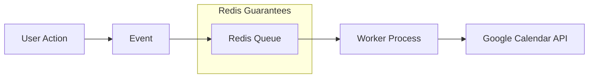

I had a background job that called the Google Calendar API. When the server
crashed mid-request, the job vanished. No retry, no log, no trace. The user's
calendar just never updated, and we had no idea until they reported it days
later.

Background jobs in Node.js applications -- API calls, sync operations,
notifications -- need reliability guarantees that in-process execution cannot
provide. When a server crashes mid-job, the work is lost. When an external API
rate-limits you, there is no built-in retry. When traffic spikes, the system has
no way to absorb and smooth out load. This is where Redis-backed job queues
enter the picture.

## The Naive Approach Falls Apart

The first instinct is to call the API directly and hope for the best:

```typescript
// BAD: Run and forget
async function handleBlockUpdate(block) {
  try {
    await googleCalendarAPI.update(block);
  } catch (error) {
    console.error(error); // Lost forever
  }
}
```

This has critical production problems: lost on server crash, no retry mechanism,
no rate limiting, no deduplication, no monitoring, and no ability to handle burst
traffic.

Compare that with a queue-based approach:

```typescript
// GOOD: Production-grade
await queue.add(
  "update-calendar",
  {
    blockId: block.id,
    snapshot: extractSnapshot(block),
    intent: "update",
  },
  {
    jobId: `block-${block.id}-update`, // Deduplication
    attempts: 3, // Auto-retry
    backoff: { type: "exponential" }, // Smart delays
    priority: urgent ? 1 : 10, // Priority queue
  },
);
```

The difference is night and day. Every job is persisted, retried on failure, and
observable.

## Redis Is Not Just a Cache

This was my first mental model shift. Redis is commonly taught as "a cache," but
it is an in-memory data structure store that serves as a coordination system.
It is persistent (survives restarts), single-threaded for commands (guaranteeing
atomicity), and handles 100,000+ operations per second on a single core.

Redis solves four key problems for job queues:

**Persistence and Reliability** -- Jobs are stored in Redis and survive app
crashes:

```javascript
// Job stored in Redis:
{
  id: "job-123",
  data: { blockId: 456, intent: "update" },
  attempts: 1,
  status: "active"
}
// Survives app crashes, will be retried on restart
```

**Distributed Coordination** -- Atomic operations ensure exactly one worker
picks up each job:

```javascript
// Atomic operation (BRPOPLPUSH):
// 1. Remove job from waiting list
// 2. Add to processing list
// 3. Return to exactly ONE worker
// All in single atomic operation - no race conditions
```

**Rate Limiting** -- Prevent overwhelming external APIs:

```javascript
new Worker("calendar-queue", processor, {
  limiter: {
    max: 100, // Max 100 jobs
    duration: 60000, // Per minute
  },
});
```

**Retry Logic** -- Exponential backoff for transient failures:

```javascript
{
  attempts: 3,
  backoff: {
    type: 'exponential',
    delay: 2000  // 2s, 4s, 8s...
  }
}
```

## How BullMQ Uses Redis Data Structures

BullMQ maps its job lifecycle onto Redis primitives:

| Structure   | Use           | Example                                 |
| ----------- | ------------- | --------------------------------------- |
| Lists       | FIFO queue    | `waiting: [job3, job2, job1]`           |
| Sorted Sets | Delayed jobs  | `{score: timestamp, member: "job-123"}` |
| Hashes      | Job data      | `job:123 {data: "...", opts: "..."}`    |
| Sets        | Deduplication | `completed: {job-123, job-124}`         |

This is not an abstraction for abstraction's sake. Each data structure was
chosen because it maps naturally to the problem: lists for FIFO ordering, sorted
sets for time-based scheduling, hashes for structured job data, sets for
deduplication.

## The Threading Model Misconception

I initially assumed BullMQ workers run on a separate thread. They do not. BullMQ
runs in the same Node.js process and same event loop.

```text
Main Thread (Event Loop)
├── NestJS Controllers
├── Services
├── Database queries
└── BullMQ Workers ← SAME THREAD
```

This changes how you reason about concurrency. It is still non-blocking because
adding a job returns immediately:

```typescript
// Sync workflow - returns immediately
await this.queue.add("create-channel", data);
// ↑ Job added to Redis, continues immediately

return { success: true };
// ↑ Returns to user immediately

// Later in event loop:
// Worker processes the job asynchronously
```

BullMQ handles concurrency through its concurrency setting, not threads:

```typescript
@Processor("google-calendar-event", {
  concurrency: 5, // Process up to 5 jobs simultaneously
})
export class QueueProcessor extends WorkerHost {
  async process(job: Job): Promise<void> {
    // Each job runs independently
  }
}
```

## Options Explored

I evaluated five approaches before choosing BullMQ:

| Option                  | Pros                                                         | Cons                                                             |
| ----------------------- | ------------------------------------------------------------ | ---------------------------------------------------------------- |
| BullMQ + Redis          | Persistence, retry, rate limiting, monitoring, deduplication | Requires Redis infrastructure; at-least-once only                |
| EventEmitter            | Zero deps; in-process; simple                                | No persistence; lost on crash; no retry                          |
| Promise Chain           | Native JS; no deps                                           | No persistence; manual retry; no monitoring                      |
| Worker Threads          | True parallelism for CPU work                                | No persistence; manual retry; complex IPC                        |
| AWS SQS / Microservices | Managed; scales independently; cross-service                 | Higher latency; more infrastructure; overkill for single-service |

EventEmitter and Promise chains lack persistence -- the single most important
requirement. Worker Threads solve a different problem (CPU parallelism). SQS was
overkill for a single NestJS service that already uses Redis.

### EventEmitter Pattern

EventEmitter is useful as a dispatch layer, but it provides no persistence:

```typescript
// Publisher
this.eventEmitter.emit('channel.create', data);

// Handler
@OnEvent('channel.create')
async handleChannelCreate(data): Promise<void> {
  await this.queue.add('create-channel', data);
}
```

If no handler exists, the event is silently lost. In practice, I use
EventEmitter to dispatch to BullMQ, not as a standalone solution.

### Promise Chain Pattern

```typescript
this.service
  .doSomething()
  .then(() => console.log("done"))
  .catch((err) => console.error(err));
// Returns immediately, runs async
```

Use this for simple, non-critical operations only.

## Race Condition Prevention

Without a queue, rapid user actions cause ordering problems:

```typescript
// User updates then immediately deletes
updateBlock(id); // Takes 2 seconds
deleteBlock(id); // Takes 1 second
// DELETE completes first! UPDATE fails or recreates deleted item
```

With Redis + BullMQ, jobs process sequentially:

```typescript
await queue.add("update", { blockId: 123 });
await queue.add("delete", { blockId: 123 });
// Redis ensures sequential processing for blockId: 123
```

For finer-grained control, distributed locking prevents concurrent operations on
the same resource:

```typescript
private async acquireLock(blockId: number, ttl: number = 30): Promise<boolean> {
  const lockKey = `block-lock:${blockId}`;
  const redisClient = await this.queue.client;
  const result = await redisClient.set(lockKey, lockValue, 'EX', ttl, 'NX');
  return result === 'OK';
}
```

## Monitoring and Observability

One of BullMQ's strongest advantages is built-in observability:

```typescript
// See all failed jobs
await queue.getFailed();

// See waiting jobs
await queue.getWaiting();

// Get metrics
const counts = await queue.getJobCounts();
// { waiting: 5, active: 2, completed: 100, failed: 3 }

// Get specific job status
const job = await queue.getJob(jobId);
console.log(job.failedReason);
```

This is the difference between "something broke and we have no idea what" and
"job-456 failed on attempt 2 with a 429 rate limit error from Google."

## Architecture Summary



## Practical Takeaway

Use BullMQ when you need persistence (jobs must survive crashes), retry logic
(external APIs fail), monitoring (tracking failures), rate limiting (preventing
API throttling), deduplication (preventing duplicate processing), or priority
queuing.

Do not use it for simple fire-and-forget events where job loss is acceptable, for
CPU-bound computation (BullMQ shares the event loop), for sub-millisecond
latency requirements (Redis round-trip adds 1-5ms), or for single-use scripts
where adding Redis is unnecessary complexity.

One important caveat: BullMQ provides at-least-once semantics, not exactly-once.
If duplicate processing would corrupt data, you need idempotency guards on top
of BullMQ.
