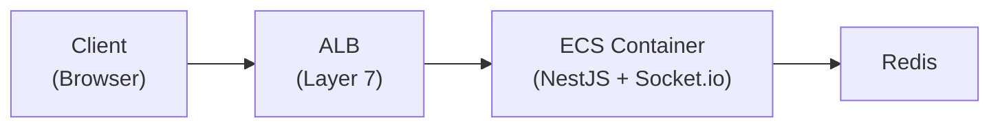
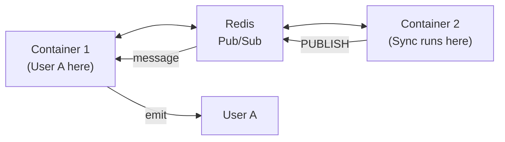

notifications.

---

## The Problem

A NestJS backend running on AWS ECS needs to push real-time notifications to
browser clients (e.g., "sync complete" after a background job finishes). HTTP
polling wastes resources and adds latency. WebSockets solve this, but
introducing them in a containerized, load-balanced environment raises questions:
How does ALB handle the HTTP-to-WebSocket upgrade? How do multiple containers
broadcast to clients connected to different instances? What happens when
connections drop?

---

## Difficulties Encountered

- **Misunderstanding ALB's role** — Initial assumption was that ALB actively
  manages WebSocket state; in reality ALB is just a TCP tunnel after the HTTP
  upgrade handshake. This confusion led to unnecessary ALB configuration
  attempts
- **Cross-container broadcasting** — When User A connects to Container 1 but a
  sync job completes on Container 2, Container 2 cannot directly notify User A.
  Took time to understand that Redis Pub/Sub solves this via persistent TCP
  subscriptions, not HTTP callbacks
- **Connection lifecycle edge cases** — Browser tab close sends a TCP FIN (not a
  WebSocket close frame), network drops send nothing (relies on ping/pong
  timeout), and ALB has its own idle timeout. Each scenario requires different
  handling, which was not obvious from Socket.io docs alone
- **Sticky sessions confusion** — Thought sticky sessions were mandatory for
  Socket.io, but they are only needed for HTTP polling fallback. With WebSocket
  transport only, any container can handle the connection after the initial
  upgrade

---

## Architecture Overview



### Connection Flow

1. **Client** sends HTTP request with `Upgrade: websocket` header
2. **ALB** receives request, routes to a container
3. **Container** accepts upgrade, establishes WebSocket
4. **ALB** keeps TCP tunnel open (passes through data)
5. **Socket.io** manages the connection from here

---

## Component Responsibilities

| Component            | Role                                                             |
| -------------------- | ---------------------------------------------------------------- |
| **ALB**              | Routes initial HTTP upgrade, then passes through TCP (tunnel)    |
| **Socket.io Server** | Manages WebSocket connection, tracks clients, handles heartbeats |
| **NestJS Gateway**   | Application logic - auth, message handling, room management      |
| **Redis Adapter**    | Broadcasts messages across multiple containers                   |

**Key insight:** ALB is just a tunnel - Socket.io manages the actual connection.

---

## Why We Need ALB

Even though Socket.io manages state, ALB serves a different purpose:

### Initial Connection Routing

```text
Without ALB:
  Client: "I want to connect to wss://api.example.com"
  Containers have private IPs:
  - 10.0.1.5:3000
  - 10.0.1.6:3000
  Client can't access private IPs directly!

With ALB:
  Client → api.example.com → ALB (public) → picks container → WebSocket established
```

---

## Redis for Multi-Container Broadcasting

### The Problem

With multiple ECS containers, User A might connect to Container 1, but the sync
job runs on Container 2.

```text
Without Redis:
  User A ──────────────► Container 1 (User A's socket here)
  Sync Job ────────────► Container 2 (Sync completes here)
  Container 2 can't notify User A!
```

### The Solution: Redis Pub/Sub



### How Pub/Sub Actually Works

**Key insight:** Redis doesn't "call" your app. Your app maintains persistent
TCP connections to Redis.

```text
Step 1: STARTUP
  Container opens TCP connection to Redis (stays open!)
  → "SUBSCRIBE moba:socket.io"

Step 2: PUBLISH
  Container 2 sends message to Redis
  → "PUBLISH moba:socket.io {user:123, data:...}"

Step 3: PUSH
  Redis writes to the ALREADY OPEN TCP connection

Step 4: RECEIVE
  Node.js event loop picks up data from socket
  Socket.io adapter handles it → delivers to user's WebSocket
```

### Code Reference

```typescript
// pubClient: for PUBLISHING messages
// subClient: for SUBSCRIBING (maintains open TCP connection)
const pubClient = createClient({ url: redisUrl });
const subClient = pubClient.duplicate();

await Promise.all([pubClient.connect(), subClient.connect()]);

this.adapterConstructor = createAdapter(pubClient, subClient, {
  key: `${redisConfig.prefix}:socket.io`
});
```

---

## Connection Lifecycle

### Scenario A: Client Closes App/Tab (Normal)

```text
Client closes browser
    ↓
Browser's TCP stack sends FIN packet (not Socket.io!)
    ↓
TCP FIN packet ──► ALB ──► Container
    ↓
Socket.io detects TCP connection closed
    ↓
handleDisconnect() called (auto room cleanup)
```

**Why TCP FIN, not WebSocket message?**

- Browser is closing, no time for graceful WebSocket close
- TCP FIN is faster and handled by OS, not JavaScript
- Works even if JavaScript is frozen/crashed

### Scenario B: Network Interruption

```text
Network drops (no FIN packet)
    ↓
Socket.io ping/pong timeout (~25s)
    ↓
Server marks client as disconnected
    ↓
handleDisconnect() called
```

### Scenario C: ALB Idle Timeout

```text
No activity for 60 seconds (ALB default)
    ↓
ALB closes the TCP connection
    ↓
Both client and server detect disconnect
```

**Note:** This rarely happens because Socket.io sends heartbeat every 25s.

### Summary Table

| Initiator              | Mechanism             | Detection                |
| ---------------------- | --------------------- | ------------------------ |
| Client (normal close)  | TCP FIN               | Immediate                |
| Client (crash/network) | No FIN                | Ping/pong timeout (~25s) |
| ALB                    | Idle timeout (60s)    | TCP RST                  |
| Server                 | `client.disconnect()` | Immediate                |

---

## ALB Idle Timeout (Why No Change Needed)

| Setting                | Default Value | What it does                         |
| ---------------------- | ------------- | ------------------------------------ |
| ALB idle timeout       | 60 seconds    | Closes connection if no data for 60s |
| Socket.io pingInterval | 25 seconds    | Sends ping every 25s                 |
| Socket.io pingTimeout  | 20 seconds    | Waits 20s for pong response          |

Socket.io's heartbeat keeps the connection alive:

```text
Timeline:
0s   ─── Connection established
25s  ─── Socket.io sends PING → ALB resets idle timer
50s  ─── Socket.io sends PING → ALB resets idle timer
75s  ─── Socket.io sends PING → ALB resets idle timer
...

ALB idle timeout (60s) is NEVER reached because Socket.io
sends heartbeat every 25s. No config change needed!
```

---

## Single Container Setup (Simplified)

For single-container deployments:

| Component           | Needed? | Why                                              |
| ------------------- | ------- | ------------------------------------------------ |
| ALB                 | Yes     | Routes public traffic to private container       |
| Redis Adapter       | Yes     | Future-proofs for multi-container                |
| Sticky Sessions     | No      | Single container = all connections go same place |
| Multiple containers | No      | Not needed until scale requires it               |

---

## Multi-Container Considerations

When scaling to multiple containers:

### Sticky Sessions

Ensures reconnections go to the same container:

- Faster reconnection (previous state available)
- Less Redis overhead
- Required for Socket.io HTTP polling fallback

### Configuration

```text
When you click "Merge pull request" dropdown ▼:
┌─────────────────────────────────────┐
│ Create a merge commit               │ ← feature→develop
│ Squash and merge                    │ ← develop→main
│ Rebase and merge                    │
└─────────────────────────────────────┘
```

---

## When to Use

- **Real-time notifications to browser clients** — When the server needs to push
  updates (sync status, live collaboration, chat) without client polling
- **Containerized deployments behind a load balancer** — When multiple ECS tasks
  or Kubernetes pods serve the same application and clients may connect to any
  instance
- **Background job completion alerts** — When async workers finish tasks and
  users need immediate feedback without refreshing

---

## When NOT to Use

- **Simple request-response APIs** — If the client only needs data when it
  explicitly asks, REST or GraphQL is simpler and has no persistent connection
  overhead
- **Server-sent events (SSE) suffice** — If communication is one-directional
  (server to client only), SSE is simpler than WebSocket and works through more
  proxies without special config
- **Low-frequency updates** — If updates happen less than once per minute,
  long-polling or periodic fetch is cheaper than maintaining persistent
  WebSocket connections
- **Serverless / Lambda** — WebSockets require persistent connections; Lambda
  functions are ephemeral. Use API Gateway WebSocket APIs instead of Socket.io
  in serverless environments

---

## Options Considered

| Option                     | Pros                                                                            | Cons                                                                                           |
| -------------------------- | ------------------------------------------------------------------------------- | ---------------------------------------------------------------------------------------------- |
| Socket.io + Redis Adapter  | Auto-reconnect, room management, fallback to polling, cross-container broadcast | Extra dependency (Redis); Socket.io adds protocol overhead                                     |
| Raw WebSocket (ws library) | Minimal overhead; no abstraction layer                                          | No auto-reconnect; manual room management; no cross-container broadcast without custom pub/sub |
| Server-Sent Events (SSE)   | Simple; works through most proxies; no upgrade needed                           | Unidirectional (server to client only); no binary support                                      |
| Long Polling               | Works everywhere; no special infra                                              | High latency; wastes server resources; complex client logic                                    |
| AWS API Gateway WebSockets | Serverless; managed scaling                                                     | Vendor lock-in; different programming model; no Socket.io compatibility                        |

## Why This Approach

Chose Socket.io with Redis Adapter because the application needs bidirectional
communication (client sends actions, server pushes notifications), automatic
reconnection handling, and cross-container message broadcast. Raw WebSocket
would require reimplementing all of Socket.io's room management, heartbeat, and
reconnection logic. SSE is unidirectional. The Redis Adapter was chosen over
custom pub/sub because Socket.io's adapter pattern handles serialization,
namespaces, and room-scoped broadcasting out of the box.

---

## Key Points

1. **ALB is just a tunnel** - Routes initial connection, then passes through TCP
2. **Socket.io manages lifecycle** - Ping/pong, timeouts, rooms, cleanup are
   automatic
3. **Redis enables multi-container** - Uses persistent TCP connections, not HTTP
4. **Pub/Sub pattern** - Subscribe once, receive messages as they're published
5. **Single container simplifies** - No sticky sessions needed; Redis useful for
   future scaling

---

## References

- [Socket.io Documentation](https://socket.io/docs/v4/)
- [AWS ALB WebSocket Support](https://docs.aws.amazon.com/elasticloadbalancing/latest/application/load-balancer-websockets.html)
- [Redis Pub/Sub](https://redis.io/docs/interact/pubsub/)
