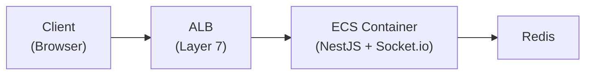
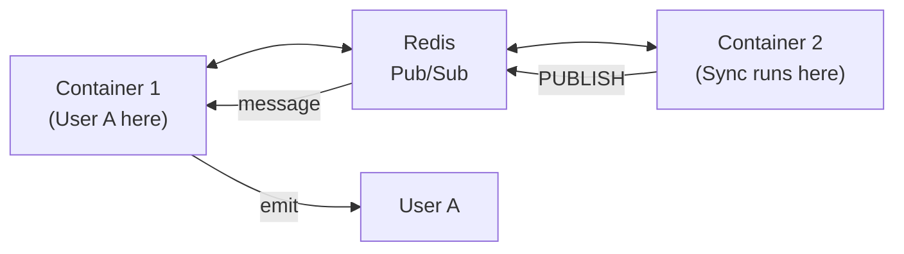

I needed to push real-time notifications to browser clients -- "sync complete"
messages after background jobs finished. HTTP polling worked but wasted resources
and added visible latency. WebSockets were the obvious solution, but deploying
them behind an AWS ALB with multiple ECS containers raised questions I did not
have answers to.

How does ALB handle the HTTP-to-WebSocket upgrade? How do multiple containers
broadcast to clients connected to different instances? What happens when
connections drop? This post covers the architecture I landed on after working
through those questions.

## The Difficulties

Several misconceptions slowed me down.

I initially assumed ALB actively manages WebSocket state. It does not. ALB is
just a TCP tunnel after the HTTP upgrade handshake. This confusion led to
unnecessary ALB configuration attempts that solved nothing.

Cross-container broadcasting was the harder problem. When User A connects to
Container 1 but a sync job completes on Container 2, Container 2 cannot directly
notify User A. It took time to understand that Redis Pub/Sub solves this via
persistent TCP subscriptions, not HTTP callbacks.

Connection lifecycle edge cases were not obvious from Socket.io docs alone.
Browser tab close sends a TCP FIN (not a WebSocket close frame). Network drops
send nothing (relies on ping/pong timeout). ALB has its own idle timeout. Each
scenario requires different handling.

I also thought sticky sessions were mandatory for Socket.io. They are not. Sticky
sessions are only needed for HTTP polling fallback. With WebSocket transport
only, any container can handle the connection after the initial upgrade.

## Architecture Overview



The connection flow works like this:

1. **Client** sends HTTP request with `Upgrade: websocket` header
2. **ALB** receives the request and routes it to a container
3. **Container** accepts the upgrade and establishes a WebSocket
4. **ALB** keeps the TCP tunnel open (passes through data)
5. **Socket.io** manages the connection from here

## Component Responsibilities

| Component            | Role                                                             |
| -------------------- | ---------------------------------------------------------------- |
| **ALB**              | Routes initial HTTP upgrade, then passes through TCP (tunnel)    |
| **Socket.io Server** | Manages WebSocket connection, tracks clients, handles heartbeats |
| **NestJS Gateway**   | Application logic -- auth, message handling, room management     |
| **Redis Adapter**    | Broadcasts messages across multiple containers                   |

The key insight: ALB is just a tunnel. Socket.io manages the actual connection.

## Why ALB Is Still Needed

Even though Socket.io manages state, ALB serves a different purpose -- initial
connection routing:

```text
Without ALB:
  Client: "I want to connect to wss://api.example.com"
  Containers have private IPs:
  - 10.0.1.5:3000
  - 10.0.1.6:3000
  Client can't access private IPs directly!

With ALB:
  Client → api.example.com → ALB (public) → picks container → WebSocket established
```

Containers live in a private subnet. ALB is the public-facing entry point that
routes traffic to the right place.

## Redis for Multi-Container Broadcasting

With multiple ECS containers, User A might connect to Container 1, but the sync
job runs on Container 2. Container 2 cannot directly notify User A.



### How Pub/Sub Actually Works

Redis does not "call" your app. Your app maintains persistent TCP connections to
Redis:

```text
Step 1: STARTUP
  Container opens TCP connection to Redis (stays open!)
  → "SUBSCRIBE moba:socket.io"

Step 2: PUBLISH
  Container 2 sends message to Redis
  → "PUBLISH moba:socket.io {user:123, data:...}"

Step 3: PUSH
  Redis writes to the ALREADY OPEN TCP connection

Step 4: RECEIVE
  Node.js event loop picks up data from socket
  Socket.io adapter handles it → delivers to user's WebSocket
```

The code to set this up:

```typescript
// pubClient: for PUBLISHING messages
// subClient: for SUBSCRIBING (maintains open TCP connection)
const pubClient = createClient({ url: redisUrl });
const subClient = pubClient.duplicate();

await Promise.all([pubClient.connect(), subClient.connect()]);

this.adapterConstructor = createAdapter(pubClient, subClient, {
  key: `${redisConfig.prefix}:socket.io`,
});
```

Two separate Redis connections: one for publishing, one for subscribing. The
subscriber connection stays open permanently, listening for messages.

## Connection Lifecycle

Three disconnect scenarios, each detected differently:

### Normal Close (User Closes Tab)

```text
Client closes browser
    ↓
Browser's TCP stack sends FIN packet (not Socket.io!)
    ↓
TCP FIN packet ──► ALB ──► Container
    ↓
Socket.io detects TCP connection closed
    ↓
handleDisconnect() called (auto room cleanup)
```

The browser sends a TCP FIN, not a WebSocket close frame, because the browser is
shutting down and there is no time for a graceful WebSocket close. TCP FIN is
faster, handled by the OS, and works even if JavaScript is frozen.

### Network Interruption

```text
Network drops (no FIN packet)
    ↓
Socket.io ping/pong timeout (~25s)
    ↓
Server marks client as disconnected
    ↓
handleDisconnect() called
```

### ALB Idle Timeout

```text
No activity for 60 seconds (ALB default)
    ↓
ALB closes the TCP connection
    ↓
Both client and server detect disconnect
```

This rarely happens because Socket.io sends a heartbeat every 25 seconds,
resetting the ALB idle timer well before the 60-second threshold.

| Initiator              | Mechanism             | Detection                |
| ---------------------- | --------------------- | ------------------------ |
| Client (normal close)  | TCP FIN               | Immediate                |
| Client (crash/network) | No FIN                | Ping/pong timeout (~25s) |
| ALB                    | Idle timeout (60s)    | TCP RST                  |
| Server                 | `client.disconnect()` | Immediate                |

## ALB Idle Timeout and Socket.io Heartbeat

| Setting                | Default Value | What it does                         |
| ---------------------- | ------------- | ------------------------------------ |
| ALB idle timeout       | 60 seconds    | Closes connection if no data for 60s |
| Socket.io pingInterval | 25 seconds    | Sends ping every 25s                 |
| Socket.io pingTimeout  | 20 seconds    | Waits 20s for pong response          |

```text
Timeline:
0s   ─── Connection established
25s  ─── Socket.io sends PING → ALB resets idle timer
50s  ─── Socket.io sends PING → ALB resets idle timer
75s  ─── Socket.io sends PING → ALB resets idle timer
...

ALB idle timeout (60s) is NEVER reached because Socket.io
sends heartbeat every 25s. No config change needed!
```

## Options Explored

| Option                     | Pros                                                                            | Cons                                                                                           |
| -------------------------- | ------------------------------------------------------------------------------- | ---------------------------------------------------------------------------------------------- |
| Socket.io + Redis Adapter  | Auto-reconnect, room management, fallback to polling, cross-container broadcast | Extra dependency (Redis); Socket.io adds protocol overhead                                     |
| Raw WebSocket (ws library) | Minimal overhead; no abstraction layer                                          | No auto-reconnect; manual room management; no cross-container broadcast without custom pub/sub |
| Server-Sent Events (SSE)   | Simple; works through most proxies; no upgrade needed                           | Unidirectional (server to client only); no binary support                                      |
| Long Polling               | Works everywhere; no special infra                                              | High latency; wastes server resources; complex client logic                                    |
| AWS API Gateway WebSockets | Serverless; managed scaling                                                     | Vendor lock-in; different programming model; no Socket.io compatibility                        |

I chose Socket.io with the Redis Adapter because the application needs
bidirectional communication (client sends actions, server pushes notifications),
automatic reconnection handling, and cross-container message broadcast. Raw
WebSocket would require reimplementing room management, heartbeat, and
reconnection logic. SSE is unidirectional. The Redis Adapter handles
serialization, namespaces, and room-scoped broadcasting out of the box.

## Scaling Considerations

For a single container, the setup is straightforward:

| Component           | Needed? | Why                                              |
| ------------------- | ------- | ------------------------------------------------ |
| ALB                 | Yes     | Routes public traffic to private container       |
| Redis Adapter       | Yes     | Future-proofs for multi-container                |
| Sticky Sessions     | No      | Single container = all connections go same place |
| Multiple containers | No      | Not needed until scale requires it               |

When scaling to multiple containers, sticky sessions ensure reconnections go to
the same container (faster reconnection, less Redis overhead) and are required
for Socket.io's HTTP polling fallback.

## Practical Takeaway

Use this architecture when you need real-time notifications to browser clients,
when running containerized deployments behind a load balancer, or when background
job completion alerts need to reach users immediately.

Do not use WebSockets for simple request-response APIs (REST or GraphQL is
simpler), when server-sent events suffice (one-directional, simpler setup), for
low-frequency updates (long-polling or periodic fetch is cheaper), or in
serverless/Lambda environments (use API Gateway WebSocket APIs instead).

The five things to remember: ALB is just a tunnel after the initial upgrade.
Socket.io manages the full lifecycle (heartbeat, timeouts, rooms, cleanup).
Redis enables multi-container broadcasting via persistent TCP connections.
Pub/Sub means subscribe once, receive messages as they are published. And for
single-container deployments, include the Redis Adapter anyway -- it costs
nothing and saves you from a painful migration when you scale.
