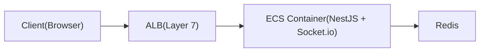
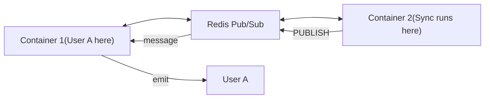

Our users kept refreshing the page to check if their calendar sync was done. We needed the server to push a "sync complete" notification in real time, but our NestJS backend ran on multiple ECS containers behind an ALB. So if a background job finishes on Container 2, how does User A, connected to Container 1, ever hear about it?

Answering that took us through the whole path: how ALB handles the HTTP upgrade, how Redis Pub/Sub bridges containers, and what actually happens when a connection drops.

---

## The Problem

A NestJS backend running on AWS ECS needs to push real-time notifications to browser clients (e.g., "sync complete" after a background job finishes). HTTP polling wastes resources and adds latency. WebSockets solve this, but introducing them in a containerized, load-balanced environment raises questions: How does ALB handle the HTTP-to-WebSocket upgrade? How do multiple containers broadcast to clients connected to different instances? What happens when connections drop?

---

## Difficulties Encountered

- We assumed ALB actively manages WebSocket state. It does not. Once the HTTP
  upgrade handshake is done, ALB is a TCP tunnel and nothing more. That
  misreading cost us a few pointless attempts at ALB configuration.
- Cross-container broadcasting took a while to click. When User A connects to
  Container 1 but a sync job completes on Container 2, Container 2 has no way to
  reach User A by itself. Redis Pub/Sub closes the gap through persistent TCP
  subscriptions, not HTTP callbacks.
- The connection lifecycle edge cases were not obvious from the Socket.io docs
  alone. Closing a browser tab sends a TCP FIN rather than a WebSocket close
  frame, a network drop sends nothing at all and shows up only through the
  ping/pong timeout, and ALB keeps its own idle timeout on top of both. Each
  case needs different handling.
- We thought sticky sessions were mandatory for Socket.io. They matter only for
  the HTTP polling fallback. With WebSocket transport alone, any container can
  carry the connection once the upgrade is finished.

---

## Architecture Overview



### Connection Flow

1. **Client** sends HTTP request with `Upgrade: websocket` header
2. **ALB** receives request, routes to a container
3. **Container** accepts upgrade, establishes WebSocket
4. **ALB** keeps TCP tunnel open (passes through data)
5. **Socket.io** manages the connection from here

---

## Component Responsibilities

| Component            | Role                                                             |
| -------------------- | ---------------------------------------------------------------- |
| **ALB**              | Routes initial HTTP upgrade, then passes through TCP (tunnel)    |
| **Socket.io Server** | Manages WebSocket connection, tracks clients, handles heartbeats |
| **NestJS Gateway**   | Application logic: auth, message handling, room management       |
| **Redis Adapter**    | Broadcasts messages across multiple containers                   |

ALB is just a tunnel. Socket.io manages the actual connection.

So if Socket.io manages the connection, why keep an ALB at all? Because of network topology, not protocol handling.

---

## Why We Need ALB

### Initial Connection Routing

```text
Without ALB:
  Client: "I want to connect to wss://api.example.com"
  Containers have private IPs:
  - 10.0.1.5:3000
  - 10.0.1.6:3000
  Client can't access private IPs directly!

With ALB:
  Client → api.example.com → ALB (public) → picks container → WebSocket established
```

That covers how clients reach containers. The harder problem is how containers reach each other.

---

## Redis for Multi-Container Broadcasting

### The Problem

With multiple ECS containers, User A might connect to Container 1, but the sync job runs on Container 2.

```text
Without Redis:
  User A ──────────────► Container 1 (User A's socket here)
  Sync Job ────────────► Container 2 (Sync completes here)
  Container 2 can't notify User A!
```

### The Solution: Redis Pub/Sub



### How Pub/Sub Actually Works

It is easy to picture Redis firing an HTTP request at your application whenever a message is published. It works the other way around. Your app opens persistent TCP connections to Redis, and Redis writes data straight into those already-open sockets:

```text
Step 1: STARTUP
  Container opens TCP connection to Redis (stays open!)
  → "SUBSCRIBE app:socket.io"

Step 2: PUBLISH
  Container 2 sends message to Redis
  → "PUBLISH app:socket.io {user:123, data:...}"

Step 3: PUSH
  Redis writes to the ALREADY OPEN TCP connection

Step 4: RECEIVE
  Node.js event loop picks up data from socket
  Socket.io adapter handles it → delivers to user's WebSocket
```

### Code Reference

The Socket.io Redis adapter setup uses two separate Redis clients, one for publishing and one for subscribing. The subscriber holds a persistent TCP connection that Redis writes to whenever a message lands on the channel:

```typescript
// pubClient: for PUBLISHING messages
// subClient: for SUBSCRIBING (maintains open TCP connection)
const pubClient = createClient({ url: redisUrl });
const subClient = pubClient.duplicate();

await Promise.all([pubClient.connect(), subClient.connect()]);

this.adapterConstructor = createAdapter(pubClient, subClient, {
  key: `${redisConfig.prefix}:socket.io`
});
```

---

## Connection Lifecycle

### Scenario A: Client Closes App/Tab (Normal)

```text
Client closes browser
    ↓
Browser's TCP stack sends FIN packet (not Socket.io!)
    ↓
TCP FIN packet ──► ALB ──► Container
    ↓
Socket.io detects TCP connection closed
    ↓
handleDisconnect() called (auto room cleanup)
```

**Why TCP FIN, not WebSocket message?**

- Browser is closing, no time for graceful WebSocket close
- TCP FIN is faster and handled by OS, not JavaScript
- Works even if JavaScript is frozen/crashed

### Scenario B: Network Interruption

```text
Network drops (no FIN packet)
    ↓
Socket.io ping/pong timeout (~25s)
    ↓
Server marks client as disconnected
    ↓
handleDisconnect() called
```

### Scenario C: ALB Idle Timeout

```text
No activity for 60 seconds (ALB default)
    ↓
ALB closes the TCP connection
    ↓
Both client and server detect disconnect
```

This rarely happens, because Socket.io sends a heartbeat every 25s.

### Summary Table

| Initiator              | Mechanism             | Detection                |
| ---------------------- | --------------------- | ------------------------ |
| Client (normal close)  | TCP FIN               | Immediate                |
| Client (crash/network) | No FIN                | Ping/pong timeout (~25s) |
| ALB                    | Idle timeout (60s)    | TCP RST                  |
| Server                 | `client.disconnect()` | Immediate                |

---

## ALB Idle Timeout (Why No Change Needed)

| Setting                | Default Value | What it does                         |
| ---------------------- | ------------- | ------------------------------------ |
| ALB idle timeout       | 60 seconds    | Closes connection if no data for 60s |
| Socket.io pingInterval | 25 seconds    | Sends ping every 25s                 |
| Socket.io pingTimeout  | 20 seconds    | Waits 20s for pong response          |

Socket.io's heartbeat keeps the connection alive:

```text
Timeline:
0s   ─── Connection established
25s  ─── Socket.io sends PING → ALB resets idle timer
50s  ─── Socket.io sends PING → ALB resets idle timer
75s  ─── Socket.io sends PING → ALB resets idle timer
...

ALB idle timeout (60s) is NEVER reached because Socket.io
sends heartbeat every 25s. No config change needed!
```

---

## Single Container Setup (Simplified)

For single-container deployments:

| Component           | Needed? | Why                                              |
| ------------------- | ------- | ------------------------------------------------ |
| ALB                 | Yes     | Routes public traffic to private container       |
| Redis Adapter       | Yes     | Future-proofs for multi-container                |
| Sticky Sessions     | No      | Single container = all connections go same place |
| Multiple containers | No      | Not needed until scale requires it               |

---

## Multi-Container Considerations

When scaling to multiple containers:

### Sticky Sessions

Sticky sessions route reconnections back to the same container:

- Faster reconnection (previous state available)
- Less Redis overhead
- Required for Socket.io HTTP polling fallback

---

## When to Use

- Real-time notifications to browser clients, where the server has to push
  updates (sync status, live collaboration, chat) without the client polling
- Containerized deployments behind a load balancer, where multiple ECS tasks or
  Kubernetes pods serve the same application and a client may land on any
  instance
- Background job completion alerts, where async workers finish work and users
  need immediate feedback without refreshing

---

## When NOT to Use

- Simple request-response APIs. If the client only needs data when it explicitly
  asks, REST or GraphQL is simpler and carries no persistent connection overhead
- One-directional traffic. If only the server ever talks, SSE is simpler than
  WebSocket and passes through more proxies without special config
- Low-frequency updates. If something changes less than once a minute,
  long-polling or a periodic fetch costs less than holding connections open
- Serverless / Lambda. WebSockets need persistent connections and Lambda
  functions are ephemeral, so API Gateway WebSocket APIs fit better than
  Socket.io there

---

## Options Considered

| Option                     | Pros                                                                            | Cons                                                                                           |
| -------------------------- | ------------------------------------------------------------------------------- | ---------------------------------------------------------------------------------------------- |
| Socket.io + Redis Adapter  | Auto-reconnect, room management, fallback to polling, cross-container broadcast | Extra dependency (Redis); Socket.io adds protocol overhead                                     |
| Raw WebSocket (ws library) | Minimal overhead; no abstraction layer                                          | No auto-reconnect; manual room management; no cross-container broadcast without custom pub/sub |
| Server-Sent Events (SSE)   | Simple; works through most proxies; no upgrade needed                           | Unidirectional (server to client only); no binary support                                      |
| Long Polling               | Works everywhere; no special infra                                              | High latency; wastes server resources; complex client logic                                    |
| AWS API Gateway WebSockets | Serverless; managed scaling                                                     | Vendor lock-in; different programming model; no Socket.io compatibility                        |

## Why This Approach

Chose Socket.io with Redis Adapter because the application needs bidirectional
communication (client sends actions, server pushes notifications), automatic
reconnection handling, and cross-container message broadcast. Raw WebSocket
would require reimplementing all of Socket.io's room management, heartbeat, and
reconnection logic. SSE is unidirectional. The Redis Adapter was chosen over
custom pub/sub because Socket.io's adapter pattern handles serialization,
namespaces, and room-scoped broadcasting out of the box.

---

## Practical Takeaways

On paper the architecture looks heavy. The mental model turns out to be small once each component's job is clear.

1. ALB is just a tunnel. After the initial HTTP upgrade handshake it does nothing but pass TCP bytes through, and Socket.io owns the rest of the lifecycle: ping/pong, timeouts, rooms, cleanup. There is no reason to over-configure the ALB, because Socket.io's 25-second heartbeat keeps connections alive well inside the 60-second idle timeout.

2. Redis Pub/Sub solves the multi-container broadcast problem. Every container subscribes once over a persistent TCP connection. When Container 2 publishes, Redis writes the message into Container 1's already-open socket, with no HTTP callbacks and no polling anywhere in the path. The Socket.io adapter takes care of serialization and room-scoped delivery.

3. Add the Redis adapter even on a single container. The overhead is negligible, and it means scaling out later is a Terraform change instead of an application rewrite. Sticky sessions can wait until the HTTP polling fallback actually matters.

4. Know the three disconnect scenarios. A normal tab close sends a TCP FIN and is detected instantly. A network drop sends nothing and only surfaces through the ping/pong timeout after roughly 25 seconds. The ALB idle timeout at 60 seconds rarely fires, thanks to the heartbeat. Socket.io handles all three on its own, but knowing which one you are looking at makes production debugging much faster.

If you are adding real-time features to a containerized backend, Socket.io with the Redis adapter behind an ALB covers connection management, reconnection, and cross-container messaging without writing any of it yourself.

---

## References

- [Socket.io Documentation](https://socket.io/docs/v4/)
- [AWS ALB WebSocket Support](https://docs.aws.amazon.com/elasticloadbalancing/latest/application/load-balancer-websockets.html)
- [Redis Pub/Sub](https://redis.io/docs/interact/pubsub/)
