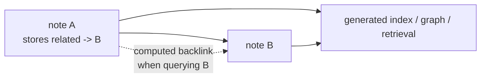

## The backlink maintenance trap

A bidirectional knowledge graph sounds responsible until you have to maintain
it.

Suppose note A references note B. The useful thing to write while authoring note
A is obvious: "this note relates to B because of this reason." The tempting
thing to also write is the reverse edge on note B: "A links here." That second
edge feels complete, but it is not new knowledge. It is bookkeeping.

Bookkeeping drifts.

The next time note A changes, note B's reverse edge may not change with it. A
file moves and the reverse path goes stale. A link is removed from one side and
forgotten on the other. The graph still looks richly connected, but some of that
richness is a lie.

3B avoids that class of rot by refusing to store the reverse edge. It stores
only the forward link the author is already thinking about. Backlinks are
computed later by walking the stored forward links.

That sounds like a small schema choice. In practice, it is the maintenance
economics of the whole knowledge base.

## Atomic notes are graph nodes

The 2026-06-14 architecture model describes the knowledge layer as 940 atomic,
frontmatter-typed entries across 15 category folders. Treat those numbers as
model-snapshot facts, not a promise that the live filesystem will stay frozen.
The structure matters more than the count.

Each durable note lives under `knowledge/{category}/` as a kebab-case Markdown
file. The category gives the note a home. The tags classify cross-cutting
concerns. The frontmatter records metadata the rest of the system can read:
status, dates, confidence, references, publishing state, usage history, and
forward links.

The body is not free-form scratch. Knowledge entries follow a 5W1H shape:

- The Problem
- Difficulties Encountered
- The Solution
- When to Use
- When NOT to Use

Decision-shaped entries add options considered and the reason the chosen
approach won. That keeps a note atomic without making it contextless. It tells a
future reader not only what the answer is, but why the answer was worth writing
down.

## `related:` is the stored edge

The stored link lives in frontmatter:

```yaml
related:
  - path: ../devops/example-pattern.md
    context: "Why this note points there"
```

That `context` field is not decoration. A bare path says two notes are
connected. The context says why. Without it, future readers and retrieval tools
inherit an edge with no semantics.

3B keeps link metadata in frontmatter for the same reason it keeps rule routing
in frontmatter: the graph edge is part of the source. It should be reviewable,
parseable, and available to tooling without scraping prose sections like
"Related" or guessing from inline mentions.

This also keeps authoring discipline clear. The writer owns the forward claim:
while writing this note, I know it points to that note for this reason. The
writer does not own every future reverse listing that might mention this note.
That reverse listing is derived.

## Backlinks are a query, not an authoring burden

If note B wants to know who points at it, the system can answer by scanning all
stored `related:` links and selecting entries whose path targets B. That is a
query. It is not a field the author should maintain.

This is the same basic move as a database index. You store the canonical fact
once and derive the lookup shape you need later. A reverse index can be rebuilt.
A manually edited reverse edge has to be trusted.

3B's schema makes the rule explicit: forward links are stored; backlinks are
computed. The Markdown authoring rule reinforces the same idea by pushing links
into frontmatter and banning wiki-style shortcuts. The YAML schema documents the
linking strategy directly: external references are URLs, forward links are
internal `related:` entries, and reverse edges are computed from those forward
links.

The generated `knowledge/_index.md` is one downstream surface of that choice.
Graph tools and retrieval layers can read the same forward-link facts and build
whatever reverse view they need. The source notes stay simple.



The dashed edge is the important one. It is useful, but it is not authored.

## Categories keep the graph human-sized

Forward links solve edge maintenance. They do not solve placement.

3B uses 15 category folders in the June 11 model snapshot. Categories are not
arbitrary personal moods; they are documented in `knowledge/_categories.md` with
examples and exclusions. `devops`, `backend`, `ai-ml`, and `general` dominate
the distribution, while `moba` is explicitly non-transferable and excluded from
public publishing by default.

There is also a threshold for creating a new category: five or more orphan
notes. That constraint matters. Without it, every note can argue for its own
folder, and the taxonomy becomes another thing to maintain. With it, categories
emerge only after enough pressure accumulates.

The result is a two-level model: folders give a stable primary home, tags
describe cross-cutting dimensions, and forward links connect concepts across
homes. The graph can stay rich without turning the directory tree into a graph
itself.

## Why the difficulty section matters

The unusual part of 3B's knowledge template is not "The Solution." Every
knowledge base has solutions.

The unusual part is that "Difficulties Encountered" is required.

That section captures the dead ends, misleading signals, wrong assumptions, and
friction that made the answer non-obvious. It is easy to cut those details when
cleaning up a note. It is also how you erase the most reusable part of the
learning.

A polished answer tells future-you what to do. The difficulty narrative tells
future-you why the wrong path looked plausible. For agent-assisted work, that is
especially valuable. Agents often fail in repeated shapes: trusting stale
summaries, broadening scope, reading generated output as source of truth,
missing a frontmatter rule. Capturing the struggle makes those patterns
searchable and reusable.

It also makes later blog posts better. A post that only states the final system
is a tour. A post that preserves the problem, the confusion, and the resolution
has an arc.

## How the graph feeds the rest of 3B

The knowledge layer is not an archive at the edge of the system. It is the
distilled layer other workflows feed and query.

`/wrap` and `/archive-task` promote session working state into durable
knowledge. Frontmatter gives retrieval tools structured fields. `references:`
support publication credibility. `when_used:` records reuse. The `blog:` block
lets selected entries sync to `brandonwie.dev`. The privacy matrix keeps private
areas, including work-specific categories, out of public/index surfaces.

That means the Zettelkasten is not separate from the agent harness. It is one of
the harness's memory surfaces. The same note can help a future session retrieve
a design pattern, feed a blog post, and explain why a past workaround was
rejected.

The forward-links-only rule is what keeps that graph cheap enough to maintain.
Every extra manual field has to earn its place. Reverse edges do not.

## What this pattern buys and what it costs

The main benefit is trust. If a note says it points to another note, that is an
authored claim with context. If a reverse edge appears in a graph view, it is
computed from authored claims. You know which layer you are looking at.

The second benefit is authoring speed. When writing a note, you add the links
you actually mean. You do not leave the file to patch every target's reverse
metadata.

The cost is that reverse views require tooling. A plain file read will not show
every backlink unless some index or query layer computes it. 3B accepts that
cost because the alternative is worse: stale bidirectional metadata that looks
complete but cannot be trusted.

This is the general 3B pattern again: store source facts once, compute derived
views, and make the boundary explicit.

## Store intent, compute consequence

The forward link is intent. The author knows, at the moment of writing, why this
note points to that one.

The backlink is consequence. It follows mechanically from all the forward links
in the corpus.

3B stores intent and computes consequence. That is why the knowledge base can be
a graph without asking the author to maintain every edge twice. It is also why
the required difficulty narrative belongs in the note: the goal is not only to
remember the answer, but to preserve the path that made the answer worth
remembering.

A durable knowledge base does not get durable by storing more fields. It gets
durable by storing the fields a human can keep true.
