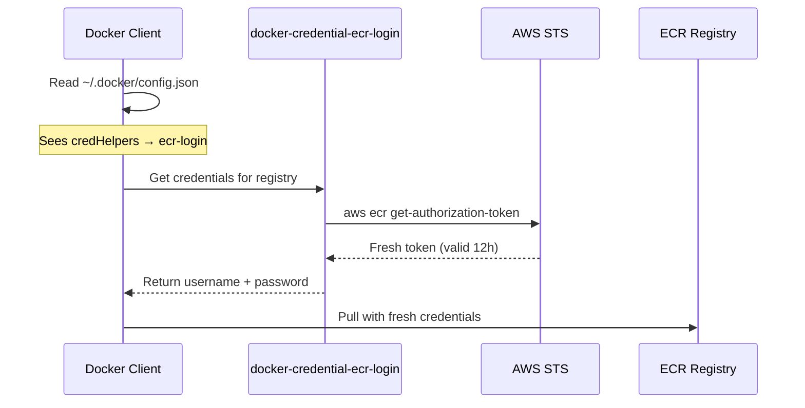

After dealing with ECR token expiration for weeks — first with manual `docker login`, then with a cron job that still had a race condition — I found the right solution: AWS's ECR Credential Helper. Instead of storing tokens that expire, it fetches fresh tokens on-demand every time Docker needs to authenticate.

The old approach stored a token at container startup, and that token expired after 12 hours. The credential helper flips this: no token is stored, and a fresh one is fetched at the exact moment Docker needs it.

## The Old Way vs The New Way

```text
OLD WAY (One-time login):
┌─────────────────────────────────────────────────┐
│ Container startup: docker login → token stored  │
│ 12 hours later: token expires                   │
│ docker pull: "authorization token has expired"  │
└─────────────────────────────────────────────────┘
```

```text
NEW WAY (Credential helper):
┌─────────────────────────────────────────────────┐
│ docker pull requested                           │
│ Docker reads ~/.docker/config.json              │
│ Sees credHelpers → calls docker-credential-ecr-login │
│ Helper fetches fresh token from AWS STS         │
│ Docker uses token immediately                   │
│ No storage = no expiry problem                  │
└─────────────────────────────────────────────────┘
```

## The Gotchas I Hit

**Error appeared only after 12+ hours.** The Airflow DockerOperator worked perfectly on initial deployment. The "authorization token has expired" error only surfaced the next day, making it hard to connect the failure to authentication rather than a missing image.

**Cron-based token refresh has a race condition.** My first fix was a cron job running `docker login` every 11 hours. But if a pull happened during the brief window between token expiry and the next cron execution, it still failed. The credential helper eliminates this window entirely.

**Binary must match your architecture.** The helper binary is architecture-specific (`linux-amd64` vs `linux-arm64`). Using the wrong one fails silently — Docker reports "credentials not found" without indicating an architecture mismatch.

**`config.json` key must be the exact registry URL.** The `credHelpers` key must match the exact ECR registry URL including the account ID and region. A typo or wrong region means Docker falls back to no auth with no warning.

## How It Works

When Docker needs to pull an image, it checks `~/.docker/config.json` for credential helpers. If one is configured for the registry, Docker calls the helper binary, which fetches a fresh token from AWS STS using the instance's IAM role:



The token is used immediately and never stored to disk. Each pull gets a fresh token.

## Setup

### 1. Install the Helper

```dockerfile
# In Dockerfile
RUN curl -sL "https://amazon-ecr-credential-helper-releases.s3.us-east-2.amazonaws.com/0.9.0/linux-${ARCH}/docker-credential-ecr-login" \
    -o /usr/local/bin/docker-credential-ecr-login \
    && chmod +x /usr/local/bin/docker-credential-ecr-login
```

### 2. Configure Docker

```json
// ~/.docker/config.json
{
  "credHelpers": {
    "123456789.dkr.ecr.ap-northeast-2.amazonaws.com": "ecr-login"
  }
}
```

The key must be the **exact** registry URL. Docker matches this string literally — `123456789.dkr.ecr.ap-northeast-2.amazonaws.com` must match your actual account ID and region.

### 3. Required IAM Permissions

The EC2 instance role needs these permissions:

```text
- sts:GetCallerIdentity      (account ID lookup)
- ecr:GetAuthorizationToken  (Docker login token)
- ecr:BatchCheckLayerAvailability
- ecr:GetDownloadUrlForLayer
- ecr:BatchGetImage
```

## Key Properties

- **On-demand**: Token fetched only when Docker needs it
- **No storage**: Token used immediately, never written to disk
- **Auto-refresh**: Each operation gets a fresh token
- **IAM-based**: Uses EC2 instance role, no credentials to manage

## Credential Helper vs docker login

| Aspect           | docker login            | Credential Helper |
| ---------------- | ----------------------- | ----------------- |
| Token storage    | ~/.docker/config.json   | None              |
| Expiry handling  | Manual refresh (cron)   | Automatic         |
| Setup complexity | Simple                  | Slightly more     |
| Maintenance      | High (cron, monitoring) | None              |

The credential helper requires slightly more initial setup (install binary, configure `config.json`), but the zero-maintenance aspect is worth it. No cron jobs to monitor, no race conditions, no expired token incidents at 2 AM.

## When to Use This

| Scenario                                 | Use Credential Helper?        |
| ---------------------------------------- | ----------------------------- |
| Long-running containers pulling from ECR | Yes                           |
| CI/CD pipelines                          | Maybe (short-lived, login OK) |
| Local development                        | Yes (convenient)              |
| Lambda/ECS with ECR                      | No (AWS handles it)           |

## When NOT to Use This

- **Lambda or ECS tasks pulling from ECR** — AWS manages ECR authentication natively for these services. Adding the credential helper is redundant.
- **Short-lived CI/CD containers** — If the entire pipeline completes in under 12 hours, a single `docker login` at the start is simpler and sufficient.
- **Non-ECR registries** — The credential helper is ECR-specific. For Docker Hub, GHCR, or other registries, use their native auth mechanisms.
- **Environments without IAM roles** — The helper relies on IAM credentials (instance role, environment variables, or AWS config). If IAM is not available, it cannot function.

## Takeaway

The ECR Credential Helper replaces cron-based token refresh with on-demand authentication. Install the binary, configure `~/.docker/config.json` with your exact registry URL, and forget about ECR token expiry. The setup takes five minutes and eliminates an entire class of production incidents — no more "authorization token has expired" failures at 2 AM.

## References

- [Amazon ECR Credential Helper](https://github.com/awslabs/amazon-ecr-credential-helper)
- [AWS ECR Registry Authentication](https://docs.aws.amazon.com/AmazonECR/latest/userguide/registry_auth.html)
