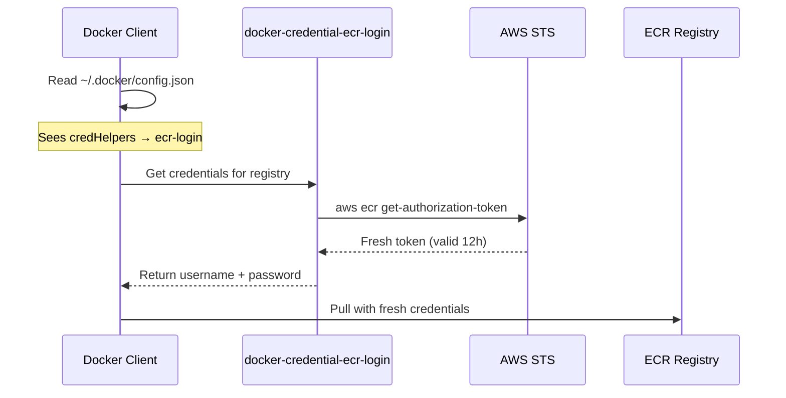

tokens that expire, it fetches fresh tokens on-demand.

## The Problem

```text
OLD WAY (One-time login):
┌─────────────────────────────────────────────────┐
│ Container startup: docker login → token stored  │
│ 12 hours later: token expires                   │
│ docker pull: "authorization token has expired"  │
└─────────────────────────────────────────────────┘
```

ECR tokens expire after 12 hours. Storing them means they can expire before the
next use.

---

## Difficulties Encountered

- **Error appeared only after 12+ hours** - The Airflow DockerOperator worked
  fine on initial deployment. The `ImageNotFound` / "authorization token has
  expired" error only surfaced the next day, making it hard to connect the
  failure to authentication rather than a missing image.
- **Cron-based token refresh is fragile** - The first attempted fix was a cron
  job running `docker login` every 11 hours. This introduced a race condition:
  if a pull happened during the brief window between token expiry and cron
  execution, it still failed.
- **Credential helper binary must match architecture** - The helper binary is
  architecture-specific (`linux-amd64` vs `linux-arm64`). Using the wrong binary
  fails silently -- Docker just reports "credentials not found" without
  indicating an architecture mismatch.
- **`config.json` key must be exact registry URL** - The `credHelpers` key in
  `~/.docker/config.json` must match the exact ECR registry URL including the
  account ID and region. A typo or wrong region means Docker falls back to no
  auth with no warning.

---

## The Solution

```text
NEW WAY (Credential helper):
┌─────────────────────────────────────────────────┐
│ docker pull requested                           │
│ Docker reads ~/.docker/config.json              │
│ Sees credHelpers → calls docker-credential-ecr-login │
│ Helper fetches fresh token from AWS STS         │
│ Docker uses token immediately                   │
│ No storage = no expiry problem                  │
└─────────────────────────────────────────────────┘
```

## How It Works



## Configuration

### 1. Install the Helper

```dockerfile
# In Dockerfile
RUN curl -sL "https://amazon-ecr-credential-helper-releases.s3.us-east-2.amazonaws.com/0.9.0/linux-${ARCH}/docker-credential-ecr-login" \
    -o /usr/local/bin/docker-credential-ecr-login \
    && chmod +x /usr/local/bin/docker-credential-ecr-login
```

### 2. Configure Docker

```json
// ~/.docker/config.json
{
  "credHelpers": {
    "123456789.dkr.ecr.ap-northeast-2.amazonaws.com": "ecr-login"
  }
}
```

### 3. Required IAM Permissions

```text
- sts:GetCallerIdentity      (account ID lookup)
- ecr:GetAuthorizationToken  (Docker login token)
- ecr:BatchCheckLayerAvailability
- ecr:GetDownloadUrlForLayer
- ecr:BatchGetImage
```

## Key Points

- **On-demand**: Token fetched only when Docker needs it
- **No storage**: Token used immediately, never written to disk
- **Auto-refresh**: Each operation gets a fresh token
- **IAM-based**: Uses EC2 instance role, no credentials to manage

## When to Use

| Scenario                                 | Use Credential Helper?        |
| ---------------------------------------- | ----------------------------- |
| Long-running containers pulling from ECR | Yes                           |
| CI/CD pipelines                          | Maybe (short-lived, login OK) |
| Local development                        | Yes (convenient)              |
| Lambda/ECS with ECR                      | No (AWS handles it)           |

---

## When NOT to Use

- **Lambda or ECS tasks pulling from ECR** - AWS manages ECR authentication
  natively for these services. Adding the credential helper is redundant.
- **Short-lived CI/CD containers** - If the entire pipeline completes in under
  12 hours, a single `docker login` at the start is simpler and sufficient.
- **Non-ECR registries** - The credential helper is ECR-specific. For Docker
  Hub, GHCR, or other registries, use their native auth mechanisms.
- **Environments without IAM roles** - The helper relies on IAM credentials
  (instance role, environment variables, or AWS config). If IAM is not
  available, it cannot function.

---

## Options Considered

| Aspect           | docker login            | Credential Helper |
| ---------------- | ----------------------- | ----------------- |
| Token storage    | ~/.docker/config.json   | None              |
| Expiry handling  | Manual refresh (cron)   | Automatic         |
| Setup complexity | Simple                  | Slightly more     |
| Maintenance      | High (cron, monitoring) | None              |

---

## Why This Approach

Chose **ECR Credential Helper** over `docker login` with cron because:

- Airflow DockerOperator pulls images on unpredictable schedules (DAGs run at
  various times). A cron-based refresh cannot guarantee a valid token at every
  pull moment.
- The credential helper eliminates an entire class of production incidents
  (expired token failures) with zero ongoing maintenance.
- The one-time setup cost (install binary + configure `config.json`) is trivial
  compared to the operational cost of monitoring and maintaining a cron job.
