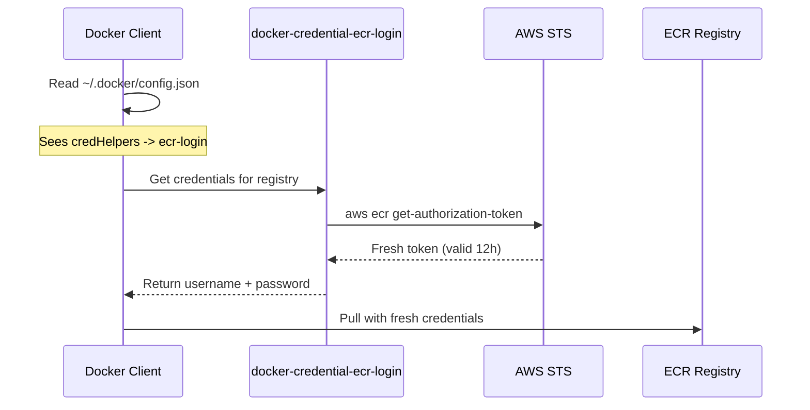

Our Airflow DockerOperator worked perfectly on day one. The next morning, every
DAG that pulled a Docker image from ECR failed with "authorization token has
expired." ECR tokens last 12 hours, and we had been storing one at container
startup. The token expired overnight, and Airflow had no way to refresh it.

## Why This Matters

ECR authentication is invisible when it works and catastrophic when it does
not. If your containers pull images on unpredictable schedules -- which is
exactly what Airflow DAGs do -- a stored token will eventually expire between
pulls. The failure mode is subtle: the error says "ImageNotFound," which looks
like a missing image rather than an expired credential.

---

## The Difficulties I Ran Into

- **Error appeared only after 12+ hours** -- The Airflow DockerOperator worked
  fine on initial deployment. The "authorization token has expired" error only
  surfaced the next day, making it hard to connect the failure to
  authentication rather than a missing image.
- **Cron-based token refresh is fragile** -- My first fix was a cron job
  running `docker login` every 11 hours. This introduced a race condition: if
  a pull happened during the brief window between token expiry and cron
  execution, it still failed.
- **Credential helper binary must match architecture** -- The helper binary is
  architecture-specific (`linux-amd64` vs `linux-arm64`). Using the wrong
  binary fails silently -- Docker just reports "credentials not found" without
  indicating an architecture mismatch.
- **`config.json` key must be exact registry URL** -- The `credHelpers` key in
  `~/.docker/config.json` must match the exact ECR registry URL including the
  account ID and region. A typo or wrong region means Docker falls back to no
  auth with no warning.

---

## Options Explored

| Aspect           | docker login            | Credential Helper |
| ---------------- | ----------------------- | ----------------- |
| Token storage    | ~/.docker/config.json   | None              |
| Expiry handling  | Manual refresh (cron)   | Automatic         |
| Setup complexity | Simple                  | Slightly more     |
| Maintenance      | High (cron, monitoring) | None              |

The `docker login` approach is simpler to set up but requires ongoing
maintenance. You need a cron job, monitoring for failures, and a plan for the
race condition between expiry and refresh. The credential helper costs a few
minutes of setup and then runs maintenance-free.

---

## The Solution: ECR Credential Helper

Instead of storing a token that expires, the credential helper fetches a fresh
token on every `docker pull`. Docker calls the helper binary, which calls AWS
STS, gets a new token, and hands it directly to Docker. Nothing is stored to
disk. Nothing expires.



---

## Configuration

### 1. Install the Helper

```dockerfile
# In Dockerfile
RUN curl -sL "https://amazon-ecr-credential-helper-releases.s3.us-east-2.amazonaws.com/0.9.0/linux-${ARCH}/docker-credential-ecr-login" \
    -o /usr/local/bin/docker-credential-ecr-login \
    && chmod +x /usr/local/bin/docker-credential-ecr-login
```

Make sure the `ARCH` variable matches your instance. Using `linux-amd64` on an
ARM instance will not produce a helpful error message -- Docker will just say
"credentials not found."

### 2. Configure Docker

```json
// ~/.docker/config.json
{
  "credHelpers": {
    "123456789.dkr.ecr.ap-northeast-2.amazonaws.com": "ecr-login"
  }
}
```

The key must be the exact registry URL, including your AWS account ID and
region. A typo here means Docker silently falls back to no authentication.

### 3. Required IAM Permissions

```text
- sts:GetCallerIdentity      (account ID lookup)
- ecr:GetAuthorizationToken  (Docker login token)
- ecr:BatchCheckLayerAvailability
- ecr:GetDownloadUrlForLayer
- ecr:BatchGetImage
```

On EC2, these permissions come from the instance role. No credentials to
manage, no secrets to rotate.

---

## Why This Works

The credential helper eliminates the entire class of "expired token" failures.
Every pull gets a fresh token, so there is no window where the token can
expire. The approach works because:

- **On-demand** -- Token fetched only when Docker needs it
- **No storage** -- Token used immediately, never written to disk
- **Auto-refresh** -- Each operation gets a fresh token
- **IAM-based** -- Uses EC2 instance role, no credentials to manage

For our Airflow setup, this was the correct choice. DAGs run on unpredictable
schedules -- some hourly, some daily, some weekly. A cron-based refresh cannot
guarantee a valid token at every pull moment. The credential helper can.

---

## Practical Takeaway

Use this decision matrix to determine if you need the credential helper:

| Scenario                                 | Use Credential Helper?        |
| ---------------------------------------- | ----------------------------- |
| Long-running containers pulling from ECR | Yes                           |
| CI/CD pipelines                          | Maybe (short-lived, login OK) |
| Local development                        | Yes (convenient)              |
| Lambda/ECS with ECR                      | No (AWS handles it)           |

### When NOT to Use

- **Lambda or ECS tasks pulling from ECR** -- AWS manages ECR authentication
  natively for these services. Adding the credential helper is redundant.
- **Short-lived CI/CD containers** -- If the entire pipeline completes in
  under 12 hours, a single `docker login` at the start is simpler and
  sufficient.
- **Non-ECR registries** -- The credential helper is ECR-specific. For Docker
  Hub, GHCR, or other registries, use their native auth mechanisms.
- **Environments without IAM roles** -- The helper relies on IAM credentials
  (instance role, environment variables, or AWS config). If IAM is not
  available, it cannot function.

The one-time setup cost (install binary + configure `config.json`) is trivial
compared to the operational cost of monitoring and maintaining a cron job that
refreshes tokens. Set it up once and forget about ECR auth.
