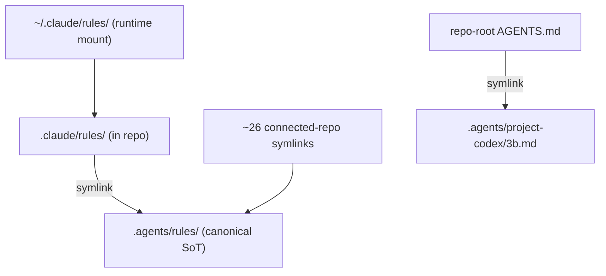
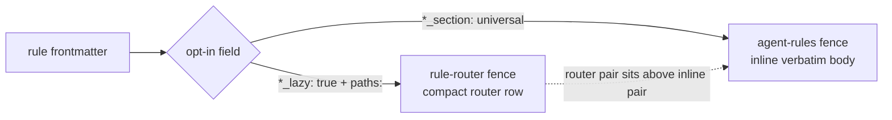
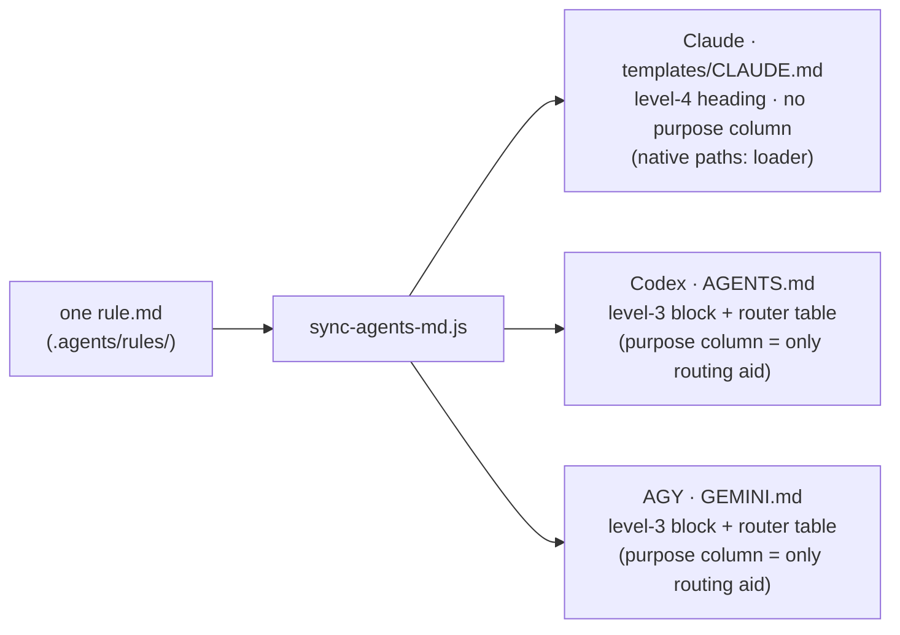
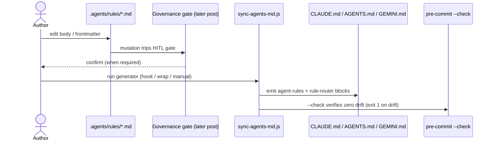

## The one-author, three-runtime problem

If you run more than one AI coding agent, you have already met this problem.
Claude Code reads its configuration from `~/.claude/`. Codex reads from
`~/.codex/`. A third agent — in my case AGY (Antigravity CLI), which reuses the
`~/.gemini/` namespace it inherited from the retired Gemini CLI — reads from
somewhere else again. Each CLI hardcodes its own runtime mount. None of them
knows the others exist.

Now you write a rule. "Never stage files with `git add -A`." "Edit the source of
truth, not the symlink." "Before editing markdown, check the frontmatter
schema." You want all three agents to obey it. The naive move is to paste the
rule into three config trees. It works for exactly as long as you never touch it
again. The first time you refine the rule in one place, the other two silently
rot, and you are back to three agents behaving three different ways — except now
you _believe_ they agree.

This is a configuration-drift problem dressed up as an AI problem. The
interesting part is not the rule; it is the question underneath it: **how do you
make N agents obey the same rule without maintaining N copies of that rule?**

## The keystone: `.agents/` as the single source of truth

The answer 3B settled on is a single folder. Everything shared between agents is
authored exactly once, under `.agents/`: the rule bodies, the skills, the prompt
templates, the per-project context files, the command-permission policy, the
cross-session buffer, and the friction logs. There is no second copy to keep in
sync, because there is no second copy. `.agents/` is the canonical store, and
every runtime is a _view_ onto it.

That makes one operating rule load-bearing for both humans and agents: **edit
the source of truth, never the symlink.** Hold onto that — it sounds like a
style preference, and it is actually a correctness constraint. We will see why
in a moment.

A single canonical folder buys you authoring discipline, but it does not, by
itself, get the bytes in front of three CLIs that each insist on reading from
their own hardcoded path. For that, 3B uses two different transports, and the
distinction between them is the whole design.

## Transport 1: back-symlinks resolve each runtime to the SoT

The first transport is the boring, reliable one: symlinks. Inside the repo,
`.claude/<subdir>` is a symlink to `../.agents/<same>`. When Claude Code reaches
for `~/.claude/rules/`, the lookup chains through the repo's `.claude/` and
lands on the real bytes in `.agents/`. Nine of these back-symlinks are in place
(six directories, three files), and roughly twenty-six more symlinks from
connected project repos chain through the same way. The repo-root `AGENTS.md` is
itself a symlink to `.agents/project-codex/3b.md`. Each runtime believes it is
reading its own private config; all of them are reading one folder.

This is where "edit the SoT, never the symlink" stops being advice. Most editors
save a file by writing a temporary file and then `rename`-ing it over the target
— an atomic save. When the target is a symlink, that rename replaces _the link
itself_ with a fresh regular file. The edit appears to succeed; the content even
looks right. But the link is gone, the connection to the SoT is severed, and
every later update to the canonical file silently fails to propagate. The same
trap bites some CLI tools that rewrite config in place. It is the reason the
original `.claude/ → .agents/` migration had to ship as rename-then-symlink
commit _pairs_ rather than a single commit: the pre-commit tooling's
stash-and-restore step could not traverse a symlink that was being replaced in
the same commit (ADR-014, 2026-04-27).

Back-symlinks solve one precise thing: making three runtimes resolve to the same
bytes. They do nothing about the fact that the three agents do not _want_ the
same bytes.

## Transport 2: the generator projects one rule into three profiles

Claude, Codex, and AGY consume rules in structurally different ways. Handing all
three the identical file would waste context budget on the agent that does not
need the extra scaffolding, and starve the agent that does. So the second
transport is not a symlink at all — it is a program.

`scripts/sync-agents-md.js` is a roughly 950-line Node generator. It reads each
rule file's YAML frontmatter and decides, per agent, whether and how that rule
should appear in that agent's profile. The gate is a single frontmatter field,
`applicable_agents` (default `[claude]` when absent). If an agent is not in that
list, the generator skips it entirely for that rule.

For the agents that _are_ listed, the generator emits into one of two `AUTO-GEN`
marker-pair regions, depending on which opt-in the rule declares:

- A rule that opts in with a `*_section` field is **inlined verbatim** into the
  `agent-rules` fence — its full body becomes always-on context for that agent.
- A rule that opts in with a `*_lazy` field gets a **compact router row** in the
  `rule-router` fence — a one-line pointer (name, globs, purpose, path) the
  agent consults and then reads the full file on demand.

The router pair sits above the inline pair in every target file. And because the
registry that drives all of this is just a list with one row per agent, adding a
fourth agent someday is not a rewrite — it is adding a row.

(The deeper routing grammar — how the `paths:` globs match, how an intent
vocabulary picks rules, how lazy loading actually fires — is its own story,
covered in a later post.)

## The payoff: the same rule lands differently per agent

Here is the part worth slowing down for. Take one rule body. Run the generator.
Look at how it lands in each profile.

In Claude's target, the rule is inlined as a level-4 heading nested under a
numbered section — and the generator deliberately **drops the routing/purpose
column** it emits for the others. It can do that because Claude Code has a
native `paths:` lazy-loader: Claude already decides when to pull a rule into
context based on the file globs in the rule's own frontmatter, so a prose "here
is when this applies" column would be redundant scaffolding. Dropping it saves
on the order of 520 tokens per emit — context budget handed back to the session.

In Codex's and AGY's targets, the same rule lands as a flat level-3 block
accompanied by a router table whose purpose column is their _only_ routing aid —
neither has Claude's native lazy-loader, so the generator has to supply the
routing hint in prose.

That is the thesis in one image. The shape of the output is dictated as much by
_Claude's native loader_ as by any design choice of mine — the generator is, in
effect, compiling one source rule down to whatever each target runtime can best
consume. "Author once, reach three" is not "write once, paste thrice." It is
write once, _project_ three ways.

## Why the projection is trustworthy, not a fragile script

A code generator sitting between your authored intent and what your agents
actually read is a liability if you cannot trust it. Several things make this
one trustworthy rather than a footgun.

**It runs at the right moments.** The generator fires from a pre-commit hook
when a rule file is staged, from a session-wrap step, from a manual invocation,
and in CI as a `--check` that fails the build if the committed targets have
drifted from what the generator would produce. You cannot land a rule edit and
forget to regenerate; the check will catch it.

**It refuses to silently overgrow.** Three byte budgets guard the output: a
per-rule advisory warning at 5,000 bytes, a hard failure if the always-on
universal block exceeds 30,000 bytes, and a hard failure if Claude's template
crosses 38,000 bytes — a deliberate 2KB margin under the 40KB point where Claude
Code itself starts warning about context cost. The budgets are forward-looking
guards; today only the advisory per-rule warning fires in practice.

**It is deterministic and self-consistent.** Regeneration is idempotent, and
multiple per-agent sections are threaded through a single pass, so running it
twice changes nothing. The generator also hard-fails if executed under Bun — the
toolchain runs Node in CI and pre-commit, and refusing the wrong runtime is
cheaper than debugging a subtle divergence later.

One consequence is worth calling out because it used to be a real failure mode:
as of a fix in late May 2026, Claude's global config is _fully generator-owned_.
There are no hand-edited rows left in it. Editing a rule body and running the
generator updates Claude's template in the same pass — no separate manual touch,
no chance for the human-readable copy to lag the machine-readable one. (A
sibling generator does the same job for command permissions, rendering one
policy file into Claude's settings and Codex's rules — but that is its own
subsystem.) A rule edit also trips a human-in-the-loop governance gate before it
can land; that gate is a whole post of its own, later in this series.

## It survived an agent swap

The strongest evidence that this is a transport design and not a tool-specific
hack is that one of the three agents got replaced and the design did not flinch.
When Google deprecated the Gemini CLI, AGY (Antigravity CLI) succeeded it,
reusing the `~/.gemini/` namespace, via a six-phase cutover (ADR-033,
2026-05-22). The three-agent contract held throughout. Because "support an
agent" had been reduced to "a row in the registry plus its target files,"
swapping the third agent touched the registry and the generated targets — not
the rules themselves. Forty-some rule bodies did not need editing to change
which agent read them. That is what it looks like when the abstraction is in the
right place.

## The honest edges

A post that only lists what works is marketing. Here is what is shipped and what
is not.

**Shipped today:** `.agents/` as the single canonical store; three-agent fan-out
with both inline and lazy propagation; the nine back-symlinks; a fully
generator-owned Claude global; the byte budgets and the Bun guard; and the
Gemini-to-AGY swap described above.

**Deferred, and labeled as such:**

- AGY per-project context is intentionally limited to the home repo itself.
  Connected repos receive the AGY contract through the shared root files, not
  through per-project AGY files — that rollout is deferred until AGY is actually
  run in those repos (inherited from ADR-022's future-work note, tracked under
  ADR-033).
- The old manual "dual-touch" workaround — hand-editing Claude's template and
  grep-verifying it after a rule change — is **history, not current practice.**
  It survives only as an entry in the known-failure-modes log so the trap is
  recoverable, not as a step anyone performs now.
- The byte-budget hard limits are guards against future growth, not walls the
  system is currently pressed against.

**One number, told honestly:** the architecture registry snapshot this post is
drawn from records 85 rules opted into cross-agent propagation; a live check on
2026-05-31 reported 88. The gap is not an error — it is the generated surfaces
moving faster than the narrative docs that describe them, which is exactly the
drift this whole system exists to manage. (The registry itself shipped on
2026-05-30.)

**What belongs to later posts:** the frontmatter-as-loader mechanics — `paths:`
matching, the intent vocabulary — are the next post. Skills propagate by yet
another set of physics (a symlink for one agent, a hardlink for another, a
pinned adapter for the third); that is its own post. The governance gate that
every rule edit trips is another. This post stops at the spine: one folder, two
transports, three agents.

## Closing: a system whose subject is itself

There is a small recursion hiding in all of this. The architecture registry that
this post is written from — the model, the subsystem write-ups, the evolution
history — lives in the same repository as the rules it documents, and it is
backed by a numbered trail of architecture decisions (ADR-014 for the SoT
folder, ADR-015 for the generator, ADR-033 for the agent swap, ADR-039 for a
later context-budget reclaim), not by anyone's memory of a chat. The
source-of-truth spine is what makes that possible. Once "shared agent behavior"
has exactly one home, the knowledge system can turn around and describe itself
without contradicting itself.

One folder. Two transports. Three agents. One author.

> **Part 1 of a series.** This is the opener of a series on running a
> multi-agent harness as a personal knowledge system. Later parts cover how
> rules route themselves through frontmatter, how skills propagate by three
> different transports, the governance gates around every change, and the token
> stack underneath it all — coming soon.

## When this pattern fits — and when it doesn't

Reach for a single source-of-truth folder plus a projecting generator when you
run **two or more agent runtimes that must obey the same authored rules**, the
runtimes hardcode different config mounts, and you control the repository they
all read from. The payoff scales with the number of rules and runtimes: the more
there are, the worse copy-paste drift gets, and the more a generator earns its
keep.

Skip it when there is **one** runtime (no fan-out to reconcile — a plain config
file is simpler), when the runtimes already share a native config format (let
them use it), or when the rule set is small and static enough that drift is not
a real risk. A generator and a symlink lattice are infrastructure; like all
infrastructure they cost maintenance, and below some threshold the copy-paste
you were avoiding is genuinely cheaper.

## Source & method

This post is drawn from a versioned architecture registry that lives in the same
repository as the rules it describes, alongside the decision records that
justify each move — the `.agents/` source-of-truth folder, the generator, the
agent succession, and a later context-budget reclaim each have their own ADR.
Every figure here — line counts, byte budgets, symlink counts — was checked
against that registry and the live tree rather than recalled from memory.

The hardest part to get right in practice was not the generator but the
**symlinks**: an editor's atomic save silently replaces a symlink with a regular
file, so "edit the source of truth, never the symlink" is a correctness rule,
not etiquette — and the original migration had to be split into
rename-then-symlink commit pairs to survive the pre-commit tooling. That trap is
the single most transferable lesson here.
