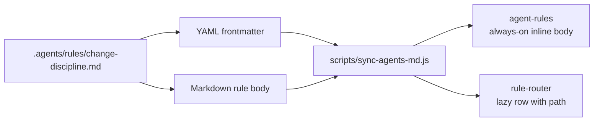
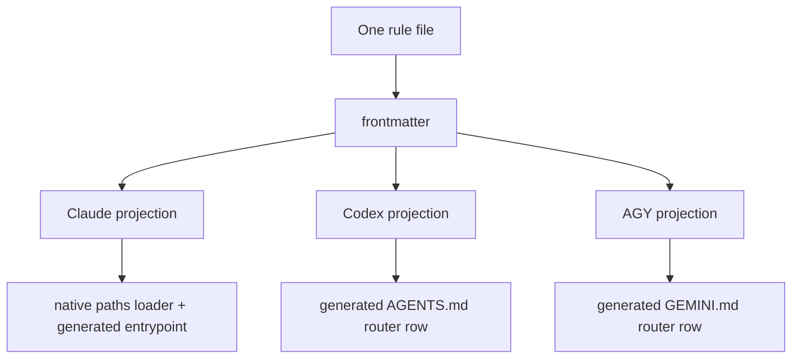

that decides which agent sees which rule, when, and in what shape._

## The false simplicity of one rules folder

A flat rules directory looks like the obvious shape until you try to load it.

In 3B, the canonical rule bodies live under `.agents/rules/`. They are Markdown
files because humans and agents both need to read them, review them, and link to
them. Keeping them flat is intentional. There is no `claude/`, `codex/`, or
`agy/` subtree full of near-duplicates. There is one directory and one human
registry.

That solves the authoring problem. It does not solve the loading problem.

If every agent loaded every rule all the time, the system would be simple in the
same way a global variable is simple. It would work at first, then punish every
future task. A one-line markdown edit would drag in PR review lifecycle rules. A
backend bug hunt would inherit blog-publishing gates. A Codex session would read
Claude-only runtime advice it cannot execute. The context window would fill with
correct instructions at the wrong time.

The interesting design problem is not "where do rules live?" Post #1 answered
that: they live in `.agents/`. The next problem is sharper: **when should a rule
be loaded, and for which runtime?**

3B's answer is that the rule carries its own route.

## A rule file is a loaded unit

Each rule file has two halves. The Markdown body is the instruction: what the
agent should do, why the rule exists, and how to verify that it was followed.
The YAML frontmatter is the loading contract: which agents the rule applies to,
whether it should be always-on or lazy, which file globs trigger it, and where
the generated projection should land.

That split matters because it keeps the route beside the rule itself. You do not
maintain a separate routing spreadsheet. You do not rely on a hidden hook to
remember why a rule appears in Codex but not AGY. You open the rule and see both
the behavior and the loading metadata in the same review diff.

At a simplified level, a rule file says:

```yaml
applicable_agents: [claude, codex, agy]
paths:
  - "projects/**"
codex_lazy: true
agy_lazy: true
claude_lazy: true
description: "Short router-table purpose"
```

The Markdown below that frontmatter is ordinary prose. The frontmatter above it
is not ordinary. It is the part the generator reads.

That generator, `scripts/sync-agents-md.js`, walks `.agents/rules/*.md`, parses
frontmatter, classifies the rule per agent, and rewrites generated regions in
each agent's entrypoint files. The result is not one universal output. It is one
source rule projected into whichever shape each runtime needs.



That is the core move: frontmatter turns a Markdown rule from a passive document
into a routable unit.

## Always-on and lazy are output shapes

3B uses two output shapes for rules.

The first is an inline section. A rule that opts in with an agent-specific
`*_section` field can be inserted directly into that agent's generated
`agent-rules` block. This is always-on context. It should be rare, compact, and
reserved for rules that are valuable in almost every session. If it is always
loaded, every token has to justify itself.

The second is a lazy router row. A rule that opts in with `*_lazy: true` and a
real `paths:` gate is listed in the generated `rule-router` block. The row gives
the agent enough information to know when to read the full rule: name, glob
surface, intent/purpose, and path. The rule body stays out of context until the
working set matches it.

Those two shapes are not stylistic. They express different cost models.

Inline rules optimize for immediacy. The agent does not need to discover them;
they are already in the prompt. Lazy rules optimize for context budget. The
agent pays the cost only when the current task touches the relevant surface.

The design only works because the route is explicit. A rule cannot simply exist
and hope some future loader interprets it correctly. If it wants to be always-on
for Codex, it says so. If it wants to be lazy for AGY, it says so. If it applies
to Claude by default but should not reach other agents, the metadata keeps that
boundary visible.

## Three agents, different loader physics

The routing fields have to serve three runtimes that do not behave the same.

Claude has a native `.claude/rules/` path-based lazy-loader. That means a
`paths:` gate is not just metadata for a generated table; Claude itself can
interpret it. Codex does not have the same context-injection hook surface. Its
project entrypoint needs a generated router table that tells Codex which rule
file to read before editing a matching path. AGY follows the same general
pattern through its generated profile.

That difference is why frontmatter uses agent-specific fields instead of one
global "load this" switch. The same rule may need to be inline for one runtime,
lazy for another, and skipped for a third. The generator treats the rule body as
the source, but the projection is per-agent.



This is where the phrase "frontmatter as the loader" becomes literal. The
frontmatter is not loaded by agents directly; the generator loads it and turns
it into each agent's own loading surface. Metadata becomes infrastructure.

## The weird part: universal can still have paths

The most useful test of a routing system is not the normal case. It is the case
that sounds contradictory.

In 3B, "universal" does not always mean "no `paths:`." ADR-039 exists because of
that sentence.

Some rules are universal-tier: they are important enough to appear in the global
generated instruction block. The obvious implementation would be to omit
`paths:` and let the generator inline them. But Claude has its own native scan
of `.claude/rules/`. Without a guard, the same universal rule could be loaded
once through the generated global embed and again through the native rule scan.

The fix is deliberately strange: universal rules can carry a never-match
`paths:` sentinel, such as:

```yaml
paths:
  - "__never_match_universal_delivered_via_claude_md__/**"
```

That path is not meant to match a real file. It is meant to satisfy and suppress
one loader while the generator handles the real delivery path.

This is the detail that makes the architecture honest. The routing model is not
purely shaped by intent. It is also shaped by runtime behavior. The loader's
quirks become part of the source contract because pretending they do not exist
would be worse.

The lesson is broader than Claude. When multiple tools consume the same rule
corpus, "semantic" labels like universal, lazy, and scoped are not enough. You
also need to know which loader is looking at which fields and when. Otherwise a
clean taxonomy turns into duplicate context, missing context, or both.

## Guardrails make metadata executable

Once routing lives in frontmatter, frontmatter needs the same discipline as
code. A typo in prose is annoying. A typo in routing metadata can make a rule
disappear.

3B has several guardrails around that.

The first is the YAML schema rule. It documents the cross-agent fields:
`applicable_agents`, agent-specific `*_section` fields, agent-specific `*_lazy`
fields, repo fields for project-scoped output, and the ordinary required
frontmatter fields like `tags`, `created`, `updated`, and `status`.

The second is the six-field routing schema. A lazy-routed layer is expected to
say what it targets, what triggers it, who owns it, how to verify it, how to
sync it, and what failure mode applies if the route is missing. That is more
ceremony than a single glob, and that is the point. A glob tells you when the
rule loads. The six-field schema tells you why the route is allowed to exist.

The third is the generator itself. It does not only concatenate files. It
classifies rules, rejects invalid combinations, enforces that lazy rules have
paths, and keeps byte budgets visible so "universal" cannot become a junk
drawer.

There is also an intent-resolution layer. Static globs are good at path-shaped
triggers: edit `projects/**`, read project rules. They are weaker for
intent-shaped work: investigate, review, verify, document. 3B's intent block is
an advisory extension above static paths. It lets rules describe conceptual
triggers without pretending that intent matching is more authoritative than the
hard path gate.

Taken together, these guardrails make rule metadata reviewable. A routing change
is not a hidden runtime tweak. It is a diff in the rule file and a
generated-output check.

## What this pattern buys you

The obvious benefit is reduced drift. The rule body and its route live together,
so edits to one can be reviewed with the other.

The less obvious benefit is selective context. An agent does not need the whole
system in its prompt to behave correctly. It needs the small always-on contract
plus the ability to find the right larger rule when the working set calls for
it. That is a better fit for long-lived repos than loading every instruction up
front.

It also gives you a concrete place to encode runtime asymmetry. Codex's lack of
Claude-style context injection is not treated as a vague caveat. It changes the
projection: Codex gets generated router text. Claude's native rule scan is not
hand-waved away. It gets the sentinel workaround.

Most importantly, the system makes rule routing auditable. You can ask why a
rule loaded, why it did not load, which agent it reaches, and which command
regenerates the downstream files. The answer is in versioned text, not in a
person's memory.

## What I would not copy blindly

I would not start with the 57-rule corpus captured in the 2026-06-14
architecture model. 3B reached that scale because it grew through many real
failures: stale docs, unsafe git staging, task handoff collisions, frontmatter
drift, review loops, graph-tool routing, and agent-specific runtime quirks.
Copying the shape without the pressure that created it would produce a heavy
system too early.

I would copy the smaller principle: keep the rule and the route in the same
file.

If you only have five rules, you may not need a generator yet. You can still put
loading metadata beside each rule and write the simplest script that checks it.
When the sixth or tenth rule appears, and when the second agent arrives, the
metadata is already where it belongs.

I would also be careful with the word "universal." In small systems, it usually
means "everybody reads this." In multi-loader systems, it means "this rule is
delivered through a universal surface for a particular runtime." That is less
elegant, but it is precise enough to survive contact with real tools.

## The route belongs beside the rule

Instruction systems fail quietly. A rule can be correct, important, and
completely absent from the session that needed it. Or it can be irrelevant and
still burn context in every session forever. Both failures look like "the agent
made a bad choice" until you inspect the loader.

3B's rule architecture treats loading as part of authoring. The Markdown body
says what to do. The frontmatter says where that instruction belongs. The
generator turns both into concrete agent surfaces.

That is the pattern behind "rules that route themselves." The rule is not
self-aware, and the YAML is not magic. The trick is simpler: put the route next
to the rule, validate it like code, and let the generator make each runtime's
quirks explicit.

Once you do that, a flat directory stops being a pile of Markdown files. It
becomes a control plane.
