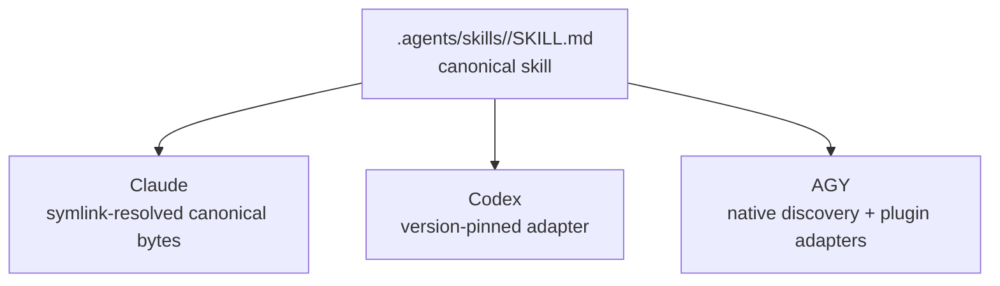
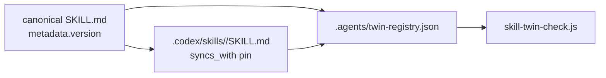
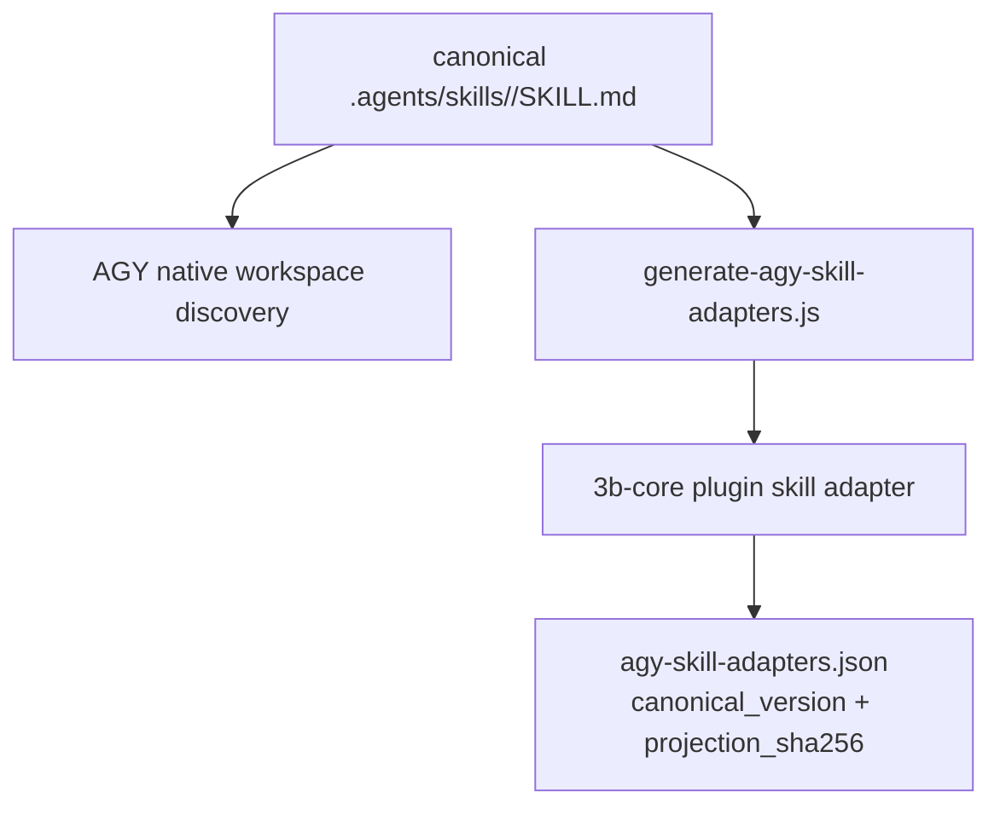

resolves canonical bytes, Codex reads a pinned adapter, and AGY splits native
discovery from plugin runnability._

## Uniformity is the wrong target

The easiest mistake in a multi-agent setup is to confuse consistency with
uniformity.

Consistency means the same workflow has one source of truth. Uniformity means
every runtime receives that workflow through the same mechanism. The first is
valuable. The second is often fiction.

3B's skills system is where that difference becomes unavoidable. A rule can be
treated mostly as text: load it always, or route it lazily, and the agent reads
instructions. A skill is heavier. It is a workflow primitive with trigger text,
arguments, reference files, version metadata, changelog history, and sometimes
capability declarations. It is not just "context." It is a unit the runtime may
discover, list, dispatch, or refuse to run.

The June 14 architecture model captures the shape this way: 40 canonical skills
reach Claude via symlink, AGY via a shared inode hardlink, and Codex via a
version-pinned hand-maintained copy. The exact counts are scoped to that
2026-06-14 architecture model snapshot, but the architectural lesson is durable:
one source of truth does not require one transport.

The right goal is same behavior, different physics.

## What a 3B skill contains

A canonical 3B skill lives at:

```text
.agents/skills/<name>/SKILL.md
```

That file starts with YAML frontmatter: `name`, `description`, optional tool
allowances, version metadata, and sometimes a `caps:` declaration. Then comes
the body: purpose, workflow steps, reference files, output rules, and changelog.
Some skills carry `references/` folders. Some have Rule-6 README files. The
largest skill, `wrap`, is large enough that nobody should pretend skill
transport is a trivial text-copy problem.

The important part is that `.agents/skills/` is still the canonical source. A
skill should not be authored separately for Claude, Codex, and AGY. If the
workflow changes, the canonical skill is where the change belongs. The question
is how each runtime receives enough of that skill to behave correctly.

That answer differs per runtime.



The diagram looks symmetrical only because diagrams are polite. The filesystem
is not symmetrical.

## Claude: resolve the canonical file

Claude is the cleanest path. The runtime already has a skill surface, and 3B's
compatibility layer points that surface back at the canonical tree.

The chain is conceptually simple:

```text
~/.claude/skills -> .claude/skills -> .agents/skills
```

In repo terms, `.claude/skills` is a back-symlink to `.agents/skills`. Claude
believes it is reading its own runtime mount. The bytes are canonical. There is
no adapter copy to update and no second body to reconcile.

That is the best case for source-of-truth design. The runtime's constraints
allow the canonical file to be the consumed file. The transport is just path
resolution.

It still has a footgun: edit the source, not the symlink. If a tool atomic-saves
through the symlink and replaces the link with a regular file, the apparent edit
can sever the source-of-truth chain. But that is an authoring discipline
problem, not a skill-transport problem. Claude's transport can remain a
canonical-byte path.

## Codex: adapt and pin

Codex is different. 3B does not treat the canonical Claude skill body as the
Codex runtime artifact. It keeps a repo-local `.codex/skills/<name>/SKILL.md`
adapter surface.

That sounds like duplication until you look at the guardrail. Codex adapters
carry a version pin back to the canonical source:

```yaml
metadata:
  syncs_with: ".agents/skills/<name>/SKILL.md@<version>"
```

The adapter can be thinner and more Codex-shaped, but it is not allowed to
pretend it is independent. Its relationship to the canonical skill is explicit.
The twin registry records which canonical skill and Codex adapter are a pair,
and `scripts/skill-twin-check.js` verifies that both sides exist. The
`sync-codex-skills.sh` helper links repo-local Codex skill entries into the
user-level Codex skill directory and checks for drift.

This is the kind of duplication that can be made safe: visible, versioned,
checked, and intentionally smaller than the source.

The tradeoff is manual catch-up. A Codex adapter does not magically update
because the canonical skill changed. That is why the version pin matters. If the
canonical skill moves from one version to another and the adapter still points
at the old version, the mismatch is reviewable. The system does not hide the
gap.



Codex gets the same workflow intent through a different artifact. That is not a
failure of source-of-truth design. It is the source-of-truth design admitting
that Codex has different constraints.

## AGY: discovery and runnability are different surfaces

AGY is the transport that punishes oversimplified diagrams.

The June 11 model describes AGY's skill path in shared-inode terms: canonical
skill bytes are visible through the Gemini-compatible skill surface, while only
a small subset receives generated plugin adapters. The subsystem notes frame the
blog angle as "same skill, three transport physics": Claude symlink, AGY
hardlink/shared inode, Codex version-pinned copy.

The later AGY migration docs sharpen that into a two-surface model:

1. **Native workspace discovery** — AGY can see canonical workspace skills.
2. **Plugin adapter runnability** — `/3b:` commands require generated adapter
   directories inside the `3b-core` plugin.

Those surfaces are related, but they are not the same thing. A skill can be
visible to AGY without being runnable as a plugin command. For the June 11
snapshot, the special plugin adapter pair is `check` and `handoff`; the
generator projects only the compatible frontmatter and body shape, rewrites
links, copies support files, and records a projection hash.



The point is not the exact number of adapters. That count has already changed
after the June 11 model. The point is the split: discovery is not runnability.
If you collapse those into one word, you will either overclaim what AGY can run
or underclaim what AGY can see.

The deprecated `sync-agy-skills.sh` script is a useful warning. User-tier
mirroring into `~/.gemini/skills/` was disabled because it caused skill-name
conflicts. That tells you the transport problem is not solved by "copy
everything everywhere." Sometimes the correct transport is no mirror at all,
plus a smaller generated adapter surface for the commands that need plugin
runnability.

## Verification makes asymmetry safe

Transport asymmetry is only acceptable if the system can prove what each path is
doing.

For Claude, the check is mostly symlink integrity: does the runtime mount still
resolve to `.agents/skills`?

For Codex, the checks are twin existence and version awareness: does every
declared twin have both canonical and adapter files, and does the adapter say
which canonical version it tracks?

For AGY, the check is projection integrity: did the generator produce the
adapter body from the canonical skill, with the expected filtered frontmatter,
support files, and `projection_sha256`?

These are different checks because the transports are different. A single
"skills are synced" boolean would erase the facts that matter. 3B keeps the
checks close to the transport mechanism instead.

That is also why the source files matter. `.agents/twin-registry.json` is not a
random inventory. It is the registry for the Codex bridge state. The AGY
manifest is not just a build artifact. It records projection metadata. The
deprecated AGY mirror script is not dead trivia. It documents why a seemingly
obvious mirror path was rejected.

## What this teaches about multi-agent tooling

The clean abstraction is not "skills sync to all agents." That sentence hides
too much.

The better abstraction is:

```text
canonical skill behavior + runtime-specific transport + transport-specific verification
```

This formula is less elegant, but it survives real tools. Claude can consume
canonical bytes through a symlink chain. Codex needs an adapter whose
relationship to canonical is version-pinned. AGY needs separate thinking for
workspace discovery and plugin command runnability.

Once you name those differences, they stop being drift. Drift is when two copies
disagree accidentally. Transport asymmetry is when two runtimes need different
artifacts and the system records how those artifacts relate.

That distinction is the difference between a multi-agent setup that scales and
one that becomes a pile of stale mirrors.

## What needs refresh before publication

This draft intentionally follows the 2026-06-14 architecture model. That model
is the source of truth for the blog series ordering and thesis, but the live
skills subsystem has continued to move. Before public publication, the post
needs one freshness pass:

- Recount canonical skills and Codex adapters.
- Reconcile the AGY hardlink/shared-inode phrasing with the later
  frontmatter-driven AGY adapter projection model.
- Decide whether to describe adapter counts as snapshot facts or update the
  architecture model first.

Those are publication-edit tasks, not reasons to avoid the post. They are the
same lesson in miniature: when transport facts drift, make the source boundary
explicit.

## Same behavior, different physics

The skill system is where 3B's "author once" principle becomes mature. It does
not insist that every runtime receive identical files. It insists that every
runtime's file has a visible relationship to the canonical behavior.

Claude gets path resolution. Codex gets a pinned adapter. AGY gets a split
between native discovery and plugin adapter runnability. Each path is different
because each runtime is different.

That is not a compromise away from the source of truth. It is what a source of
truth looks like when it has to survive contact with three tools that load
skills in three different ways.
