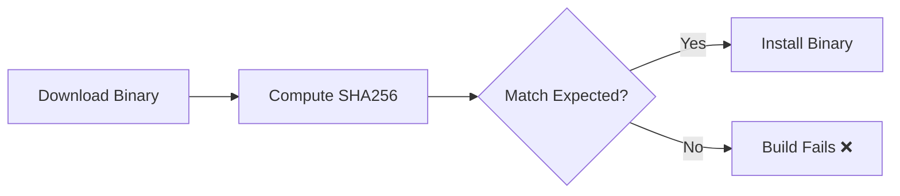

# Binary Checksum Verification

Verify downloaded binaries haven't been tampered with using SHA256 checksums.

## The Problem

Downloading binaries from the internet without verification is a supply chain attack vector:

```text
Attack scenario:
┌─────────────────────────────────────────────────────────┐
│ 1. Attacker compromises download server or CDN         │
│ 2. Replaces legitimate binary with malicious version   │
│ 3. Your Dockerfile downloads and installs malware      │
│ 4. Malware runs with your container's permissions      │
└─────────────────────────────────────────────────────────┘
```

## The Solution

```dockerfile
# Download binary
RUN curl -sL "https://example.com/binary" -o /usr/local/bin/binary \
    #
    # Verify checksum (SECURITY - prevents supply chain attacks)
    # Format: "<expected_hash>  <filepath>" (note: two spaces required)
    # sha256sum -c reads the hash, computes actual hash, compares them
    # If mismatch → build fails (someone tampered with the file)
    #
    && echo "abc123...  /usr/local/bin/binary" | sha256sum -c - \
    && chmod +x /usr/local/bin/binary
```

## How It Works



## Getting the Expected Checksum

1. **Official release page**: Most projects publish checksums
2. **Compute yourself**: Download once, verify manually, then use that hash

```bash
# Compute SHA256 of a file
sha256sum /path/to/binary
# Output: abc123def456...  /path/to/binary
```

## Real Example (ECR Credential Helper)

```dockerfile
RUN ARCH=$(dpkg --print-architecture) \
    && if [ "$ARCH" = "arm64" ]; then \
         ECR_ARCH="arm64"; \
         EXPECTED_SHA="76aa3bb223d4e64dd4456376334273f27830c8d818efe278ab6ea81cb0844420"; \
       else \
         ECR_ARCH="amd64"; \
         EXPECTED_SHA="dd6bd933e439ddb33b9f005ad5575705a243d4e1e3d286b6c82928bcb70e949a"; \
       fi \
    && curl -sL "https://amazon-ecr-credential-helper-releases.s3.us-east-2.amazonaws.com/0.9.0/linux-${ECR_ARCH}/docker-credential-ecr-login" \
       -o /usr/local/bin/docker-credential-ecr-login \
    && echo "${EXPECTED_SHA}  /usr/local/bin/docker-credential-ecr-login" | sha256sum -c - \
    && chmod +x /usr/local/bin/docker-credential-ecr-login
```

## Key Points

- **Two spaces required**: Between hash and filepath in `sha256sum -c`
- **Architecture-specific**: Different binaries have different checksums
- **Version-specific**: Update checksums when updating binary versions
- **Build fails on mismatch**: Prevents installing tampered binaries

## When to Use

| Scenario | Verification Needed? |
| -------- | -------------------- |
| Package manager (apt, pip) | No (built-in verification) |
| Direct binary download | Yes |
| Scripts from GitHub | Consider (or use signed releases) |
| Internal artifacts | Optional (trust your CI/CD) |
