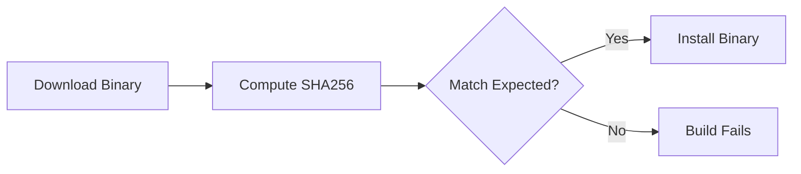

Six months ago, I was writing a Dockerfile that downloaded the AWS ECR credential helper. `curl -sL`, pipe to a path, `chmod +x`, done. It worked. It passed CI. It shipped to production. And the entire time, I had no way of knowing whether the binary I downloaded was the one AWS published or something an attacker swapped in at the CDN level.

That gap between "it works" and "it's safe" is where supply chain attacks live.

## Why This Matters

When you install something through a package manager like `apt` or `pip`, the manager verifies package signatures behind the scenes. But when you download a raw binary with `curl` -- which happens constantly in Dockerfiles -- no one is checking anything. The attack scenario is straightforward:

1. An attacker compromises the download server or CDN
2. They replace the legitimate binary with a malicious version
3. Your Dockerfile downloads and installs malware
4. That malware runs with your container's permissions

This is not theoretical. The [Codecov breach](https://about.codecov.io/security-update/) happened through a modified bash uploader script. The SolarWinds attack happened through a tampered build artifact. Verifying checksums is the minimum viable defense against this class of attack.

## How Checksum Verification Works

The concept is straightforward: the publisher computes a SHA256 hash of the binary and publishes it alongside the download. You download the binary, compute its hash yourself, and compare. If they match, the file is intact. If they differ, someone changed the file.



In a Dockerfile, this looks like:

```dockerfile
# Download binary
RUN curl -sL "https://example.com/binary" -o /usr/local/bin/binary \
    #
    # Verify checksum (SECURITY - prevents supply chain attacks)
    # Format: "<expected_hash>  <filepath>" (note: two spaces required)
    # sha256sum -c reads the hash, computes actual hash, compares them
    # If mismatch → build fails (someone tampered with the file)
    #
    && echo "abc123...  /usr/local/bin/binary" | sha256sum -c - \
    && chmod +x /usr/local/bin/binary
```

The `sha256sum -c -` command reads the expected hash from stdin, computes the actual hash of the file at the specified path, and compares them. If they differ, it exits with a non-zero code, which fails the Docker build.

## Getting the Expected Checksum

Where do you find the expected hash? It depends on the project:

1. **Official release page**: Most well-maintained projects publish checksums alongside their releases. Look for a `CHECKSUMS` or `SHA256SUMS` file.
2. **Compute it yourself**: Download once from a trusted network, verify it manually (or through other means), then hardcode that hash.

```bash
# Compute SHA256 of a file
sha256sum /path/to/binary
# Output: abc123def456...  /path/to/binary
```

Some projects, like the ECR credential helper, publish no checksums at all. In that case, you download the binary once, compute the hash yourself, and pin it. This does not protect against a compromise that happened before your first download, but it does protect against any change after that point.

## The Gotchas That Cost Me Hours

This should be a five-minute task, but several sharp edges made it take much longer.

**The two-space delimiter is invisible.** The `sha256sum -c` command requires exactly two spaces between the hash and the filepath: `"abc123  /path/to/file"`. One space silently fails with a cryptic "no properly formatted checksum lines found" error. The error message never mentions spacing. I stared at a correct-looking hash for twenty minutes before discovering this.

**Architecture-specific checksums are easy to miss.** When supporting both `amd64` and `arm64`, each architecture produces a different binary with a different hash. My first attempt used a single checksum, and the build failed only on ARM. It looked like a download issue, not a checksum mismatch, because I was not expecting architecture to matter.

**Hash updates are a manual chore.** Every time you bump the binary version, you need new checksums for every supported architecture. Forgetting to update a checksum after a version bump causes silent build failures that look like network errors. There is no automated solution to this -- it is an inherent cost of pinning checksums.

## Real Example: ECR Credential Helper

Here is how I verify the ECR credential helper in a multi-architecture Dockerfile:

```dockerfile
RUN ARCH=$(dpkg --print-architecture) \
    && if [ "$ARCH" = "arm64" ]; then \
         ECR_ARCH="arm64"; \
         EXPECTED_SHA="76aa3bb223d4e64dd4456376334273f27830c8d818efe278ab6ea81cb0844420"; \
       else \
         ECR_ARCH="amd64"; \
         EXPECTED_SHA="dd6bd933e439ddb33b9f005ad5575705a243d4e1e3d286b6c82928bcb70e949a"; \
       fi \
    && curl -sL "https://amazon-ecr-credential-helper-releases.s3.us-east-2.amazonaws.com/0.9.0/linux-${ECR_ARCH}/docker-credential-ecr-login" \
       -o /usr/local/bin/docker-credential-ecr-login \
    && echo "${EXPECTED_SHA}  /usr/local/bin/docker-credential-ecr-login" | sha256sum -c - \
    && chmod +x /usr/local/bin/docker-credential-ecr-login
```

The pattern: detect architecture, select the correct hash, download, verify, then make executable. If the verification fails, the entire Docker build stops. No tampered binary reaches production.

## When to Use (and When Not To)

Not every download needs manual checksum verification. The decision depends on whether the download channel already provides integrity guarantees.

| Scenario                   | Verification Needed?              |
| -------------------------- | --------------------------------- |
| Package manager (apt, pip) | No (built-in verification)        |
| Direct binary download     | Yes                               |
| Scripts from GitHub        | Consider (or use signed releases) |
| Internal artifacts         | Optional (trust your CI/CD)       |

Skip manual checksums when **package managers handle verification** (apt, pip, npm all verify package integrity through signed manifests), when the container is **ephemeral and never touches production** (the supply chain risk is low and the maintenance cost is not justified), when **GPG signature verification is available** (signatures prove both integrity AND authenticity, while checksums prove only integrity), or when you **rebuild the binary from source in CI** (you control the build, so checksums are meaningless).

## Takeaway

The pattern is three lines: download, verify, chmod. The hard part is not the implementation -- it is remembering to do it every time you add a `curl` to a Dockerfile, and keeping the hashes updated when you bump versions. Make it a habit. The one time it catches a tampered binary will justify every checksum you ever maintained.
