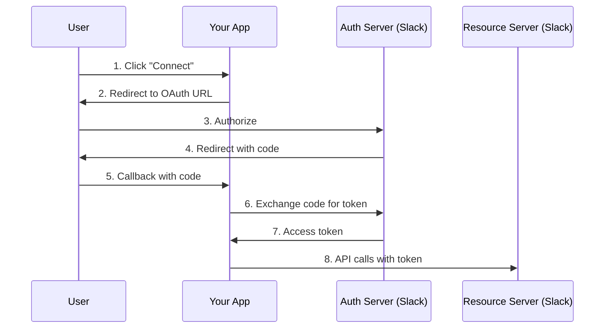

I needed to integrate Slack into a backend connector service. The OAuth 2.0 flow seemed straightforward in theory -- redirect, authorize, exchange code, store token. In practice, I spent days debugging opaque error messages, CSRF edge cases, and redirect URI mismatches. Here are the patterns I landed on, and the traps I hit along the way.

## Why This Matters

Any time your backend needs to act on behalf of a user in a third-party service -- sending Slack messages, reading Google Calendar events, accessing GitHub repos -- you need OAuth 2.0. Getting it wrong means token leaks, CSRF attacks on callbacks, and broken auth flows that are hard to debug because the provider's error responses are deliberately vague.

## The Difficulties

Four issues made this implementation harder than the RFC makes it sound.

**State parameter CSRF attacks are silent.** Forgetting the state parameter does not cause any visible error -- the flow works fine. The vulnerability only becomes apparent under attack, making it easy to ship insecure code that passes all functional tests.

**Token exchange errors are vague.** When `oauth.v2.access` returns `{"ok": false, "error": "invalid_grant"}`, it could mean the code expired (10-minute window), the redirect URI does not match exactly, or the code was already used. No further detail is provided.

**Redirect URI must match exactly.** A trailing slash mismatch between what is registered in the provider and what is sent in the request causes a confusing "redirect_uri_mismatch" error that does not tell you which URI it expected.

**In-memory state storage breaks with multiple replicas.** A naive `dict`-based state store works in development but silently fails in production with multiple server replicas, since the callback may hit a different instance than the one that generated the state.

## Authorization Code Flow

The Authorization Code flow is the standard for server-side applications. Here is the sequence:



## CSRF Protection with State Parameter

Always generate a cryptographically secure state parameter and validate it before processing the callback:

```python
import secrets

# Store for state validation (use Redis in production with multiple replicas)
_oauth_states: dict[str, str] = {}

async def authorize():
    # Generate cryptographically secure state
    state = secrets.token_urlsafe(32)
    _oauth_states[state] = "slack"

    params = {
        "client_id": settings.SLACK_CLIENT_ID,
        "scope": settings.SLACK_SCOPES,
        "redirect_uri": settings.SLACK_REDIRECT_URI,
        "state": state,  # CSRF protection
    }
    return {"authorize_url": f"https://slack.com/oauth/v2/authorize?{urlencode(params)}"}

async def callback(code: str, state: str):
    # Validate state FIRST
    if state not in _oauth_states:
        raise HTTPException(400, "Invalid state token")

    del _oauth_states[state]  # One-time use
    # ... exchange code for token
```

The state parameter prevents an attacker from tricking a user into authorizing the attacker's account. Without it, a CSRF attack can link a victim's session to the attacker's Slack workspace. The in-memory dict works for single-instance development, but use Redis or a database in production where multiple replicas serve traffic.

## Token Exchange

Exchange the authorization code for an access token. This happens server-side so the client secret never reaches the browser:

```python
async def exchange_code_for_token(code: str) -> dict:
    token_url = "https://slack.com/api/oauth.v2.access"

    async with httpx.AsyncClient(timeout=30.0) as client:
        response = await client.post(
            token_url,
            data={
                "client_id": settings.SLACK_CLIENT_ID,
                "client_secret": settings.SLACK_CLIENT_SECRET,
                "code": code,
                "redirect_uri": settings.SLACK_REDIRECT_URI,
            },
        )
        result = response.json()

    if not result.get("ok"):
        raise OAuthError(result.get("error", "unknown"))

    return {
        "access_token": result["access_token"],
        "team_id": result["team"]["id"],
        "scope": result["scope"],
    }
```

The `redirect_uri` in the token exchange must match the one sent during authorization _exactly_ -- including trailing slashes, protocol, and port.

## Secure Token Storage

Store tokens in a secrets manager, not in your database or code:

```python
# Store in Vault
def store_oauth_token(source_type: str, token_data: dict) -> bool:
    client = VaultClient(vault_addr, k8s_role)
    return client.write_secret(f"connectors/{source_type}", token_data)

# Retrieve per-request
def get_oauth_token(source_type: str) -> dict:
    client = VaultClient(vault_addr, k8s_role)
    return client.read_secret(f"connectors/{source_type}")
```

Tokens in a database are one SQL injection away from compromise. A secrets manager like Vault provides encryption at rest, audit logging, and automatic rotation.

## Error Handling

Map provider errors to appropriate HTTP responses so your frontend can show useful messages:

| OAuth Error    | HTTP Status | User Message                        |
| -------------- | ----------- | ----------------------------------- |
| invalid_client | 500         | Configuration error                 |
| invalid_grant  | 400         | Authorization expired, please retry |
| access_denied  | 403         | Access was denied                   |
| invalid_scope  | 400         | Invalid permissions requested       |
| server_error   | 503         | Provider temporarily unavailable    |

## Configuration Separation

Keep sensitive and non-sensitive settings in different places:

| Setting       | Storage          | Sensitivity |
| ------------- | ---------------- | ----------- |
| Client ID     | ConfigMap/env    | Low         |
| Client Secret | K8s Secret/Vault | HIGH        |
| Redirect URI  | ConfigMap/env    | Low         |
| Scopes        | ConfigMap/env    | Low         |
| Access Tokens | Vault only       | HIGH        |

## Best Practices Checklist

1. **Never log tokens** -- Mask in logs, never print full values
2. **Use HTTPS** -- OAuth requires TLS for redirect URIs
3. **Validate state** -- Check state before processing callback
4. **Minimal scopes** -- Request only what you need
5. **Token rotation** -- Implement refresh flow if provider supports it
6. **Secure storage** -- Use Vault or equivalent, not database
7. **Audit trail** -- Log OAuth events (connect, disconnect, errors)

## Why This Works

These patterns work because they address the three main failure modes of OAuth implementations: CSRF (state parameter), token leakage (Vault storage + never logging), and configuration drift (separation of sensitive and non-sensitive settings). Each pattern is a direct response to a real bug or vulnerability I encountered.

## Practical Takeaway

Use these patterns for server-side applications integrating with third-party APIs (Slack, Google, GitHub) where you need delegated user authorization, multi-tenant SaaS where each customer connects their own accounts, and backend connector services that act on behalf of users.

Do **not** use OAuth 2.0 for internal service-to-service communication (use API keys or mTLS instead), for simple API key scenarios where you control both client and server, or for client-side only apps without a backend (use Authorization Code with PKCE instead). Also skip it for webhooks -- verify webhook signatures instead of using OAuth tokens.
