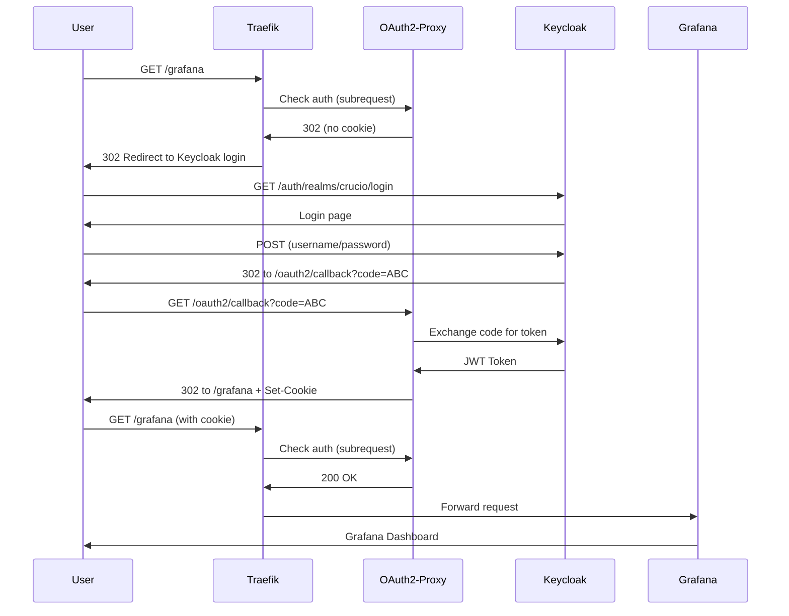
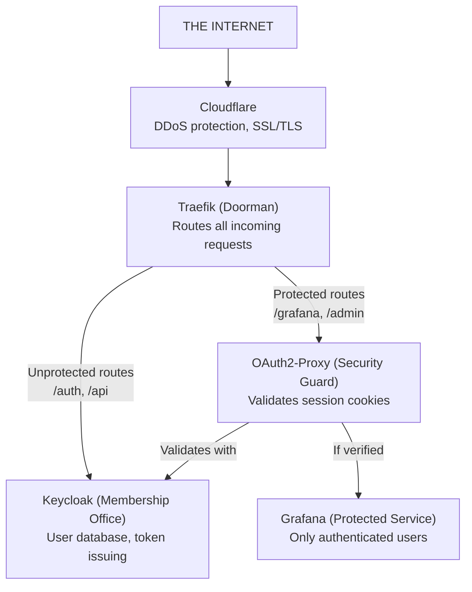

Every service in our Kubernetes cluster was wide open. If you knew the URL -- `/grafana`, `/admin`, any internal dashboard -- you could access it directly. Adding authentication to each service individually would mean duplicating login logic everywhere. I needed a single, centralized auth gate that protects all services without any of them needing to implement authentication themselves. Here is how I set it up with Traefik ForwardAuth, Keycloak, and OAuth2-Proxy.

## Why This Matters

In a Kubernetes cluster running multiple web services (dashboards, APIs, admin panels), the naive approach is to add auth logic to each one. This creates duplicated code, inconsistent security policies, and a maintenance burden that grows with every new service. A centralized auth gateway solves all three problems: one login, one set of policies, zero auth code in your services.

## The Difficulties

Five issues made this integration significantly harder than the documentation suggested.

**Cross-namespace middleware references are undocumented.** Traefik's ForwardAuth middleware must be in the same namespace as the IngressRoute, or use a `middleware@namespace` syntax that is barely mentioned in the docs. Initial attempts with cross-namespace references silently failed -- requests just bypassed auth entirely with no error.

**OAuth2-Proxy configuration is sprawling.** OAuth2-Proxy has 100+ configuration flags. Finding the correct combination for Keycloak OIDC (issuer URL format, scope requirements, cookie domain settings) required extensive trial-and-error because most examples online use Google or GitHub as the provider, not Keycloak.

**Redirect loops on misconfigured cookie domains.** If the cookie domain does not match the service domain exactly, the browser never sends the auth cookie back, causing an infinite redirect loop between OAuth2-Proxy and Keycloak with no useful error message.

**OIDC discovery endpoint path varies by Keycloak version.** Keycloak changed its default URL structure between versions (with and without `/auth/` prefix), causing "issuer mismatch" errors that looked like a configuration problem but were actually a version compatibility issue.

**ForwardAuth subrequests are invisible.** When ForwardAuth denies a request, Traefik logs show only the final 302 redirect. The internal subrequest to OAuth2-Proxy and its response are not logged by default, making it very hard to diagnose why auth is failing.

## The Big Picture: A Building Analogy

Think of your application as a building with different rooms:

| Room              | What's Inside                  |
| ----------------- | ------------------------------ |
| **Grafana room**  | Monitoring dashboards          |
| **API room**      | Where apps talk to the backend |
| **Web room**      | The main lobby/website         |
| **Keycloak room** | The membership office          |

Right now, anyone can walk into any room. The goal is to add security so only **members can enter certain rooms**.

## What is Traefik

**Traefik is the doorman** that stands at the entrance of your building. When someone visits `https://crucio.brandonwie.dev/grafana`, Traefik receives the request, looks at the URL path, and routes it to the right service.

| Job                | What It Means                                  |
| ------------------ | ---------------------------------------------- |
| **Routing**        | "You want /grafana? Go to the Grafana room!"   |
| **Security**       | "I'll add security features to protect you"    |
| **Load Balancing** | "Room is full? Let me send you to another one" |

Technically, Traefik is a Kubernetes Ingress Controller that handles incoming traffic. The key configuration files are `ingressroute-*.yaml` (which URLs go where) and `middleware-*.yaml` (extra processing like rate limiting and security headers).

## What is Keycloak

**Keycloak is the membership office** that issues ID cards and verifies them.

| Job                 | What It Means                                              |
| ------------------- | ---------------------------------------------------------- |
| **Stores Users**    | Has a database of usernames and passwords                  |
| **Issues Tokens**   | When you log in, gives you a "membership card" (JWT token) |
| **Verifies Tokens** | Other services can ask "Is this card real?"                |

Key concepts to know:

| Term       | Meaning                                              |
| ---------- | ---------------------------------------------------- |
| **Realm**  | A tenant/workspace in Keycloak                       |
| **Client** | An application that uses Keycloak (e.g., crucio-web) |
| **OIDC**   | OpenID Connect -- the protocol for authentication    |

## The Problem: No Security

Without ForwardAuth, Traefik just routes requests without checking identity. It is a lazy doorman that lets everyone in without asking for credentials.

## What is ForwardAuth

ForwardAuth teaches the doorman to check membership cards. Instead of letting everyone through, Traefik will now:

1. Stop you at the door
2. Ask "Do you have a valid membership card?"
3. If no -- send you to the membership office to get one
4. If yes -- let you in

Technically, ForwardAuth is a Traefik middleware that intercepts incoming requests and makes an internal "subrequest" to an authentication service. If the auth service returns `200 OK`, the request goes through. If it returns `401` or `302`, Traefik redirects to login.

## Who is OAuth2-Proxy

Traefik can ask "is this person a member?" but it does not know **how** to verify membership cards. OAuth2-Proxy is the security guard that:

1. Knows how to read membership cards (JWT tokens)
2. Knows how to talk to Keycloak
3. Handles the entire "go get a card, come back with it" dance

It runs as a separate service (port 4180, internal only), implements the full OAuth2/OIDC flow, and stores session data in secure HTTP-only cookies.

## The Complete Login Flow

Here is what happens step by step when you first visit a protected service:

**Step 1: You visit Grafana.** Browser navigates to `https://crucio.brandonwie.dev/grafana`.

**Step 2: Traefik checks ForwardAuth.** Traefik makes an internal subrequest to OAuth2-Proxy asking "Is this person allowed in?"

**Step 3: No valid cookie.** OAuth2-Proxy does not find a session cookie. It responds with a 302 redirect.

**Step 4: Redirect to login.** Your browser is sent to the Keycloak login page.

**Step 5: You log in.** Enter username and password at Keycloak.

**Step 6: Keycloak issues a code.** After successful authentication, Keycloak redirects your browser to the OAuth2-Proxy callback URL with a temporary authorization code.

**Step 7: OAuth2-Proxy exchanges code for token.** OAuth2-Proxy sends the code to Keycloak and receives a JWT token in return. It stores this in a secure cookie on your browser.

**Step 8: Redirect back to Grafana.** Your browser goes back to `/grafana`, this time carrying the session cookie.

**Step 9: Access granted.** Traefik checks ForwardAuth again. This time OAuth2-Proxy finds the valid cookie and returns 200 OK. Traefik forwards you to Grafana.



## Complete Architecture



## Glossary

| Term             | Plain English                                | Technical Definition                                   |
| ---------------- | -------------------------------------------- | ------------------------------------------------------ |
| **Traefik**      | Doorman that routes to the right room        | Kubernetes Ingress Controller                          |
| **Keycloak**     | Membership office that knows all members     | Identity and Access Management (IAM) server            |
| **OAuth2-Proxy** | Security guard that checks your card         | Authentication proxy for OAuth2/OIDC flows             |
| **ForwardAuth**  | Rule that says "check cards before entering" | Traefik middleware delegating auth to external service |
| **JWT Token**    | Your digital membership card                 | JSON Web Token -- signed data proving identity         |
| **Cookie**       | Where your browser stores your card          | Browser storage for session data                       |
| **OIDC**         | The language the membership office speaks    | OpenID Connect -- auth protocol built on OAuth2        |
| **Realm**        | A separate membership database               | Keycloak tenant/workspace                              |
| **Middleware**   | Extra checks the doorman performs            | Traefik plugin that processes requests                 |
| **Subrequest**   | Doorman's whisper to security guard          | Internal HTTP request for auth check                   |

## Deployment Setup Guide

### Prerequisites

Before deploying OAuth2-Proxy, ensure:

1. **Keycloak is running**: `kubectl get pods -n crucio-security -l app.kubernetes.io/name=keycloak`
2. **Realm exists**: Your Keycloak realm is created
3. **Test user exists**: At least one user for testing

### Step 1: Create OAuth2-Proxy Client in Keycloak

This is a manual step. Access the Keycloak Admin Console via port-forward, create a new client with these settings:

- Client ID: `oauth2-proxy`
- Client Protocol: `openid-connect`
- Client Authentication: **ON** (Confidential client)
- Standard flow: **ON**
- Valid Redirect URIs: `https://your-domain.dev/oauth2/callback`

Copy the client secret from the Credentials tab.

### Step 2: Generate Cookie Secret

```bash
# Generate 32-byte base64url-encoded secret
python3 -c 'import os,base64; print(base64.urlsafe_b64encode(os.urandom(32)).decode())'
```

### Step 3: Deploy

```bash
# Deploy OAuth2-Proxy
kubectl apply -k infra/k3s/security/oauth2-proxy/

# Deploy ForwardAuth middleware
kubectl apply -f infra/k3s/system/traefik/middleware-forwardauth.yaml

# Update protected service routes
kubectl apply -f infra/k3s/system/traefik/ingressroute-grafana.yaml
```

### Troubleshooting

| Problem                 | Cause                    | Solution                                     |
| ----------------------- | ------------------------ | -------------------------------------------- |
| 502 Bad Gateway         | OAuth2-Proxy not running | Check pods in crucio-security namespace      |
| Redirect loop           | Invalid redirect URI     | Verify Keycloak client's Valid Redirect URIs |
| "Invalid issuer"        | Wrong OIDC URL           | Check OIDC issuer URL in configmap           |
| Cookie not set          | Wrong domain             | Check cookie domains match your domain       |
| "Invalid client secret" | Secret mismatch          | Re-copy secret from Keycloak                 |

Debug with:

```bash
# Check OAuth2-Proxy logs
kubectl logs -n crucio-security -l app.kubernetes.io/name=oauth2-proxy -f

# Check Traefik logs for routing issues
kubectl logs -n kube-system -l app.kubernetes.io/name=traefik -f
```

## Why This Works

This architecture works because it separates concerns cleanly. Traefik handles routing and knows nothing about authentication. OAuth2-Proxy handles the OAuth2/OIDC protocol and knows nothing about routing. Keycloak manages users and tokens and knows nothing about either. Each component does one job, and they compose together through standard HTTP and OIDC protocols.

Adding a new protected service is one line in a Traefik middleware annotation -- no auth code, no token validation, no login page.

## Practical Takeaway

Use this pattern for Kubernetes clusters with multiple web services that need the same authentication gate, especially when using Traefik as the ingress controller.

Do **not** use it for single-service deployments (embed auth directly), API-only backends without browser clients (use JWT validation middleware), environments without Traefik (use `auth_request` for Nginx), or lightweight projects where Keycloak is overkill (consider Authelia or Authentik).
