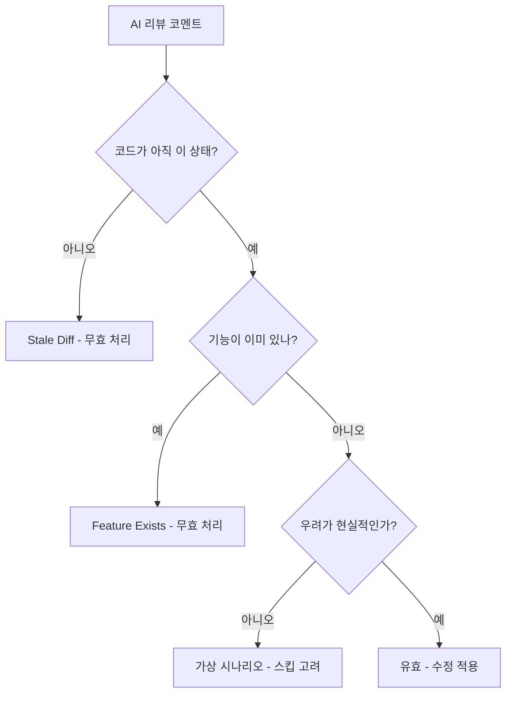

## 패턴 1: Stale Diff

**증상**: AI가 이미 수정된 코드를 지적해요.

**예시**:

```text
AI Review: "Hardcoded account ID '325908307049' should be dynamic"
실제: Account ID는 2커밋 전 abc123에서 이미 동적으로 변경됨
```

**원인**: AI가 현재 HEAD가 아닌 이전 diff를 리뷰한 거예요.

**대응 방법**:

- 항상 현재 코드 기준으로 AI 리뷰를 검증하세요
- 수정 사항을 push한 뒤 리뷰를 다시 요청하세요
- 수정이 적용되었다는 코멘트를 남기세요

## 패턴 2: Feature Exists

**증상**: AI가 이미 존재하는 기능을 추가하라고 제안해요.

**예시**:

```text
AI Review: "Consider adding checksum verification for the binary download"
실제: 체크섬 검증이 이미 80-85번째 줄에 있음
```

**원인**: AI가 코드를 청크 단위로 분석하면서 다른 섹션의 맥락을 놓친 거예요.

**대응 방법**:

- 해당 기능이 있는 줄을 AI에게 알려주세요
- 기능 근처에 목적을 설명하는 코멘트를 추가하세요
- `/validate-pr-reviews` 스킬로 체계적으로 리뷰를 검증하세요

## 패턴 3: Cross-File Blindness

**증상**: AI가 관련 파일의 변경 사항을 못 봐요.

**예시**:

```text
AI Review: "entrypoint.sh calls docker-credential-ecr-login but it's not installed"
실제: Dockerfile에서 설치하고 있음, 다른 파일일 뿐
```

**원인**: AI가 전체 컨텍스트 없이 파일을 개별적으로 리뷰한 거예요.

**대응 방법**:

- 관련 파일을 모두 리뷰 컨텍스트에 포함하세요
- 의존성이 어디서 오는지 참조하는 코멘트를 추가하세요
- 크로스 파일 참조를 포함해서 리뷰에 답변하세요

## 패턴 4: Hypothetical Concerns

**증상**: AI가 발생할 수 없는 시나리오에 대해 우려를 제기해요.

**예시**:

```text
AI Review: "What if AWS_DEFAULT_REGION is set to an invalid region?"
실제: AWS CLI가 명확한 에러 메시지를 반환함, 별도 처리 불필요
```

**원인**: AI가 철저하게 학습되어 있어서 때로는 지나치게 철저해져요.

**대응 방법**:

- 우려 사항이 현실적인지 평가하세요
- 기존 에러 처리(AWS CLI 등)를 신뢰하세요
- 실제로 발생 가능한 실패 모드에만 처리를 추가하세요

## 검증 워크플로우



## 핵심 정리

| 패턴                 | 감지 방법        | 대응                      |
| -------------------- | ---------------- | ------------------------- |
| Stale Diff           | 현재 코드 확인   | 무효 처리, 코멘트 추가    |
| Feature Exists       | 코드베이스 검색  | 기존 코드 위치 안내       |
| Cross-File Blindness | 관련 파일 확인   | 크로스 파일 컨텍스트 설명 |
| Hypothetical         | 발생 가능성 평가 | 스킵 또는 최소한의 처리   |

## 이게 왜 중요한가

- AI 리뷰는 시간을 절약하지만 사람의 검증이 필요해요
- AI 제안을 맹목적으로 구현하면 노력이 낭비돼요
- 패턴을 이해하면 유효한 피드백과 무효한 피드백을 빠르게 구별할 수 있어요
- 보강 코멘트를 남기면 반복적인 잘못된 리뷰를 방지할 수 있어요
