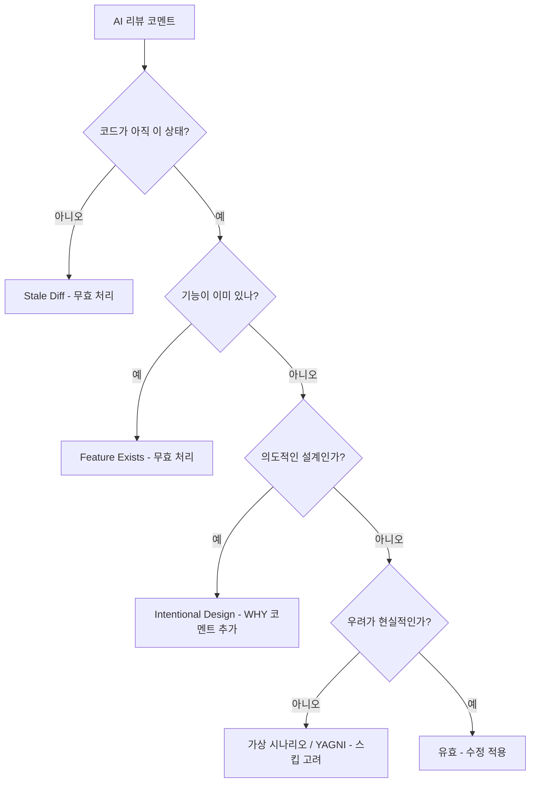

AI 코드 리뷰 도구(GitHub Copilot, Claude, Codex)는 실제 버그를 잡아내고 시간을 절약해줘요. 하지만 false positive도 생성해요 -- 정확한 코드를 지적하거나, 이미 존재하는 기능을 제안하거나, 실제로 발생할 수 없는 시나리오에 대해 우려를 제기하죠. 여러 프로젝트에서 AI가 생성한 PR 코멘트들을 검토하다 보니 같은 실패 모드가 반복되는 걸 발견했어요. 이 글에서는 잘못된 AI 피드백의 여섯 가지 패턴을 분류하고, 각각에 대한 분류 워크플로우를 제공해요.

---

## 문제

AI 리뷰어는 프로젝트 전체 컨텍스트 없이 코드를 분석해요. diff를 단독으로 보고, 파일 간 의존성을 놓치고, 특정 상황에 맞는지 평가하지 않은 채 일반적인 모범 사례를 적용하죠. 결과는 false positive 속에 묻힌 진짜 유용한 피드백이에요.

AI 리뷰를 체계적으로 분류하는 방법이 없으면, 불필요한 변경을 구현하느라 시간을 낭비하거나, 모든 걸 무시하고 실제 이슈를 놓치거나 둘 중 하나예요.

---

## 패턴 1: Stale Diff

**증상**: AI가 이미 수정된 코드를 지적해요.

**예시**:

```text
AI Review: "Hardcoded account ID '123456789012' should be dynamic"
실제: Account ID는 2커밋 전 abc123에서 이미 동적으로 변경됨
```

**원인**: AI가 현재 HEAD가 아닌 이전 diff를 리뷰한 거예요.

**대응 방법**:

- 항상 현재 코드 기준으로 AI 리뷰를 검증하세요
- 수정 사항을 push한 뒤 리뷰를 다시 요청하세요
- 수정이 적용되었다는 코멘트를 남기세요

## 패턴 2: Feature Exists

**증상**: AI가 이미 존재하는 기능을 추가하라고 제안해요.

**예시**:

```text
AI Review: "Consider adding checksum verification for the binary download"
실제: 체크섬 검증이 같은 파일 조금 위쪽에 이미 있음
```

**원인**: AI가 코드를 청크 단위로 분석하면서 다른 섹션의 맥락을 놓친 거예요.

**대응 방법**:

- 해당 기능이 있는 줄을 AI에게 알려주세요
- 기능 근처에 목적을 설명하는 코멘트를 추가하세요
- 답변하기 전에 각 리뷰 코멘트를 전체 코드베이스와 대조해 체계적으로 검증하세요

## 패턴 3: Cross-File Blindness

**증상**: AI가 관련 파일의 변경 사항을 못 봐요.

**예시**:

```text
AI Review: "entrypoint.sh calls docker-credential-ecr-login but it's not installed"
실제: Dockerfile에서 설치하고 있음, 다른 파일일 뿐
```

**원인**: AI가 전체 컨텍스트 없이 파일을 개별적으로 리뷰한 거예요.

**대응 방법**:

- 관련 파일을 모두 리뷰 컨텍스트에 포함하세요
- 의존성이 어디서 오는지 참조하는 코멘트를 추가하세요
- 크로스 파일 참조를 포함해서 리뷰에 답변하세요

## 패턴 4: Hypothetical Concerns

**증상**: AI가 발생할 수 없는 시나리오에 대해 우려를 제기해요.

**예시**:

```text
AI Review: "What if AWS_DEFAULT_REGION is set to an invalid region?"
실제: AWS CLI가 명확한 에러 메시지를 반환함, 별도 처리 불필요
```

**원인**: AI가 철저하게 학습되어 있어서 때로는 지나치게 철저해져요.

**대응 방법**:

- 우려 사항이 현실적인지 평가하세요
- 기존 에러 처리(AWS CLI 등)를 신뢰하세요
- 실제로 발생 가능한 실패 모드에만 처리를 추가하세요

## 패턴 5: Intentional Design

**증상**: AI가 의도적으로 그렇게 작성된 코드를 지적해요.

**예시**:

```text
AI Review: "The query's start bound, parsed as UTC midnight, misses events for negative-offset timezones"
실제: ±1일 타임존 버퍼가 의도적으로 과다 조회(over-fetch) — 최대 IANA 오프셋(±14h) < 24h 버퍼
```

**원인**: AI가 메커니즘(UTC 자정 파싱)은 보지만 전체적인 설계 의도(버퍼 기반 과다 조회)를 놓쳐요. 시스템 수준의 불변식(invariant)을 이해하지 못한 채 줄 단위로 분석하는 거예요. 이건 가장 무시하기 어려운 false positive예요. AI의 추론이 기술적으로 그럴듯하게 들리거든요 -- 실제 엣지 케이스를 식별하지만, 코드가 이미 그걸 처리하고 있다는 걸 모르는 거예요.

**대응 방법**:

- 코드가 무엇(WHAT)을 하는지가 아니라 왜(WHY) 올바른지 설명하는 인라인 코멘트를 추가하세요
- 불변식을 코드에 직접 문서화하세요: `// NOTE: ±1 day buffer covers all IANA offsets (max ±14h < 24h)`
- 해당하는 경우 디자인 패턴 이름을 참조하세요 (예: "over-fetch and filter" 전략)

## 패턴 6: YAGNI Suggestion

**증상**: AI가 트래픽이 적거나 이미 제약이 있는 경로에 대해 조기 최적화를 추천해요.

**예시**:

```text
AI Review: "Add partial indexes for the recurrence-start columns"
실제: 인덱스가 걸린 사용자 컬럼 + 반복 일정 부모 컬럼의 NOT NULL 필터가 이미 결과를 몇 행 수준으로 좁혀줌
```

**원인**: AI가 특정 데이터 볼륨과 기존 필터 제약 조건을 평가하지 않고 일반적인 모범 사례를 적용해요. 특정 컬럼에 인덱스가 없는 쿼리를 보고 인덱스를 추천하지만, 업스트림 필터가 이미 결과 셋을 소수의 행으로 줄인다는 걸 고려하지 않아요.

**대응 방법**:

- 최적화를 보류한 이유를 문서화하는 보강 코멘트를 추가하세요: `// NOTE: [Optimization] intentionally deferred — current scale does not justify complexity.`
- 결과 셋을 제한하는 기존 사전 필터를 기록하세요
- 제안에 장기적인 가치가 있다면, 지금 구현하지 말고 백로그 항목을 만드세요 -- YAGNI는 "절대 안 한다"가 아니라 "아직은 아니다"라는 뜻이에요

## 검증 워크플로우



## 핵심 정리

| 패턴                 | 감지 방법                | 대응                      |
| -------------------- | ------------------------ | ------------------------- |
| Stale Diff           | 현재 코드 확인           | 무효 처리, 코멘트 추가    |
| Feature Exists       | 코드베이스 검색          | 기존 코드 위치 안내       |
| Cross-File Blindness | 관련 파일 확인           | 크로스 파일 컨텍스트 설명 |
| Hypothetical         | 발생 가능성 평가         | 스킵 또는 최소한의 처리   |
| Intentional Design   | 설계 의도/불변식 확인    | 해당 위치에 WHY 코멘트    |
| YAGNI Suggestion     | 실제 규모/필터 조건 평가 | 보류 사유 문서화          |

## 이게 왜 중요한가

AI 코드 리뷰는 전체적으로 긍정적이에요. 피로할 때 사람이 놓치는 오타, 보안 이슈, 로직 에러를 잡아주니까요. 하지만 모든 AI 코멘트를 필수 수정 사항으로 취급하면 불필요한 노력과 코드 변경이 생겨요.

위의 여섯 가지 패턴이 제가 겪은 false positive의 대부분을 차지해요. 이걸 인식하면 AI 피드백을 분 단위가 아닌 초 단위로 분류할 수 있어요: 코드가 변경되었는지 확인하고, 기능이 이미 있는지 확인하고, 설계가 의도적인지 검증하고, 우려가 현실적인지 평가하세요.

모든 패턴에 걸쳐 가장 효과적인 장기 대응은 같아요: **WHAT이 아니라 WHY를 설명하는 코멘트를 작성하세요.** AI 리뷰어(그리고 사람 리뷰어도)는 코드만으로는 설계 의도를 추론할 수 없어요. 불변식, 사전 필터, 의도적인 트레이드오프를 설명하는 한 줄짜리 코멘트가 같은 false positive이 다음 리뷰에서 반복되는 걸 방지해줘요.
