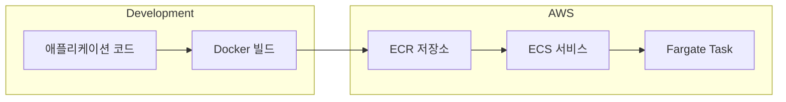
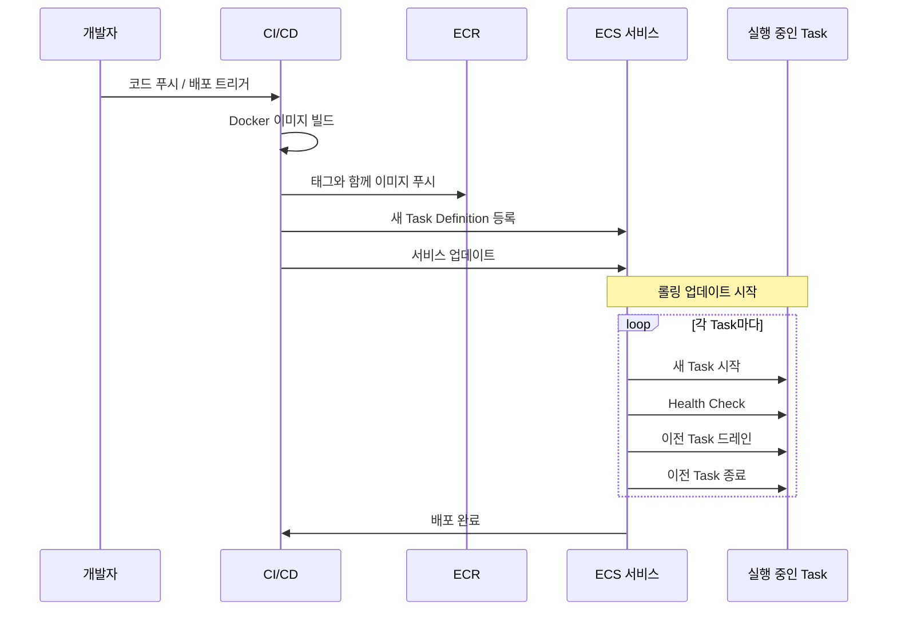
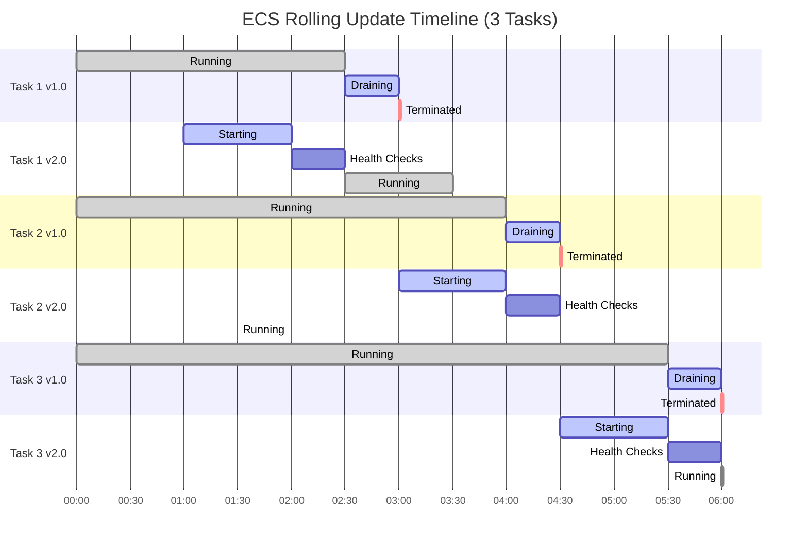
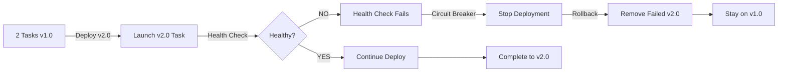
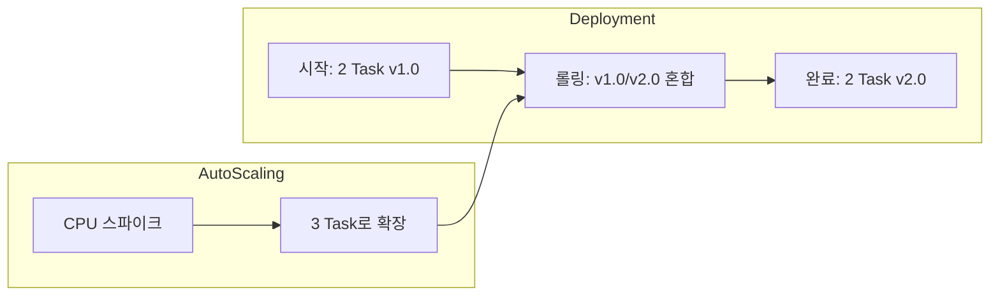
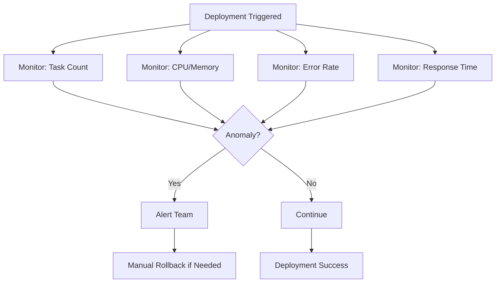
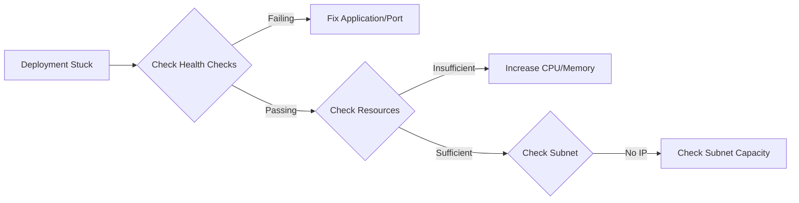

첫 ECS 배포에서 세 시간을 날렸어요. ECR에 이미지를 푸시하고, task definition을 업데이트했는데 서비스가 아무것도 안 하고 가만히 있더라고요. 알고 보니 ECS가 새 task definition revision을 만들긴 했는데, 서비스는 여전히 이전 revision을 가리키고 있었어요. `register-task-definition`과 `update-service`가 순서대로 실행해야 하는 별개의 단계라는 걸 아무도 안 알려줬어요. ECR/ECS 배포를 제대로 하기까지 겪은 많은 교훈 중 첫 번째였어요.

## 왜 중요한가

컨테이너화된 애플리케이션을 AWS에 배포하려면 여러 서비스를 조율해야 해요 -- 이미지 저장용 ECR, 오케스트레이션용 ECS, 컴퓨팅용 Fargate -- 여기에 인증 플로우, 이미지 태깅 전략, 배포 설정이 필요해요. 명확한 엔드투엔드 워크플로우가 없으면 배포가 에러 투성이가 돼요. 잘못된 저장소에 이미지가 푸시되고, task definition이 오래된 이미지를 참조하고, 롤링 업데이트가 다운타임을 일으키고, 실패한 배포에 자동 롤백이 없어요.

## 직접 겪으며 배운 것들

이것들 전부 프로덕션에서 저를 힘들게 했어요:

- **ECR 인증은 세션 기반이에요.** Docker 로그인 토큰이 12시간 뒤 만료돼요. CI/CD 파이프라인이 푸시 전에 토큰을 갱신하지 않으면 "no basic auth credentials"라는 암호 같은 에러와 함께 조용히 실패해요.
- **Task definition 버전 관리가 헷갈려요.** ECS는 `register-task-definition`을 호출할 때마다 새 revision을 만들지만, 서비스가 자동으로 최신 revision을 선택하지 않아요. 새 revision ARN으로 서비스를 명시적으로 업데이트해야 해요.
- **롤링 업데이트 퍼센트 계산이 직관적이지 않아요.** `minimum_healthy_percent`와 `maximum_percent`는 절대값이 아니라 `desired_count`에 대한 상대값이에요. 배포 중 실제 task 수는 세 값의 조합에 따라 달라져요.
- **Health check 타이밍 갭이 배포를 죽여요.** Health check grace period가 너무 짧으면, 아직 시작 중인 task를 ECS가 종료해요(특히 JVM이나 NestJS처럼 콜드 스타트가 느린 앱). 무한 배포 루프가 생겨요.
- **Circuit breaker가 기본으로 활성화되어 있지 않아요.** `deployment_circuit_breaker` 없이는 잘못된 이미지가 ECS가 실패하는 task를 끝없이 재시도하게 만들어요. 직접 개입할 때까지 Fargate 비용이 계속 나가요.

## 사용하면 좋을 때

Docker 컨테이너를 AWS에서 관리형 오케스트레이션으로 배포하거나, Kubernetes 복잡성 없이 AWS 네이티브 CI/CD를 원하거나, 무중단 롤링 배포가 필요하거나, 이미 Terraform으로 AWS 인프라를 관리하고 있을 때 적합해요.

단일 정적 사이트(S3 + CloudFront 사용), 멀티 클라우드 요구사항(Kubernetes 사용), 매우 짧은 배치 작업(Lambda 사용), 로컬 개발(Docker Compose 사용), 예산 제한이 있는 사이드 프로젝트(Docker가 설치된 t3.micro EC2가 더 저렴)에는 건너뛰세요.

## 아키텍처 개요

배포 파이프라인은 로컬 코드에서 Docker 빌드를 거쳐 AWS 서비스로 흘러가요:



## ECR: 이미지 저장소

ECR은 AWS의 관리형 Docker 컨테이너 레지스트리예요. Terraform으로 저장소를 만드는 것부터 시작해요:

```hcl
resource "aws_ecr_repository" "app" {
  name                 = "my-app"
  image_tag_mutability = "MUTABLE"

  image_scanning_configuration {
    scan_on_push = true  # 보안 스캐닝
  }
}
```

`scan_on_push`를 활성화하면 자동 취약점 스캐닝을 받을 수 있어요. OS 패키지의 알려진 CVE를 검사하고, 의존성 취약점을 스캔하고, AWS Console이나 API에서 결과를 확인할 수 있어요.

### Push 워크플로우

모든 푸시는 인증, 빌드, 태그, 푸시 네 단계를 따라요:

```bash
# 1. Docker를 ECR에 인증
aws ecr get-login-password --region ap-northeast-2 | \
  docker login --username AWS --password-stdin \
  ${ACCOUNT_ID}.dkr.ecr.ap-northeast-2.amazonaws.com

# 2. 이미지 빌드
docker build -t my-app .

# 3. ECR용 태그
docker tag my-app:latest \
  ${ACCOUNT_ID}.dkr.ecr.ap-northeast-2.amazonaws.com/my-app:latest

# 4. ECR에 푸시
docker push \
  ${ACCOUNT_ID}.dkr.ecr.ap-northeast-2.amazonaws.com/my-app:latest
```

인증 토큰이 12시간 뒤 만료된다는 걸 기억하세요. CI/CD에서는 항상 푸시 전에 갱신해야 해요.

## ECS 배포 흐름

코드 푸시부터 실행 중인 task까지의 전체 배포 순서예요:



### 수동 배포 단계

수동으로 배포해야 할 때(디버깅, 핫픽스) 이 세 명령어면 돼요:

```bash
# 1. 이미지 빌드 및 푸시 (위 참조)

# 2. 새 task definition 등록
aws ecs register-task-definition \
  --cli-input-json file://task-definition.json

# 3. 새 task definition으로 서비스 업데이트
aws ecs update-service \
  --cluster my-cluster \
  --service my-service \
  --task-definition my-task:NEW_REVISION \
  --force-new-deployment
```

핵심은 3단계가 선택이 아니라는 거예요. `update-service` 없이는 새 task definition이 존재해도 ECS가 이전 revision을 계속 실행해요.

## 롤링 업데이트

### 동작 방식

ECS가 task를 하나씩 교체해서 무중단을 보장해요. `desired_count = 2`일 때 일반적인 롤링 업데이트는 이렇게 생겼어요:

```text
Time     | Old v1.0 | New v2.0 | Total | Status
---------|----------|----------|-------|------------------
00:00    | 2        | 0        | 2     | Deploy starts
00:30    | 2        | 1        | 3     | New task starting
01:30    | 1        | 1        | 2     | First old removed
02:00    | 1        | 2        | 3     | Second new starting
03:00    | 0        | 2        | 2     | Complete
```

업데이트 중에 총 task 수가 `desired_count`를 초과하는 게 보이시죠. 이게 `maximum_percent` 설정이 하는 일이에요.

### 롤링 업데이트 프로세스 (3 Task)

Task가 3개인 경우 교체 과정을 시각화하면 이렇게 돼요:

```mermaid
graph TB
    subgraph "Rolling Deployment with 3 Tasks"
        A["Start: 3 Tasks v1.0"] -->|"New Deployment"| B["Launch Task #1 v2.0"]
        B -->|"Health Check Pass"| C["Drain Task #1 v1.0"]
        C -->|"Terminate Old"| D["Running: 2x v1.0, 1x v2.0"]
        D -->|"Continue"| E["Launch Task #2 v2.0"]
        E -->|"Health Check Pass"| F["Drain Task #2 v1.0"]
        F -->|"Terminate Old"| G["Running: 1x v1.0, 2x v2.0"]
        G -->|"Continue"| H["Launch Task #3 v2.0"]
        H -->|"Health Check Pass"| I["Drain Task #3 v1.0"]
        I -->|"Complete"| J["End: 3 Tasks v2.0"]
    end
```



### 롤링 업데이트 타임라인

각 task가 시작, health check, 드레인, 종료를 거치는 시간 흐름이에요:



### 각 Task 교체의 핵심 단계

1. **Starting** (60-90초) -- ECR에서 새 Docker 이미지 풀, 컨테이너 시작, 애플리케이션 초기화
2. **Health Checks** (30-60초) -- ALB health check 통과 필요, 설정된 포트에서 응답해야 하고, 여러 번 성공해야 함
3. **Draining** (30-300초) -- 이전 task에 새 요청 전송 중단, 기존 요청 완료 대기, graceful shutdown 기간
4. **Termination** -- 이전 task 완전 종료, 리소스 해제, 새 task 완전 가동

### 배포 설정

```hcl
resource "aws_ecs_service" "app" {
  name            = "my-service"
  cluster         = aws_ecs_cluster.main.id
  task_definition = aws_ecs_task_definition.app.arn
  desired_count   = 2

  # 배포 동작
  deployment_minimum_healthy_percent = 100  # desired 미만 불가
  deployment_maximum_percent         = 200  # 일시적으로 2배 가능

  # 자동 롤백을 위한 circuit breaker
  deployment_circuit_breaker {
    enable   = true
    rollback = true
  }
}
```

퍼센트 값은 `desired_count`에 대한 상대값이에요. `desired_count = 3`일 때:

- `minimum_healthy_percent = 100`은 항상 최소 3개 task 유지를 의미해요
- `maximum_percent = 200`은 배포 중 최대 6개 task까지 가능하다는 의미예요

### 전략 선택

| 전략   | Min % | Max % | 속도 | 위험도 | 사용 사례   |
| ------ | ----- | ----- | ---- | ------ | ----------- |
| 보수적 | 100   | 150   | 느림 | 낮음   | 프로덕션    |
| 균형   | 100   | 200   | 보통 | 낮음   | 대부분의 앱 |
| 공격적 | 50    | 200   | 빠름 | 보통   | 스테이징    |

프로덕션에는 균형 전략을 추천해요. 배포 전체에 걸쳐 풀 용량을 유지하면서 이전 task가 드레인되기 전에 새 task가 시작될 충분한 여유를 줘요.

### Circuit Breaker와 자동 롤백

Circuit breaker를 활성화하면 ECS가 실패한 배포를 감지해서 자동으로 마지막 안정 버전으로 롤백해요:



`deployment_circuit_breaker` 없이는 잘못된 이미지가 ECS가 실패하는 task를 끝없이 재시도하게 만들어요. 직접 개입할 때까지 Fargate 비용이 계속 나가요. 프로덕션 서비스에는 반드시 활성화하세요:

```hcl
deployment_circuit_breaker {
  enable   = true
  rollback = true
}
```

## Auto-Scaling과 배포

Auto-scaling은 배포 중에도 멈추지 않아요. 계속 동작하고, 그 상호작용을 이해해 두면 좋아요:



배포 중 auto-scaling이 활성화되어 있을 때의 핵심 동작:

- Auto-scaling이 배포 중 task를 추가하면 새 task는 최신 버전을 받아요
- Auto-scaling이 task를 제거하면 ECS가 이전 버전 task를 우선 제거해요
- 배포 완료 후에도 scale 상태가 유지돼요

### Auto-Scaling 상호작용 시나리오

| 시나리오             | 발생하는 일              | 결과                                       |
| -------------------- | ------------------------ | ------------------------------------------ |
| 배포 중 CPU 스파이크 | Auto-scaling이 task 추가 | 새로 추가된 task 포함 모두 배포 업데이트됨 |
| 배포 중 CPU 하락     | Auto-scaling이 task 제거 | 더 적은 task로 배포 계속 진행              |
| 배포 중 메모리 이슈  | Auto-scaling 트리거      | 신구 task 모두 스케일링 가능               |
| 배포 실패            | Task가 현재 버전에 유지  | Auto-scaling 정상 동작 계속                |

### 배포 중 CPU 스파이크 (2에서 3으로 확장)

```text
Time     | Old v1.0 | New v2.0 | Total | Event
---------|----------|----------|-------|------------------
00:00    | 2        | 0        | 2     | Deployment starts
00:30    | 2        | 1        | 3     | New task starting
01:00    | 2        | 1        | 3     | CPU SPIKE -- auto-scale triggered
01:30    | 2        | 2        | 4     | Scale-out adds v2.0 task
02:00    | 1        | 2        | 3     | Remove one old task
02:30    | 1        | 3        | 4     | Add final new task
03:00    | 0        | 3        | 3     | All tasks now v2.0
```

### Auto-Scaling 충돌 해결

Auto-scaling이 배포와 충돌하면 배포 중 일시적으로 스케일링을 중지할 수 있어요:

```bash
# 배포 중 auto-scaling 일시 중지
aws application-autoscaling register-scalable-target \
  --service-namespace ecs \
  --resource-id service/my-cluster/my-service \
  --scalable-dimension ecs:service:DesiredCount \
  --suspended-state \
    '{"DynamicScalingInSuspended": true, "DynamicScalingOutSuspended": true}'

# 배포 완료 후 다시 활성화
aws application-autoscaling register-scalable-target \
  --service-namespace ecs \
  --resource-id service/my-cluster/my-service \
  --scalable-dimension ecs:service:DesiredCount \
  --suspended-state \
    '{"DynamicScalingInSuspended": false, "DynamicScalingOutSuspended": false}'
```

## GitHub Actions 워크플로우

전체 파이프라인을 처리하는 프로덕션 수준의 GitHub Actions 워크플로우예요:

```yaml
name: Deploy to ECS

on:
  push:
    branches: [main]

jobs:
  deploy:
    runs-on: ubuntu-latest
    steps:
      - uses: actions/checkout@v4

      - name: Configure AWS credentials
        uses: aws-actions/configure-aws-credentials@v4
        with:
          aws-access-key-id: ${{ secrets.AWS_ACCESS_KEY_ID }}
          aws-secret-access-key: ${{ secrets.AWS_SECRET_ACCESS_KEY }}
          aws-region: ap-northeast-2

      - name: Login to ECR
        id: login-ecr
        uses: aws-actions/amazon-ecr-login@v2

      - name: Build and push image
        env:
          ECR_REGISTRY: ${{ steps.login-ecr.outputs.registry }}
          IMAGE_TAG: ${{ github.sha }}
        run: |
          docker build -t $ECR_REGISTRY/my-app:$IMAGE_TAG .
          docker push $ECR_REGISTRY/my-app:$IMAGE_TAG
          docker tag $ECR_REGISTRY/my-app:$IMAGE_TAG $ECR_REGISTRY/my-app:latest
          docker push $ECR_REGISTRY/my-app:latest

      - name: Update ECS task definition
        id: task-def
        uses: aws-actions/amazon-ecs-render-task-definition@v1
        with:
          task-definition: task-definition.json
          container-name: my-app
          image: ${{ steps.login-ecr.outputs.registry }}/my-app:${{ github.sha }}

      - name: Deploy to ECS
        uses: aws-actions/amazon-ecs-deploy-task-definition@v2
        with:
          task-definition: ${{ steps.task-def.outputs.task-definition }}
          service: my-service
          cluster: my-cluster
          wait-for-service-stability: true
```

`wait-for-service-stability: true` 플래그가 중요해요. 이거 없으면 워크플로우가 배포가 시작되자마자 성공으로 처리돼요. 배포가 끝났을 때가 아니라요. 배포가 실패하면 CI도 실패해야 해요.

## 모범 사례

### 이미지 태깅

추적성을 위해 여러 태그를 사용하세요:

```text
권장 태그:
- Git SHA: my-app:abc123def  (고유, 추적 가능)
- 환경: my-app:prod-latest  (현재 프로덕션)
- 시맨틱: my-app:v1.2.3  (릴리스)
```

Git SHA 태그가 가장 유용해요. 프로덕션에서 뭔가 깨졌을 때, 각 task에서 실행 중인 정확한 커밋을 추적할 수 있어요.

### ECR 수명 주기 정책

오래된 이미지가 빠르게 쌓여요. 수명 주기 정책을 설정해서 자동으로 정리하세요:

```json
{
  "rules": [
    {
      "rulePriority": 1,
      "description": "Keep last 30 images",
      "selection": {
        "tagStatus": "any",
        "countType": "imageCountMoreThan",
        "countNumber": 30
      },
      "action": {
        "type": "expire"
      }
    }
  ]
}
```

### Health Check

적절한 health check가 잘못된 배포가 서비스를 다운시키는 걸 막아요:

```hcl
resource "aws_lb_target_group" "app" {
  # ...
  health_check {
    path                = "/health"
    healthy_threshold   = 2
    unhealthy_threshold = 3
    timeout             = 5
    interval            = 30
    matcher             = "200"
  }
}
```

시작이 느린 애플리케이션에는 health check grace period를 넉넉하게 잡으세요. 부팅에 30초 걸리는 NestJS 앱은 최소 60초의 grace period가 필요해요. 그렇지 않으면 ECS가 시작이 끝나기 전에 task를 종료해요.

### Graceful Shutdown

롤링 업데이트 중 task를 종료하기 전에 ECS가 `SIGTERM`을 보내요. 애플리케이션이 이 시그널을 처리해야 진행 중인 요청을 드롭하지 않아요:

```javascript
// Graceful shutdown 처리 (Node.js)
process.on("SIGTERM", async () => {
  console.log("SIGTERM received, starting graceful shutdown");

  // 새 요청 수신 중단
  server.close(() => {
    console.log("HTTP server closed");
  });

  // 데이터베이스 연결 종료
  await database.close();

  // 진행 중인 요청 완료 대기 (최대 30초)
  setTimeout(() => {
    process.exit(0);
  }, 30000);
});

// Health check 엔드포인트 (배포 추적을 위해 버전 포함)
app.get("/health", (req, res) => {
  res.status(200).json({
    status: "healthy",
    version: process.env.APP_VERSION,
  });
});
```

### 배포 모니터링

롤링 업데이트 중에 이상 징후를 조기에 감지하려면 이 시그널들을 모니터링하세요:



```bash
# 배포 진행 상황 실시간 확인
watch -n 5 'aws ecs describe-services \
  --cluster my-cluster \
  --services my-service \
  --query "services[0].deployments"'

# 최근 배포 이벤트 확인
aws ecs describe-services \
  --cluster my-cluster \
  --services my-service \
  --query 'services[0].events[0:5]'
```

## 트러블슈팅

### 배포가 멈췄을 때

배포가 멈추면 이 두 가지부터 확인하세요:

```bash
# Task 중지 이유 확인
aws ecs describe-tasks \
  --cluster my-cluster \
  --tasks $(aws ecs list-tasks --cluster my-cluster --query 'taskArns[0]' --output text) \
  --query 'tasks[0].stoppedReason'

# 서비스 이벤트 확인
aws ecs describe-services \
  --cluster my-cluster \
  --services my-service \
  --query 'services[0].events[:5]'
```

### 자주 발생하는 문제

| 문제                   | 원인                   | 해결 방법                           |
| ---------------------- | ---------------------- | ----------------------------------- |
| Task health check 실패 | 앱이 아직 준비 안 됨   | Health check grace period 늘리기    |
| 메모리 부족            | 컨테이너에 더 많은 RAM | Task 메모리 늘리기                  |
| IP 없음                | 서브넷 가득 참         | 더 큰 서브넷이나 멀티 AZ 사용       |
| 이미지 풀 실패         | ECR 인증 만료          | ECR 토큰 갱신                       |
| 느린 배포              | 보수적인 min/max %     | max % 올리거나 min % 내리기         |
| 자동 롤백 없음         | Circuit breaker 미설정 | `deployment_circuit_breaker` 활성화 |
| Auto-scaling 충돌      | 스케일링이 배포와 충돌 | 배포 중 auto-scaling 일시 중지      |

### 배포 멈춤 의사결정 트리

배포가 멈췄을 때 빠르게 원인을 파악하는 흐름이에요:



## 실전 정리

ECR/ECS 배포 워크플로우는 움직이는 부분이 많지만, 핵심 루프는 단순해요: 인증, 이미지 푸시, task definition 등록, 서비스 업데이트. 나머지 -- 롤링 업데이트, circuit breaker, 수명 주기 정책 -- 는 그 핵심 루프를 감싸는 안전망이에요.

Circuit breaker는 첫날부터 활성화하세요. 비용이 들지 않고 실패하는 배포에 Fargate 비용이 나가는 걸 막아줘요. 그리고 이미지에는 항상 Git SHA 태그를 사용하세요 -- 새벽 2시에 뭔가 깨졌을 때, 어떤 커밋이 실행 중인지 정확히 알고 싶을 거예요.

## 참고 자료

- [ECS 배포 유형](https://docs.aws.amazon.com/AmazonECS/latest/developerguide/deployment-types.html)
- [ECR 수명 주기 정책](https://docs.aws.amazon.com/AmazonECR/latest/userguide/LifecyclePolicies.html)
- [ECS Service Auto Scaling](https://docs.aws.amazon.com/AmazonECS/latest/developerguide/service-auto-scaling.html)
- [ECS Deployment Circuit Breaker](https://docs.aws.amazon.com/AmazonECS/latest/developerguide/deployment-circuit-breaker.html)
