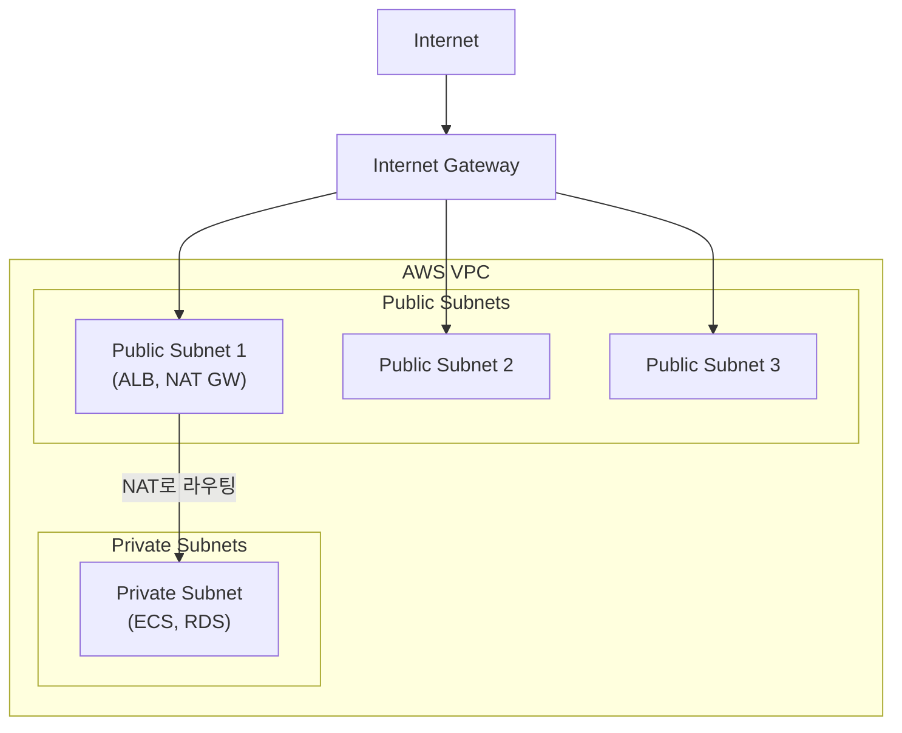
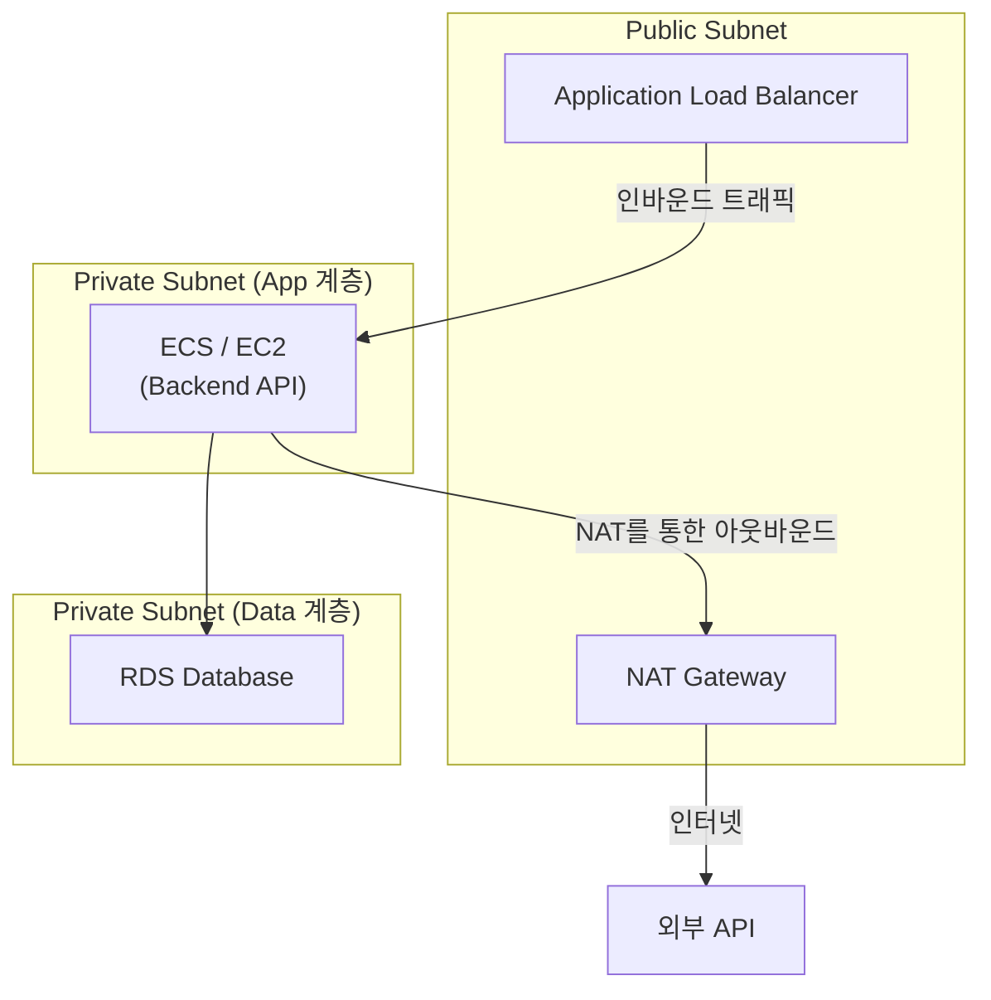

## 아키텍처 개요



## NAT Gateway 배치

### 올바른 설정

NAT Gateway는 **반드시 public subnet에 위치해야 해요**:

```hcl
resource "aws_nat_gateway" "ngw" {
  # ✅ 올바름: public subnet에 NAT Gateway 배치
  subnet_id     = aws_subnet.public.id
  allocation_id = aws_eip.nat.id
  depends_on    = [aws_internet_gateway.igw]
}
```

### 잘못된 설정

```hcl
resource "aws_nat_gateway" "ngw" {
  # ❌ 잘못됨: private subnet에 NAT Gateway
  subnet_id     = aws_subnet.private.id  # IGW에 도달 불가
}
```

## 배치가 중요한 이유

| 배치 위치      | 인터넷 접근 | 참고                           |
| -------------- | ----------- | ------------------------------ |
| Public subnet  | 가능        | Internet Gateway로 라우팅 가능 |
| Private subnet | 불가        | Internet Gateway로의 경로 없음 |

## 네트워크 흐름

### Public Subnet 리소스

```text
EC2/ECS → Route Table → Internet Gateway → Internet
```

### Private Subnet 리소스

```text
EC2/ECS → Route Table → NAT Gateway → Internet Gateway → Internet
```

## Route Table 설정

### Public Subnet Route Table

```hcl
route {
  cidr_block = "0.0.0.0/0"
  gateway_id = aws_internet_gateway.igw.id
}
```

### Private Subnet Route Table

```hcl
route {
  cidr_block     = "0.0.0.0/0"
  nat_gateway_id = aws_nat_gateway.ngw.id
}
```

## NAT Gateway 없이 무엇이 깨지나

Private subnet 리소스에서:

- `apt-get update` 실패
- 외부 API 호출 실패
- Docker 이미지 pull 실패
- AWS 서비스 API 호출 실패(S3, DynamoDB)

## 권장 아키텍처

| 계층    | Subnet 타입 | 리소스           |
| ------- | ----------- | ---------------- |
| Public  | Public      | ALB, NAT Gateway |
| Private | Private     | ECS/EC2, Lambda  |
| Data    | Private     | RDS, ElastiCache |

## 보안 시사점

| 설정                       | 위험                           |
| -------------------------- | ------------------------------ |
| RDS를 public subnet에 배치 | 데이터베이스가 인터넷에 노출됨 |
| Security group 0.0.0.0/0   | 모든 IP에 개방됨               |
| 모든 리소스를 public으로   | 네트워크 분리 없음             |

## NAT 변환 작동 방식

NAT Gateway는 네 단계로 IP 주소를 변환해요:

1. Private subnet 리소스가 인터넷으로 패킷을 전송해요
2. NAT Gateway가 패킷을 받아서 소스 IP를 자체 Elastic IP 주소로 교체해요
3. 변환된 패킷이 Internet Gateway를 통해 인터넷으로 라우팅돼요
4. 응답이 돌아오면, NAT Gateway가 목적지 주소를 원래 private IP로 다시 변환해서 전달해요

이건 단방향 시작만 가능해요. 인터넷에서 NAT Gateway를 통해 private 리소스로 인바운드 연결을 시작할 수 없어요.

## NAT Gateway vs NAT Instance

| 항목              | NAT Gateway                         | NAT Instance               |
| ----------------- | ----------------------------------- | -------------------------- |
| 관리              | AWS가 완전 관리                     | 사용자가 EC2 인스턴스 관리 |
| 가용성            | 단일 AZ 내 이중화                   | 단일 장애점                |
| 대역폭            | 5 Gbps 기본, 100 Gbps까지 자동 확장 | 인스턴스 타입에 따라 다름  |
| 유지보수          | AWS가 패치 담당                     | 사용자가 OS 패치           |
| 비용(낮은 트래픽) | 높음(시간당 + GB당)                 | 낮음(작은 인스턴스)        |
| 비용(높은 트래픽) | 예측 가능                           | 가변적, 더 저렴할 수 있음  |
| Security groups   | 미지원(NACL 사용)                   | 지원                       |
| Bastion 겸용      | 불가                                | Bastion host로 겸용 가능   |
| Port forwarding   | 미지원                              | 지원                       |
| Scaling           | 자동                                | 수동 리사이즈 필요         |

**NAT Instance를 선택할 때:** 비용이 가장 중요하고 EC2 인스턴스 관리 부담을 감수할 수 있는 소규모/취미 프로젝트.

**NAT Gateway를 선택할 때:** 가용성, 확장성, 운영 부담 감소가 비용을 정당화하는 프로덕션 워크로드.

## 비용 분석

NAT Gateway 비용은 세 가지로 구성돼요:

| 항목        | 비용(us-east-1) | 참고                                     |
| ----------- | --------------- | ---------------------------------------- |
| 시간당 요금 | ~$0.045/시간    | 트래픽과 무관하게 ~$32.40/월             |
| 데이터 처리 | ~$0.045/GB      | 게이트웨이를 통과하는 모든 트래픽에 적용 |
| Elastic IP  | 연결 중 무료    | EIP가 미연결 상태일 때만 과금            |

**월 비용 추정(예시):**

- 기본: $0.045 x 730시간 = **$32.85**
- 데이터: $0.045 x 100 GB = **$4.50**
- 합계: 아웃바운드 트래픽 100 GB 기준 **~$37.35/월**

비용은 데이터 볼륨에 비례해서 증가해요. 높은 처리량의 워크로드에서는 AWS 서비스용 VPC endpoint(S3, DynamoDB)를 고려하면 NAT Gateway를 완전히 우회해서 비용과 지연시간 모두 줄일 수 있어요.

## 관리 고려사항

- **고가용성:** NAT Gateway는 단일 AZ 내에서 이중화돼요. Multi-AZ 복원력을 위해 AZ당 NAT Gateway 하나씩 배포하고 각 private subnet이 로컬 NAT Gateway를 통해 라우팅하도록 설정하세요.
- **대역폭:** 5 Gbps에서 시작해서 100 Gbps까지 자동 확장돼요. 수동 개입이 필요 없어요.
- **모니터링:** CloudWatch 메트릭에 `BytesOutToDestination`, `BytesOutToSource`, `PacketsDropCount`, `ErrorPortAllocation`이 포함돼요.
- **Security groups 미지원:** NAT Gateway는 security groups를 지원하지 않아요. Subnet 레벨의 Network ACL로 트래픽을 제어하세요.

## 활용 사례

### 3계층 웹 아키텍처



### 일반적인 시나리오

- **데이터베이스 서버** -- 인터넷에 직접 노출되지 않지만 보안 패치 다운로드가 필요해요
- **Backend API 서버** -- 인터넷에서 직접 접근할 수 없으면서 외부 API(결제 게이트웨이, 서드파티 서비스)를 호출해야 해요
- **배치 처리** -- 처리 후 결과를 외부 스토리지에 업로드해요
- **컨테이너 pull** -- Private subnet의 ECS Fargate 태스크가 퍼블릭 레지스트리에서 Docker 이미지를 pull해요
