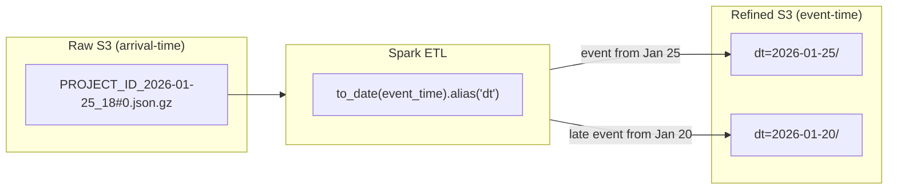
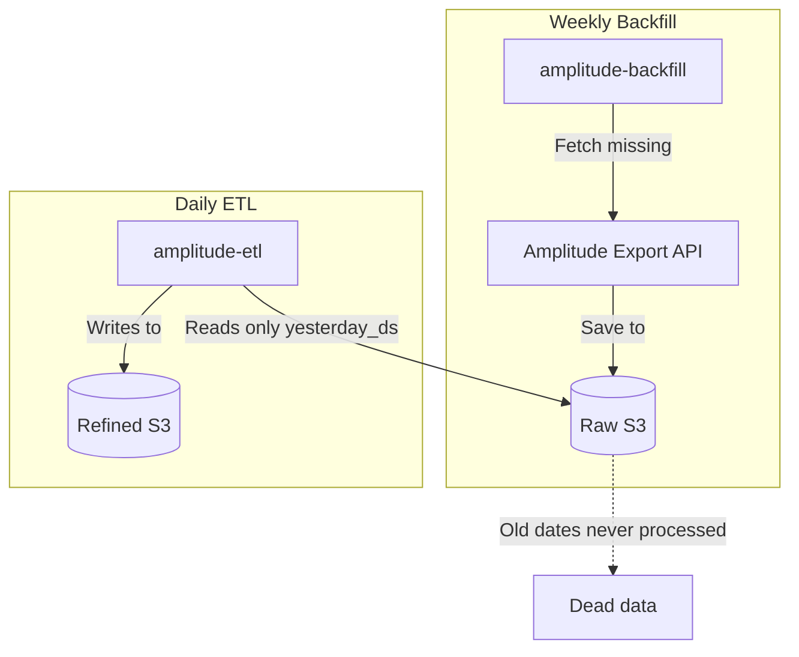

analytics 대시보드에서 월요일마다 이벤트가 10% 감소하고, 화요일에 대응하는
스파이크가 나타나는 걸 보고 있었어요. 이벤트가 사라진 게 아니라, 잘못된
날짜에 들어가고 있었어요. ETL이 event time이 아니라 arrival time으로
파티셔닝하고 있었거든요.

Amplitude Export API 데이터를 data lake에 수집할 때, raw 파일은 export
API가 반환한 시간 기준으로 정리돼요. 하지만 그 파일 안의 이벤트는 더 이른
날짜에 속할 수 있어요. 모바일 사용자가 오프라인이 되고, SDK가 업로드를
배치 처리하고, 네트워크 재시도가 전송을 지연시켜요. refined 파티션 키가
파일명의 arrival timestamp라면, 늦게 도착하는 이벤트는 잘못된 날짜에
나타나고, 모든 downstream 쿼리가 그 오류를 상속받아요.

## 두 가지 타임스탬프 이해하기

혼란은 raw 파일 이름에서 시작돼요.
`{PROJECT_ID}_2026-01-25_18#0.json.gz`라는 파일은 1월 25일 오후 6시
이벤트를 포함하는 것처럼 보여요. 그렇지 않아요. 그 시간에 _export된_
이벤트를 포함하는 거예요. 실제 이벤트는 며칠에 걸쳐 있을 수 있어요.

핵심 구분은 이거예요:

- **Arrival time** (파일명 날짜): Amplitude가 파일을 export한 시간
- **Event time** (`event_time` 필드): 사용자 기기에서 이벤트가 발생한 시간

모바일 SDK에서는 늦게 도착하는 데이터가 흔해요. 오프라인 사용자, 배치
업로드, 네트워크 재시도로 인해 이벤트의 5-10%가 발생 후 수 시간에서 수일
뒤에 도착해요.

## 검토한 옵션들

| 옵션                                   | 장점                               | 단점                                                         |
| -------------------------------------- | ---------------------------------- | ------------------------------------------------------------ |
| Arrival time(파일명 날짜)으로 파티셔닝 | 파싱 불필요                        | 늦은 이벤트가 잘못된 날짜에 위치; analytics 부정확           |
| event_time으로 파티셔닝 (선택됨)       | 정확한 날짜 배치; 늦은 데이터 처리 | event payload 파싱 필요; append mode에 downstream dedup 필요 |
| 둘 다로 파티셔닝 (dual write)          | 두 가지 접근 패턴 지원             | 이중 스토리지 비용; 두 파티션 스킴 유지 복잡성               |

arrival time으로 파티셔닝하는 게 가장 간단한 접근이에요 -- 파일명에서
날짜를 사용하고 event payload를 파싱하지 않아도 되니까요. 하지만
analytical 쿼리는 거의 항상 "이벤트가 언제 발생했는지"로 필터링하지, "파일을
언제 받았는지"로 필터링하지 않아요. 이벤트의 5-10%가 지속적으로 잘못
배치되면, 이 데이터 위에 만들어진 모든 대시보드가 잘못된 트렌드를 보여줘요.

dual-write는 raw 디버깅과 깨끗한 analytics를 모두 지원하기 위해
고려했어요. 이중 스토리지 비용은 수용할 수 있었지만, DAG에서 두 파티션
스킴을 유지하는 복잡성이 arrival time으로 쿼리하는 빈도가 얼마나 낮은지를
고려하면 정당화되지 않았어요.

## 해결책: Event Time으로 파티셔닝

ETL은 event payload에서 `event_time`의 날짜를 추출하고 그걸 파티션 키로
사용해요:

```python
# Extracts date from event_time, NOT from filename
to_date(col("event_time")).alias("dt"),
```

이 한 줄이 정확한 analytics와 부정확한 analytics의 차이예요. 늦게 도착하는
이벤트는 export된 날이 아니라 발생한 날의 파티션에 배치돼요.

write는 `mode("append")`와 `partitionBy`를 사용해요:

```python
def write_to_s3(df, output_path, partition_cols=["dt"]):
    df.write.mode("append").partitionBy(*partition_cols).parquet(output_path)
```

`mode("append")`는 늦게 도착하는 데이터를 기존 파티션에 추가할 수 있게
해요. Spark는 각 파티션 디렉토리 안에 `part-*.parquet` 파일을 생성해요.
트레이드오프는 ETL을 다시 실행하면 파티션에 중복 파일이 생성되므로,
downstream 쿼리에서 deduplication이 필요하다는 거예요.

## 흐름 작동 방식



하나의 raw 파일이 여러 refined 파티션에 이벤트를 생성할 수 있어요. 1월
25일의 export 파일이 1월 20일에 발생한 이벤트를 포함할 수 있어요(5일
늦은 도착). ETL은 각 이벤트를 발생 시간 기준으로 올바른 파티션에
라우팅해요.

## Backfill 갭

파이프라인에 알려진 갭이 있어요: weekly backfill job이 누락된 raw 파일을
가져오지만 refine하지는 않아요.



daily ETL은 `yesterday_ds`(어제 날짜)만 처리해요. 더 오래된 날짜의
backfill 데이터는 refined로 가는 경로 없이 raw 버킷에 머물러요. 세 가지
잠재적 해결책이 있어요:

1. Backfill job이 ETL transformation도 실행
2. Backfill이 영향받는 날짜에 대한 re-processing DAG를 트리거
3. refined에서 누락된 raw 파일을 처리하는 별도 "catchup ETL" DAG

## DAG-Job 변수 불일치

디버깅 중 발견한 또 다른 문제: DAG가 환경 변수를 전달하지만 Spark job이
무시해요.

| 변수            | DAG에서 전달 | Job에서 사용      |
| --------------- | ------------ | ----------------- |
| `SOURCE_PATH`   | 예           | 아니오 (하드코딩) |
| `TARGET_PATH`   | 예           | 아니오 (하드코딩) |
| `MANIFEST_PATH` | 예           | 아니오 (하드코딩) |

해결은 간단해요 -- `amplitude_backfill.py`를 상수 대신 `os.getenv()`에서
읽도록 업데이트하면 돼요. 그때까지는 DAG 설정에서 경로를 변경해도 효과가
없어서, 테스트와 디버깅이 불안정해요.

## 수동 테스트

```bash
# Test ETL for specific date
python cli.py amplitude-etl \
  --execution-date 2026-01-26 \
  --source-path "s3://amplitude-raw-bucket/{PROJECT_ID}/" \
  --target-path "s3://amplitude-refined-bucket/event/"

# Test backfill for date range
python cli.py amplitude-backfill \
  --start-date 2026-01-20 \
  --end-date 2026-01-26
```

## 이 패턴을 사용할 때

이 접근 방식은 Amplitude Export API 데이터를 파티셔닝된 data lake(S3,
GCS, HDFS)에 수집하는 모든 ETL 파이프라인에 적용돼요. 특히 늦게 도착하는
이벤트가 정확한 analytics를 위해 올바른 날짜 파티션에 들어가야 할 때,
그리고 raw Amplitude export 위에 Spark 기반 transformation job을 구축할
때 중요해요.

## 사용하지 않아도 되는 경우

- **실시간 스트리밍** -- Amplitude의 실시간 이벤트 스트리밍(webhook이나
  Kafka)을 사용한다면, 이벤트가 타임스탬프가 이미 첨부된 채로 개별적으로
  도착해요. 파일 수준 파티셔닝 로직은 적용되지 않아요.
- **소규모 analytics** -- Amplitude 데이터가 단일 쿼리에 맞는 규모(일
  100만 이벤트 미만)라면, CSV로 내보내거나 Dashboard API를 사용하는 게
  ETL 파이프라인을 구축하는 것보다 간단해요.
- **Amplitude 외 소스** -- nested ZIP+GZIP 형식과 파일 명명 규칙은
  Amplitude 고유해요. 다른 이벤트 플랫폼은 다른 export 형식을 사용해요.

## 핵심 요약

arrival time이 아닌 `event_time`으로 파티셔닝하세요. raw 버킷의 파일
이름은 Amplitude가 데이터를 export한 시간이지, 이벤트가 발생한 시간이
아니에요. 이걸 잘못 처리하면 이벤트의 5-10%가 조용히 잘못된 날짜로
이동하고, 모든 downstream 대시보드가 그 오류를 상속받아요.
