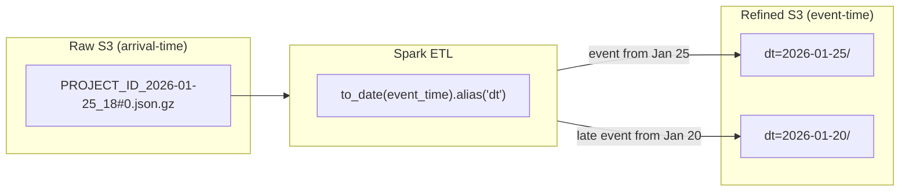
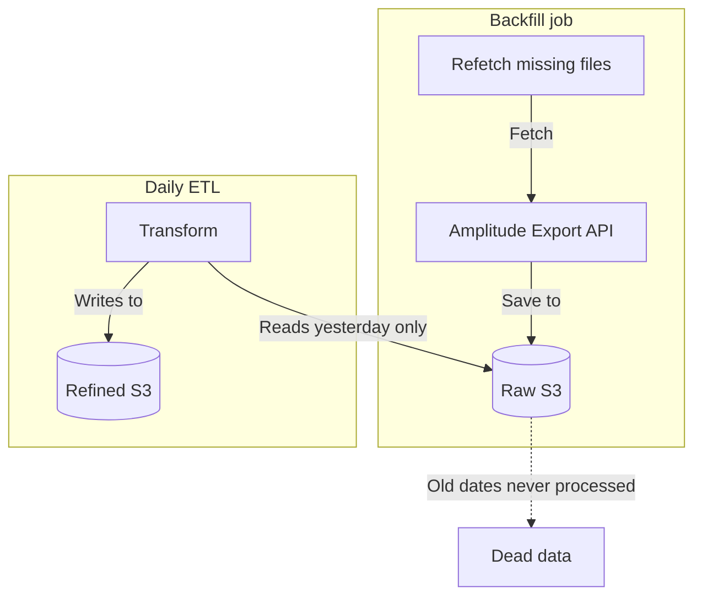

Amplitude Export API가 주는 파일 이름은 날짜처럼 보여요.
`{PROJECT_ID}_2026-01-25_18#0.json.gz`라는 파일은 "1월 25일 오후 6시
이벤트"처럼 읽히죠. 아니에요. 그 시간은 Amplitude가 파일을 _export한_
시간이고, 안에 들어 있는 이벤트는 며칠 더 오래된 것일 수 있어요.

Amplitude ETL 파이프라인의 파티셔닝 로직을 들여다봤는데, 이 구분 하나가
refined 레이어가 정확한지 조용히 틀리는지를 가르더라고요.

Amplitude Export API 데이터를 data lake에 수집할 때, raw 파일은 export
API가 반환한 시간 기준으로 정리돼요. 하지만 그 파일 안의 이벤트는 더 이른
날짜에 속할 수 있어요. 모바일 사용자가 오프라인이 되고, SDK가 업로드를
배치 처리하고, 네트워크 재시도가 전송을 지연시켜요. refined 파티션 키가
파일명의 arrival timestamp라면, 늦게 도착하는 이벤트는 잘못된 날짜에
나타나고, 모든 downstream 쿼리가 그 오류를 상속받아요.

## 두 가지 타임스탬프 이해하기

핵심 구분은 이거예요:

- **Arrival time** (파일명 날짜): Amplitude가 파일을 export한 시간
- **Event time** (`event_time` 필드): 사용자 기기에서 이벤트가 발생한 시간

모바일 SDK에서는 늦게 도착하는 데이터가 흔해요. 오프라인 사용자, 배치
업로드, 네트워크 재시도로 인해 상당수의 이벤트가 발생 후 수 시간에서 수일
뒤에 도착해요.

## 검토한 옵션들

| 옵션                                   | 장점                               | 단점                                                         |
| -------------------------------------- | ---------------------------------- | ------------------------------------------------------------ |
| Arrival time(파일명 날짜)으로 파티셔닝 | 파싱 불필요                        | 늦은 이벤트가 잘못된 날짜에 위치; analytics 부정확           |
| event_time으로 파티셔닝 (선택됨)       | 정확한 날짜 배치; 늦은 데이터 처리 | event payload 파싱 필요; append mode에 downstream dedup 필요 |
| 둘 다로 파티셔닝 (dual write)          | 두 가지 접근 패턴 지원             | 이중 스토리지 비용; 두 파티션 스킴 유지 복잡성               |

arrival time으로 파티셔닝하는 게 가장 간단한 접근이에요 -- 파일명에서
날짜를 사용하고 event payload를 파싱하지 않아도 되니까요. 하지만
analytical 쿼리는 거의 항상 "이벤트가 언제 발생했는지"로 필터링하지, "파일을
언제 받았는지"로 필터링하지 않아요. 제가 본 파이프라인에서는 자기 event
date보다 늦게 도착하는 이벤트 비율이 5-10% 정도였어요. 일 단위 비즈니스
지표를 움직이기에 충분한 수치라서, arrival time 파티셔닝은 선택지가 되지
못했어요.

dual-write는 raw 디버깅과 깨끗한 analytics를 모두 지원하기 위해
고려했어요. 이중 스토리지 비용은 수용할 수 있었지만, 두 파티션 스킴을
유지하는 복잡성이 arrival time으로 쿼리하는 빈도가 얼마나 낮은지를
고려하면 정당화되지 않았어요.

## 해결책: Event Time으로 파티셔닝

ETL은 event payload에서 `event_time`의 날짜를 추출하고 그걸 파티션 키로
사용해요:

```python
# Extracts date from event_time, NOT from filename
to_date(col("event_time")).alias("dt"),
```

이 한 줄이 정확한 analytics와 부정확한 analytics의 차이예요. 늦게 도착하는
이벤트는 export된 날이 아니라 발생한 날의 파티션에 배치돼요.

write는 `mode("append")`와 `partitionBy`를 사용해요:

```python
def write_to_s3(df, output_path, partition_cols=["dt"]):
    df.write.mode("append").partitionBy(*partition_cols).parquet(output_path)
```

`mode("append")`는 늦게 도착하는 데이터를 기존 파티션에 추가할 수 있게
해요. Spark는 각 파티션 디렉토리 안에 `part-*.parquet` 파일을 생성해요.
트레이드오프는 ETL을 다시 실행하면 파티션에 중복 파일이 생성되므로,
downstream 쿼리에서 deduplication이 필요하다는 거예요.

## 흐름 작동 방식



하나의 raw 파일이 여러 refined 파티션에 이벤트를 생성할 수 있어요. 1월
25일의 export 파일이 1월 20일에 발생한 이벤트를 포함할 수 있어요(5일
늦은 도착). ETL은 각 이벤트를 발생 시간 기준으로 올바른 파티션에
라우팅해요.

## 직접 확인해 보기

이 동작은 순수 PySpark로 로컬에서 재현할 수 있어요. 늦게 도착한 이벤트가
섞인 배치 하나를 event date 기준으로 써보면 돼요:

```python
from pyspark.sql import SparkSession
from pyspark.sql.functions import col, to_date

spark = SparkSession.builder.appName("event-time-partitioning").getOrCreate()

# One "arrival batch": both rows showed up in the same export file
events = spark.createDataFrame(
    [
        ("a1", "2026-01-25T09:12:00"),
        ("a2", "2026-01-20T22:40:00"),  # five days late
    ],
    ["event_id", "event_time"],
)

(
    events.withColumn("dt", to_date(col("event_time")))
    .write.mode("append")
    .partitionBy("dt")
    .parquet("/tmp/refined/events")
)
```

출력 디렉토리에 `dt=2026-01-25/`와 `dt=2026-01-20/`가 생겨요. 늦게 도착한
이벤트가 배치가 도착한 날이 아니라 실제로 발생한 날 아래에 들어가요.
파일명 날짜로 파티셔닝하면 두 행 모두 `dt=2026-01-25/` 하나로 뭉쳐요.

## Backfill 갭

설계할 때 미리 막아둘 만한 실패 모드가 하나 있어요. 누락된 raw 파일만
다시 가져오는 backfill은 그 자체로 refined 데이터를 만들지 않아요. Export
API에서 파일을 raw 스토리지로 되가져오고 거기서 끝나거든요.



daily ETL이 하루치 날짜(어제)만 처리하도록 되어 있으면, 더 오래된 raw
파일은 영영 다시 읽히지 않아요. backfill한 데이터가 refined로 가는 경로
없이 raw에 남아요. 에러는 나지 않아요. 누군가 오래된 파티션을 조회하고
데이터가 비어 있는 걸 발견할 때에야 드러나는 구멍이 생길 뿐이에요.

backfill에는 항상 catch-up transform을 짝지어 주세요. 세 가지 방법이
있어요:

1. Backfill job이 transformation도 직접 실행
2. Backfill이 영향받는 날짜에 대한 re-processing job을 트리거
3. raw와 refined를 비교해 차이만 처리하는 별도 catch-up job 실행

## Job까지 닿지 않는 설정

또 다른 함정은 더 조용해요. 오케스트레이터가 Spark job에 경로를 환경
변수로 넘기는데, 정작 job은 모듈 레벨 상수를 읽는 경우예요:

```python
# The scheduler sets SOURCE_PATH in the job's environment.
# The job never looks at it.
SOURCE_PATH = "s3://example-raw-bucket/events/"
```

에러는 안 나요. 변수는 설정되고, job은 실행되고, 상수가 이겨요. test
경로를 가리켰다고 생각하지만 실제로는 소스에 박혀 있는 경로 -- production
경로까지 포함해서 -- 를 그대로 읽고 쓰고 있어요.

상수를 fallback으로 두고 `os.getenv()`로 읽으면 기본값은 유지하면서
override가 실제로 먹혀요:

```python
import os

SOURCE_PATH = os.getenv("SOURCE_PATH", "s3://example-raw-bucket/events/")
```

두 줄짜리 변경이지만, 진짜로 격리된 테스트와 격리된 것처럼 보이기만 하는
테스트를 가르는 차이예요.

## 이 패턴을 사용할 때

이 접근 방식은 Amplitude Export API 데이터를 파티셔닝된 data lake(S3,
GCS, HDFS)에 수집하는 모든 ETL 파이프라인에 적용돼요. 특히 늦게 도착하는
이벤트가 정확한 analytics를 위해 올바른 날짜 파티션에 들어가야 할 때,
그리고 raw Amplitude export 위에 Spark 기반 transformation job을 구축할
때 중요해요.

## 사용하지 않아도 되는 경우

- **실시간 스트리밍** -- Amplitude의 실시간 이벤트 스트리밍(webhook이나
  Kafka)을 사용한다면, 이벤트가 타임스탬프가 이미 첨부된 채로 개별적으로
  도착해요. 파일 수준 파티셔닝 로직은 적용되지 않아요.
- **소규모 analytics** -- Amplitude 데이터가 단일 쿼리에 맞는 규모(일
  100만 이벤트 미만)라면, CSV로 내보내거나 Dashboard API를 사용하는 게
  ETL 파이프라인을 구축하는 것보다 간단해요.
- **Amplitude 외 소스** -- nested ZIP+GZIP 형식과 파일 명명 규칙은
  Amplitude 고유해요. 다른 이벤트 플랫폼은 다른 export 형식을 사용해요.

## 핵심 요약

arrival time이 아닌 `event_time`으로 파티셔닝하세요. raw 버킷의 파일
이름은 Amplitude가 데이터를 export한 시간이지, 이벤트가 발생한 시간이
아니에요. 이걸 잘못 처리하면 늦게 도착한 이벤트가 조용히 잘못된 날짜로
이동하고, 모든 downstream 대시보드가 그 오류를 상속받아요.
