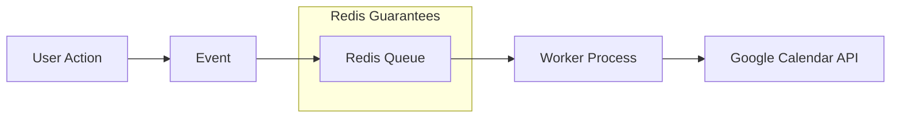

Google Calendar API를 호출하는 백그라운드 작업이 있었어요. 서버가 요청 중간에
크래시되자 작업이 사라졌어요. 재시도도, 로그도, 흔적도 없었죠. 사용자의
캘린더는 업데이트되지 않았고, 며칠 후 사용자가 신고할 때까지 저희는 전혀
몰랐어요.

Node.js 애플리케이션의 백그라운드 작업들 -- API 호출, 동기화 작업, 알림 --
은 프로세스 내 실행으로는 제공할 수 없는 안정성 보장이 필요해요. 서버가 작업
도중에 크래시하면 작업은 사라져요. 외부 API가 rate limit을 걸면 기본 재시도
메커니즘이 없어요. 트래픽이 급증하면 시스템이 부하를 흡수하고 분산할 방법이
없죠. 바로 여기서 Redis 기반 작업 큐가 필요해져요.

## 단순한 접근법의 한계

첫 번째 본능은 API를 직접 호출하고 최선을 바라는 거예요:

```typescript
// BAD: Run and forget
async function handleBlockUpdate(block) {
  try {
    await googleCalendarAPI.update(block);
  } catch (error) {
    console.error(error); // Lost forever
  }
}
```

프로덕션에서 심각한 문제가 있어요: 서버 크래시 시 유실, 재시도 메커니즘 없음,
rate limiting 없음, 중복 제거 없음, 모니터링 없음, 버스트 트래픽 처리 불가.

큐 기반 접근법과 비교하면:

```typescript
// GOOD: Production-grade
await queue.add(
  "update-calendar",
  {
    blockId: block.id,
    snapshot: extractSnapshot(block),
    intent: "update",
  },
  {
    jobId: `block-${block.id}-update`, // Deduplication
    attempts: 3, // Auto-retry
    backoff: { type: "exponential" }, // Smart delays
    priority: urgent ? 1 : 10, // Priority queue
  },
);
```

차이가 극명해요. 모든 작업이 영속화되고, 실패 시 재시도되며, 관찰 가능해요.

## Redis는 캐시가 아니에요

이것이 저의 첫 번째 멘탈 모델 전환이었어요. Redis는 흔히 "캐시"로 가르치지만,
실제로는 조정 시스템(coordination system) 역할을 하는 인메모리 데이터 구조
저장소예요. 영속적이고 (재시작해도 살아남고), 명령어 처리가 단일 스레드라서
원자성이 보장되고, 단일 코어에서 초당 100,000+ 연산을 처리해요.

Redis는 작업 큐에서 네 가지 핵심 문제를 해결해요:

**영속성과 안정성** -- 작업은 Redis에 저장되어 앱 크래시에서도 살아남아요:

```javascript
// Job stored in Redis:
{
  id: "job-123",
  data: { blockId: 456, intent: "update" },
  attempts: 1,
  status: "active"
}
// Survives app crashes, will be retried on restart
```

**분산 조정** -- 원자적 연산으로 정확히 하나의 worker만 각 작업을 가져가요:

```javascript
// Atomic operation (BRPOPLPUSH):
// 1. Remove job from waiting list
// 2. Add to processing list
// 3. Return to exactly ONE worker
// All in single atomic operation - no race conditions
```

**Rate Limiting** -- 외부 API 과부하 방지:

```javascript
new Worker("calendar-queue", processor, {
  limiter: {
    max: 100, // Max 100 jobs
    duration: 60000, // Per minute
  },
});
```

**재시도 로직** -- 일시적 실패에 대한 지수 백오프:

```javascript
{
  attempts: 3,
  backoff: {
    type: 'exponential',
    delay: 2000  // 2s, 4s, 8s...
  }
}
```

## BullMQ의 Redis 데이터 구조 활용

BullMQ는 작업 생명주기를 Redis 프리미티브에 매핑해요:

| 구조        | 용도        | 예시                                    |
| ----------- | ----------- | --------------------------------------- |
| Lists       | FIFO 큐     | `waiting: [job3, job2, job1]`           |
| Sorted Sets | 지연 작업   | `{score: timestamp, member: "job-123"}` |
| Hashes      | 작업 데이터 | `job:123 {data: "...", opts: "..."}`    |
| Sets        | 중복 제거   | `completed: {job-123, job-124}`         |

추상화를 위한 추상화가 아니에요. 각 데이터 구조는 문제에 자연스럽게 매핑되기
때문에 선택된 거예요: FIFO 순서에는 Lists, 시간 기반 스케줄링에는 Sorted
Sets, 구조화된 작업 데이터에는 Hashes, 중복 제거에는 Sets.

### Lists (FIFO 큐)

```text
waiting jobs: [job3, job2, job1]  // job1 processed first
BRPOPLPUSH removes from right, ensures FIFO order
```

Redis `BRPOPLPUSH`(blocking right-pop, left-push)는 대기 목록에서 활성 목록으로 작업을 원자적으로 이동하고, 정확히 하나의 worker에게 반환해요. 이 원자적 연산이 다중 worker 환경에서 중복 처리를 방지해요.

### Sorted Sets (지연/예약 작업)

```text
delayed jobs: {
  score: 1703001234567 (timestamp),
  member: "job-123"
}
// Jobs become available when current time > score
```

BullMQ는 sorted set을 폴링해서, score(예약 타임스탬프)가 현재 시간 이하인 작업을 다시 대기 목록으로 옮겨요.

### Hashes (작업 데이터 저장)

```text
job:123 {
  data: "{ blockId: 456, snapshot: {...} }",
  opts: "{ attempts: 3, delay: 5000 }",
  timestamp: "1703001234567"
}
```

각 작업의 전체 페이로드, 옵션, 메타데이터가 Redis hash로 저장돼요. 전체 작업을 역직렬화하지 않고도 개별 필드만 부분적으로 읽을 수 있어요.

### Sets (작업 중복 제거)

```text
completed jobs: {job-123, job-124, job-125}
// Check if job already processed via SISMEMBER
```

`jobId` 옵션과 함께 사용하면, BullMQ는 set으로 완료된 작업과 실패한 작업을 추적해서, 중복 제출의 재처리를 방지해요.

## 스레딩 모델의 오해

처음에 BullMQ worker가 별도 스레드에서 실행된다고 생각했어요. 아니에요.
BullMQ는 같은 Node.js 프로세스와 같은 이벤트 루프에서 실행돼요.

```text
Main Thread (Event Loop)
├── NestJS Controllers
├── Services
├── Database queries
└── BullMQ Workers ← SAME THREAD
```

이것이 동시성에 대한 사고방식을 바꿔요. 작업 추가가 즉시 반환되기 때문에
여전히 논블로킹이에요:

```typescript
// Sync workflow - returns immediately
await this.queue.add("create-channel", data);
// ↑ Job added to Redis, continues immediately

return { success: true };
// ↑ Returns to user immediately

// Later in event loop:
// Worker processes the job asynchronously
```

BullMQ는 스레드가 아닌 concurrency 설정으로 동시성을 처리해요:

```typescript
@Processor("google-calendar-event", {
  concurrency: 5, // Process up to 5 jobs simultaneously
})
export class QueueProcessor extends WorkerHost {
  async process(job: Job): Promise<void> {
    // Each job runs independently
  }
}
```

## 검토한 옵션들

BullMQ를 선택하기 전에 다섯 가지 접근법을 평가했어요:

| 옵션                    | 장점                                               | 단점                                            |
| ----------------------- | -------------------------------------------------- | ----------------------------------------------- |
| BullMQ + Redis          | 영속성, 재시도, rate limiting, 모니터링, 중복 제거 | Redis 인프라 필요; at-least-once만 제공         |
| EventEmitter            | 의존성 제로; 프로세스 내; 간단                     | 영속성 없음; 크래시 시 유실; 재시도 없음        |
| Promise Chain           | 네이티브 JS; 의존성 없음                           | 영속성 없음; 수동 재시도; 모니터링 없음         |
| Worker Threads          | CPU 작업의 진정한 병렬 처리                        | 영속성 없음; 수동 재시도; 복잡한 IPC            |
| AWS SQS / Microservices | 관리형; 독립적 스케일링; 서비스 간 통신            | 높은 지연; 더 많은 인프라; 단일 서비스에는 과도 |

EventEmitter와 Promise chain은 영속성이 없어요 -- 가장 중요한 요구사항인데
말이에요. Worker Threads는 다른 문제(CPU 병렬 처리)를 해결해요. SQS는 이미
Redis를 사용하는 단일 NestJS 서비스에는 과도했어요.

### EventEmitter 패턴

EventEmitter는 디스패치 레이어로는 유용하지만, 영속성을 제공하지 않아요:

```typescript
// Publisher
this.eventEmitter.emit('channel.create', data);

// Handler
@OnEvent('channel.create')
async handleChannelCreate(data): Promise<void> {
  await this.queue.add('create-channel', data);
}
```

핸들러가 없으면 이벤트는 조용히 사라져요. 실제로 저는 EventEmitter를
BullMQ로 디스패치하는 용도로 사용하지, 독립적인 솔루션으로 사용하지 않아요.

### Promise Chain 패턴

```typescript
this.service
  .doSomething()
  .then(() => console.log("done"))
  .catch((err) => console.error(err));
// Returns immediately, runs async
```

간단하고 중요하지 않은 작업에만 사용하세요.

## Race Condition 방지

큐 없이는 빠른 사용자 액션이 순서 문제를 일으켜요:

```typescript
// User updates then immediately deletes
updateBlock(id); // Takes 2 seconds
deleteBlock(id); // Takes 1 second
// DELETE completes first! UPDATE fails or recreates deleted item
```

Redis + BullMQ를 사용하면 작업이 순차적으로 처리돼요:

```typescript
await queue.add("update", { blockId: 123 });
await queue.add("delete", { blockId: 123 });
// Redis ensures sequential processing for blockId: 123
```

더 세밀한 제어가 필요하면, 분산 잠금으로 같은 리소스에 대한 동시 작업을
방지할 수 있어요:

```typescript
private async acquireLock(blockId: number, ttl: number = 30): Promise<boolean> {
  const lockKey = `block-lock:${blockId}`;
  const redisClient = await this.queue.client;
  const result = await redisClient.set(lockKey, lockValue, 'EX', ttl, 'NX');
  return result === 'OK';
}
```

## 모니터링과 관찰 가능성

BullMQ의 가장 큰 장점 중 하나는 내장된 관찰 가능성이에요:

```typescript
// See all failed jobs
await queue.getFailed();

// See waiting jobs
await queue.getWaiting();

// Get metrics
const counts = await queue.getJobCounts();
// { waiting: 5, active: 2, completed: 100, failed: 3 }

// Get specific job status
const job = await queue.getJob(jobId);
console.log(job.failedReason);
```

"뭔가 고장났는데 뭔지 모르겠다"와 "job-456이 Google의 429 rate limit 에러로
2번째 시도에서 실패했다" 사이의 차이예요.

## 아키텍처 요약



**이점:**

- **안정성**: 99.9%+ 작업 완료율
- **확장성**: worker를 추가해서 더 많은 부하 처리
- **관찰 가능성**: 모든 작업의 상태 추적
- **유지보수성**: 관심사의 명확한 분리
- **성능**: 트래픽 급증 흡수, 부하 분산

---

## 에러 처리와 DLQ 패턴

재시도 로직과 모니터링은 절반의 이야기예요. 모든 재시도가 소진되면 어떻게 되나요? 의도적인 실패 경로가 없으면 작업이 조용히 사라지고 -- 실패했다는 사실조차 알 수 없어요.

### Dead Letter Queue (DLQ)

모든 재시도가 소진되면, 실패한 작업에는 복구 경로가 필요해요. 흔한 실수는 실패 목록을 깔끔하게 유지하려고 `removeOnFail: true`를 설정하는 거예요. 문제는 실패한 작업이 감사 추적(audit trail) 없이 사라진다는 거예요. 확인할 수도, 재실행할 수도, 심지어 개수를 셀 수도 없어요.

```typescript
// BAD: Silent failure
await queue.add("sync", data, {
  attempts: 20,
  backoff: { type: "fixed", delay: 100 },
  removeOnFail: true, // Job vanishes after 20 retries — no trace left
});

// GOOD: DLQ captures failures for investigation
await queue.add("sync", data, {
  attempts: 5,
  backoff: { type: "exponential", delay: 2000 },
  removeOnFail: false, // Job stays in failed state for inspection
});
```

`removeOnFail: false`로 설정하면 실패한 작업이 `queue.getFailed()`로 조회 가능한 상태로 남아요. 이 위에 알림을 구축할 수 있고 (예: 실패 수가 임계치를 초과하면 Slack 알림), 근본 원인을 수정한 후 작업을 재실행할 수 있어요.

### 재시도 가능 vs 재시도 불가능 에러

모든 에러가 재시도할 가치가 있는 건 아니에요. `400 Bad Request`는 매번 같은 방식으로 실패해요 -- 재시도하면 재시도 예산만 낭비하고 다른 작업을 지연시켜요. `503 Service Unavailable`이나 `429 Too Many Requests`는 일시적이니 재시도할 가치가 있어요. 영구적인 클라이언트 에러와 일시적인 서버 에러를 구별하세요:

```typescript
function isRetryableError(error: any): boolean {
  const status = error?.response?.status;
  const nonRetryable = [400, 401, 403, 404];
  return !nonRetryable.includes(status);
  // 500, 503, 429 → retry (server issue or rate limit)
  // 400, 401, 403, 404 → don't retry (client error, won't change)
}
```

이 분류를 worker에서 사용해서 영구적인 실패에 대한 재시도를 단축하세요. 재시도 불가능한 작업은 재시도 예산을 소진하지 말고, 전체 에러 컨텍스트와 함께 DLQ로 직접 이동시키세요.

### BullMQ UnrecoverableError

위의 `isRetryableError` 분류는 재시도 로직을 직접 제어할 때는 잘 동작해요. 하지만 BullMQ가 자동으로 관리하는 재시도는 어떻게 하나요? 재시도 설정이 한 가지 실패 모드(예: lock contention용 `attempts: 20, delay: 100ms`)를 위해 설계됐는데, processor가 영구적 에러(예: 비즈니스 로직 실패)도 던지면, BullMQ는 절대 성공하지 않을 에러까지 포함해서 전부 재시도해요.

BullMQ의 `UnrecoverableError`가 이 문제를 해결해요. processor에서 던지면 BullMQ에게 남은 모든 재시도를 건너뛰고 작업을 바로 실패 상태로 옮기라고 알려줘요:

```typescript
import { UnrecoverableError } from 'bullmq';

async process(job: Job): Promise<void> {
  try {
    await this.executeJob(job);
  } catch (error) {
    // 비즈니스 로직 에러(AppException 계층)는 영구적
    if (error instanceof AppException) {
      throw new UnrecoverableError(error.message);
    }
    // Lock contention, 네트워크 에러 → BullMQ가 재시도
    throw error;
  }
}
```

핵심 패턴은 **예외 계층 경계**예요. 모든 비즈니스 로직 예외가 공통 기본 클래스(위 예시의 `AppException`)를 확장하고, 인프라 에러는 일반 `Error`로 남겨요. 이렇게 하면 `instanceof` 하나로 재시도 가능/불가능을 안정적으로 구분할 수 있고, 명시적인 에러 타입 목록을 따로 관리하지 않아도 돼요. 새 비즈니스 예외(예: `ResourceNotFoundException`)를 추가하면 기본 클래스를 상속하면서 `UnrecoverableError` 처리를 그대로 받아요.

이 패턴이 막아주는 건 재시도 폭풍이에요. 오래된 외부 이벤트 ID 때문에 업데이트 호출이 비즈니스 로직 예외를 10초 안에 20번 던진 적이 있어요 -- 재시도 설정(`attempts: 20, delay: 100ms`)은 Redis lock contention에 맞춰 튜닝한 값이었는데, 영구적인 실패까지 같은 속도로 재시도한 거죠. 그 부류의 에러에 `UnrecoverableError`를 던지면서 폭풍이 멈췄어요.

### 계층적 재시도 전략

단일 재시도 메커니즘은 취약해요. 네트워크 순간 장애는 밀리초 내에 해결되지만, API 장애는 몇 분 동안 지속돼요. 서로 다른 실패 지속 시간을 처리하는 세 가지 계층을 결합하세요:

```text
Layer 1: In-process retry (exponential, 3 attempts, ~15s total)
  ↓ still failing
Layer 2: Queue-level retry (exponential, 5 attempts, ~10min total)
  ↓ still failing
Layer 3: DLQ (manual inspection + alerting)
```

**Layer 1**은 일시적인 네트워크 순간 장애를 잡아요 -- 끊어진 연결, 짧은 DNS 문제. 몇 초 안에 해결돼요. **Layer 2**는 더 긴 장애를 처리해요 -- 유지보수 중인 외부 API, rate limit 윈도우. **Layer 3**는 사람의 조사가 필요한 실패예요 -- 만료된 API 키, 외부 서비스의 스키마 변경, 직렬화 로직의 버그 등.

### Rate Limit 인식 (429)

API가 `429 Too Many Requests`를 반환할 때, 보통 `Retry-After` 헤더로 정확히 얼마나 기다려야 하는지 알려줘요. 이 헤더를 무시하고 자체 고정 백오프를 사용하면 비효율적이에요 -- 너무 오래 기다리거나 충분히 기다리지 않거나.

BullMQ의 `DelayedError`를 사용하면 API가 요청한 정확한 지연 시간으로 작업을 다시 스케줄링할 수 있어요:

```typescript
if (error.response?.status === 429) {
  const retryAfter = parseInt(
    error.response.headers["retry-after"] ?? "60",
    10,
  );
  throw new DelayedError(retryAfter * 1000);
}
```

이건 일반적인 재시도와 달라요: `DelayedError`는 시도 횟수를 차감하지 않아요. 작업이 delayed set으로 이동하고 지정된 시간 후에 대기 목록으로 다시 들어가서, 진짜 실패를 위한 재시도 예산을 보존해요.

## 실전 가이드

영속성(작업이 크래시에서 살아남아야 할 때), 재시도 로직(외부 API 실패),
모니터링(실패 추적), rate limiting(API 스로틀링 방지), 중복 제거(중복 처리
방지), 또는 우선순위 큐가 필요할 때 BullMQ를 사용하세요.

작업 유실이 허용되는 단순한 fire-and-forget 이벤트, CPU 바운드 연산(BullMQ는
이벤트 루프를 공유), 밀리초 이하의 지연 요구사항(Redis 왕복이 1-5ms 추가),
또는 Redis 추가가 불필요한 일회성 스크립트에는 사용하지 마세요.

중요한 주의사항 하나: BullMQ는 at-least-once 의미론을 제공해요,
exactly-once가 아니에요. 중복 처리가 데이터 손상을 일으킬 수 있다면, BullMQ
위에 멱등성(idempotency) 가드가 필요해요.

## 핵심 정리

1. **Redis는 캐시가 아니에요** - 조정 시스템(coordination system)이에요
2. **단일 스레드 Redis** = 원자적 연산 = Race condition 없음
3. **멀티 프로세스 worker** = 안전한 병렬 처리
4. **영속성** = 작업이 크래시와 재시작에서 살아남아요
5. **내장 패턴** = 재시도, rate limit, 중복 제거, 우선순위
6. **관찰 가능성** = 시스템에서 무슨 일이 일어나는지 알 수 있어요
7. **DLQ는 필수** = `removeOnFail: true`는 실패를 조용히 잃어버려요
8. **재시도 전에 에러를 분류하세요** = 4xx 에러는 재시도 예산을 낭비해요
9. **영구적 실패에는 `UnrecoverableError`를 사용하세요** = processor에서 던지면 BullMQ가 남은 모든 재시도를 건너뛰어요. 예외 계층에 `instanceof`를 사용해서 재시도 가능한 에러(lock contention, 네트워크)와 재시도 불가능한 에러(인증, not-found, 비즈니스 로직)를 깔끔하게 분리하세요

## 더 공부할 주제

- **Redis Streams** -- Lists의 대안으로 큐 워크로드에 사용할 수 있어요. Consumer group, 메시지 확인(acknowledgment), 스트림의 임의 지점부터 재생(replay)을 지원해요
- **Redis Pub/Sub** -- 다수의 구독자에게 실시간 이벤트 브로드캐스팅. 영속성이 없어서 구독자가 없으면 메시지가 유실돼요
- **Redis Cluster** -- 데이터를 여러 노드에 샤딩해서 수평 확장. 단일 Redis 인스턴스가 처리량이나 메모리 요구사항을 감당할 수 없을 때 필요해요
- **BullMQ Pro 기능** -- Job group(그룹별 rate limit), 중첩 큐, 고급 흐름 제어
- **대안 큐 시스템** -- RabbitMQ(AMQP 프로토콜, 복잡한 라우팅), Kafka(대규모 이벤트 스트리밍), AWS SQS(관리형, 인프라 불필요)
