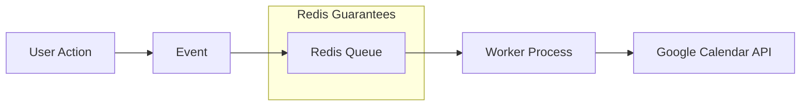

Google Calendar API를 호출하는 백그라운드 작업이 있었어요. 서버가 요청 중간에
크래시되자 작업이 사라졌어요. 재시도도, 로그도, 흔적도 없었죠. 사용자의
캘린더는 업데이트되지 않았고, 며칠 후 사용자가 신고할 때까지 저희는 전혀
몰랐어요.

Node.js 애플리케이션의 백그라운드 작업들 -- API 호출, 동기화 작업, 알림 --
은 프로세스 내 실행으로는 제공할 수 없는 안정성 보장이 필요해요. 서버가 작업
도중에 크래시하면 작업은 사라져요. 외부 API가 rate limit을 걸면 기본 재시도
메커니즘이 없어요. 트래픽이 급증하면 시스템이 부하를 흡수하고 분산할 방법이
없죠. 바로 여기서 Redis 기반 작업 큐가 필요해져요.

## 단순한 접근법의 한계

첫 번째 본능은 API를 직접 호출하고 최선을 바라는 거예요:

```typescript
// BAD: Run and forget
async function handleBlockUpdate(block) {
  try {
    await googleCalendarAPI.update(block);
  } catch (error) {
    console.error(error); // Lost forever
  }
}
```

프로덕션에서 심각한 문제가 있어요: 서버 크래시 시 유실, 재시도 메커니즘 없음,
rate limiting 없음, 중복 제거 없음, 모니터링 없음, 버스트 트래픽 처리 불가.

큐 기반 접근법과 비교하면:

```typescript
// GOOD: Production-grade
await queue.add(
  "update-calendar",
  {
    blockId: block.id,
    snapshot: extractSnapshot(block),
    intent: "update",
  },
  {
    jobId: `block-${block.id}-update`, // Deduplication
    attempts: 3, // Auto-retry
    backoff: { type: "exponential" }, // Smart delays
    priority: urgent ? 1 : 10, // Priority queue
  },
);
```

차이가 극명해요. 모든 작업이 영속화되고, 실패 시 재시도되며, 관찰 가능해요.

## Redis는 캐시가 아니에요

이것이 저의 첫 번째 멘탈 모델 전환이었어요. Redis는 흔히 "캐시"로 가르치지만,
실제로는 조정 시스템(coordination system) 역할을 하는 인메모리 데이터 구조
저장소예요. 영속적이고 (재시작해도 살아남고), 명령어 처리가 단일 스레드라서
원자성이 보장되고, 단일 코어에서 초당 100,000+ 연산을 처리해요.

Redis는 작업 큐에서 네 가지 핵심 문제를 해결해요:

**영속성과 안정성** -- 작업은 Redis에 저장되어 앱 크래시에서도 살아남아요:

```javascript
// Job stored in Redis:
{
  id: "job-123",
  data: { blockId: 456, intent: "update" },
  attempts: 1,
  status: "active"
}
// Survives app crashes, will be retried on restart
```

**분산 조정** -- 원자적 연산으로 정확히 하나의 worker만 각 작업을 가져가요:

```javascript
// Atomic operation (BRPOPLPUSH):
// 1. Remove job from waiting list
// 2. Add to processing list
// 3. Return to exactly ONE worker
// All in single atomic operation - no race conditions
```

**Rate Limiting** -- 외부 API 과부하 방지:

```javascript
new Worker("calendar-queue", processor, {
  limiter: {
    max: 100, // Max 100 jobs
    duration: 60000, // Per minute
  },
});
```

**재시도 로직** -- 일시적 실패에 대한 지수 백오프:

```javascript
{
  attempts: 3,
  backoff: {
    type: 'exponential',
    delay: 2000  // 2s, 4s, 8s...
  }
}
```

## BullMQ의 Redis 데이터 구조 활용

BullMQ는 작업 생명주기를 Redis 프리미티브에 매핑해요:

| 구조        | 용도        | 예시                                    |
| ----------- | ----------- | --------------------------------------- |
| Lists       | FIFO 큐     | `waiting: [job3, job2, job1]`           |
| Sorted Sets | 지연 작업   | `{score: timestamp, member: "job-123"}` |
| Hashes      | 작업 데이터 | `job:123 {data: "...", opts: "..."}`    |
| Sets        | 중복 제거   | `completed: {job-123, job-124}`         |

추상화를 위한 추상화가 아니에요. 각 데이터 구조는 문제에 자연스럽게 매핑되기
때문에 선택된 거예요: FIFO 순서에는 Lists, 시간 기반 스케줄링에는 Sorted
Sets, 구조화된 작업 데이터에는 Hashes, 중복 제거에는 Sets.

## 스레딩 모델의 오해

처음에 BullMQ worker가 별도 스레드에서 실행된다고 생각했어요. 아니에요.
BullMQ는 같은 Node.js 프로세스와 같은 이벤트 루프에서 실행돼요.

```text
Main Thread (Event Loop)
├── NestJS Controllers
├── Services
├── Database queries
└── BullMQ Workers ← SAME THREAD
```

이것이 동시성에 대한 사고방식을 바꿔요. 작업 추가가 즉시 반환되기 때문에
여전히 논블로킹이에요:

```typescript
// Sync workflow - returns immediately
await this.queue.add("create-channel", data);
// ↑ Job added to Redis, continues immediately

return { success: true };
// ↑ Returns to user immediately

// Later in event loop:
// Worker processes the job asynchronously
```

BullMQ는 스레드가 아닌 concurrency 설정으로 동시성을 처리해요:

```typescript
@Processor("google-calendar-event", {
  concurrency: 5, // Process up to 5 jobs simultaneously
})
export class QueueProcessor extends WorkerHost {
  async process(job: Job): Promise<void> {
    // Each job runs independently
  }
}
```

## 검토한 옵션들

BullMQ를 선택하기 전에 다섯 가지 접근법을 평가했어요:

| 옵션                    | 장점                                               | 단점                                            |
| ----------------------- | -------------------------------------------------- | ----------------------------------------------- |
| BullMQ + Redis          | 영속성, 재시도, rate limiting, 모니터링, 중복 제거 | Redis 인프라 필요; at-least-once만 제공         |
| EventEmitter            | 의존성 제로; 프로세스 내; 간단                     | 영속성 없음; 크래시 시 유실; 재시도 없음        |
| Promise Chain           | 네이티브 JS; 의존성 없음                           | 영속성 없음; 수동 재시도; 모니터링 없음         |
| Worker Threads          | CPU 작업의 진정한 병렬 처리                        | 영속성 없음; 수동 재시도; 복잡한 IPC            |
| AWS SQS / Microservices | 관리형; 독립적 스케일링; 서비스 간 통신            | 높은 지연; 더 많은 인프라; 단일 서비스에는 과도 |

EventEmitter와 Promise chain은 영속성이 없어요 -- 가장 중요한 요구사항인데
말이에요. Worker Threads는 다른 문제(CPU 병렬 처리)를 해결해요. SQS는 이미
Redis를 사용하는 단일 NestJS 서비스에는 과도했어요.

### EventEmitter 패턴

EventEmitter는 디스패치 레이어로는 유용하지만, 영속성을 제공하지 않아요:

```typescript
// Publisher
this.eventEmitter.emit('channel.create', data);

// Handler
@OnEvent('channel.create')
async handleChannelCreate(data): Promise<void> {
  await this.queue.add('create-channel', data);
}
```

핸들러가 없으면 이벤트는 조용히 사라져요. 실제로 저는 EventEmitter를
BullMQ로 디스패치하는 용도로 사용하지, 독립적인 솔루션으로 사용하지 않아요.

### Promise Chain 패턴

```typescript
this.service
  .doSomething()
  .then(() => console.log("done"))
  .catch((err) => console.error(err));
// Returns immediately, runs async
```

간단하고 중요하지 않은 작업에만 사용하세요.

## Race Condition 방지

큐 없이는 빠른 사용자 액션이 순서 문제를 일으켜요:

```typescript
// User updates then immediately deletes
updateBlock(id); // Takes 2 seconds
deleteBlock(id); // Takes 1 second
// DELETE completes first! UPDATE fails or recreates deleted item
```

Redis + BullMQ를 사용하면 작업이 순차적으로 처리돼요:

```typescript
await queue.add("update", { blockId: 123 });
await queue.add("delete", { blockId: 123 });
// Redis ensures sequential processing for blockId: 123
```

더 세밀한 제어가 필요하면, 분산 잠금으로 같은 리소스에 대한 동시 작업을
방지할 수 있어요:

```typescript
private async acquireLock(blockId: number, ttl: number = 30): Promise<boolean> {
  const lockKey = `block-lock:${blockId}`;
  const redisClient = await this.queue.client;
  const result = await redisClient.set(lockKey, lockValue, 'EX', ttl, 'NX');
  return result === 'OK';
}
```

## 모니터링과 관찰 가능성

BullMQ의 가장 큰 장점 중 하나는 내장된 관찰 가능성이에요:

```typescript
// See all failed jobs
await queue.getFailed();

// See waiting jobs
await queue.getWaiting();

// Get metrics
const counts = await queue.getJobCounts();
// { waiting: 5, active: 2, completed: 100, failed: 3 }

// Get specific job status
const job = await queue.getJob(jobId);
console.log(job.failedReason);
```

"뭔가 고장났는데 뭔지 모르겠다"와 "job-456이 Google의 429 rate limit 에러로
2번째 시도에서 실패했다" 사이의 차이예요.

## 아키텍처 요약



## 실전 가이드

영속성(작업이 크래시에서 살아남아야 할 때), 재시도 로직(외부 API 실패),
모니터링(실패 추적), rate limiting(API 스로틀링 방지), 중복 제거(중복 처리
방지), 또는 우선순위 큐가 필요할 때 BullMQ를 사용하세요.

작업 유실이 허용되는 단순한 fire-and-forget 이벤트, CPU 바운드 연산(BullMQ는
이벤트 루프를 공유), 밀리초 이하의 지연 요구사항(Redis 왕복이 1-5ms 추가),
또는 Redis 추가가 불필요한 일회성 스크립트에는 사용하지 마세요.

중요한 주의사항 하나: BullMQ는 at-least-once 의미론을 제공해요,
exactly-once가 아니에요. 중복 처리가 데이터 손상을 일으킬 수 있다면, BullMQ
위에 멱등성(idempotency) 가드가 필요해요.
