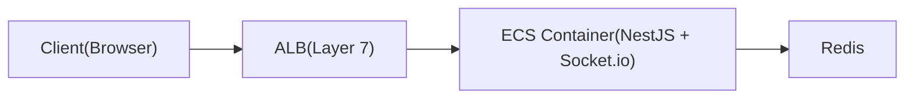
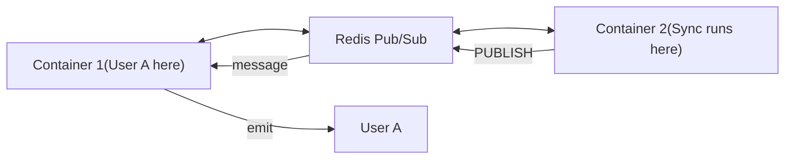

브라우저 클라이언트에 실시간 알림을 푸시해야 했어요 -- 백그라운드 작업이
완료된 후 "동기화 완료" 메시지를 보내는 거죠. HTTP 폴링도 동작했지만 리소스를
낭비하고 눈에 보이는 지연을 추가했어요. WebSocket이 명확한 해결책이었지만,
여러 ECS 컨테이너 뒤의 AWS ALB에 배포하려니 답이 없는 질문들이 생겼어요.

ALB는 HTTP-to-WebSocket 업그레이드를 어떻게 처리할까? 다른 인스턴스에 연결된
클라이언트에게 여러 컨테이너가 어떻게 브로드캐스트할까? 연결이 끊기면 어떻게
될까? 이 글은 그 질문들을 해결하면서 도달한 아키텍처를 다뤄요.

## 어려웠던 점들

여러 오해가 진행을 늦췄어요.

처음에 ALB가 WebSocket 상태를 적극적으로 관리한다고 생각했어요. 아니에요.
ALB는 HTTP 업그레이드 핸드셰이크 이후에는 그냥 TCP 터널이에요. 이 혼동
때문에 아무 효과 없는 불필요한 ALB 설정을 시도했어요.

컨테이너 간 브로드캐스팅이 더 어려운 문제였어요. 사용자 A가 Container 1에
연결되어 있는데 동기화 작업이 Container 2에서 완료되면, Container 2가
사용자 A에게 직접 알릴 수 없어요. Redis Pub/Sub가 HTTP 콜백이 아닌 영구 TCP
구독을 통해 이 문제를 해결한다는 걸 이해하는 데 시간이 걸렸어요.

연결 수명 주기의 엣지 케이스는 Socket.io 문서만으로는 명확하지 않았어요.
브라우저 탭 닫기는 TCP FIN을 보내고 (WebSocket 닫기 프레임이 아님), 네트워크
끊김은 아무것도 보내지 않고 (ping/pong 타임아웃에 의존), ALB는 자체 유휴
타임아웃이 있어요. 각 시나리오마다 다른 처리가 필요해요.

Socket.io에 sticky session이 필수라고 생각했는데, 아니었어요. Sticky session은
HTTP 폴링 폴백에만 필요해요. WebSocket 전송만 사용하면, 초기 업그레이드 후
어떤 컨테이너든 연결을 처리할 수 있어요.

## 아키텍처 개요



연결 흐름은 이렇게 동작해요:

1. **Client**가 `Upgrade: websocket` 헤더와 함께 HTTP 요청을 보냄
2. **ALB**가 요청을 받아 컨테이너로 라우팅
3. **Container**가 업그레이드를 수락하고 WebSocket 설정
4. **ALB**가 TCP 터널을 열린 상태로 유지 (데이터를 통과시킴)
5. **Socket.io**가 여기서부터 연결을 관리

## 컴포넌트 역할

| 컴포넌트             | 역할                                                |
| -------------------- | --------------------------------------------------- |
| **ALB**              | 초기 HTTP 업그레이드 라우팅, 이후 TCP 통과 (터널)   |
| **Socket.io Server** | WebSocket 연결 관리, 클라이언트 추적, 하트비트 처리 |
| **NestJS Gateway**   | 애플리케이션 로직 -- 인증, 메시지 처리, 룸 관리     |
| **Redis Adapter**    | 여러 컨테이너 간 메시지 브로드캐스트                |

핵심 인사이트: ALB는 그냥 터널이에요. Socket.io가 실제 연결을 관리해요.

## ALB가 필요한 이유

Socket.io가 상태를 관리하지만, ALB는 다른 목적을 제공해요 -- 초기 연결
라우팅:

```text
Without ALB:
  Client: "I want to connect to wss://api.example.com"
  Containers have private IPs:
  - 10.0.1.5:3000
  - 10.0.1.6:3000
  Client can't access private IPs directly!

With ALB:
  Client → api.example.com → ALB (public) → picks container → WebSocket established
```

컨테이너는 프라이빗 서브넷에 있어요. ALB가 트래픽을 올바른 곳으로 라우팅하는
퍼블릭 진입점이에요.

## 멀티 컨테이너 브로드캐스팅을 위한 Redis

여러 ECS 컨테이너가 있을 때, 사용자 A가 Container 1에 연결되어 있지만 동기화
작업은 Container 2에서 실행될 수 있어요. Container 2는 사용자 A에게 직접
알릴 수 없어요.



### Pub/Sub의 실제 동작 방식

Redis가 앱을 "호출"하지 않아요. 앱이 Redis에 대한 영구 TCP 연결을 유지해요:

```text
Step 1: STARTUP
  Container opens TCP connection to Redis (stays open!)
  → "SUBSCRIBE moba:socket.io"

Step 2: PUBLISH
  Container 2 sends message to Redis
  → "PUBLISH moba:socket.io {user:123, data:...}"

Step 3: PUSH
  Redis writes to the ALREADY OPEN TCP connection

Step 4: RECEIVE
  Node.js event loop picks up data from socket
  Socket.io adapter handles it → delivers to user's WebSocket
```

이를 설정하는 코드:

```typescript
// pubClient: for PUBLISHING messages
// subClient: for SUBSCRIBING (maintains open TCP connection)
const pubClient = createClient({ url: redisUrl });
const subClient = pubClient.duplicate();

await Promise.all([pubClient.connect(), subClient.connect()]);

this.adapterConstructor = createAdapter(pubClient, subClient, {
  key: `${redisConfig.prefix}:socket.io`,
});
```

두 개의 별도 Redis 연결: 하나는 발행용, 하나는 구독용이에요. 구독자 연결은
메시지를 기다리며 영구적으로 열려 있어요.

## 연결 수명 주기

세 가지 연결 끊김 시나리오가 있고, 각각 다르게 감지돼요:

### 정상 종료 (사용자가 탭 닫기)

```text
Client closes browser
    ↓
Browser's TCP stack sends FIN packet (not Socket.io!)
    ↓
TCP FIN packet ──► ALB ──► Container
    ↓
Socket.io detects TCP connection closed
    ↓
handleDisconnect() called (auto room cleanup)
```

브라우저는 WebSocket 닫기 프레임이 아닌 TCP FIN을 보내요. 브라우저가 종료
중이라 우아한 WebSocket 닫기를 할 시간이 없거든요. TCP FIN은 더 빠르고, OS가
처리하며, JavaScript가 멈춰도 동작해요.

### 네트워크 중단

```text
Network drops (no FIN packet)
    ↓
Socket.io ping/pong timeout (~25s)
    ↓
Server marks client as disconnected
    ↓
handleDisconnect() called
```

### ALB 유휴 타임아웃

```text
No activity for 60 seconds (ALB default)
    ↓
ALB closes the TCP connection
    ↓
Both client and server detect disconnect
```

이건 드물게 발생해요. Socket.io가 25초마다 하트비트를 보내서 60초 임계값
전에 ALB 유휴 타이머를 리셋하거든요.

| 시작자                       | 메커니즘              | 감지                      |
| ---------------------------- | --------------------- | ------------------------- |
| 클라이언트 (정상 종료)       | TCP FIN               | 즉시                      |
| 클라이언트 (크래시/네트워크) | FIN 없음              | Ping/pong 타임아웃 (~25s) |
| ALB                          | 유휴 타임아웃 (60s)   | TCP RST                   |
| 서버                         | `client.disconnect()` | 즉시                      |

## ALB 유휴 타임아웃과 Socket.io 하트비트

| 설정                   | 기본값 | 역할                              |
| ---------------------- | ------ | --------------------------------- |
| ALB 유휴 타임아웃      | 60초   | 60초 동안 데이터 없으면 연결 종료 |
| Socket.io pingInterval | 25초   | 25초마다 ping 전송                |
| Socket.io pingTimeout  | 20초   | pong 응답을 20초 대기             |

```text
Timeline:
0s   ─── Connection established
25s  ─── Socket.io sends PING → ALB resets idle timer
50s  ─── Socket.io sends PING → ALB resets idle timer
75s  ─── Socket.io sends PING → ALB resets idle timer
...

ALB idle timeout (60s) is NEVER reached because Socket.io
sends heartbeat every 25s. No config change needed!
```

## 검토한 옵션들

| 옵션                          | 장점                                                      | 단점                                                                              |
| ----------------------------- | --------------------------------------------------------- | --------------------------------------------------------------------------------- |
| Socket.io + Redis Adapter     | 자동 재연결, 룸 관리, 폴링 폴백, 컨테이너 간 브로드캐스트 | 추가 의존성 (Redis); Socket.io 프로토콜 오버헤드                                  |
| Raw WebSocket (ws 라이브러리) | 최소 오버헤드; 추상화 레이어 없음                         | 자동 재연결 없음; 수동 룸 관리; 커스텀 pub/sub 없이 컨테이너 간 브로드캐스트 불가 |
| Server-Sent Events (SSE)      | 간단; 대부분의 프록시 통과; 업그레이드 불필요             | 단방향 (서버에서 클라이언트만); 바이너리 지원 없음                                |
| Long Polling                  | 어디서든 동작; 특별한 인프라 불필요                       | 높은 지연; 서버 리소스 낭비; 복잡한 클라이언트 로직                               |
| AWS API Gateway WebSockets    | 서버리스; 관리형 스케일링                                 | 벤더 종속; 다른 프로그래밍 모델; Socket.io 호환 불가                              |

Socket.io와 Redis Adapter를 선택한 이유는 애플리케이션에 양방향 통신
(클라이언트가 액션을 보내고, 서버가 알림을 푸시), 자동 재연결 처리, 컨테이너
간 메시지 브로드캐스트가 필요했기 때문이에요. Raw WebSocket은 룸 관리,
하트비트, 재연결 로직을 다시 구현해야 해요. SSE는 단방향이에요. Redis
Adapter는 직렬화, 네임스페이스, 룸 범위 브로드캐스팅을 기본 제공해요.

## 스케일링 고려사항

단일 컨테이너의 경우 설정이 간단해요:

| 컴포넌트        | 필요? | 이유                                       |
| --------------- | ----- | ------------------------------------------ |
| ALB             | Yes   | 퍼블릭 트래픽을 프라이빗 컨테이너로 라우팅 |
| Redis Adapter   | Yes   | 멀티 컨테이너를 위한 미래 대비             |
| Sticky Sessions | No    | 단일 컨테이너 = 모든 연결이 같은 곳으로    |
| 여러 컨테이너   | No    | 스케일이 필요할 때까지 불필요              |

여러 컨테이너로 확장할 때, sticky session은 재연결이 같은 컨테이너로 가도록
보장하고 (더 빠른 재연결, Redis 오버헤드 감소), Socket.io의 HTTP 폴링
폴백에 필수예요.

## 실전 가이드

브라우저 클라이언트에 실시간 알림이 필요하거나, 로드 밸런서 뒤에서
컨테이너화된 배포를 하거나, 백그라운드 작업 완료 알림이 사용자에게 즉시
도달해야 할 때 이 아키텍처를 사용하세요.

단순한 요청-응답 API(REST나 GraphQL이 더 간단), server-sent events로 충분한
경우(단방향, 더 간단한 설정), 낮은 빈도의 업데이트(long-polling이나 주기적
fetch가 더 저렴), 서버리스/Lambda 환경(Socket.io 대신 API Gateway WebSocket
API 사용)에는 WebSocket을 사용하지 마세요.

기억해야 할 다섯 가지: ALB는 초기 업그레이드 이후 그냥 터널이에요. Socket.io가
전체 수명 주기를 관리해요 (하트비트, 타임아웃, 룸, 정리). Redis는 영구 TCP
연결을 통해 멀티 컨테이너 브로드캐스팅을 가능하게 해요. Pub/Sub는 한 번
구독하면 메시지가 발행될 때마다 받는 구조예요. 그리고 단일 컨테이너
배포에서도 Redis Adapter를 포함하세요 -- 비용이 들지 않고, 스케일할 때
고통스러운 마이그레이션을 막아줘요.
