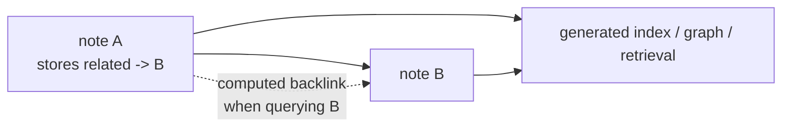

## 백링크 관리라는 함정

양방향 지식 graph는 그럴듯해 보여요. 직접 관리하기 전까지는요.

노트 A가 노트 B를 참조한다고 해볼게요. 노트 A를 쓰면서 적어둘 내용은 분명해요. "이 노트는 이런 이유로 B와 연결된다"는 거죠. 여기서 욕심이 생겨요. 노트 B 쪽에도 역방향 연결을 적고 싶어져요. "A가 여기를 가리킨다"고요. 그 연결은 완성된 느낌을 주지만 사실 새로운 지식은 아니에요. 그냥 장부 기록일 뿐이죠.

장부는 어긋나기 마련이에요.

다음에 노트 A가 바뀌어도 노트 B의 역방향 연결은 같이 안 바뀔 수 있어요. file 하나를 옮기면 역방향 경로가 끊겨요. 한쪽에서 링크를 지워도 다른 쪽에서는 그대로 남아 있죠. graph는 여전히 촘촘하게 연결돼 보이지만, 그 촘촘함의 일부는 거짓이에요.

3B는 역방향 연결을 아예 저장하지 않는 방식으로 이런 종류의 부패를 피해요. 작성자가 이미 머릿속에 그리고 있는 포워드 링크만 저장하죠. 백링크는 나중에 저장된 포워드 링크를 따라가면서 계산해요.

작은 schema 선택처럼 들리지만 실제로는 지식 베이스 전체의 관리 비용을 좌우하는 결정이에요.

## 원자적 노트는 graph의 node예요

2026-06-14 아키텍처 모델은 지식 layer를 15개 category 폴더에 흩어진 940개의 원자적 노트로 설명해요. 각 노트는 frontmatter로 타입이 정해져 있고요. 이 숫자는 모델 스냅샷의 사실일 뿐, 실제 파일 시스템이 그대로 멈춰 있겠다는 약속은 아니에요. 숫자보다 구조가 더 중요하죠.

오래 남길 노트는 `knowledge/{category}/` 아래에 kebab-case markdown file로 들어가요. category가 노트에 자리를 주고, tag가 여러 주제에 걸친 관심사를 분류해요. frontmatter에는 시스템의 나머지 부분이 읽을 수 있는 메타데이터를 담아요. status, 날짜, confidence, references, 발행 상태, 사용 이력, 그리고 포워드 링크까지요.

본문은 아무렇게나 끄적이는 공간이 아니에요. 지식 항목은 5W1H 형태를 따라요.

- 문제
- 겪었던 어려움
- 해결책
- 언제 쓸 것인가
- 언제 쓰지 말 것인가

결정에 가까운 항목에는 검토한 선택지들과 그중 하나를 고른 이유를 더해요. 이렇게 하면 노트가 원자적이면서도 맥락을 잃지 않아요. 미래의 독자에게 답이 무엇인지만이 아니라, 왜 그 답을 적어둘 가치가 있었는지까지 알려주죠.

## `related:`이 저장되는 연결이에요

저장되는 링크는 frontmatter 안에 있어요.

```yaml
related:
  - path: ../devops/example-pattern.md
    context: "Why this note points there"
```

여기서 `context` 필드는 장식이 아니에요. 경로만 적으면 두 노트가 연결됐다는 사실만 알 수 있어요. context가 그 이유를 말해주죠. 이게 없으면 미래의 독자나 검색 도구는 의미 없는 연결만 물려받게 돼요.

3B가 rule 라우팅을 frontmatter에 두는 것과 같은 이유예요. graph의 연결이 소스의 일부라는 거죠. 그래서 사람이 검토하고 도구가 바로 파싱해서 쓸 수 있어야 해요. "Related" 같은 산문 섹션을 긁어 오거나 본문 속 언급에서 추측하게 만들면 안 돼요.

이렇게 하면 작성 책임도 분명해져요. 작성자는 포워드 방향의 주장을 책임져요. 이 노트를 쓰는 지금, 어떤 이유로 저 노트를 가리키는지 안다는 거예요. 반면 나중에 이 노트를 언급할 수많은 역방향 목록까지 책임지진 않아요. 그 역방향 목록은 계산으로 만들어지니까요.

## 백링크는 query지, 작성 부담이 아니에요

노트 B가 자기를 가리키는 게 누군지 알고 싶다면 시스템은 저장된 `related:` 링크를 전부 훑어서 B를 가리키는 항목만 골라내면 돼요. 이건 query예요. 작성자가 직접 관리할 필드가 아니죠.

데이터베이스 index와 똑같은 발상이에요. 정규화된 사실은 한 번만 저장하고, 나중에 필요한 조회 형태는 거기서 끌어내요. 역방향 index는 다시 만들 수 있어요. 하지만 손으로 고친 역방향 연결은 그냥 믿는 수밖에 없죠.

3B의 schema는 이 규칙을 분명하게 못박아요. 포워드 링크는 저장하고, 백링크는 계산한다고요. markdown 작성 rule도 링크를 frontmatter 안으로 밀어넣고 wiki 스타일 단축 표기를 금지하면서 같은 생각을 강화해요. YAML schema는 링크 전략을 직접 문서로 남겨요. 외부 references는 URL로, 포워드 링크는 내부 `related:` 항목으로, 역방향 연결은 그 포워드 링크에서 계산한다고요.

자동 생성되는 `knowledge/_index.md`도 그 선택이 만들어낸 하류의 한 면이에요. graph 도구와 검색 layer는 같은 포워드 링크 사실을 읽어서 필요한 역방향 뷰를 알아서 만들어요. 소스 노트는 단순한 채로 남고요.



점선으로 그린 연결이 핵심이에요. 쓸모는 있지만 손으로 작성한 게 아니거든요.

## category가 graph를 사람이 다룰 만한 크기로 유지해요

포워드 링크는 연결 관리 문제를 풀어줘요. 하지만 노트를 어디에 둘지는 풀어주지 못해요.

3B는 6월 11일 모델 스냅샷 기준으로 15개의 category 폴더를 써요. category는 그날그날 기분 따라 정하는 게 아니에요. `knowledge/_categories.md`에 예시와 제외 기준까지 문서로 남아 있죠. `devops`, `backend`, `ai-ml`, `general`이 분포의 대부분을 차지하고, `moba`는 다른 데로 옮겨 쓸 수 없는 내용이라 기본적으로 공개 발행에서 빠져요.

새 category를 만드는 기준도 있어요. 어디에도 속하지 못한 노트가 다섯 개 넘게 쌓여야 하죠. 이 조건이 중요해요. 이게 없으면 모든 노트가 자기만의 폴더를 주장할 수 있고, 분류 체계 자체가 또 하나의 관리 대상이 돼버려요. 조건이 있으니 압력이 충분히 쌓인 뒤에야 category가 생겨나요.

그 결과는 2단계 모델이에요. 폴더는 안정적인 1차 자리를 주고, tag는 여러 주제에 걸친 차원을 설명하고, 포워드 링크는 자리를 넘나들며 개념을 연결해요. 디렉터리 트리 자체를 graph로 만들지 않으면서도 연결은 풍부하게 유지하는 거죠.

## 어려움 섹션이 중요한 이유

3B 지식 템플릿에서 특이한 부분은 "해결책"이 아니에요. 해결책이야 어느 지식 베이스에나 있으니까요.

특이한 건 "겪었던 어려움"을 꼭 적어야 한다는 점이에요.

이 섹션은 막다른 길, 헷갈리게 만든 신호, 틀린 가정, 그리고 답을 뻔하지 않게 만든 마찰을 담아요. 노트를 정리하면서 이런 세부 사항은 잘라내기 쉬워요. 그런데 그게 바로 학습에서 가장 재사용 가치가 높은 부분을 지우는 길이에요.

잘 다듬은 답은 미래의 나에게 무엇을 할지 알려줘요. 어려움의 서사는 미래의 나에게 왜 그 잘못된 길이 그럴듯해 보였는지 알려주죠. agent와 함께 일할 때는 특히 값져요. agent는 비슷한 형태로 반복해서 실패하거든요. 오래된 요약을 믿거나, 범위를 넓히거나, 생성된 출력을 진실의 원천으로 읽거나, frontmatter rule 하나를 놓치는 식으로요. 그 고생을 적어두면 이런 패턴을 검색하고 다시 쓸 수 있어요.

덕분에 나중에 쓰는 블로그 글도 더 좋아져요. 완성된 시스템만 설명하는 글은 그냥 둘러보기예요. 문제와 혼란과 해결을 함께 담은 글에는 이야기의 흐름이 있어요.

## graph가 3B의 나머지를 어떻게 먹여 살리는가

지식 layer는 시스템 한구석에 처박힌 archive가 아니에요. 다른 워크플로가 채워 넣고 또 꺼내 쓰는 농축된 layer죠.

`/wrap`과 `/archive-task`는 세션의 작업 상태를 오래 남길 지식으로 끌어올려요. frontmatter는 검색 도구에 구조화된 필드를 주고요. `references:`는 발행할 글의 신뢰도를 받쳐줘요. `when_used:`는 재사용을 기록해요. `blog:` 블록은 골라낸 항목을 `brandonwie.dev`로 sync하게 해주죠. 프라이버시 매트릭스는 work 관련 category를 포함한 비공개 영역을 공개 surface와 index에서 빼둬요.

그러니까 Zettelkasten은 agent harness와 따로 노는 게 아니에요. harness의 메모리 surface 중 하나예요. 같은 노트 하나가 미래 세션에서 디자인 패턴을 찾아주고, 블로그 글을 채워주고, 과거의 우회책이 왜 버려졌는지 설명해줘요.

이 모든 걸 관리할 만큼 graph를 싸게 유지해주는 게 바로 포워드 링크만 저장하는 규칙이에요. 손으로 채우는 필드는 하나하나 제 값을 해야 해요. 역방향 연결은 그러질 못하고요.

## 이 패턴이 주는 것과 치르는 비용

가장 큰 이점은 신뢰예요. 노트가 다른 노트를 가리킨다고 적혀 있으면 그건 맥락이 붙은 작성된 주장이에요. graph 뷰에 역방향 연결이 보이면, 그건 작성된 주장에서 계산해낸 거고요. 지금 어느 layer를 보고 있는지 알 수 있죠.

두 번째 이점은 작성 속도예요. 노트를 쓸 때는 정말로 의도한 링크만 넣어요. 파일을 떠나 가리키는 대상마다 역방향 메타데이터를 손보러 다닐 필요가 없죠.

대신 치르는 비용도 있어요. 역방향 뷰를 보려면 도구가 필요하다는 거죠. 그냥 파일을 열어서는 모든 백링크가 보이지 않아요. 어떤 index나 query layer가 계산해줘야 하죠. 3B는 이 비용을 받아들여요. 대안이 더 나쁘니까요. 완성된 척하지만 믿을 수 없는, 어긋난 양방향 메타데이터 말이에요.

결국 3B의 일반적인 패턴이 다시 나와요. 소스 사실은 한 번만 저장하고, 파생된 뷰는 계산하고, 그 경계를 분명하게 드러낸다는 거죠.

## 의도를 저장하고, 결과를 계산하라

포워드 링크는 의도예요. 작성자는 글을 쓰는 그 순간에, 왜 이 노트가 저 노트를 가리키는지 알아요.

백링크는 결과예요. 코퍼스에 담긴 모든 포워드 링크에서 기계적으로 따라 나오죠.

3B는 의도를 저장하고 결과를 계산해요. 그래서 작성자에게 연결을 두 번씩 관리하라고 시키지 않고도 지식 베이스가 graph일 수 있어요. 어려움의 서사를 노트에 꼭 넣는 이유도 같아요. 목표는 답을 기억하는 것만이 아니라, 그 답을 기억할 가치가 있게 만든 과정까지 남기는 거니까요.

오래 남는 지식 베이스는 필드를 더 많이 저장한다고 오래 남는 게 아니에요. 사람이 참으로 유지할 수 있는 필드만 저장할 때 오래 남아요.
