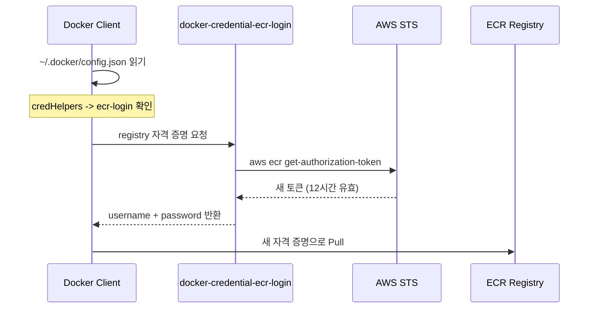

Airflow DockerOperator가 첫날에는 완벽하게 작동했어요. 다음 날 아침, ECR에서
Docker 이미지를 pull하는 모든 DAG가 "authorization token has expired"로
실패했어요. ECR 토큰은 12시간 동안만 유효한데, 컨테이너 시작 시점에 한 번만
저장해두고 있었거든요. 밤새 토큰이 만료됐고, Airflow는 갱신할 방법이
없었어요.

## 왜 중요한가

ECR 인증은 작동할 때는 보이지 않지만, 안 되면 치명적이에요. 컨테이너가
예측 불가능한 스케줄로 이미지를 pull한다면 -- Airflow DAG가 정확히 그런
패턴이에요 -- 저장된 토큰은 결국 pull 사이에 만료돼요. 실패 모드가
미묘해요: 에러가 "ImageNotFound"라고 나와서 이미지가 없는 것처럼 보이지,
자격 증명이 만료된 것처럼 보이지 않아요.

---

## 겪었던 어려움

- **12시간 후에야 에러 발생** -- Airflow DockerOperator가 초기 배포에서는
  정상 작동했어요. "authorization token has expired" 에러는 다음 날에야
  나타나서, 이미지 누락이 아니라 인증 문제라는 걸 연결하기 어려웠어요.
- **Cron 기반 토큰 갱신은 취약함** -- 첫 번째 시도한 수정은 11시간마다
  `docker login`을 실행하는 cron job이었어요. 이건 race condition을
  만들었어요: 토큰 만료와 cron 실행 사이의 짧은 창에서 pull이 발생하면 여전히
  실패했어요.
- **Credential helper 바이너리는 아키텍처가 맞아야 함** -- helper 바이너리는
  아키텍처별(`linux-amd64` vs `linux-arm64`)이에요. 잘못된 바이너리를
  사용하면 조용히 실패해요 -- Docker가 아키텍처 불일치를 알려주지 않고
  그냥 "credentials not found"라고만 해요.
- **`config.json` 키가 정확한 registry URL이어야 함** --
  `~/.docker/config.json`의 `credHelpers` 키가 계정 ID와 리전을 포함한 정확한
  ECR registry URL과 일치해야 해요. 오타나 잘못된 리전이면 Docker가 경고
  없이 인증 없는 상태로 폴백해요.

---

## 검토한 옵션

| 항목        | docker login          | Credential Helper |
| ----------- | --------------------- | ----------------- |
| 토큰 저장   | ~/.docker/config.json | 없음              |
| 만료 처리   | 수동 갱신 (cron)      | 자동              |
| 셋업 복잡도 | 간단                  | 약간 더 복잡      |
| 유지보수    | 높음 (cron, 모니터링) | 없음              |

`docker login` 방식은 셋업이 더 간단하지만 지속적인 유지보수가 필요해요.
Cron job, 실패 모니터링, 만료와 갱신 사이의 race condition 대응 계획이
필요하죠. Credential helper는 몇 분의 셋업 후 유지보수 없이 돌아가요.

---

## 해결책: ECR Credential Helper

만료되는 토큰을 저장하는 대신, credential helper가 매 `docker pull`마다
새로운 토큰을 가져와요. Docker가 helper 바이너리를 호출하고, helper가 AWS
STS를 호출해서 새 토큰을 받아서 Docker에 바로 전달해요. 디스크에 아무것도
저장되지 않고, 만료되는 것도 없어요.



---

## 설정 방법

### 1. Helper 설치

```dockerfile
# Dockerfile에서
RUN curl -sL "https://amazon-ecr-credential-helper-releases.s3.us-east-2.amazonaws.com/0.9.0/linux-${ARCH}/docker-credential-ecr-login" \
    -o /usr/local/bin/docker-credential-ecr-login \
    && chmod +x /usr/local/bin/docker-credential-ecr-login
```

`ARCH` 변수가 인스턴스와 일치하는지 확인하세요. ARM 인스턴스에서
`linux-amd64`를 사용하면 도움이 안 되는 에러만 나와요 -- Docker가 그냥
"credentials not found"라고만 해요.

### 2. Docker 설정

```json
// ~/.docker/config.json
{
  "credHelpers": {
    "123456789.dkr.ecr.ap-northeast-2.amazonaws.com": "ecr-login"
  }
}
```

키는 AWS 계정 ID와 리전을 포함한 정확한 registry URL이어야 해요. 여기서
오타가 나면 Docker가 조용히 인증 없는 상태로 폴백해요.

### 3. 필요한 IAM 권한

```text
- sts:GetCallerIdentity      (계정 ID 조회)
- ecr:GetAuthorizationToken  (Docker 로그인 토큰)
- ecr:BatchCheckLayerAvailability
- ecr:GetDownloadUrlForLayer
- ecr:BatchGetImage
```

EC2에서는 이 권한들이 인스턴스 역할에서 나와요. 관리할 자격 증명도, 교체할
시크릿도 없어요.

---

## 왜 이 방식이 효과적인가

Credential helper는 "만료된 토큰" 장애 유형 전체를 제거해요. 매 pull마다 새
토큰을 가져오기 때문에 토큰이 만료될 수 있는 창이 없어요. 이 방식이
동작하는 이유는:

- **온디맨드** -- Docker가 필요할 때만 토큰을 가져옴
- **저장 없음** -- 토큰이 즉시 사용되고 디스크에 기록되지 않음
- **자동 갱신** -- 매 작업마다 새 토큰 발급
- **IAM 기반** -- EC2 인스턴스 역할 사용, 관리할 자격 증명 없음

저희 Airflow 환경에서는 이게 올바른 선택이었어요. DAG가 예측 불가능한
스케줄로 실행되거든요 -- 어떤 건 매시간, 어떤 건 매일, 어떤 건 매주. Cron
기반 갱신으로는 모든 pull 시점에 유효한 토큰을 보장할 수 없어요. Credential
helper는 할 수 있고요.

---

## 실전 팁

이 결정 매트릭스로 credential helper가 필요한지 판단하세요:

| 시나리오                            | Credential Helper 사용?            |
| ----------------------------------- | ---------------------------------- |
| ECR에서 pull하는 장기 실행 컨테이너 | 예                                 |
| CI/CD 파이프라인                    | 경우에 따라 (수명 짧으면 login OK) |
| 로컬 개발                           | 예 (편리함)                        |
| Lambda/ECS + ECR                    | 아니오 (AWS가 처리)                |

### 사용하면 안 되는 경우

- **Lambda 또는 ECS가 ECR에서 pull할 때** -- AWS가 이 서비스들의 ECR 인증을
  네이티브로 관리해요. Credential helper를 추가하면 중복이에요.
- **수명이 짧은 CI/CD 컨테이너** -- 전체 파이프라인이 12시간 안에 완료되면
  시작 시 `docker login` 한 번이 더 간단하고 충분해요.
- **ECR이 아닌 레지스트리** -- Credential helper는 ECR 전용이에요. Docker
  Hub, GHCR 등 다른 레지스트리는 각자의 인증 메커니즘을 사용하세요.
- **IAM 역할이 없는 환경** -- Helper가 IAM 자격 증명(인스턴스 역할, 환경
  변수, AWS 설정)에 의존해요. IAM을 사용할 수 없으면 작동하지 않아요.

한 번의 셋업 비용(바이너리 설치 + `config.json` 설정)은 토큰을 갱신하는
cron job을 모니터링하고 유지하는 운영 비용에 비하면 아무것도 아니에요.
한 번 설정하고 ECR 인증은 잊어버리세요.
