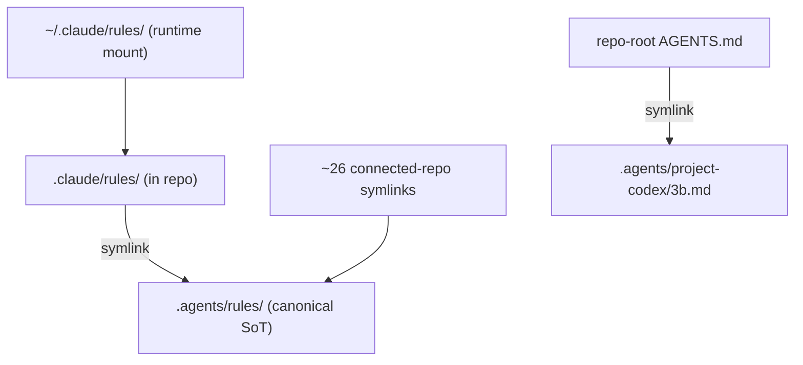
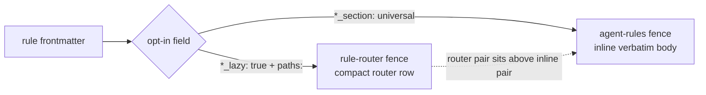
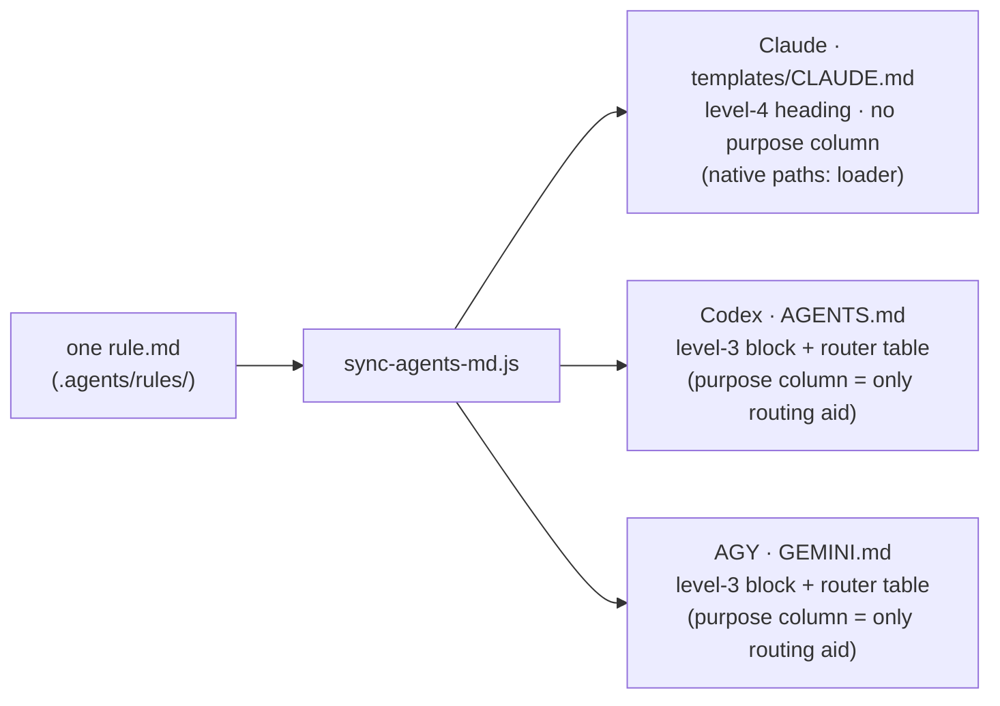
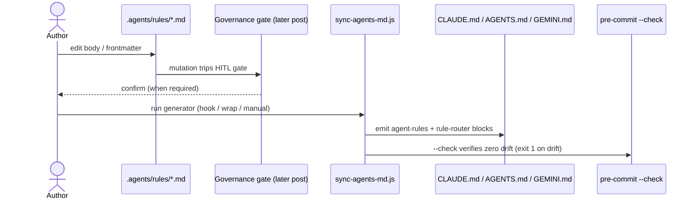

## 한 명의 작성자, 세 개의 runtime

AI coding agent를 두 개 넘게 돌려본 적 있다면 이미 겪어봤을 거예요. Claude Code는 설정을 `~/.claude/`에서 읽고, Codex는 `~/.codex/`에서 읽어요. 세 번째 agent인 AGY(Antigravity CLI)는 또 다른 데서 읽는데, 사라진 Gemini CLI한테 물려받은 `~/.gemini/` 자리를 그대로 써요. CLI마다 자기가 읽을 경로를 코드에 박아두고, 옆에 다른 agent가 있다는 건 몰라요.

이제 규칙을 하나 적어봐요. "`git add -A`로 stage하지 마라." "symlink 말고 source of truth를 고쳐라." "Markdown 고치기 전에 frontmatter schema부터 확인해라." 이걸 세 agent가 다 따랐으면 좋겠어요. 제일 손쉬운 방법은 설정 트리 세 곳에 같은 규칙을 붙여넣는 거예요. 그런데 이건 그 규칙을 두 번 다시 안 건드리는 동안만 잘 돌아가요. 한 곳에서 규칙을 다듬는 순간 나머지 두 곳은 슬그머니 낡기 시작하고, 세 agent는 또 제각각 움직여요. 더 고약한 건, 이제는 셋이 같은 규칙을 따른다고 _믿고_ 있다는 거예요.

AI 문제처럼 생겼지만 사실은 설정이 어긋나는 문제예요. 재미있는 대목은 규칙 자체가 아니라 그 밑에 깔린 질문이에요. **agent가 N개일 때, 규칙 사본을 N개 끌어안지 않고도 다 같은 규칙을 따르게 하려면 어떻게 해야 할까요?**

## Keystone: source of truth로서의 `.agents/`

3B가 고른 답은 폴더 하나예요. agent끼리 나눠 쓰는 건 전부 `.agents/` 밑에 딱 한 번만 적어요. 규칙 본문, skill, prompt 틀, 프로젝트별 맥락 파일, 명령 권한 정책, 세션을 잇는 buffer, friction log가 다 여기 모여 있어요. 두 번째 사본이 없으니 맞춰줄 두 번째 사본도 없어요. `.agents/`가 원본이고, 각 runtime은 그 위에 얹힌 _창_일 뿐이에요.

그래서 사람한테나 agent한테나 운영 규칙 하나가 중요해져요. **source of truth를 고치고, symlink는 건드리지 마라.** 이걸 기억해두세요. 취향 같지만 사실은 정확성을 좌우하는 제약이에요. 왜 그런지는 잠시 뒤에 나와요.

원본 폴더 하나만 둬도 작성 규율은 잡혀요. 그렇다고 그것만으로 서로 다른 경로를 박아둔 세 CLI 앞에 같은 내용을 들이밀 수는 없어요. 3B는 이 일을 두 가지 운반 방식으로 풀어요. 그리고 이 둘을 가르는 게 설계의 전부예요.

## Transport 1: back-symlink로 각 runtime을 SoT에 연결하기

첫 번째 방식은 따분하지만 믿음직한 symlink예요. repo 안에서 `.claude/<subdir>`는 `../.agents/<same>`를 가리키는 symlink예요. Claude Code가 `~/.claude/rules/`를 찾으면, 그 조회는 repo의 `.claude/`를 거쳐 실제 내용이 든 `.agents/`에 닿아요. 이런 back-symlink가 아홉 개 깔려 있고(디렉터리 여섯, 파일 셋), 연결된 프로젝트 repo에서 들어오는 symlink 스물여섯 개쯤도 같은 식으로 이어져요. repo 맨 위의 `AGENTS.md`마저 `.agents/project-codex/3b.md`를 가리키는 symlink예요. runtime마다 제 전용 설정을 읽는다고 믿지만, 실은 다들 폴더 하나를 읽어요.

여기서 "SoT를 고치고 symlink는 건드리지 마라"는 말이 단순한 조언에서 벗어나요. editor는 대부분 파일을 저장할 때 임시 파일에 쓴 다음 target 위로 `rename`해요. 한 번에 갈아끼우는 저장이죠. 그런데 target이 symlink면, 이 rename은 _link 자체_를 새 일반 파일로 갈아엎어요. 저장은 된 것 같고 내용도 멀쩡해 보여요. 하지만 link는 사라졌고 SoT와의 연결도 끊겼고, 이후 원본을 아무리 고쳐도 슬그머니 안 퍼져요. 설정을 그 자리에서 다시 쓰는 일부 CLI 도구도 같은 덫에 걸려요. 그래서 맨 처음 `.claude/ -> .agents/` migration도 commit 하나로는 못 끝냈고, rename 다음에 symlink를 거는 commit _쌍_으로 쪼개야 했어요. pre-commit 도구가 잠깐 치워뒀다 되돌리는 단계에서, 같은 commit 안에서 갈아끼워지는 symlink를 못 따라갔거든요(ADR-014, 2026-04-27).

back-symlink가 푸는 건 딱 하나예요. 세 runtime이 같은 내용에 닿게 하는 것. 그런데 세 agent가 같은 내용을 _원하지 않는다_는 사실까지 풀어주진 못해요.

## Transport 2: generator로 하나의 규칙을 세 profile에 투영하기

Claude, Codex, AGY는 규칙을 받아들이는 구조가 서로 달라요. 셋한테 똑같은 파일을 건네면, 굳이 필요 없는 군더더기로 어떤 agent의 context를 축내고, 정작 필요한 agent한테는 살을 못 붙여줘요. 그래서 두 번째 방식은 symlink가 아니라 프로그램이에요.

`scripts/sync-agents-md.js`는 950줄쯤 되는 Node generator예요. 규칙 파일마다 YAML frontmatter를 읽고, agent별로 그 규칙을 해당 profile에 띄울지, 띄운다면 어떤 모양으로 띄울지 정해요. 갈림길은 `applicable_agents`라는 frontmatter 항목 하나예요. 비어 있으면 기본값이 `[claude]`고요. 어떤 agent가 그 목록에 없으면 generator는 그 규칙을 그 agent용으로는 아예 건너뛰어요.

목록에 든 agent라면, generator는 규칙이 선언한 방식에 따라 두 가지 `AUTO-GEN` 표식 구간 중 하나에 찍어내요.

- `*_section` 항목으로 등록한 규칙은 `agent-rules` 울타리 안에 **본문 그대로 박혀요.** 규칙 전체가 그 agent의 항상 켜진 맥락이 되는 거예요.
- `*_lazy` 항목으로 등록한 규칙은 `rule-router` 울타리에 **짤막한 안내 한 줄**로 들어가요. 이름, glob, 쓰임새, 경로를 담은 한 줄짜리 길잡이고, agent는 이 줄을 보고 필요할 때 본문을 읽어요.

target 파일마다 안내 구간이 본문 구간 위에 놓여요. 그리고 이 모든 걸 굴리는 등록부가 agent마다 한 줄씩 가진 목록일 뿐이라, 언젠가 네 번째 agent를 더해도 다시 짜는 게 아니라 한 줄 보태는 일이에요.

더 깊은 routing 문법, 그러니까 `paths:` glob이 어떻게 들어맞는지, 어떤 의도 어휘가 규칙을 골라내는지, lazy loading이 실제로 어떻게 터지는지는 따로 떼어낼 이야기예요. 다음 글에서 다룰 주제예요.

## Payoff: 같은 규칙이 agent마다 다르게 도착한다

여기가 천천히 들여다볼 대목이에요. 규칙 본문 하나를 들고 generator를 돌려서, 각 profile에 어떻게 도착하는지 보면 모양이 다 달라요.

Claude용에서는 규칙이 번호 붙은 절 아래 4단계 제목으로 박혀요. 그리고 generator는 다른 agent한테는 찍어주던 길잡이 칸을 여기선 일부러 **빼버려요.** Claude Code에는 `paths:` lazy-loader가 자체로 들어 있어서예요. Claude는 규칙 frontmatter의 파일 glob을 보고 언제 규칙을 맥락에 끌어올지 이미 알아서 정해요. 그러니 "이 규칙은 이럴 때 쓴다"는 설명 칸은 군더더기일 뿐이에요. 이걸 빼면 찍을 때마다 520 token쯤 아껴요. 그만큼 context가 세션으로 되돌아와요.

Codex용과 AGY용에서는 같은 규칙이 평평한 3단계 덩어리로 들어가고, 길잡이 표가 따라붙어요. 그 표의 쓰임새 칸이 이 둘한테는 _유일한_ 길잡이예요. 둘 다 Claude 같은 lazy-loader가 없으니, generator가 그 힌트를 글로 채워줘야 하거든요.

이 그림 한 장이 이 설계가 말하려는 전부예요. 출력 모양은 내가 고른 설계만큼이나 _Claude가 자체로 가진 loader_가 정해줘요. generator는 사실상 원본 규칙 하나를 각 runtime이 가장 잘 삼킬 수 있는 모양으로 빚어내는 셈이에요. "한 번 적어서 세 곳에 닿는다"는 건 "한 번 쓰고 세 번 붙여넣는다"가 아니에요. 한 번 쓰고, 세 갈래로 _쏘아 보낸다_는 뜻이에요.

## 왜 이 투영이 부서지기 쉬운 script가 아니라 믿을 만한가

내가 적어둔 의도와 agent가 실제로 읽는 내용 사이에 generator가 끼어 있으면, 그 generator를 못 믿는 순간 위험 덩어리가 돼요. 이 generator가 발등 찍는 도구가 아니라 믿을 만한 도구인 데는 몇 가지 이유가 있어요.

**제때 돌아요.** 규칙 파일을 stage하면 pre-commit hook에서 돌고, 세션을 마무리하는 단계에서도 돌고, 직접 불러서도 돌릴 수 있고, CI에서는 `--check`로 commit된 target이 generator가 뽑을 결과와 어긋났는지 살펴요. 규칙을 고쳐놓고 다시 뽑는 걸 잊은 채로는 못 들어가요. check가 잡아내니까요.

**슬그머니 불어나는 걸 거부해요.** 출력에는 세 가지 크기 한도가 걸려 있어요. 규칙 하나가 5,000바이트를 넘으면 알림만 띄우고, 항상 켜진 universal 덩어리가 30,000바이트를 넘으면 아예 실패하고, Claude template이 38,000바이트를 넘어도 실패해요. Claude Code가 맥락 비용을 두고 경고를 띄우기 시작하는 40KB보다 일부러 2KB 낮춰 잡은 거예요. 이 한도들은 앞으로의 성장을 막는 울타리고, 지금 실제로 걸리는 건 규칙별 알림 정도예요.

**한결같고 앞뒤가 맞아요.** 다시 뽑아도 결과가 그대로라 두 번 돌려도 안 바뀌어요. agent별 구역 여럿도 한 번에 같이 엮어 처리하니 실행할 때마다 결과가 달라지지 않아요. generator는 Bun에서 돌리면 일부러 실패해요. CI와 pre-commit은 Node로 도니까, 엉뚱한 runtime을 막아두는 편이 나중에 미묘하게 어긋난 걸 디버깅하는 것보다 싸거든요.

하나 짚고 넘어갈 결과가 있어요. 예전엔 이게 진짜 사고 지점이었어요. 2026년 5월 말에 고친 뒤로 Claude의 전역 설정은 _온전히 generator가 주인_이에요. 손으로 적은 줄이 하나도 안 남았어요. 규칙 본문을 고치고 generator를 돌리면 Claude template도 같은 차례에 갱신돼요. 손으로 한 번 더 만질 일도 없고, 사람이 읽는 사본이 기계가 읽는 사본보다 뒤처질 틈도 없어요. 명령 권한도 형제 격인 generator가 똑같이 처리해요. 정책 파일 하나를 Claude settings와 Codex 규칙으로 풀어내죠. 다만 그건 별개의 하위 시스템이에요. 규칙을 고치면 들어가기 전에 사람이 한 번 확인하는 통제 관문도 거쳐야 하는데, 이 관문은 이 시리즈 뒤쪽에서 따로 다룰 글감이에요.

## agent를 갈아끼워도 버텼다

이게 특정 도구에만 먹히는 잔재주가 아니라 운반 설계라는 가장 센 증거는, 세 agent 중 하나가 통째로 바뀌었는데도 설계가 끄떡없었다는 점이에요. Google이 Gemini CLI를 접은 뒤 AGY(Antigravity CLI)가 그 자리를 이어받았고, 물려받은 `~/.gemini/` 자리를 그대로 썼어요. 이 갈아끼우기는 여섯 단계에 걸쳐 진행됐어요(ADR-033, 2026-05-22). 그 내내 세 agent 약속은 깨지지 않았어요. "agent를 받쳐준다"가 "등록부 한 줄과 그 target 파일들"로 줄어 있었던 덕에, 세 번째 agent를 바꾸는 일은 등록부와 뽑아낸 target을 손대는 일이었지 규칙 자체를 고치는 일이 아니었어요. 마흔 개 넘는 규칙 본문은 어떤 agent가 읽을지 바꾸려고 손볼 필요가 없었어요. 추상화가 제자리에 놓이면 이런 모양이 나와요.

## 솔직하게 짚는 부분

잘 돌아가는 것만 늘어놓는 글은 광고예요. 지금 나온 것과 아직 안 나온 것을 갈라서 적어볼게요.

**오늘 나온 것:** `.agents/`를 원본 한 곳으로 쓰는 구조, 본문 박기와 lazy 둘 다로 퍼뜨리는 세 agent 분배, back-symlink 아홉 개, 온전히 generator가 쥔 Claude 전역 설정, 크기 한도와 Bun 막이, 그리고 위에서 말한 Gemini에서 AGY로의 갈아끼우기예요.

**미뤄둔 것, 그리고 미뤘다고 밝혀둔 것:**

- AGY의 프로젝트별 맥락은 일부러 본거지 repo 하나로만 묶어뒀어요. 연결된 repo는 공유하는 맨 위 파일로 AGY 약속을 받지만, repo마다 따로 AGY 파일을 까는 일은 거기서 AGY를 실제로 돌릴 때까지 미뤄뒀어요. ADR-022의 향후 과제 메모에서 이어졌고 ADR-033 아래에서 챙겨봐요.
- 예전에 손으로 두 번 만지던 우회책, 그러니까 규칙을 바꾼 뒤 Claude template을 직접 고치고 grep으로 확인하던 방식은 **지난 일이지 지금 하는 일이 아니에요.** 알려진 사고 유형 기록에만 남겨뒀어요. 덫에서 빠져나올 길을 남겨두려는 거지, 지금 누가 밟는 단계가 아니에요.
- 크기 한도는 앞으로 불어날 걸 막는 울타리예요. 지금 시스템이 그 벽에 짓눌려 있다는 뜻은 아니에요.

**숫자 하나를 솔직하게 털어놓으면:** 이 글이 바탕 삼은 architecture 등록부 스냅숏에는 세 agent로 퍼뜨리겠다고 등록한 규칙이 85개로 적혀 있어요. 그런데 2026-05-31에 실제로 확인하니 88개가 나왔어요. 이 차이는 오류가 아니에요. 뽑아낸 표면이 그걸 설명하는 글보다 빨리 움직인다는 뜻이고, 바로 그 어긋남을 다스리려고 이 시스템이 있는 거예요. 등록부 자체는 2026-05-30에 나왔어요.

**뒤 글로 넘길 것:** frontmatter가 loader 노릇을 하는 속내, 즉 `paths:` 들어맞기와 의도 어휘는 다음 글 주제예요. skill은 또 다른 물리 법칙으로 퍼져요. 한 agent엔 symlink, 다른 agent엔 hardlink, 세 번째엔 고정해둔 adapter를 써요. 그것도 따로 다룰 글감이에요. 규칙을 고칠 때마다 거치는 통제 관문도 따로 다룰 거예요. 이 글은 등뼈에서 멈춰요. 폴더 하나, 운반 둘, agent 셋.

## 자기 자신을 설명하는 system

여기엔 작은 되돌이가 숨어 있어요. 이 글의 바탕이 된 architecture 등록부, 즉 모델과 하위 시스템 글과 변천 기록은 자기가 설명하는 규칙들과 같은 repo에 살아요. 그리고 chat에서 주워들은 기억이 아니라, 번호가 매겨진 architecture 결정의 자취에 기대고 있어요. SoT 폴더는 ADR-014, generator는 ADR-015, agent 갈아끼우기는 ADR-033, 나중의 context 예산 되찾기는 ADR-039로 남아 있어요. source-of-truth 등뼈가 있어서 이게 가능해요. "agent가 함께 따르는 행동"이 딱 한 곳에 살면, 지식 시스템은 자기를 돌아보고 설명하면서도 스스로와 어긋나지 않을 수 있어요.

폴더 하나, transport 둘, agent 셋, 작성자 한 명.

> **시리즈 1편.** 개인 지식 시스템으로 여러 agent를 한 틀에서 굴리는 이야기, 그 첫 글이에요. 다음 글들에서는 규칙이 frontmatter를 거쳐 스스로 길을 찾는 방식, skill이 세 갈래 운반으로 퍼지는 방식, 모든 변경을 둘러싼 통제 관문, 그리고 그 밑을 받치는 token 더미를 다룰 거예요.

## 이 pattern이 맞는 경우와 아닌 경우

**같은 규칙을 따라야 하는 agent runtime이 둘 이상**이고, runtime마다 서로 다른 설정 경로를 박아뒀으며, 그들이 읽는 repo를 내가 쥐고 있다면, 원본 폴더 하나에 투영용 generator를 얹는 방식이 해볼 만해요. 규칙과 runtime 수가 늘수록 이득도 커져요. 많아질수록 붙여넣기로 인한 어긋남은 더 나빠지고, generator가 제 몫을 톡톡히 해요.

반대로 runtime이 **하나**뿐이면 맞출 분배가 없으니 평범한 설정 파일이 더 간단해요. runtime이 이미 함께 쓰는 설정 형식을 갖췄다면 그걸 쓰면 돼요. 규칙이 적고 거의 안 바뀌어서 어긋남이 진짜 위험이 아니라면 굳이 만들 까닭도 없어요. generator와 symlink 격자는 인프라예요. 모든 인프라가 그렇듯 손이 가고, 어느 선 아래에서는 피하려던 그 붙여넣기가 정말로 더 싸요.

## Source & method

이 글은 규칙이 사는 repo와 같은 repo에 든, 판이 매겨진 architecture 등록부에서 가져왔어요. 수마다 그 까닭을 대주는 결정 기록도 옆에 있어요. `.agents/` source-of-truth 폴더, generator, agent 승계, 나중의 context 예산 되찾기는 저마다 자기 ADR을 갖고 있어요. 줄 수, 바이트 한도, symlink 개수 같은 숫자는 기억에서 꺼낸 게 아니라 등록부와 실제 트리에 대조해 확인했어요.

실제로 가장 까다로웠던 건 generator가 아니라 **symlink**였어요. editor의 한 번에 갈아끼우는 저장이 symlink를 조용히 일반 파일로 바꿔버리거든요. 그래서 "source of truth를 고치고 symlink는 건드리지 마라"는 말은 예의가 아니라 정확성을 지키는 규칙이에요. 맨 처음 migration이 pre-commit 도구를 통과하려고 rename 다음에 symlink를 거는 commit 쌍으로 쪼개져야 했던 까닭도 이 덫 때문이었어요. 여기서 가장 옮겨 쓸 만한 교훈이 바로 그거예요.
