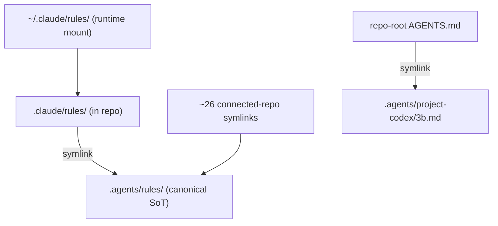
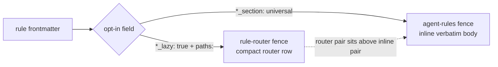
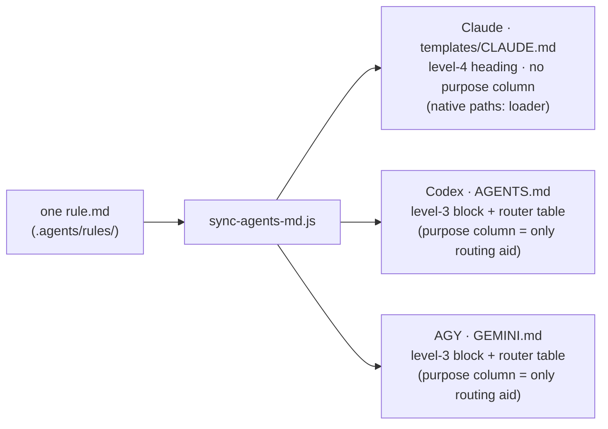
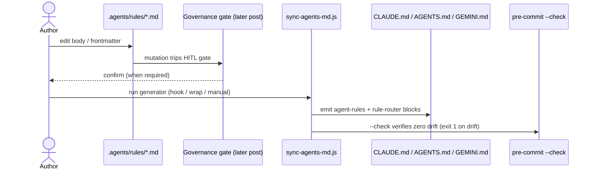

## 한 명의 작성자, 세 개의 runtime

AI coding agent를 둘 이상 써봤다면 이 문제를 이미 만났을 거예요.
Claude Code는 설정을 `~/.claude/`에서 읽고, Codex는 `~/.codex/`에서
읽어요. 세 번째 agent인 AGY(Antigravity CLI)는, 예전 Gemini CLI에서
이어받은 `~/.gemini/` namespace를 재사용해요. 각 CLI는 자기 runtime
mount를 하드코딩해두고, 서로의 존재는 몰라요.

이제 rule 하나를 쓴다고 해볼게요. "`git add -A`로 stage하지 마라."
"symlink가 아니라 source of truth를 수정하라." "Markdown을 수정하기
전에 frontmatter schema를 확인하라." 이 rule을 세 agent가 모두 따르게
하고 싶어요. 가장 단순한 방법은 세 config tree에 같은 rule을 붙여넣는
거예요. 그리고 이 방법은 다시는 그 rule을 고치지 않는 동안만 작동해요.
한 곳에서 rule을 다듬는 순간 나머지 두 곳은 조용히 썩기 시작하고, 세
agent는 다시 서로 다르게 행동해요. 더 나쁜 점은, 이제는 셋이 같은 rule을
따른다고 _믿고_ 있다는 거예요.

이건 AI 문제처럼 보이는 configuration drift 문제예요. 흥미로운 지점은
rule 자체가 아니라 그 아래 질문이에요. **N개의 agent가 같은 authored
rule을 따르게 하려면, N개의 사본을 유지하지 않고 어떻게 해야 할까요?**

## Keystone: source of truth로서의 `.agents/`

3B가 선택한 답은 하나의 folder예요. Agent 사이에서 공유되는 모든 것은
`.agents/` 아래에 정확히 한 번만 작성해요. rule body, skill, prompt
template, project별 context file, command-permission policy, cross-session
buffer, friction log가 모두 여기에 있어요. 두 번째 사본이 없으니 맞춰야
할 두 번째 사본도 없어요. `.agents/`가 canonical store이고, 각 runtime은
그 위에 얹힌 _view_예요.

그래서 인간과 agent 모두에게 하나의 운영 규칙이 중요해져요. **source of
truth를 수정하고, symlink를 수정하지 말 것.** 이걸 기억해두세요. 취향
문제처럼 들리지만 실제로는 correctness constraint예요. 잠시 뒤에 왜
그런지 나와요.

하나의 canonical folder는 작성 discipline을 만들어줘요. 하지만 그것만으로
각자 다른 hardcoded path를 읽는 세 CLI 앞에 같은 bytes를 가져다주지는
못해요. 3B는 이 문제를 두 가지 transport로 풀어요. 그리고 이 둘을
구분하는 게 설계의 핵심이에요.

## Transport 1: back-symlink로 각 runtime을 SoT에 연결하기

첫 번째 transport는 지루하지만 믿을 수 있는 symlink예요. repo 안에서
`.claude/<subdir>`는 `../.agents/<same>`을 가리키는 symlink예요. Claude
Code가 `~/.claude/rules/`를 찾으면, lookup은 repo의 `.claude/`를 거쳐
실제 bytes가 있는 `.agents/`로 떨어져요. 이런 back-symlink가 아홉 개
있고(여섯 directory, 세 file), 연결된 project repo에서 오는 symlink도
대략 스물여섯 개가 같은 방식으로 이어져요. repo root의 `AGENTS.md`
자체도 `.agents/project-codex/3b.md`로 향하는 symlink예요. 각 runtime은
자기 전용 config를 읽는다고 믿지만, 실제로는 모두 하나의 folder를 읽고
있어요.

여기서 "SoT를 수정하고 symlink를 수정하지 말라"는 말은 조언이 아니게
돼요. 대부분의 editor는 파일을 저장할 때 임시 파일을 쓴 뒤 target 위로
`rename`해요. atomic save죠. 그런데 target이 symlink면, 그 rename은
_link 자체_를 새 regular file로 바꿔버려요. 수정은 성공한 것처럼 보이고,
내용도 맞아 보여요. 하지만 link는 사라졌고, SoT와의 연결은 끊겼고,
이후 canonical file의 모든 업데이트는 조용히 전파되지 않아요. config를
제자리에서 rewrite하는 일부 CLI tool도 같은 함정에 걸려요. 그래서 최초의
`.claude/ -> .agents/` migration은 한 commit으로 끝낼 수 없었고,
rename 후 symlink를 만드는 commit _쌍_으로 나눠야 했어요. pre-commit
tooling의 stash-and-restore 단계가 같은 commit 안에서 교체되는 symlink를
따라갈 수 없었기 때문이에요(ADR-014, 2026-04-27).

Back-symlink는 딱 하나를 해결해요. 세 runtime이 같은 bytes를 resolve하게
만드는 것. 하지만 세 agent가 같은 bytes를 _원하지 않는다_는 사실까지
해결해주지는 않아요.

## Transport 2: generator로 하나의 rule을 세 profile에 투영하기

Claude, Codex, AGY는 rule을 구조적으로 다르게 소비해요. 셋에게 완전히
같은 file을 건네면, 어떤 agent에게는 필요 없는 scaffolding으로 context
budget을 낭비하고, 어떤 agent에게는 필요한 정보가 부족해져요. 그래서 두
번째 transport는 symlink가 아니라 program이에요.

`scripts/sync-agents-md.js`는 약 950줄짜리 Node generator예요. 각 rule
file의 YAML frontmatter를 읽고, agent별로 그 rule이 해당 profile에
나타나야 하는지, 나타난다면 어떤 형태여야 하는지 결정해요. gate는
`applicable_agents`라는 frontmatter field 하나예요. 없으면 기본값은
`[claude]`예요. 어떤 agent가 그 list에 없으면 generator는 그 rule을
그 agent 대상으로는 완전히 skip해요.

대상 agent가 list에 있다면, generator는 rule이 선언한 opt-in에 따라 두
가지 `AUTO-GEN` marker-pair 영역 중 하나에 emit해요.

- `*_section` field로 opt-in한 rule은 `agent-rules` fence에 **verbatim으로
  inline**돼요. rule 전체가 그 agent의 always-on context가 돼요.
- `*_lazy` field로 opt-in한 rule은 `rule-router` fence에 **compact router
  row**로 들어가요. 이름, glob, 목적, path를 담은 한 줄 pointer이고,
  agent는 그 row를 보고 필요할 때 full file을 읽어요.

모든 target file에서 router pair는 inline pair보다 위에 있어요. 그리고
이 모든 걸 drive하는 registry는 agent마다 한 row를 가진 list일 뿐이라,
언젠가 네 번째 agent를 추가해도 rewrite가 아니라 row 추가예요.

더 깊은 routing grammar, 즉 `paths:` glob이 어떻게 match되는지, intent
vocabulary가 rule을 어떻게 고르는지, lazy loading이 실제로 어떻게
발화되는지는 별도 이야기예요. 다음 글에서 다룰 주제예요.

## Payoff: 같은 rule이 agent마다 다르게 도착한다

여기가 천천히 볼 만한 부분이에요. rule body 하나를 잡고 generator를
돌려보면, 각 profile에 도착하는 모양이 서로 달라요.

Claude target에서는 rule이 numbered section 아래의 level-4 heading으로
inline돼요. 그리고 generator는 다른 agent에게 emit하는 routing/purpose
column을 의도적으로 **떨어뜨려요**. Claude Code에는 native `paths:`
lazy-loader가 있기 때문이에요. Claude는 rule frontmatter의 file glob을
기준으로 언제 rule을 context에 당겨올지 이미 결정할 수 있어요. 그래서
"이 rule은 언제 적용된다"는 prose column은 중복 scaffolding이에요. 이걸
빼면 emit마다 대략 520 token을 아껴요. 그만큼 session에 context budget이
돌아와요.

Codex와 AGY target에서는 같은 rule이 flat level-3 block으로 들어가고,
router table이 붙어요. 그 table의 purpose column은 이 둘에게 _유일한_
routing aid예요. 둘 다 Claude의 native lazy-loader가 없으니, generator가
prose로 routing hint를 공급해야 해요.

이 그림 하나가 이 설계의 thesis예요. 출력 형태는 내가 고른 design choice만큼
이나 _Claude의 native loader_에 의해 결정돼요. generator는 사실상 하나의
source rule을 각 target runtime이 가장 잘 소비할 수 있는 형태로 compile하고
있어요. "한 번 작성해서 세 곳에 도달한다"는 말은 "한 번 쓰고 세 번
붙여넣는다"가 아니에요. 한 번 쓰고, 세 방식으로 _project_한다는 뜻이에요.

## 왜 이 projection이 fragile script가 아니라 믿을 만한가

작성한 intent와 agent가 실제로 읽는 내용 사이에 code generator가 있으면,
그 generator를 믿을 수 없을 때 liability가 돼요. 이 generator가 footgun이
아니라 믿을 만한 도구가 되는 이유는 몇 가지가 있어요.

**적절한 순간에 실행돼요.** rule file이 staged되면 pre-commit hook에서
generator가 돌고, session wrap step에서도 돌고, manual invocation으로도
돌릴 수 있고, CI에서는 `--check`로 committed target이 generator output과
drift됐는지 확인해요. rule을 수정해놓고 regenerate를 잊은 채 land할 수
없어요. check가 잡아내요.

**조용히 비대해지는 걸 거부해요.** output에는 세 가지 byte budget이
걸려 있어요. rule 하나가 5,000 byte를 넘으면 advisory warning, always-on
universal block이 30,000 byte를 넘으면 hard failure, Claude template이
38,000 byte를 넘으면 hard failure예요. Claude Code가 context cost warning을
띄우기 시작하는 40KB 지점보다 일부러 2KB 낮게 잡은 거예요. 이 budget들은
미래 성장을 막는 guard이고, 현재 실제로 걸리는 것은 per-rule advisory
warning 정도예요.

**결정적이고 self-consistent해요.** regeneration은 idempotent라서 두 번
돌려도 바뀌지 않아요. 여러 per-agent section도 single pass 안에서 함께
thread되기 때문에 서로 다른 실행 결과가 나오지 않아요. generator는 Bun
아래에서 실행되면 hard-fail해요. CI와 pre-commit은 Node로 돌기 때문에,
잘못된 runtime을 거부하는 편이 나중에 subtle divergence를 디버깅하는
것보다 싸요.

하나 짚고 넘어갈 결과가 있어요. 이건 예전에는 실제 failure mode였어요.
2026년 5월 말 fix 이후 Claude의 global config는 _완전히 generator-owned_
상태가 됐어요. hand-edited row가 남아 있지 않아요. rule body를 수정하고
generator를 돌리면 Claude template도 같은 pass에서 업데이트돼요. 별도
manual touch도 없고, 사람이 읽는 copy가 machine-readable copy보다 뒤처질
가능성도 없어요. command permission도 sibling generator가 같은 일을 해요.
하나의 policy file을 Claude settings와 Codex rules로 render하죠. 다만 그건
별도 subsystem이에요. rule edit은 land되기 전에 human-in-the-loop governance
gate도 통과해야 해요. 이 gate도 나중에 따로 다룰 글감이에요.

## Agent swap을 버텼다

이 설계가 tool-specific hack이 아니라 transport design이라는 가장 강한
증거는, 세 agent 중 하나가 교체됐는데도 설계가 흔들리지 않았다는 점이에요.
Google이 Gemini CLI를 deprecate한 뒤 AGY(Antigravity CLI)가 그 자리를
이어받았고, AGY는 retired Gemini CLI에서 물려받은 `~/.gemini/` namespace를
재사용했어요. 이 전환은 여섯 phase cutover로 진행됐어요(ADR-033,
2026-05-22). 그 내내 three-agent contract는 유지됐어요. "agent를 지원한다"가
"registry의 row 하나와 target file들"로 축소되어 있었기 때문에, 세 번째
agent를 바꾸는 작업은 registry와 generated target을 건드리는 일이었지
rule 자체를 고치는 일이 아니었어요. 40개가 넘는 rule body는 어떤 agent가
읽는지 바꾸기 위해 수정될 필요가 없었어요. abstraction이 제자리에 있을 때
이런 모양이 나와요.

## 솔직한 edge들

작동하는 것만 나열하는 글은 marketing이에요. 지금 shipped된 것과 아닌
것을 나눠서 적어볼게요.

**오늘 shipped된 것:** `.agents/`를 single canonical store로 쓰는 구조,
inline과 lazy propagation을 모두 지원하는 three-agent fan-out, 아홉 개의
back-symlink, fully generator-owned Claude global, byte budget과 Bun guard,
그리고 위에서 말한 Gemini-to-AGY swap이에요.

**Deferred로 표시된 것:**

- AGY per-project context는 의도적으로 home repo 자체로 제한돼 있어요.
  연결된 repo들은 shared root file을 통해 AGY contract를 받지만,
  per-project AGY file rollout은 AGY를 실제로 그 repo들에서 실행할 때까지
  미뤄뒀어요. ADR-022의 future-work note에서 이어졌고 ADR-033 아래에서
  추적돼요.
- 예전의 manual "dual-touch" workaround, 즉 rule 변경 후 Claude template을
  손으로 고치고 grep으로 검증하던 방식은 **history일 뿐 현재 practice가
  아니에요.** known-failure-modes log에만 남아 있어요. trap을 복구할 수
  있게 하기 위해서지, 누군가 지금 수행하는 step이 아니에요.
- byte-budget hard limit은 미래 성장을 막는 guard예요. 지금 시스템이 그
  벽에 눌려 있다는 뜻은 아니에요.

**숫자 하나를 솔직하게 말하면:** 이 글이 기반으로 삼은 architecture
registry snapshot에는 cross-agent propagation에 opt-in한 rule이 85개로
기록돼 있어요. 그런데 2026-05-31 live check는 88개를 보고했어요. 이 차이는
오류가 아니에요. generated surface가 narrative doc보다 빠르게 움직이고
있다는 뜻이고, 바로 그 drift를 관리하기 위해 이 시스템이 존재해요.
registry 자체는 2026-05-30에 shipped됐어요.

**나중 글로 넘길 것:** frontmatter-as-loader mechanics, 즉 `paths:` matching과
intent vocabulary는 다음 글 주제예요. skill은 또 다른 물리법칙으로
전파돼요. 한 agent에는 symlink, 다른 agent에는 hardlink, 세 번째에는 pinned
adapter를 써요. 그것도 별도 글감이에요. 모든 rule edit이 거치는 governance
gate도 따로 다룰 예정이에요. 이 글은 spine에서 멈춰요. 하나의 folder,
두 transport, 세 agent.

## 자기 자신을 설명하는 system

여기에는 작은 recursion이 숨어 있어요. 이 글의 바탕이 된 architecture
registry, 즉 model, subsystem write-up, evolution history는 자신이 설명하는
rule들과 같은 repo에 살고 있어요. 그리고 chat에서 기억한 내용이 아니라,
numbered architecture decision trail에 기대고 있어요. SoT folder는
ADR-014, generator는 ADR-015, agent swap은 ADR-033, 나중의 context-budget
reclaim은 ADR-039로 남아 있어요. source-of-truth spine이 있어서 이게
가능해요. "shared agent behavior"가 정확히 한 곳에 살면, knowledge system은
자기 자신을 돌아보고 설명하면서도 스스로와 모순되지 않을 수 있어요.

Folder 하나. Transport 둘. Agent 셋. Author 한 명.

> **Series Part 1.** 개인 knowledge system으로 multi-agent harness를 굴리는
> 방식에 대한 시리즈의 첫 글이에요. 이후 글에서는 rule이 frontmatter를
> 통해 route되는 방식, skill이 세 가지 transport로 전파되는 방식, 모든
> change 주변의 governance gate, 그리고 그 아래 token stack을 다룰 예정이에요.

## 이 pattern이 맞는 경우와 아닌 경우

**같은 authored rule을 따라야 하는 agent runtime이 둘 이상**이고, 각 runtime이
서로 다른 config mount를 hardcode하고 있으며, 그들이 읽는 repo를 제어할 수
있다면 single source-of-truth folder와 projecting generator를 고려할 만해요.
payoff는 rule과 runtime 수가 늘수록 커져요. 많아질수록 copy-paste drift는
더 나빠지고, generator가 자기 값을 해요.

반대로 runtime이 **하나**뿐이라면 fan-out을 맞출 일이 없으니 plain config
file이 더 단순해요. runtime들이 이미 native shared config format을 갖고
있다면 그걸 쓰면 돼요. rule set이 작고 거의 변하지 않아서 drift가 실제
risk가 아니라면 굳이 만들 필요도 없어요. generator와 symlink lattice는
infrastructure예요. 모든 infrastructure가 그렇듯 maintenance cost가 있고,
어느 threshold 아래에서는 피하려던 copy-paste가 정말로 더 싸요.

## Source & method

이 글은 rule이 사는 repo와 같은 repo에 들어 있는 versioned architecture
registry에서 가져왔어요. 각 move를 정당화하는 decision record도 옆에
있어요. `.agents/` source-of-truth folder, generator, agent succession,
나중의 context-budget reclaim은 각각 자기 ADR을 갖고 있어요. line count,
byte budget, symlink count 같은 숫자는 기억에서 꺼낸 게 아니라 registry와
live tree를 대조해서 확인했어요.

실제로 가장 어려웠던 건 generator가 아니라 **symlink**였어요. editor의
atomic save가 symlink를 regular file로 조용히 바꿔버리기 때문이에요. 그래서
"source of truth를 수정하고 symlink를 수정하지 말라"는 말은 예절이 아니라
correctness rule이에요. 최초 migration이 pre-commit tooling을 통과하려고
rename-then-symlink commit pair로 쪼개져야 했던 이유도 이 trap 때문이었어요.
여기서 가장 transferable한 lesson은 바로 그거예요.
