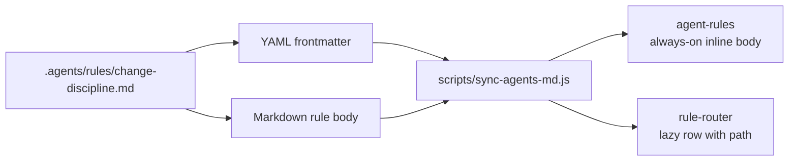
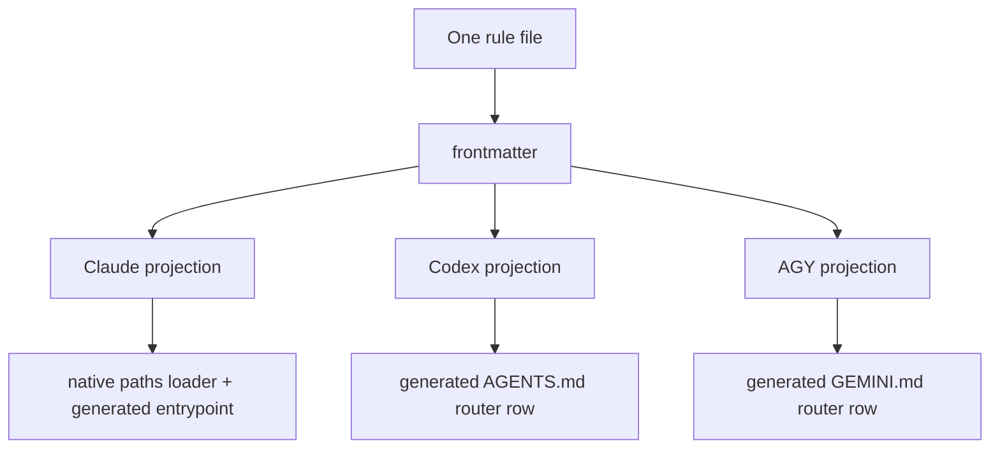

평평한 rule 디렉터리는 막상 불러오기 전까지는 가장 당연한 모양처럼 보여요. 그런데 실제로 로드해보면 이야기가 달라져요.

## rule 폴더 하나면 된다는 착각

3B에서 rule의 원본 본문은 `.agents/rules/` 아래에 모여 있어요. 사람도 agent도 읽고, 리뷰하고, 링크를 걸어야 하니까 전부 Markdown 파일이에요. 평평하게 둔 건 의도한 거예요. `claude/`, `codex/`, `agy/`로 나뉘어 거의 똑같은 사본이 가득한 하위 트리 같은 건 없어요. 디렉터리 하나, 사람이 읽는 레지스트리 하나뿐이에요.

이걸로 authoring 문제는 풀려요. 하지만 로딩 문제는 그대로 남아요.

모든 agent가 항상 모든 rule을 불러온다면, 전역 변수가 단순한 것과 똑같은 방식으로 단순할 거예요. 처음엔 잘 돌아가다가, 이후의 모든 작업에 벌을 주기 시작해요. 한 줄짜리 Markdown 수정이 PR 리뷰 lifecycle rule을 줄줄이 끌고 들어와요. 백엔드 버그를 잡는 작업이 blog-publishing 게이트를 떠안아요. Codex 세션이 실행하지도 못하는 Claude 전용 runtime 조언을 읽어요. 맞는 지침이 엉뚱한 타이밍에 컨텍스트를 가득 채워버려요.

흥미로운 설계 문제는 "rule이 어디에 사는가"가 아니에요. 그건 첫 번째 글에서 답했어요. `.agents/`에 산다고요. 다음 문제가 더 날카로워요. **rule을 언제, 어떤 runtime을 위해 불러와야 할까요?**

3B의 답은 rule이 자기 길을 스스로 들고 다닌다는 거예요.

## rule 파일은 로드되는 단위예요

rule 파일마다 두 부분이 있어요. Markdown 본문은 지침이에요. agent가 무엇을 해야 하는지, 왜 이 rule이 있는지, 제대로 따랐는지 어떻게 확인하는지를 담아요. YAML frontmatter는 로딩 계약이에요. 어떤 agent에 적용되는지, 항상 켜둘지 lazy로 둘지, 어떤 파일 glob이 이걸 트리거하는지, 생성된 결과물이 어디에 떨어질지를 담아요.

이 분리가 중요한 이유는 rule 옆에 길을 그대로 붙여두기 때문이에요. 라우팅용 스프레드시트를 따로 관리할 필요가 없어요. 왜 이 rule이 Codex에는 나오고 AGY에는 안 나오는지 숨겨진 hook이 기억해주길 바랄 필요도 없어요. rule을 열면 동작과 로딩 메타데이터가 같은 리뷰 diff 안에 보여요.

단순하게 보면 rule 파일은 이렇게 말해요.

```yaml
applicable_agents: [claude, codex, agy]
paths:
  - "projects/**"
codex_lazy: true
agy_lazy: true
claude_lazy: true
description: "Short router-table purpose"
```

frontmatter 아래의 Markdown은 평범한 산문이에요. 그 위의 frontmatter는 평범하지 않아요. 제너레이터가 읽어내는 부분이거든요.

그 제너레이터인 `scripts/sync-agents-md.js`는 `.agents/rules/*.md`를 훑고, frontmatter를 파싱하고, agent별로 rule을 분류하고, 각 agent의 entrypoint 파일 안 생성 구역을 다시 써요. 결과물은 하나의 보편적인 출력이 아니에요. 하나의 원본 rule을 각 runtime이 필요로 하는 모양으로 투영한 거예요.



핵심은 바로 이거예요. frontmatter가 Markdown rule을 수동적인 문서에서 라우팅 가능한 단위로 바꿔놓아요.

## always-on과 lazy는 출력 모양이에요

3B는 rule에 두 가지 출력 모양을 써요.

첫 번째는 인라인 섹션이에요. agent별 `*_section` 필드로 옵트인한 rule은 해당 agent의 생성된 `agent-rules` 블록에 바로 끼워 넣을 수 있어요. 이게 always-on 컨텍스트예요. 드물고, 짧고, 거의 모든 세션에서 가치 있는 rule에만 써야 해요. 항상 로드되는 만큼, 모든 토큰이 자기 값어치를 증명해야 하니까요.

두 번째는 lazy router 행이에요. `*_lazy: true`와 진짜 `paths:` 게이트로 옵트인한 rule은 생성된 `rule-router` 블록에 한 줄로 올라가요. 이 행은 agent가 전체 rule을 언제 읽어야 할지 판단할 만큼의 정보를 줘요. 이름, glob 범위, 의도와 목적, 그리고 path예요. rule 본문은 작업 집합이 매칭되기 전까지 컨텍스트 밖에 머물러요.

이 두 모양은 취향 차이가 아니에요. 서로 다른 비용 모델을 나타내요.

인라인 rule은 즉시성을 노려요. agent가 따로 찾아낼 필요 없이 이미 prompt 안에 들어 있어요. lazy rule은 컨텍스트 예산을 노려요. 지금 작업이 관련 범위를 건드릴 때만 agent가 비용을 치러요.

이 설계가 돌아가는 건 길이 명시적이기 때문이에요. rule이 그냥 존재만 하면서 언젠가 어떤 로더가 알아서 잘 해석해주길 바랄 수는 없어요. Codex에서 always-on이고 싶으면 그렇다고 말해요. AGY에서 lazy이고 싶으면 그렇다고 말해요. 기본적으로 Claude에 적용되지만 다른 agent에는 닿지 않아야 한다면, 메타데이터가 그 경계를 눈에 보이게 지켜줘요.

## agent 셋, 제각각인 로더 물리학

라우팅 필드는 똑같이 동작하지 않는 세 runtime을 모두 받쳐줘야 해요.

Claude에는 path 기반 lazy 로더인 `.claude/rules/` 경로가 기본으로 있어요. 그래서 `paths:` 게이트가 생성된 테이블용 메타데이터에 그치지 않아요. Claude 자신이 직접 해석할 수 있어요. Codex에는 똑같은 컨텍스트 주입 hook 표면이 없어요. Codex의 프로젝트 entrypoint에는 매칭되는 path를 수정하기 전에 어떤 rule 파일을 읽어야 할지 알려주는 router 테이블이 필요해요. AGY도 생성된 프로필로 같은 패턴을 따라요.

그 차이 때문에 frontmatter는 하나의 전역 "이거 로드해" 스위치 대신 agent별 필드를 써요. 같은 rule이라도 한 runtime에는 인라인, 다른 runtime에는 lazy, 또 다른 runtime에는 건너뛰기가 필요할 수 있어요. 제너레이터는 rule 본문을 원본으로 다루지만 투영은 agent마다 달라요.



"로더가 된 frontmatter"라는 말이 말 그대로가 되는 지점이 바로 여기예요. frontmatter를 agent가 직접 불러오는 게 아니에요. 제너레이터가 그걸 불러와서 각 agent의 로딩 표면으로 바꿔놓아요. 메타데이터가 인프라가 되는 거예요.

## 이상한 부분: universal에도 path가 붙을 수 있어요

라우팅 시스템을 가장 잘 시험하는 건 평범한 경우가 아니에요. 모순처럼 들리는 경우예요.

3B에서 "universal"이 항상 "`paths:` 없음"을 뜻하는 건 아니에요. ADR-039는 바로 그 문장 때문에 존재해요.

어떤 rule은 universal 등급이에요. 전역 생성 지침 블록에 등장할 만큼 중요하다는 뜻이죠. 당연한 구현이라면 `paths:`를 빼고 제너레이터가 인라인하게 두는 거예요. 그런데 Claude에는 `.claude/rules/`를 직접 훑는 native 스캔이 있어요. 가드가 없으면 똑같은 universal rule이 생성된 전역 임베드로 한 번, native rule 스캔으로 또 한 번 로드될 수 있어요.

해법은 일부러 좀 이상해요. universal rule은 절대 매칭되지 않는 `paths:` 센티넬을 들고 다닐 수 있어요. 예를 들면 이런 거예요.

```yaml
paths:
  - "__never_match_universal_delivered_via_claude_md__/**"
```

이 path는 실제 파일과 매칭되라고 만든 게 아니에요. 진짜 전달 경로는 제너레이터가 맡고, 한쪽 로더는 만족시키면서 동시에 잠재우라고 만든 거예요.

이 디테일이 아키텍처를 솔직하게 만들어요. 라우팅 모델은 순전히 의도만으로 빚어지지 않아요. runtime 동작에도 영향을 받아요. 로더의 기벽이 원본 계약의 일부가 되는 거예요. 존재하지 않는 척하는 게 더 나쁠 테니까요.

교훈은 Claude보다 더 넓어요. 여러 도구가 같은 rule 묶음을 소비할 때는 universal, lazy, scoped 같은 "의미론적" 라벨만으로는 부족해요. 어떤 로더가 어떤 필드를 언제 보고 있는지도 알아야 해요. 그러지 않으면 깔끔한 분류 체계가 중복 컨텍스트나 누락된 컨텍스트, 혹은 둘 다로 변해버려요.

## 가드레일이 메타데이터를 실행 가능하게 만들어요

라우팅이 frontmatter에 사는 순간, frontmatter도 코드와 똑같은 규율이 필요해져요. 산문의 오타는 거슬리는 정도예요. 라우팅 메타데이터의 오타는 rule을 사라지게 만들 수 있어요.

3B에는 그걸 막는 가드레일이 몇 개 있어요.

첫 번째는 YAML 스키마 rule이에요. 여기엔 cross-agent 필드를 문서화해둬요. `applicable_agents`, agent별 `*_section` 필드, agent별 `*_lazy` 필드, 프로젝트 범위 출력을 위한 repo 필드, 그리고 `tags`, `created`, `updated`, `status` 같은 평범한 필수 frontmatter 필드예요.

두 번째는 6개 필드 라우팅 스키마예요. lazy로 라우팅되는 레이어는 무엇을 겨냥하는지, 무엇이 트리거하는지, 누가 소유하는지, 어떻게 검증하는지, 어떻게 sync하는지, 길이 사라지면 어떤 실패 모드가 적용되는지를 밝혀야 해요. glob 하나보다 격식이 많죠. 바로 그게 핵심이에요. glob은 rule이 언제 로드되는지 알려줘요. 6개 필드 스키마는 그 길이 존재해도 되는 이유를 알려줘요.

세 번째는 제너레이터 자체예요. 단순히 파일을 이어 붙이기만 하지 않아요. rule을 분류하고, 잘못된 조합을 거부하고, lazy rule에는 path가 있도록 강제하고, "universal"이 잡동사니 서랍이 되지 않도록 바이트 예산을 눈에 보이게 유지해요.

intent 해석 레이어도 있어요. 정적 glob은 path 모양 트리거에는 강해요. `projects/**`를 수정하면 프로젝트 rule을 읽는 식이죠. 하지만 investigate, review, verify, document처럼 의도 모양 작업에는 약해요. 3B의 intent 블록은 정적 path 위에 얹은 보조적 확장이에요. intent 매칭이 단단한 path 게이트보다 더 권위 있는 척하지 않으면서 rule이 개념적 트리거를 묘사할 수 있게 해줘요.

이 가드레일들이 모이면 rule 메타데이터를 리뷰 가능하게 만들어요. 라우팅 변경은 숨겨진 runtime 손질이 아니에요. rule 파일의 diff와 생성된 출력 점검이에요.

## 이 패턴이 가져다주는 것

명백한 이점은 드리프트가 줄어든다는 거예요. rule 본문과 그 길이 함께 사니까, 한쪽을 고치면 다른 쪽과 함께 리뷰할 수 있어요.

덜 명백한 이점은 선택적 컨텍스트예요. agent가 올바르게 행동하려고 시스템 전체를 prompt에 넣을 필요는 없어요. 작은 always-on 계약 하나면 돼요. 거기에 작업 집합이 부를 때 알맞은 큰 rule을 찾아낼 능력만 더하면 되고요. 오래 사는 repo에는 모든 지침을 미리 들이붓는 것보다 이쪽이 더 잘 맞아요.

runtime 비대칭을 새겨 넣을 구체적인 자리도 생겨요. Codex에 Claude 스타일 컨텍스트 주입이 없다는 사실을 막연한 단서로 취급하지 않아요. 그건 투영을 바꿔요. Codex는 생성된 router 텍스트를 받아요. Claude의 native rule 스캔도 얼버무리고 넘어가지 않아요. 센티넬 우회책을 받아요.

무엇보다 이 시스템은 rule 라우팅을 감사 가능하게 만들어요. 왜 이 rule이 로드됐는지, 왜 로드되지 않았는지, 어떤 agent에 닿는지, 어떤 명령이 하위 파일을 다시 생성하는지 물을 수 있어요. 답은 버전 관리되는 텍스트에 있어요. 누군가의 기억 속이 아니라요.

## 무작정 따라 하지 않을 것

2026-06-14 아키텍처 모델에 담긴 57개 rule 묶음부터 시작하지는 않을 거예요. 3B가 그 규모에 이른 건 실제 실패를 숱하게 겪으며 자랐기 때문이에요. 낡은 문서, 안전하지 않은 git 스테이징, 작업 핸드오프 충돌, frontmatter 드리프트, 리뷰 루프, 그래프 도구 라우팅, agent별 runtime 기벽 같은 것들이요. 그 모양을 만들어낸 압력 없이 모양만 베끼면, 너무 이른 시점에 무거운 시스템이 나와버려요.

대신 더 작은 원칙을 베낄 거예요. rule과 길을 같은 파일에 두는 것 말이에요.

rule이 다섯 개뿐이라면 아직 제너레이터는 필요 없을지도 몰라요. 그래도 각 rule 옆에 로딩 메타데이터를 두고, 그걸 점검하는 가장 단순한 스크립트를 쓸 수 있어요. 여섯 번째나 열 번째 rule이 등장하고, 두 번째 agent가 도착하면, 메타데이터는 이미 제자리에 있을 거예요.

"universal"이라는 단어도 조심할 거예요. 작은 시스템에서는 보통 "모두가 이걸 읽는다"는 뜻이에요. 여러 로더가 있는 시스템에서는 "이 rule은 특정 runtime을 위한 universal 표면을 통해 전달된다"는 뜻이에요. 덜 우아하지만, 진짜 도구와 부딪혀도 살아남을 만큼은 정확해요.

## 길은 rule 옆에 있어야 해요

지침 시스템은 조용히 실패해요. rule이 맞고, 중요하고, 그런데도 정작 필요했던 세션에는 완전히 빠져 있을 수 있어요. 아니면 무관한데도 모든 세션에서 영원히 컨텍스트를 태울 수도 있고요. 두 실패 모두 로더를 들여다보기 전까지는 "agent가 잘못 골랐네"처럼 보여요.

3B의 rule 아키텍처는 로딩을 authoring의 일부로 다뤄요. Markdown 본문은 무엇을 할지 말해요. frontmatter는 그 지침이 어디에 속하는지 말해요. 제너레이터는 둘 다 구체적인 agent 표면으로 바꿔요.

이게 "스스로 길을 찾는 rule" 뒤에 있는 패턴이에요. rule이 자의식이 있는 것도, YAML이 마법인 것도 아니에요. 요령은 더 단순해요. 길을 rule 옆에 두고, 코드처럼 검증하고, 제너레이터가 각 runtime의 기벽을 명시적으로 드러내게 하는 거예요.

그렇게 하고 나면, 평평한 디렉터리는 더 이상 Markdown 파일 무더기가 아니에요. 컨트롤 플레인이 돼요.
