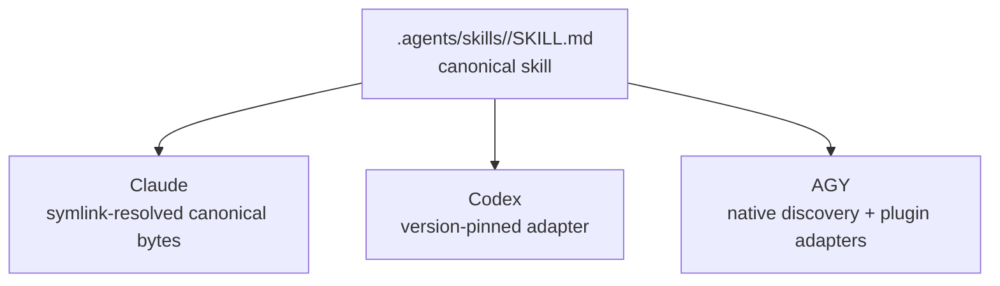
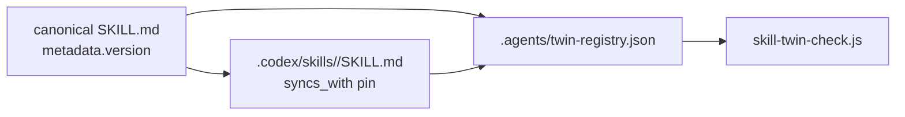
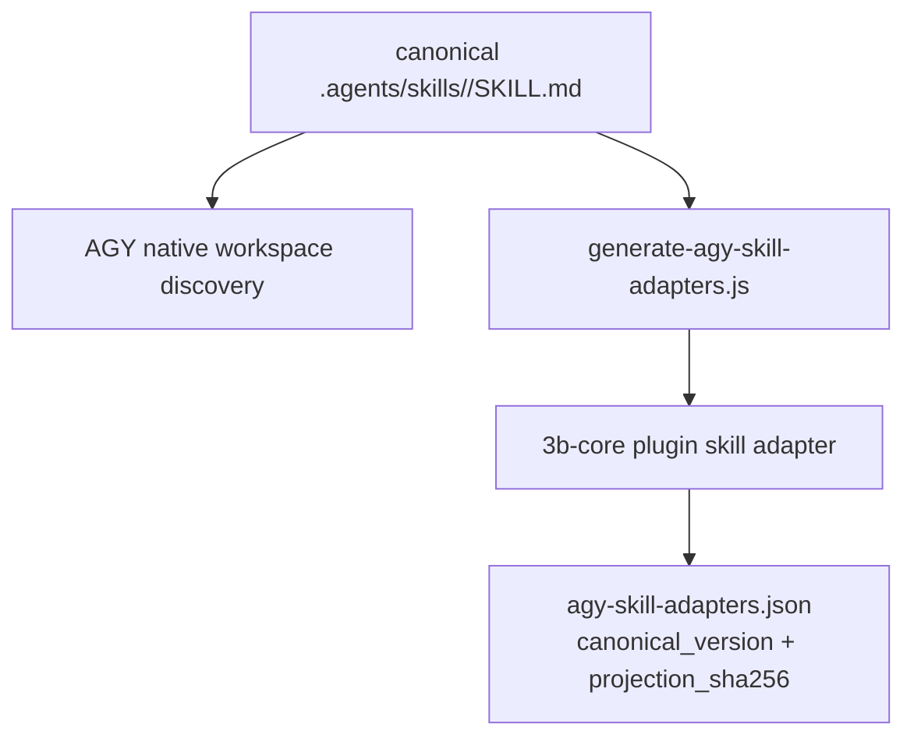

skill 하나를 세 agent에 똑같이 깔려다 보니 이상한 점이 보였어요. 같은 workflow인데
Claude는 symlink로 원본을 그대로 읽고, Codex는 따로 둔 adapter를 읽고, AGY는 또
다른 방식으로 받더라고요. 처음엔 이게 어긋난 건가 싶었는데, 들여다보니 어긋난 게
아니라 원래 이래야 하는 거였어요.

## 획일성은 잘못된 목표예요

multi-agent 환경에서 가장 쉽게 빠지는 함정이 일관성과 획일성을 헷갈리는 거예요.

일관성은 같은 workflow에 source of truth가 하나라는 뜻이에요. 획일성은 모든
runtime이 그 workflow를 똑같은 방식으로 받는다는 뜻이고요. 앞쪽은 가치가 있어요.
뒤쪽은 대부분 환상이에요.

3B의 skill 시스템에서 이 차이가 피할 수 없게 드러나요. 어떤 rule은 거의 텍스트로만
다뤄도 돼요. 항상 불러오거나 필요할 때만 lazy하게 라우팅하면 agent가 그 지침을
읽으니까요. skill은 더 무거워요. trigger 텍스트, 인자, 참조 파일, 버전 metadata,
changelog 이력, 때로는 capability 선언까지 담은 workflow 단위거든요. 단순한
'context'가 아니에요. runtime이 발견하고, 나열하고, 실행하거나 실행을 거부할 수도
있는 단위예요.

6월 14일 architecture 모델은 그 모양을 이렇게 잡아요. canonical skill 40개가
Claude에는 symlink로, AGY에는 inode를 공유하는 hardlink로, Codex에는 버전을 고정한
손수 관리하는 사본으로 도달해요. 정확한 개수는 2026-06-14 architecture 모델
스냅샷에 한정된 거지만, architecture 차원의 교훈은 오래가요. source of truth가
하나라고 해서 전달 방식까지 하나여야 하는 건 아니에요.

올바른 목표는 같은 동작, 다른 물리예요.

## 3B skill에는 뭐가 들어 있나

canonical 3B skill 파일은 아래 경로에 자리 잡고 있어요.

```text
.agents/skills/<name>/SKILL.md
```

이 파일은 YAML frontmatter로 시작해요. `name`, `description`, 선택적인 tool 허용
범위, 버전 metadata, 때로는 `caps:` 선언이 들어가요. 그다음에 본문이 와요. 목적,
workflow 단계, 참조 파일, 출력 규칙, changelog 순서예요. 어떤 skill은 `references/`
폴더를 들고 다니고, 어떤 skill은 Rule-6 README 파일을 갖고 있어요. 가장 큰 skill인
`wrap`은 워낙 커서, skill 전달이 그냥 텍스트 복사 문제라고 우길 수 있는 수준이
아니에요.

중요한 건 `.agents/skills/`가 여전히 canonical 원본이라는 점이에요. skill을 Claude,
Codex, AGY용으로 따로 작성하면 안 돼요. workflow가 바뀌면 canonical skill이 바로 그
변경이 들어갈 자리예요. 문제는 각 runtime이 그 skill을 제대로 동작할 만큼 어떻게
받느냐예요.

그 답은 runtime마다 달라요.



다이어그램이 대칭으로 보이는 건 다이어그램이 예의 바르기 때문일 뿐이에요. 파일
시스템은 대칭이 아니에요.

## Claude: canonical 파일을 그대로 풀어요

Claude가 가장 깔끔한 경로예요. runtime에 이미 skill 표면이 있고, 3B의 호환 계층이 그
표면을 canonical 트리 쪽으로 다시 가리켜요.

연결 고리는 개념적으로 단순해요.

```text
~/.claude/skills -> .claude/skills -> .agents/skills
```

repo 관점에서 보면 `.claude/skills`는 `.agents/skills`로 되돌아가는 back-symlink예요.
Claude는 자기 runtime 마운트를 읽고 있다고 믿어요. 바이트는 canonical 그대로고요.
업데이트할 adapter 사본도 없고, 맞춰야 할 두 번째 본문도 없어요.

source of truth 설계로 보면 가장 좋은 경우예요. runtime의 제약 조건 덕분에 canonical
파일이 곧 소비되는 파일이 될 수 있거든요. 전달은 그냥 경로 해석이에요.

그래도 함정은 하나 있어요. symlink가 아니라 원본을 수정해야 해요. 어떤 도구가
symlink 너머로 atomic-save를 하면서 그 링크를 일반 파일로 바꿔버리면, 수정한 것처럼
보여도 source of truth 연결 고리가 끊길 수 있어요. 하지만 이건 작성 규율 문제지
skill 전달 문제가 아니에요. Claude의 전달은 canonical 바이트 경로로 유지될 수 있어요.

## Codex: 맞춰서 적응시키고 버전을 고정해요

Codex는 좀 달라요. 3B는 canonical Claude skill 본문을 그대로 갖다 쓰지 않아요. repo
안에 따로 `.codex/skills/<name>/SKILL.md`라는 adapter 표면을 둬요.

guardrail을 보기 전까지는 중복처럼 들려요. Codex adapter는 canonical 원본으로
되돌아가는 버전 핀을 들고 다녀요.

```yaml
metadata:
  syncs_with: ".agents/skills/<name>/SKILL.md@<version>"
```

adapter는 더 얇고 더 Codex스럽게 생길 수 있어요. 하지만 자기가 독립적인 척하는 건
허용되지 않아요. canonical skill과의 관계가 명시적으로 드러나거든요. twin 레지스트리는
어떤 canonical skill과 Codex adapter가 한 쌍인지 기록하고, `scripts/skill-twin-check.js`가
양쪽이 다 존재하는지 검증해요. `sync-codex-skills.sh` 헬퍼는 repo 안의 Codex skill
항목을 사용자 레벨 Codex skill 디렉터리로 연결하고 drift를 확인해요.

이건 안전하게 만들 수 있는 종류의 중복이에요. 눈에 보이고, 버전이 붙어 있고, 검사를
거치고, 의도적으로 원본보다 작거든요.

대가는 수동으로 따라잡는 거예요. canonical skill이 바뀌었다고 Codex adapter가 알아서
업데이트되지는 않아요. 그래서 버전 핀이 중요해요. canonical skill이 한 버전에서 다른
버전으로 넘어갔는데 adapter가 여전히 옛 버전을 가리키고 있으면, 그 어긋남을 리뷰할 수
있어요. 시스템이 그 틈을 숨기지 않거든요.



Codex는 같은 workflow 의도를 다른 산출물로 받아요. 이건 source of truth 설계의
실패가 아니에요. Codex가 다른 제약 조건을 갖는다는 걸 source of truth 설계가
인정하는 거예요.

## AGY: 탐색과 실행 가능 여부는 다른 표면이에요

AGY는 단순화한 다이어그램을 벌하는 전달 방식이에요.

6월 11일 모델은 AGY의 skill 경로를 inode를 공유하는 관점으로 설명해요. canonical
skill 바이트는 Gemini 호환 skill 표면에서 보이지만, 그중 작은 일부만 생성된 plugin
adapter를 받아요. 서브시스템 노트는 이 블로그 각도를 '같은 skill, 세 가지 전달 방식'
이라고 정리해요. Claude는 symlink, AGY는 hardlink로 inode 공유, Codex는 버전을 고정한
사본이라는 식으로요.

이후의 AGY 마이그레이션 문서는 이걸 두 표면 모델로 더 날카롭게 다듬어요.

1. **native workspace 탐색**. AGY가 canonical workspace skill을 볼 수 있어요.
2. **plugin adapter 실행 가능 여부**. `/3b:` 명령은 `3b-core` plugin 안에 생성된
   adapter 디렉터리가 있어야 해요.

이 두 표면은 관련이 있지만 같은 게 아니에요. skill이 AGY에 보인다고 해서 plugin
명령으로 실행할 수 있는 건 아니거든요. 6월 11일 스냅샷에서는 특별한 plugin adapter
쌍이 `check`와 `handoff`예요. 생성기는 호환되는 frontmatter와 본문 모양만 투영하고,
링크를 다시 쓰고, 지원 파일을 복사하고, 투영 해시를 기록해요.



핵심은 adapter의 정확한 개수가 아니에요. 그 개수는 6월 11일 모델 이후 이미 바뀌었어요.
핵심은 그 갈림이에요. 탐색은 실행 가능 여부와 달라요. 이 둘을 한 단어로 뭉뚱그리면,
AGY가 실행할 수 있는 걸 과장하거나 AGY가 볼 수 있는 걸 축소하게 돼요.

폐기된 `sync-agy-skills.sh` 스크립트는 쓸모 있는 경고예요. `~/.gemini/skills/`로
사용자 계층에 미러링하는 건 skill 이름 충돌을 일으켜서 꺼버렸어요. 전달 문제가
'전부 다 어디에나 복사하기'로는 풀리지 않는다는 걸 알려주죠. 어떤 때는 올바른 전달이
미러를 아예 두지 않는 것, 그리고 plugin 실행이 필요한 명령에만 더 작게 생성한 adapter
표면을 더하는 거예요.

## 검증이 비대칭을 안전하게 만들어요

전달의 비대칭은 시스템이 각 경로가 뭘 하는지 증명할 수 있을 때만 받아들일 수 있어요.

Claude는 대부분 symlink 무결성 검사예요. runtime 마운트가 여전히 `.agents/skills`로
풀리는가를 보는 거죠.

Codex는 twin 존재 여부와 버전 인식을 검사해요. 선언된 모든 twin이 canonical 파일과
adapter 파일을 둘 다 갖고 있는지, 그리고 adapter가 자기가 추적하는 canonical 버전이
무엇인지 말하고 있는지 보는 거예요.

AGY는 투영 무결성을 검사해요. 생성기가 canonical skill에서 adapter 본문을 만들어냈는지,
예상한 대로 필터링된 frontmatter와 지원 파일과 `projection_sha256`을 갖췄는지 보는
거죠.

전달이 다르니까 검사도 달라요. 'skill이 동기화됐다'는 단일 boolean 하나로는 정작
중요한 사실들이 지워져요. 3B는 그래서 검사를 전달 방식 가까이에 두는 쪽을 택해요.

원본 파일들이 중요한 이유도 여기 있어요. `.agents/twin-registry.json`은 아무렇게나
만든 목록이 아니에요. Codex 브리지 상태를 담는 레지스트리예요. AGY manifest도 그냥
빌드 산출물이 아니에요. 투영 metadata를 기록하죠. 폐기된 AGY 미러 스크립트도 죽은
잡담이 아니에요. 뻔해 보이던 미러 경로가 왜 거부됐는지를 문서로 남겨두거든요.

## multi-agent 도구에서 배우는 것

깔끔한 추상화는 'skill이 모든 agent에 동기화된다'가 아니에요. 이 문장은 너무 많은 걸
숨겨요.

더 나은 추상화는 이거예요.

```text
canonical skill behavior + runtime-specific transport + transport-specific verification
```

이 공식은 덜 우아하지만 실제 도구를 만나도 살아남아요. Claude는 symlink 사슬로
canonical 바이트를 소비할 수 있어요. Codex는 canonical과의 관계가 버전으로 고정된
adapter가 필요해요. AGY는 workspace 탐색과 plugin 명령 실행 가능 여부를 따로 생각해야
해요.

이 차이들에 이름을 붙이고 나면, 더 이상 drift가 아니에요. drift는 두 사본이 우연히
어긋나는 거예요. 전달의 비대칭은 두 runtime이 서로 다른 산출물을 필요로 하고, 그
산출물들이 어떻게 연결되는지 시스템이 기록해 두는 거예요.

이 구분이 확장되는 multi-agent 환경과 낡은 미러 더미로 전락하는 환경을 가르는
차이예요.

## 같은 동작, 다른 물리

skill 시스템은 3B의 '한 번만 작성한다'는 원칙이 무르익는 지점이에요. 모든 runtime이
똑같은 파일을 받아야 한다고 고집하지 않아요. 모든 runtime의 파일이 canonical 동작과
눈에 보이는 관계를 갖고 있어야 한다고 고집하죠.

Claude는 경로 해석을 받아요. Codex는 고정된 adapter를 받고요. AGY는 native 탐색과
plugin adapter 실행 가능 여부 사이의 갈림을 받아요. 각 경로가 다른 건 각 runtime이
다르기 때문이에요.

이건 source of truth에서 한발 물러선 타협이 아니에요. skill을 세 가지 다른 방식으로
불러오는 세 도구와 부딪쳐도 살아남아야 하는 source of truth는 원래 이렇게 생겼어요.
