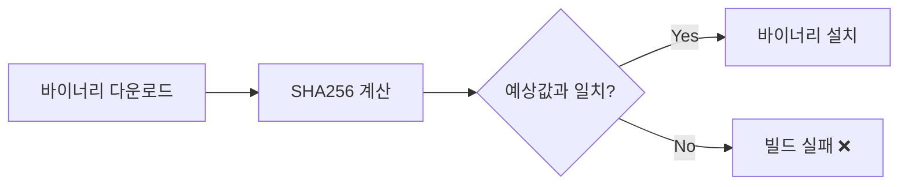

# 바이너리 체크섬 검증

SHA256 체크섬을 사용해서 다운로드한 바이너리가 변조되지 않았는지 검증하는 방법입니다.

## 문제 상황

검증 없이 인터넷에서 바이너리를 다운로드하면 supply chain 공격에 취약해집니다:

```text
공격 시나리오:
┌─────────────────────────────────────────────────────────┐
│ 1. 공격자가 다운로드 서버나 CDN을 탈취                   │
│ 2. 정상 바이너리를 악성 버전으로 교체                    │
│ 3. Dockerfile이 악성 코드를 다운로드하고 설치            │
│ 4. 악성 코드가 컨테이너 권한으로 실행됨                  │
└─────────────────────────────────────────────────────────┘
```

## 해결 방법

```dockerfile
# 바이너리 다운로드
RUN curl -sL "https://example.com/binary" -o /usr/local/bin/binary \
    #
    # 체크섬 검증 (보안 - supply chain 공격 방지)
    # 형식: "<예상_해시>  <파일경로>" (주의: 공백 두 개 필요)
    # sha256sum -c는 해시를 읽고, 실제 해시를 계산해서 비교함
    # 불일치 시 → 빌드 실패 (누군가 파일을 변조했다는 뜻)
    #
    && echo "abc123...  /usr/local/bin/binary" | sha256sum -c - \
    && chmod +x /usr/local/bin/binary
```

## 동작 원리



## 예상 체크섬 구하기

1. **공식 릴리스 페이지**: 대부분의 프로젝트에서 체크섬을 공개함
2. **직접 계산**: 한 번 다운로드해서 직접 검증하고, 그 해시를 사용

```bash
# 파일의 SHA256 계산
sha256sum /path/to/binary
# 출력: abc123def456...  /path/to/binary
```

## 실제 예시 (ECR Credential Helper)

```dockerfile
RUN ARCH=$(dpkg --print-architecture) \
    && if [ "$ARCH" = "arm64" ]; then \
         ECR_ARCH="arm64"; \
         EXPECTED_SHA="76aa3bb223d4e64dd4456376334273f27830c8d818efe278ab6ea81cb0844420"; \
       else \
         ECR_ARCH="amd64"; \
         EXPECTED_SHA="dd6bd933e439ddb33b9f005ad5575705a243d4e1e3d286b6c82928bcb70e949a"; \
       fi \
    && curl -sL "https://amazon-ecr-credential-helper-releases.s3.us-east-2.amazonaws.com/0.9.0/linux-${ECR_ARCH}/docker-credential-ecr-login" \
       -o /usr/local/bin/docker-credential-ecr-login \
    && echo "${EXPECTED_SHA}  /usr/local/bin/docker-credential-ecr-login" | sha256sum -c - \
    && chmod +x /usr/local/bin/docker-credential-ecr-login
```

## 핵심 포인트

- **공백 두 개 필요**: `sha256sum -c`에서 해시와 파일 경로 사이에
- **아키텍처별로 다름**: 다른 바이너리는 다른 체크섬을 가짐
- **버전별로 다름**: 바이너리 버전을 업데이트하면 체크섬도 업데이트해야 함
- **불일치 시 빌드 실패**: 변조된 바이너리 설치를 방지

## 언제 사용할까

| 상황 | 검증 필요? |
| ---- | ---------- |
| 패키지 매니저 (apt, pip) | X (자체 검증 있음) |
| 직접 바이너리 다운로드 | O |
| GitHub 스크립트 | 고려 (또는 서명된 릴리스 사용) |
| 내부 아티팩트 | 선택 (CI/CD를 신뢰한다면) |
