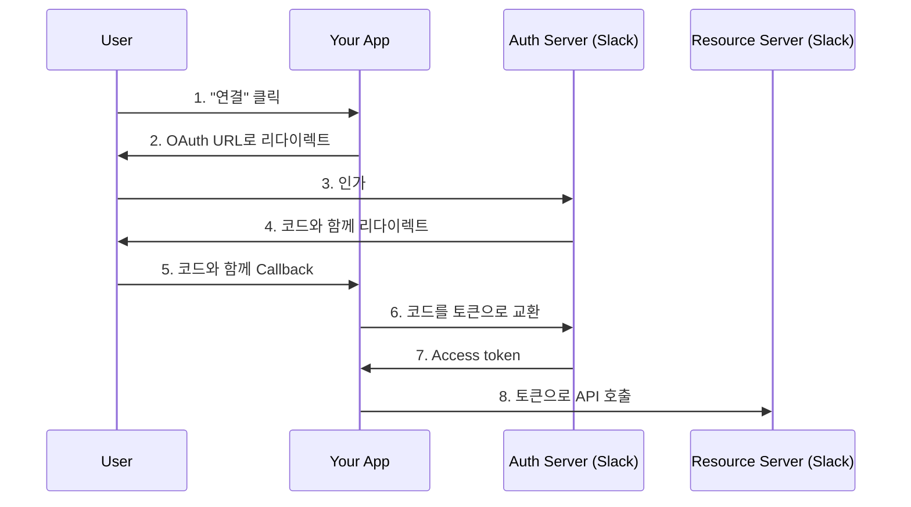

백엔드 커넥터 서비스에 Slack을 통합해야 했어요. OAuth 2.0 플로우는 이론적으로 간단해 보였어요 -- 리다이렉트하고, 인가하고, 코드를 교환하고, 토큰을 저장하면 되니까요. 실제로는 불투명한 에러 메시지, CSRF 엣지 케이스, redirect URI 불일치를 디버깅하는 데 며칠을 보냈어요. 제가 최종적으로 정리한 패턴과 도중에 만난 함정들을 공유할게요.

## 왜 중요한가

백엔드가 서드파티 서비스에서 사용자를 대신해 작업해야 할 때 -- Slack 메시지 보내기, Google Calendar 이벤트 읽기, GitHub 저장소 접근 등 -- OAuth 2.0이 필요해요. 잘못 구현하면 토큰 유출, callback에 대한 CSRF 공격, 그리고 디버깅이 어려운 깨진 인증 플로우가 발생해요. Provider의 에러 응답이 의도적으로 모호하기 때문이에요.

## 어려웠던 점들

네 가지 문제가 RFC가 묘사하는 것보다 구현을 어렵게 만들었어요.

**State 파라미터 CSRF 공격은 조용함.** State 파라미터를 빠뜨려도 눈에 보이는 에러가 없어요. 플로우가 잘 동작해요. 취약점은 공격을 당할 때만 드러나서, 모든 기능 테스트를 통과하는 보안 취약 코드를 배포하기 쉬워요.

**토큰 교환 에러가 모호함.** `oauth.v2.access`가 `{"ok": false, "error": "invalid_grant"}`를 반환하면, 코드가 만료된 건지(10분 유효), redirect URI가 정확히 일치하지 않는 건지, 코드가 이미 사용된 건지 알 수 없어요. 추가 정보가 제공되지 않아요.

**Redirect URI가 정확히 일치해야 함.** Provider에 등록된 것과 요청에 보내는 것 사이에 후행 슬래시 하나만 달라도, 어떤 URI를 기대했는지 알려주지 않는 "redirect_uri_mismatch" 에러가 발생해요.

**인메모리 state 저장소가 다중 레플리카에서 실패.** 단순한 `dict` 기반 state 저장소는 개발 환경에서 잘 동작하지만, 다중 서버 레플리카가 있는 프로덕션에서는 조용히 실패해요. Callback이 state를 생성한 것과 다른 인스턴스에 도달할 수 있거든요.

## Authorization Code Flow

Authorization Code flow는 서버사이드 애플리케이션의 표준이에요. 순서는 이래요:



## State 파라미터로 CSRF 보호

항상 암호학적으로 안전한 state 파라미터를 생성하고 callback 처리 전에 검증하세요:

```python
import secrets

# State 검증용 저장소 (다중 레플리카 프로덕션에서는 Redis 사용)
_oauth_states: dict[str, str] = {}

async def authorize():
    # 암호학적으로 안전한 state 생성
    state = secrets.token_urlsafe(32)
    _oauth_states[state] = "slack"

    params = {
        "client_id": settings.SLACK_CLIENT_ID,
        "scope": settings.SLACK_SCOPES,
        "redirect_uri": settings.SLACK_REDIRECT_URI,
        "state": state,  # CSRF 보호
    }
    return {"authorize_url": f"https://slack.com/oauth/v2/authorize?{urlencode(params)}"}

async def callback(code: str, state: str):
    # state를 먼저 검증
    if state not in _oauth_states:
        raise HTTPException(400, "Invalid state token")

    del _oauth_states[state]  # 일회용
    # ... 코드를 토큰으로 교환
```

State 파라미터는 공격자가 피해자를 속여 공격자의 계정으로 인가하게 만드는 것을 방지해요. 이것 없이는 CSRF 공격으로 피해자의 세션을 공격자의 Slack workspace에 연결할 수 있어요. 인메모리 dict는 단일 인스턴스 개발용으로 동작하지만, 다중 레플리카 프로덕션에서는 Redis나 데이터베이스를 사용하세요.

## 토큰 교환

Authorization code를 access token으로 교환해요. 이건 서버사이드에서 이루어지므로 client secret이 브라우저에 노출되지 않아요:

```python
async def exchange_code_for_token(code: str) -> dict:
    token_url = "https://slack.com/api/oauth.v2.access"

    async with httpx.AsyncClient(timeout=30.0) as client:
        response = await client.post(
            token_url,
            data={
                "client_id": settings.SLACK_CLIENT_ID,
                "client_secret": settings.SLACK_CLIENT_SECRET,
                "code": code,
                "redirect_uri": settings.SLACK_REDIRECT_URI,
            },
        )
        result = response.json()

    if not result.get("ok"):
        raise OAuthError(result.get("error", "unknown"))

    return {
        "access_token": result["access_token"],
        "team_id": result["team"]["id"],
        "scope": result["scope"],
    }
```

토큰 교환의 `redirect_uri`는 인가 시 전송한 것과 _정확히_ 일치해야 해요 -- 후행 슬래시, 프로토콜, 포트까지 포함해서요.

## 안전한 토큰 저장

토큰은 데이터베이스나 코드가 아닌 시크릿 매니저에 저장하세요:

```python
# Vault에 저장
def store_oauth_token(source_type: str, token_data: dict) -> bool:
    client = VaultClient(vault_addr, k8s_role)
    return client.write_secret(f"connectors/{source_type}", token_data)

# 요청별로 조회
def get_oauth_token(source_type: str) -> dict:
    client = VaultClient(vault_addr, k8s_role)
    return client.read_secret(f"connectors/{source_type}")
```

데이터베이스의 토큰은 SQL 인젝션 하나면 유출돼요. Vault 같은 시크릿 매니저는 저장 시 암호화, 감사 로깅, 자동 로테이션을 제공해요.

## 에러 처리

Provider 에러를 적절한 HTTP 응답으로 매핑해서 프론트엔드가 유용한 메시지를 보여줄 수 있게 하세요:

| OAuth 에러     | HTTP 상태 | 사용자 메시지                     |
| -------------- | --------- | --------------------------------- |
| invalid_client | 500       | 설정 오류                         |
| invalid_grant  | 400       | 인가가 만료됨, 다시 시도해 주세요 |
| access_denied  | 403       | 접근이 거부됨                     |
| invalid_scope  | 400       | 잘못된 권한이 요청됨              |
| server_error   | 503       | Provider가 일시적으로 사용 불가   |

## 설정 분리

민감한 설정과 비민감한 설정을 다른 곳에 보관하세요:

| 설정          | 저장소           | 민감도 |
| ------------- | ---------------- | ------ |
| Client ID     | ConfigMap/env    | 낮음   |
| Client Secret | K8s Secret/Vault | 높음   |
| Redirect URI  | ConfigMap/env    | 낮음   |
| Scopes        | ConfigMap/env    | 낮음   |
| Access Token  | Vault만          | 높음   |

## 베스트 프랙티스 체크리스트

1. **토큰을 로그에 남기지 않기** -- 로그에서 마스킹, 전체 값 출력 금지
2. **HTTPS 사용** -- OAuth는 redirect URI에 TLS를 요구
3. **State 검증** -- callback 처리 전에 state 확인
4. **최소 scope** -- 필요한 것만 요청
5. **토큰 로테이션** -- provider가 지원하면 refresh flow 구현
6. **안전한 저장소** -- 데이터베이스가 아닌 Vault 등 사용
7. **감사 추적** -- OAuth 이벤트(연결, 해제, 에러) 로깅

## 이 방식이 동작하는 이유

이 패턴들은 OAuth 구현의 세 가지 주요 실패 모드를 해결하기 때문에 동작해요: CSRF(state 파라미터), 토큰 유출(Vault 저장 + 로깅 금지), 설정 드리프트(민감/비민감 설정 분리). 각 패턴은 제가 실제로 만난 버그나 취약점에 대한 직접적인 대응이에요.

## 실무 팁

서드파티 API(Slack, Google, GitHub)와 통합하는 서버사이드 애플리케이션에서 위임된 사용자 인가가 필요할 때, 각 고객이 자체 계정을 연결하는 멀티테넌트 SaaS, 사용자를 대신해 동작하는 백엔드 커넥터 서비스에 이 패턴들을 사용하세요.

내부 서비스 간 통신에는 OAuth 2.0을 사용하지 **마세요** (API 키나 mTLS를 대신 사용). 클라이언트와 서버를 모두 제어하는 단순한 API 키 시나리오에도 해당하지 않아요. 백엔드가 없는 클라이언트 전용 앱에도 적합하지 않아요 (대신 PKCE를 사용한 Authorization Code를 사용하세요). Webhook에도 해당하지 않아요 -- OAuth 토큰 대신 webhook 서명을 검증하세요.
