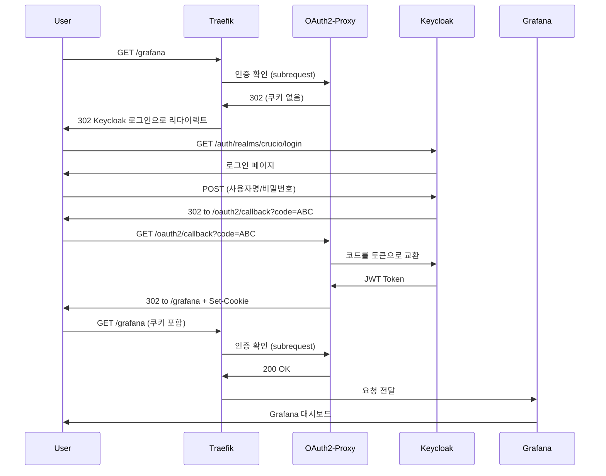
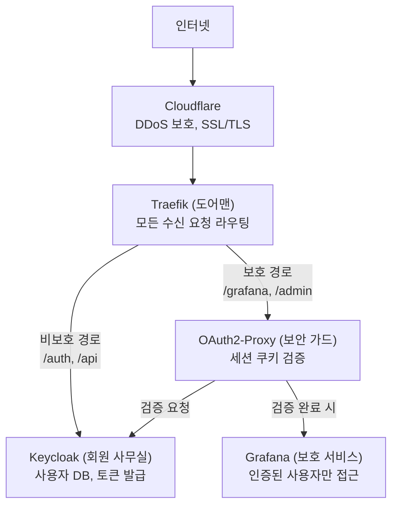

Kubernetes 클러스터의 모든 서비스가 열려 있었어요. URL만 알면 -- `/grafana`, `/admin`, 어떤 내부 대시보드든 -- 직접 접근할 수 있었죠. 각 서비스마다 개별적으로 인증을 추가하면 로그인 로직을 모든 곳에 중복시키게 돼요. 서비스들이 직접 인증을 구현할 필요 없이 모든 서비스를 보호하는 단일 중앙 집중식 인증 게이트가 필요했어요. Traefik ForwardAuth, Keycloak, OAuth2-Proxy로 이를 어떻게 설정했는지 공유할게요.

## 왜 중요한가

여러 웹 서비스(대시보드, API, 관리 패널)를 실행하는 Kubernetes 클러스터에서 순진한 접근 방식은 각 서비스에 인증 로직을 추가하는 거예요. 이렇게 하면 코드 중복, 일관성 없는 보안 정책, 새 서비스가 추가될 때마다 늘어나는 유지보수 부담이 생겨요. 중앙 집중식 인증 게이트웨이는 세 가지 문제를 모두 해결해요: 한 번의 로그인, 하나의 정책 세트, 서비스에 인증 코드 제로.

## 어려웠던 점들

다섯 가지 문제가 이 통합을 문서에서 시사하는 것보다 훨씬 어렵게 만들었어요.

**네임스페이스 간 미들웨어 참조가 문서화되지 않음.** Traefik의 ForwardAuth 미들웨어는 IngressRoute와 같은 네임스페이스에 있거나, 문서에 거의 언급되지 않는 `middleware@namespace` 구문을 사용해야 해요. 네임스페이스 간 참조 시도가 에러 없이 조용히 실패했어요 -- 요청이 인증을 완전히 우회했어요.

**OAuth2-Proxy 설정이 방대함.** OAuth2-Proxy는 100개 이상의 설정 플래그가 있어요. Keycloak OIDC에 맞는 올바른 조합(issuer URL 형식, scope 요구사항, 쿠키 도메인 설정)을 찾으려면 많은 시행착오가 필요했어요. 대부분의 온라인 예제가 Keycloak이 아닌 Google이나 GitHub을 provider로 사용하거든요.

**잘못된 쿠키 도메인으로 인한 리다이렉트 루프.** 쿠키 도메인이 서비스 도메인과 정확히 일치하지 않으면, 브라우저가 인증 쿠키를 다시 보내지 않아 OAuth2-Proxy와 Keycloak 사이의 무한 리다이렉트 루프가 발생해요. 유용한 에러 메시지도 없이요.

**OIDC discovery endpoint 경로가 Keycloak 버전에 따라 다름.** Keycloak이 버전 간에 기본 URL 구조를 변경했어요(`/auth/` 접두사 유무). 이로 인해 설정 문제처럼 보이지만 실제로는 버전 호환성 문제인 "issuer mismatch" 에러가 발생했어요.

**ForwardAuth subrequest가 보이지 않음.** ForwardAuth가 요청을 거부할 때 Traefik 로그에는 최종 302 리다이렉트만 표시돼요. OAuth2-Proxy에 대한 내부 subrequest와 응답은 기본적으로 로깅되지 않아서, 인증이 왜 실패하는지 진단하기가 매우 어려워요.

## 큰 그림: 건물 비유

애플리케이션을 여러 방이 있는 건물이라고 생각하세요:

| 방              | 안에 있는 것              |
| --------------- | ------------------------- |
| **Grafana 방**  | 모니터링 대시보드         |
| **API 방**      | 앱이 백엔드와 통신하는 곳 |
| **Web 방**      | 메인 로비/웹사이트        |
| **Keycloak 방** | 회원 사무실               |

지금은 아무나 어떤 방이든 들어갈 수 있어요. 목표는 **회원만 특정 방에 들어갈 수 있도록** 보안을 추가하는 거예요.

## Traefik이란

**Traefik은 건물 입구에 서 있는 도어맨**이에요. 누군가 `https://crucio.brandonwie.dev/grafana`를 방문하면, Traefik이 요청을 받고 URL 경로를 확인한 뒤 올바른 서비스로 라우팅해요.

| 역할            | 의미                                        |
| --------------- | ------------------------------------------- |
| **라우팅**      | "/grafana 원하세요? Grafana 방으로 가세요!" |
| **보안**        | "보안 기능을 추가해서 보호할게요"           |
| **로드 밸런싱** | "방이 꽉 찼나요? 다른 곳으로 안내할게요"    |

기술적으로 Traefik은 들어오는 트래픽을 처리하는 Kubernetes Ingress Controller예요. 주요 설정 파일은 `ingressroute-*.yaml`(어떤 URL이 어디로 가는지)과 `middleware-*.yaml`(rate limiting이나 보안 헤더 같은 추가 처리)이에요.

## Keycloak이란

**Keycloak은 ID 카드를 발급하고 검증하는 회원 사무실**이에요.

| 역할            | 의미                                             |
| --------------- | ------------------------------------------------ |
| **사용자 저장** | 사용자명과 비밀번호 데이터베이스를 보유          |
| **토큰 발급**   | 로그인하면 "회원증" (JWT 토큰) 발급              |
| **토큰 검증**   | 다른 서비스가 "이 카드 진짜인가요?" 물을 수 있음 |

알아야 할 핵심 개념:

| 용어       | 의미                                              |
| ---------- | ------------------------------------------------- |
| **Realm**  | Keycloak의 테넌트/워크스페이스                    |
| **Client** | Keycloak을 사용하는 애플리케이션 (예: crucio-web) |
| **OIDC**   | OpenID Connect -- 인증을 위한 프로토콜            |

## 문제: 보안 없음

ForwardAuth 없이는 Traefik이 신원 확인 없이 요청을 라우팅하기만 해요. 자격 증명을 묻지 않고 모든 사람을 들여보내는 게으른 도어맨인 거예요.

## ForwardAuth란

ForwardAuth는 도어맨에게 회원증을 확인하도록 가르치는 거예요. 모든 사람을 통과시키는 대신, Traefik이 이제:

1. 문 앞에서 멈추게 하고
2. "유효한 회원증이 있나요?" 물어보고
3. 없으면 -- 회원 사무실로 보내서 받아오게 하고
4. 있으면 -- 들여보내요

기술적으로 ForwardAuth는 들어오는 요청을 가로채서 인증 서비스에 내부 "subrequest"를 보내는 Traefik 미들웨어예요. 인증 서비스가 `200 OK`를 반환하면 요청이 통과하고, `401`이나 `302`를 반환하면 Traefik이 로그인으로 리다이렉트해요.

## OAuth2-Proxy란

Traefik은 "이 사람 회원인가요?"라고 물을 수 있지만, 회원증을 **어떻게** 검증하는지는 몰라요. OAuth2-Proxy는 다음을 아는 보안 가드예요:

1. 회원증을 읽는 방법 (JWT 토큰)
2. Keycloak과 대화하는 방법
3. "카드를 받아오고, 가지고 돌아오는" 전체 프로세스 처리

별도 서비스로 실행되며 (포트 4180, 내부 전용), 전체 OAuth2/OIDC 플로우를 구현하고, 보안 HTTP-only 쿠키에 세션 데이터를 저장해요.

## 전체 로그인 플로우

보호된 서비스를 처음 방문할 때 일어나는 일을 단계별로 살펴볼게요.

**Step 1: Grafana 방문.** 브라우저가 `https://crucio.brandonwie.dev/grafana`로 이동해요.

**Step 2: Traefik이 ForwardAuth 확인.** Traefik이 OAuth2-Proxy에 "이 사람 들어와도 되나요?"라고 내부 subrequest를 보내요.

**Step 3: 유효한 쿠키 없음.** OAuth2-Proxy가 세션 쿠키를 찾지 못해요. 302 리다이렉트로 응답해요.

**Step 4: 로그인으로 리다이렉트.** 브라우저가 Keycloak 로그인 페이지로 이동해요.

**Step 5: 로그인.** Keycloak에서 사용자명과 비밀번호를 입력해요.

**Step 6: Keycloak이 코드 발급.** 인증 성공 후, Keycloak이 임시 authorization code와 함께 OAuth2-Proxy callback URL로 브라우저를 리다이렉트해요.

**Step 7: OAuth2-Proxy가 코드를 토큰으로 교환.** OAuth2-Proxy가 코드를 Keycloak에 보내고 JWT 토큰을 받아요. 브라우저에 보안 쿠키로 저장해요.

**Step 8: Grafana로 돌아감.** 브라우저가 세션 쿠키를 가지고 `/grafana`로 돌아가요.

**Step 9: 접근 허용.** Traefik이 ForwardAuth를 다시 확인해요. 이번에는 OAuth2-Proxy가 유효한 쿠키를 찾고 200 OK를 반환해요. Traefik이 Grafana로 전달해요.



## 전체 아키텍처



## 용어 사전

| 용어             | 쉬운 설명                              | 기술적 정의                                        |
| ---------------- | -------------------------------------- | -------------------------------------------------- |
| **Traefik**      | 올바른 방으로 안내하는 도어맨          | Kubernetes Ingress Controller                      |
| **Keycloak**     | 모든 회원을 아는 회원 사무실           | Identity and Access Management (IAM) 서버          |
| **OAuth2-Proxy** | 카드를 확인하는 보안 가드              | OAuth2/OIDC 플로우를 처리하는 인증 프록시          |
| **ForwardAuth**  | "들어가기 전에 카드를 확인하라"는 규칙 | 외부 서비스에 인증을 위임하는 Traefik 미들웨어     |
| **JWT Token**    | 디지털 회원증                          | JSON Web Token -- 신원을 증명하는 서명된 데이터    |
| **Cookie**       | 브라우저가 카드를 보관하는 곳          | 세션 데이터를 위한 브라우저 저장소                 |
| **OIDC**         | 회원 사무실이 사용하는 언어            | OpenID Connect -- OAuth2 위에 구축된 인증 프로토콜 |
| **Realm**        | 별도의 회원 데이터베이스               | Keycloak 테넌트/워크스페이스                       |
| **Middleware**   | 도어맨이 수행하는 추가 검사            | 요청을 처리하는 Traefik 플러그인                   |
| **Subrequest**   | 도어맨이 보안 가드에게 속삭임          | 인증 확인을 위한 내부 HTTP 요청                    |

## 배포 설정 가이드

### 사전 조건

OAuth2-Proxy를 배포하기 전에 확인하세요:

1. **Keycloak 실행 중**: `kubectl get pods -n crucio-security -l app.kubernetes.io/name=keycloak`
2. **Realm 존재**: Keycloak realm이 생성되어 있어야 함
3. **테스트 사용자 존재**: 테스트용 사용자가 최소 1명 있어야 함

### Step 1: Keycloak에서 OAuth2-Proxy 클라이언트 생성

수동 작업이에요. Port-forward를 통해 Keycloak Admin Console에 접속하고 다음 설정으로 새 클라이언트를 생성하세요:

- Client ID: `oauth2-proxy`
- Client Protocol: `openid-connect`
- Client Authentication: **ON** (Confidential client)
- Standard flow: **ON**
- Valid Redirect URIs: `https://your-domain.dev/oauth2/callback`

Credentials 탭에서 client secret을 복사하세요.

### Step 2: Cookie Secret 생성

```bash
# 32바이트 base64url 인코딩 시크릿 생성
python3 -c 'import os,base64; print(base64.urlsafe_b64encode(os.urandom(32)).decode())'
```

### Step 3: 배포

```bash
# OAuth2-Proxy 배포
kubectl apply -k infra/k3s/security/oauth2-proxy/

# ForwardAuth 미들웨어 배포
kubectl apply -f infra/k3s/system/traefik/middleware-forwardauth.yaml

# 보호 서비스 라우트 업데이트
kubectl apply -f infra/k3s/system/traefik/ingressroute-grafana.yaml
```

### 문제 해결

| 문제                    | 원인                | 해결                                          |
| ----------------------- | ------------------- | --------------------------------------------- |
| 502 Bad Gateway         | OAuth2-Proxy 미실행 | crucio-security 네임스페이스 파드 확인        |
| 리다이렉트 루프         | 잘못된 redirect URI | Keycloak 클라이언트의 Valid Redirect URI 확인 |
| "Invalid issuer"        | 잘못된 OIDC URL     | configmap의 OIDC issuer URL 확인              |
| 쿠키 미설정             | 잘못된 도메인       | 쿠키 도메인이 서비스 도메인과 일치하는지 확인 |
| "Invalid client secret" | 시크릿 불일치       | Keycloak에서 시크릿 다시 복사                 |

디버그 방법:

```bash
# OAuth2-Proxy 로그 확인
kubectl logs -n crucio-security -l app.kubernetes.io/name=oauth2-proxy -f

# Traefik 라우팅 이슈 로그 확인
kubectl logs -n kube-system -l app.kubernetes.io/name=traefik -f
```

## 이 방식이 동작하는 이유

이 아키텍처는 관심사를 깔끔하게 분리하기 때문에 동작해요. Traefik은 라우팅을 처리하고 인증에 대해 아무것도 몰라요. OAuth2-Proxy는 OAuth2/OIDC 프로토콜을 처리하고 라우팅에 대해 아무것도 몰라요. Keycloak은 사용자와 토큰을 관리하고 둘 다에 대해 아무것도 몰라요. 각 컴포넌트가 하나의 일을 하고, 표준 HTTP와 OIDC 프로토콜을 통해 함께 조합돼요.

새로운 보호 서비스를 추가하는 건 Traefik 미들웨어 어노테이션 한 줄이에요 -- 인증 코드도, 토큰 검증도, 로그인 페이지도 필요 없어요.

## 실무 팁

같은 인증 게이트가 필요한 여러 웹 서비스가 있는 Kubernetes 클러스터에 이 패턴을 사용하세요. 특히 Traefik을 ingress controller로 사용할 때 좋아요.

단일 서비스 배포에는 사용하지 **마세요** (인증을 직접 내장하세요). 브라우저 클라이언트 없는 API 전용 백엔드에도 적합하지 않아요 (JWT 검증 미들웨어를 사용하세요). Traefik이 없는 환경에도 해당하지 않아요 (Nginx의 `auth_request`를 사용하세요). Keycloak이 과한 경량 프로젝트에도 적합하지 않아요 (Authelia나 Authentik을 고려하세요).
